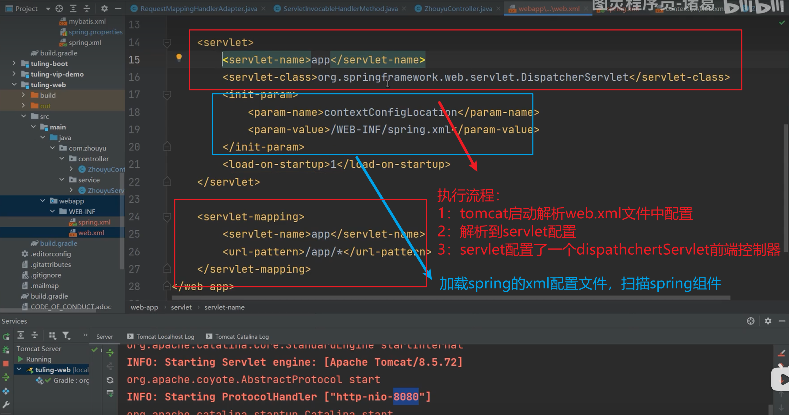
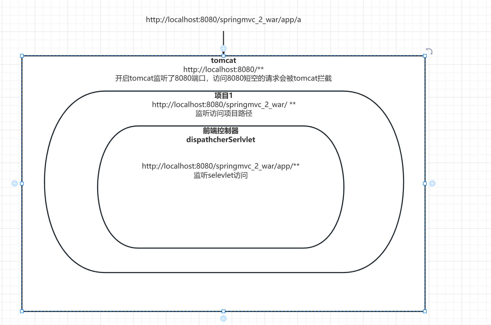

## springmvc

### 原理解析

```java
//springmvc启动原理解析
1:启动tomcat
2:tomcat解析web.xml文件
3:tomcat解析完成web.xml文件 创建dispathhcerServlet
4:调用dispathcherServler的init（）方法
5:
```



```xml
	
	<!--被映射的servlet-->
  <servlet>
    <servlet-name>app</servlet-name>
    <servlet-class>org.springframework.web.servlet.DispatcherServlet</servlet-class>
    <init-param>
      <param-name>contextConfigLocation</param-name>
      <param-value>/WEB-INF/springConfig.xml</param-value>
    </init-param>
    <load-on-startup>1</load-on-startup>
  </servlet>
	
	<!--映射路径-->
  <servlet-mapping>
    <servlet-name>app</servlet-name>
    <url-pattern>/app/*</url-pattern>
  </servlet-mapping>
```




### dispathcherServlet创建过程解析

```javascript
/*
1:当创建dispathcherServlet的时候，会调用他的init方法
2：init解析
3：init方法中有一个initServletBean方法（） 初始化servlet 创建spring容器
	1：打印日志，记录信息
	关键代码
	2：this.webApplicationContext = initWebApplicationContext(); //创建spring容器
		1：指定创建spring容器的类型-》默认是XmlWebApplicationContent.clsass
		2:使用getContextConfigLocation（）方法读取我们配置的xml中的contextConfigLocation属性
		 <param-name>contextConfigLocation</param-name>
      	  <param-value>/WEB-INF/springConfig.xml</param-value>
      	3：解析springConfig.xml配置文件，解析springConfig配置了扫描bena的配置
      	4：解析完成。将bean配置到spring容器中，完成dispathcherServlet的启动
	

*/
```

