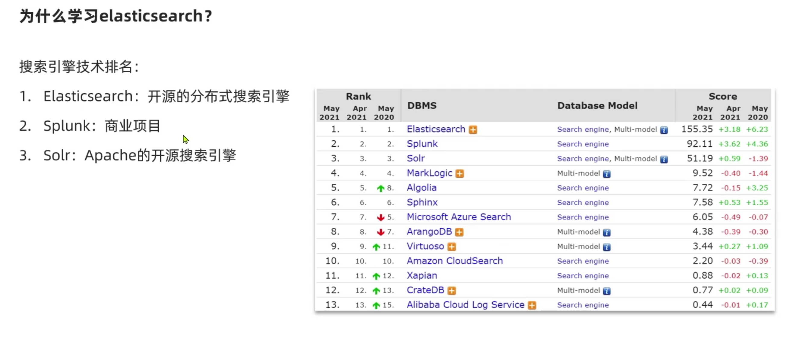

## 初始elasticrearch

### 初识ES

#### **什么是elasticsearch**

1. elasticsearch 是一款非常强大的开源搜索引擎，可以帮助我们从海量数据中快速找到需要的内容

2. elasticsearch 结合kibana ， Logstash ， Beats 也就是 elastic stack （ELK） 。被广泛应用在日志数据分析，实时监控等领域

3. elasticsearch 是 elastic stack 的核心 ，负责存储，搜索，分析数据

   

   

   #### elasticsearch 是基于 Lucene 开发的

   

   

#### elasticsearch 的发展


#### 为什么学习




#### 总结

**什么是 elasticsearch**

一个开源的分布式搜索引擎，可以用来实现搜索，日志统计，分析，系统监控等

**什么是elastic stack （ELK）**

是以elasticsearch 是为核心的技术栈，包括 beats ， Logstash ， kibana， elasticsearch

**什么是Lucene？**

是Apache的开源搜索引擎类库，提供了搜索引擎的核心API


### 倒排索引

#### **正向索引和倒排索引**

**mysql**


**es**


#### 总结

**什么是词条**

- 每一条数据就是一个文档
- 对文档中的内容分词，得到词语就是词条

**什么是正向索引**

- 基于文档id创建的索引，查询词条时，必须先找到文档，然后判断是否包含词条

**什么是倒排索引**

- 对文档内容分词，对词条创建索引，并记录词条所在文档信息，查询时，先根据词条查询到文档id，然后获取到文档

  

### es的一些概念

#### **文档**

elasticrearch 是面向文档存储的，可是数据库的一条商品数据，一个订单数据，文档数据会被序列化为json格式后存储在elasticrearch中


#### 索引


#### 概念对比


#### 架构

- Mysql：擅长事务类型操作，可以确保数据的安全和一致性
- Elasticsearch 擅长海量数据的搜索，分析，计算


### 安装 es ，kibana

参照黑马笔记中的。  安装 es 


## 索引操作

### mapping 映射属性

mapping是对索引库中的文档的约束，常见的mapping属性包括

- type ： 字段数据类型，常见的类型有
  - 字符串：text （可分词的文本），keyword（精确值，例如，品牌，国家，ip地址）
  - 数值：long,integer,short,byte,double,float
  - 布尔：boolean
  - 日期：date
  - 对象：object
- index：是否创建索引，默认为true
- analyzer ： 使用哪种分词器
- properties：该字段的子字段


### 索引crud


#### 创建 索引库

ES中通过Resutful请求操作索引库，文档，请求内容用DSL语句来表示。创建索引库和mapping的DSL语法如下

```json
put /索引库名
{
    "mappings"{
    	"properties":{
    		"字段名1":{
    			"type":"text",
    			"analyzer":"ik_smart"
			},
			"字段名2":{
    			"type":"keyword",
    			"index":"false"
			},
			"字段名3":{
    			"properties"{
                	"子字段":{
                		"type":"keyword"
            		}
            	}
			}
		}
	}
}
```


```powershell
PUT /heima
{
  "mappings": {
    "properties": {
      "info":{
        "type": "text",
        "analyzer": "ik_smart"
        
      },
      "email":{
        "type": "keyword",
        "index": false
      },
      "name":{
        "type": "object",
        "properties":{
          "firstName":{
            "type":"keyword"
          },
          "lastName":{
          	"type":"keyword"
          }
        }
      }
      
    }
  }
  
}
```


#### 查询索引库

```powershell
# 查询索引库

GET /索引库名称

GET /heima
```


#### 删除索引库

```powershell
DELETE /索引库名称

DELETE /heima
```


#### 修改索引库

```powershell
# es 中是禁止修改 索引库
# 索引库和mapping一旦创建无法修改，但是可以添加新的字段，语法：
# 修改索引库
PUT /heima/_mapping
{
  "properties":{
    "heima":{
      "type":"integer"
    }
  }
}
```


#### 总结

**索引库的操作有哪些**

- 创建索引库：PUT / 索引库名
- 查询索引库：GET /索引库名
- 删除索引库：DELETE /索引库名
- 添加字段 : PUT /索引库名/_mapping


## 文档操作

### 新增文档

新增文档的DSL语法如下

```powershell
POST /索引库名/_doc/文档id
{
	"字段名1":"值1",
	"字段名2":"值2",
	"字段名3":{
		"子属性1":"值3",
		"子属性2":"值4"
	}
}
```

**例子**

```powershell
POST /heima/_doc/1
{
	"info":"黑马程序员java讲师",
	"email":"12312@qq.con",
	"name":{
		"firstName":"云",
		"lastName":"空"
	}
}
```


### 查询文档

```powershell
# get/索引库名/_doc/文档id

# 查询索引库
get /heima/_doc/1

```


### 删除文档

```powershell
# delete/索引库名/_doc/文档id

DELETE /heima/_doc/1
```


### 修改文档

#### **方式一 ： 全量修改。会删除旧文档，添加新文档**

```powershell
PUT /索引库名/_doc/文档id 
{
	"字段1":"值1",
	"字段2":"值2"
}
```

示例

```powershell
PUT /heima/_doc/1
{
  "info":"黑马程序员java讲师22222222",
	"email":"12312@qq.con",
	"name":{
		"firstName":"云",
		"lastName":"空"
	}
}
```

```powershell
# 使用全量修改，是将旧的文档删除，然后进行添加
# 如果没有旧的文档存在，那么这个修改操作旧会变成 添加
```


#### **方式二 ： 增量修改，修改指定字段值**


```powershell
post /索引库名/_update/文档id
{
	"doc":{
		"字段名":"新的值"
	}
}
```


例子

```powershell
POST /heima/_update/1
{
  "doc":{
    "info":"黑马程序员java讲师"
  }
}
```


### 总结

文档操作有那些

- 创建文档 : POST  /索引库名称/_doc/文档id {json文档}
- 查询文档 : GET/索引库名/文档id
- 删除文档：DELETE /索引库名/文档id
- 修改文档:
  - 全量修改: PUT /索引库名/_doc/文档id {json文档}
  - 曾量修改: POST/索引库名/_update/文档id {"doc":{字段}}


## RestClient 操作索引库

### 什么是RestClient

ES官方提供了各种不同语言的客户端，用来操作ES，这些客户端的本质就是组装DSL语句，通过http请求发送给ES


### 创建索引库

```powershell
# 1、使用 javaRestClient 时。先将数据库创建好，表结构创建好
```

```powershell
# 2、创建 DSL 索引库 ，根据数据库表字段进行创建
```

```powershell
# 表结构
create table heima.tb_hotel
(
    id        bigint       not null comment '酒店id'
        primary key,
    name      varchar(255) not null comment '酒店名称',
    address   varchar(255) not null comment '酒店地址',
    price     int(10)      not null comment '酒店价格',
    score     int(2)       not null comment '酒店评分',
    brand     varchar(32)  not null comment '酒店品牌',
    city      varchar(32)  not null comment '所在城市',
    star_name varchar(16)  null comment '酒店星级，1星到5星，1钻到5钻',
    business  varchar(255) null comment '商圈',
    latitude  varchar(32)  not null comment '纬度',
    longitude varchar(32)  not null comment '经度',
    pic       varchar(255) null comment '酒店图片'
)
    charset = utf8mb4;


# 根据表结构创建的 索引库
PUT /hotel
{
  "mappings": {
    "properties": {
      "id":{
        "type": "keyword"
      },
      "name":{
        "type": "text",
        "analyzer": "ik_max_word",
        "copy_to": "all"
      },
      "address":{
        "type": "keyword",
        "index": false
      },
      "price":{
        "type": "integer",
        "copy_to": "all"
      },
      "score":{
        "type": "integer",
        "copy_to": "all"
      },
      "brand":{
        "type": "keyword",
        "copy_to": "all"
      },
      "city":{
        "type": "keyword",
        "copy_to": "all"
      },
      "starName":{
        "type": "keyword",
      },
      "business":{
        "type": "keyword",
      },
      "loaction":{
        "type": "geo_point"
      },
      "pic":{
        "type": "keyword",
        "index": false
      },
      "all":{
        "type": "text"
      }
    }
  }
}
```

```powershell
# 3、  初始化 javaRestClient
```

1. 引入es的RestHighLeveClient的

   ```xml
   <dependency>
       <groupId>org.elasticsearch.client</groupId>
       <artifactId>elasticsearch-rest-high-level-client</artifactId>
   </dependency>
   ```

2. 因为SpringBoot默认的ES版本是7.6.2，所以我们需要覆盖默认的ES版本：

   ```xml
   <properties>
       <java.version>1.8</java.version>
       <elasticsearch.version>7.12.1</elasticsearch.version>
   </properties>
   ```

3. 初始化RestHighLevelClient：

   初始化的代码如下：

   ```java
   RestHighLevelClient client = new RestHighLevelClient(RestClient.builder(
           HttpHost.create("http://192.168.150.101:9200")
   ));
   ```


```java
public static final String MAPPING_TEMPLATE = "{\n" +
            "  \"mappings\": {\n" +
            "    \"properties\": {\n" +
            "      \"id\":{\n" +
            "        \"type\": \"keyword\",\n" +
            "        \"index\": true\n" +
            "      },\n" +
            "      \"name\":{\n" +
            "        \"type\": \"text\",\n" +
            "        \"analyzer\": \"ik_max_word\",\n" +
            "        \"index\": true,\n" +
            "        \"copy_to\": \"all\"\n" +
            "      },\n" +
            "      \"address\":{\n" +
            "        \"type\": \"keyword\",\n" +
            "        \"index\": false\n" +
            "      },\n" +
            "      \"price\":{\n" +
            "        \"type\": \"integer\",\n" +
            "        \"index\": true,\n" +
            "        \"copy_to\": \"all\"\n" +
            "      },\n" +
            "      \"score\":{\n" +
            "        \"type\": \"integer\",\n" +
            "        \"index\": true,\n" +
            "        \"copy_to\": \"all\"\n" +
            "      },\n" +
            "      \"brand\":{\n" +
            "        \"type\": \"keyword\",\n" +
            "        \"index\": true,\n" +
            "        \"copy_to\": \"all\"\n" +
            "      },\n" +
            "      \"city\":{\n" +
            "        \"type\": \"keyword\",\n" +
            "        \"index\": true,\n" +
            "        \"copy_to\": \"all\"\n" +
            "      },\n" +
            "      \"starName\":{\n" +
            "        \"type\": \"keyword\",\n" +
            "        \"index\": true\n" +
            "      },\n" +
            "      \"business\":{\n" +
            "        \"type\": \"keyword\",\n" +
            "        \"index\": true\n" +
            "      },\n" +
            "      \"loaction\":{\n" +
            "        \"type\": \"geo_point\"\n" +
            "      },\n" +
            "      \"pic\":{\n" +
            "        \"type\": \"keyword\",\n" +
            "        \"index\": false\n" +
            "      },\n" +
            "      \"all\":{\n" +
            "        \"type\": \"text\"\n" +
            "      }\n" +
            "    }\n" +
            "  }\n" +
            "}";
```

```java 
    @Test
    public void createHotelIndex() throws IOException {
        // 创建 请求的对象
        CreateIndexRequest request = new CreateIndexRequest("hotel");

        // 创建请求 参数
        request.source(HotelConstants.MAPPING_TEMPLATE, XContentType.JSON);

        // 发起 请求
        client.indices().create(request, RequestOptions.DEFAULT);
    }

```


### 删除索引库

```java
    @Test
    public void deleteHotelIndex() throws IOException {

        DeleteIndexRequest deleteIndexRequest = new DeleteIndexRequest("hotel"); //  hotel 索引库名
        client.indices().delete(deleteIndexRequest,RequestOptions.DEFAULT);
    }
```


### 判断索引库是否存在

```java
    @Test
    public void existsHotelIndex() throws IOException {
        GetIndexRequest getIndexRequest = new GetIndexRequest("hotel");

        boolean exists = client.indices().exists(getIndexRequest, RequestOptions.DEFAULT);
        System.out.println(exists);
    }
```


### 总结

索引库的基本操作步骤

- 初始化RestHighLevelClient
- 创建XxxIndexRequst， XXX是Create，Get，Delte
- 准备DSL（Create时需要）
- 发起请求，调用RestHighLevelClient.indices().xxx方法， XXX是Create，exti，Delte


## RestClient 操作文档

去数据库查询酒店数据，导入到hotel索引库，实现酒店数据的crud

基本步骤：

1. 初始化javaRestClient
2. 利用JavaRestClient新增酒店数据
3. 使用JavaRestClient根据id查询数据
4. 使用JavaRestClient删除酒店数据
5. 使用JavaRestClient修改酒店数据

### 新增文档

```java
    @Test
    public void createIndexDocument() throws IOException {

        // 创建 请求对象
        IndexRequest indexRequest = new IndexRequest("hotel").id("1");

        // 加载请求数据
        indexRequest.source("{\"name\":\"java\",\"age\":\"18\"}",XContentType.JSON);

        // 发起请求
        client.index(indexRequest,RequestOptions.DEFAULT);
    }
```

```java
 // 新增文档数据
    @Test
    public void createIndexDocument() throws IOException {
        //查询数据库
        Hotel hotel = iHotelService.getById("61083");

        // 对象转换
        HotelDoc hotelDoc = new HotelDoc(hotel);
        String jsonString = JSON.toJSONString(hotelDoc);
        System.out.println(jsonString);

//        // 创建 请求对象
        IndexRequest indexRequest = new IndexRequest("hotel").id(hotelDoc.getId().toString());
//
        // 加载请求数据
        indexRequest.source(jsonString,XContentType.JSON);
//
//        // 发起请求
        client.index(indexRequest,RequestOptions.DEFAULT);
    }


    @AfterEach
    public void close() throws IOException {
        client.close();
    }
```


### 根据id查询酒店数据


```java
    @Test
    public void documentById() throws IOException {
        // 创建请求对象
        GetRequest getRequest = new GetRequest("hotel","61083");
        // 发送请求
        GetResponse documentFields = client.get(getRequest, RequestOptions.DEFAULT);
        // 获取的数据转换为 String 类型
        String sourceAsString = documentFields.getSourceAsString();
        // String 转换为对象那
        HotelDoc hotelDoc = JSON.parseObject(sourceAsString, HotelDoc.class);
        System.out.println(hotelDoc);
    }
```


### 修改文档

根据id修改酒店文档数据

**修改文档数据的方式有两种**

- 方式1：全量更新，再次写入id一样的文档，就会删除就文档，添加新文档
- 方式2：局部跟新。只更新部分字段，

**方式2**

```java
    @Test
    public void updateDocument() throws IOException {
        //创建更新对象
        UpdateRequest updateRequest = new UpdateRequest("hotel","61083");
        // 更新数据
        updateRequest.doc(
                "city","上海2"
        );
        // 发送请求
        client.update(updateRequest,RequestOptions.DEFAULT);
    }

```


### 删除文档

```java
    @Test
    public void deleteDocument() throws IOException {

        DeleteRequest deleteRequest = new DeleteRequest("hotel","61083");

        client.delete(deleteRequest,RequestOptions.DEFAULT);
    }
```


### 批量导入文档

需求：批量查询酒店数据，然后批量导入索引库中

```java
@Test
    public void loadDocument() throws IOException {
        // 数据库查询数据
        List<Hotel> list = iHotelService.list();
        // 提交桶
        BulkRequest bulkRequest = new BulkRequest();

        // 遍历数据集合
        list.forEach(item->{
            // 创建 增加数据对象
            IndexRequest indexRequest = new IndexRequest("hotel").id(item.getId().toString());
            // 数据转换
            HotelDoc hotelDoc = new HotelDoc(item);
            String jsonString = JSON.toJSONString(hotelDoc);
            // 将json 数据 ，加载到 增加数据对象中
            indexRequest.source(jsonString,XContentType.JSON);
            // 将增加数据对象加载到 提交桶中
            bulkRequest.add(indexRequest);
        });
        // 发起请求，将数据桶提交上去
        client.bulk(bulkRequest,RequestOptions.DEFAULT);
        }
    }
```