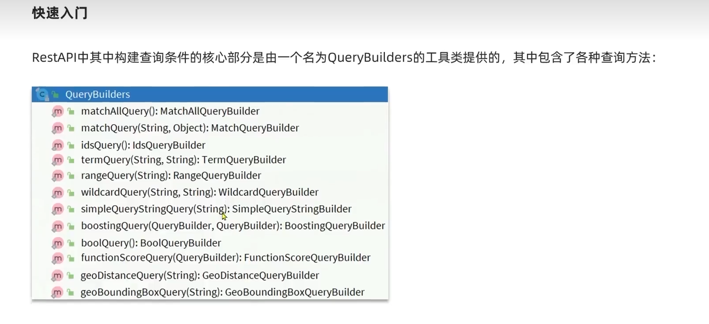
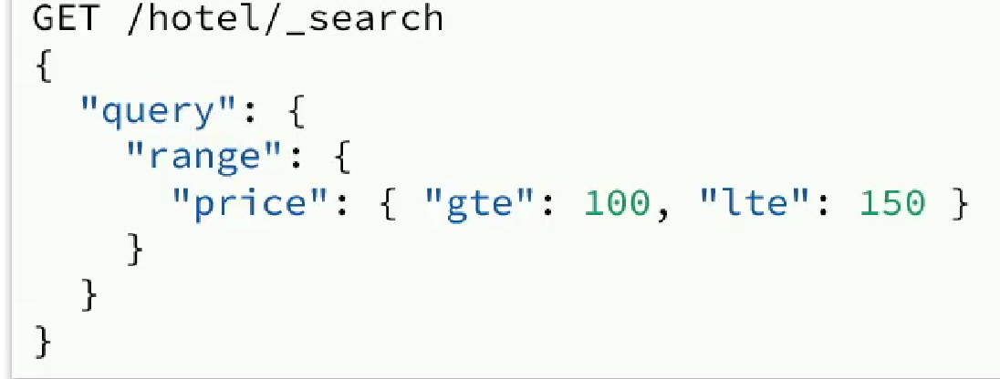

## DSL 查询文档

### DSL 查询分类

Elasticsearch 提供了基于JSON的DSL 来定义查询，常见的查询类型包括

- 查询所有：查询所有数据，一般测试用。例如：match_all
- 全文检索（full text） 查询： 利用分词器对用户输入内容分词，然后去倒排索引中匹配 例如：
  - match_query
  - multi_match_query
- 精确查询，根据精确词条值查找数据，一般查找keyword，数值，日期，boolean 等类型字段 例如：
  - ids  根据id查询
  - range 根据数值范围查询 
  - term 按照数据的值查询
- 地理 （geo）查询：根据经纬度查询，例如：
  - geo_distance
  - geo_bounding_box
- 复合（compound） 查询：复合查询可以将上述各种查询条件组合起来，合并查询条件例如
  - bool
  - function_score


#### DSL Qeury 基本语法

```powershell
get /indexName/_search
{
	"queyr":{
		"查询类型":{
			"查询条件":"条件值"
		}
	}
}
```

```powershell
# 查询所有
GET /hotel/_search
{
  "query": {
    "match_all": {}
  }
}
```


### 全文检查查询

**全文检索查询，会对用户输入内容分词，常用于搜索框搜索**

#### match

**match查询**：全文检索查询的一种，会对用户输入的内容进行分词，然后去倒排索引库检索：语法

```json

GET /hotel/_search
{
  "query": {
    "match": {
      "FIELD": "TEXT"
    } 
  }
}

GET /hotel/_search
{
  "query": {
    "match": {
      "name": "店"
    } 
  }
}
```


#### multi_match

**multi_match**: 与match查询类型，只不过允许同时查询多个字段，语法

```json
#查询多个字段
GET /hotel/_search
{
  "query": {
    "multi_match": {
      "query": "如家外滩",
      "fields": ["name","brand"]
    }
  }
}
```


#### 总结

**match和multi_match 的区别是什么**

- match：根据一个字段查询
- multi_match：根据多个字段查询，参与字段越多，查询性能越差

### 精准查询

**精确查询一般是查找keyword，数值，日期，boolean等类型字段，所以不会对搜索条件分词 常见的有**

1. term ： 根据词条精确值查询
2. range：根据值的范围查询

#### term

语法：

```json
GET /hotel/_eql/search
{
  "query": {
    "term": {
      "FIELD": {
        "value": "VALUE"
      }
    }
  }
}
```

```json
GET /hotel/_search
{
  "query": {
    "term": {
      "price": {
        "value": "392"
      }
    }
  }
}
```


#### range

```json
GET /hotel/_search
{
  "query": {
    "range": {
      "FIELD": {
        "gte": 10,
        "lte": 20
      }
    }
  }
}

```

```json
// 查询价格在100-300之间的酒店
GET /hotel/_search
{
  "query": {
    "range": {
      "price": {
        "gte": 100,
        "lte": 300
      }
    }
  }
}
```


#### 总结

**精确查询常见的有那些**

- term 查询：根据词条的精确匹配，一般搜索keyword类型，数值类型，布尔类型，日期类型
- range查询：根据数值范围，可以是数值，日期范围


### 地理坐标查询

**根据经纬度查询，常见的使用场景**

- 携程：搜索我附近的酒店
- 滴滴：搜索我附近的出租车
- 微信：搜索我附近的人


''


### 复合查询 Function Scorce Query

复合（compound） 查询：复合查询可以将其他它检查查询组合起来；实现更复杂的搜索逻辑


**function score ： 算分函数查询，可以控制文档相关性算法，控制文档排名，例如百度竞价**

使用 function score query ，可以修改文档的相关性算分 query score ， 根据新得到的算分排序

```powershell
# 算分排序
GET /hotel/_search
{
  "query": {
    "function_score": {
      "query": {"match": {
        "all": "酒店"
      }},
      "functions": [
        {
          "filter": {
            "term": {
              "brand": "如家"
            }
          },
           "weight": 10
          }
      ]
    }
  }
}
# 查询酒店关键字排序算分，给品牌是如家的酒店进行加分
```


**案例**

给 “如家”这个品牌的酒店排名靠前一些

1. 那些文档需要算法加权
   1. 品牌为如家的酒店
2. 算法函数是什么
   1. weight就可以
3. 加权模式是什么
   1. 求和


```powershell
GET /hotel/_search
{
  "query": {
    "function_score": {
      "query": {
        "match": {
          "all": "酒店"   # 查询条件
        }
      },
      "functions": [
        {
          "filter": {
            "term": {
              "brand": "如家" #品牌为如家的酒店需要加权
            }
          },
          "weight": 13  # 加权权重比
        }
      ],
      "boost_mode": "sum"  # 加权方式  sum 求和
    }
  }
}
```

#### 总结

- 过滤条件：那些文档要加分、
- 算分函数：如何计算function score
- 加权方式： function score 与 query score 如何运算


### 复合查询 Boolean Query

布尔查询是一个或多个子查询的组合，子查询的组合方式有

- must：必须匹配每个子查询 。 类似 “与”
- should ： 选择匹配子查询，类似 ”或“
- must_not: 必须不匹配，不参与算分，类似于 ”非“
- filter：必须匹配，不参与算分


```powershell
# 查询城市为 上海 
# 品牌为 皇冠假日 or 华美达 任意一家  
# 价格 》= 500
# 得分在 45 分以上
GET /hotel/_search
{
  "query": {
    "bool": {
      "must": [
        {
          "term": {"city": "上海"}
        }
      ],
      "should": [
        {
          "term":{"brand":"皇冠假日"}
        },
        {
          "term":{"brand":"华美达"}
        }
      ],
      "must_not": [
        {
          "range": {
            "price": {
              "lte": 500
            }
          }
        }
      ],
      "filter": [
        {"range": {
          "score": {
            "gte": 45
          }
        }}
      ]
    }
  }
}
```

**案例**

搜索名字是如家的 ， 价格不高于400 ， 坐标在31.21 ， 121.5 周围10km范围内的酒店


```powershell

GET /hotel/_search
{
  "query": {
    "bool": {
      "must": [
        {
          "term": {
            "name": "如家"
          }
        }
      ],
      "must_not": [
        {
          "range": {
            "price": {
              "gt": 400
            }
          }
        }
      ],
      "filter": [
        {
          "geo_distance": {
            "distance": "10km",
            "loaction": {
              "lat": 31.21,
              "lon": 121.5
            }
          }
        }
      ]
    }
  }
}
```


## 搜索结果处理


### 排序

elasticcsearch支持对搜索结果排序，默认是根据相关读算法 （_score） 来排序，可以排序字段类型有：keyword类型，数值类型，地理坐标类型，日期类型等

#### **简单类型排序** 


```powershell
# 排序
GET /hotel/_search
{
  "query": {
    "match_all": {}
  },
  "sort": [
    {
      "price": {
        "order": "desc"    
      }
    }
  ]
}
```


#### 地理坐标类型排序


**案例**

对酒店数据按照用户评价排序，评价相同按照价格升序排序

```powershell

GET /hotel/_search 
{
  "query": {
    "match_all": {}
  },
  "sort": [
    {
      "score": {
        "order": "desc"
      }
    },
    {
      "price": {
        "order": "desc"
      }
    }
  ]
}

```


**案例2**

实现酒店数据按照到你的位置坐标距离升序排序

```powershell

GET /hotel/_search
{
  "query": {
    "match_all": {}
  },
  "sort": [
    {
      "_geo_distance": {
        "location": {
          "lat": 31.034661,
          "lon": 121.612282
        },
        "order": "desc",
        "unit": "km"
      }
    }
  ]
}
```


### 分页

elaticsearch 默认情况下只返回top10 的数据，而如果要查询更多的数据就需要修改分页参数了

elaticsearch 中通过修改 from  ， size 来控制分页结果


```powershell
GET /hotel/_search
{
  "query": {
    "match_all": {}
  },
  "sort": [
    {
      "price": {
        "order": "desc"
      }
    }
  ],
  "from": 0,
  "size": 99
}
```


#### 深度分页问题

ES 是分布式的，所有会面临深度分页问题，例如按price排序后，获取 from = 990 , size = 10 的数据


#### 深度分页解决方案

针对深度分页,ES提供了两种解决方案，官方文档

- search after ： 分页时需要排序，原理是从上一次的排序值开始，查询下一页数据。官方推荐使用方式
- scroll：原理将排序数据形成快照，保存在内存，官方已经不推荐使用

#### 总结


### 高亮

高亮：就是在搜索结果中把搜索关键字突出显示


```powershell
# 高亮
GET /hotel/_search
{
  "query": {
    "match": {
      "brand": "如家"
    }
  },
  "highlight": {
    "fields": {
      "brand":{
        "require_field_match": "false", 
        "pre_tags": "<em>",
        "post_tags": "</em>"
      }
    }
  }
}
```

#### 总结


## RestClient 查询文档

### 快速入门

我们通过match_all 来演示基本的api


**直接查询全部 **

```java
    @Test
        public void match_all () throws IOException {
            
            SearchRequest request = new SearchRequest("hotel");

            request.source()
                    .query(QueryBuilders.matchAllQuery());

            SearchResponse search = client.search(request, RequestOptions.DEFAULT);
            System.out.println(search);
        }

```

**查询全部数据，设置分页。转换为jiava对象**

```java
  @Test
        public void match_all () throws IOException {

        List<HotelDoc> hotelDocs = new ArrayList<>();

            // 创建请求对象
            SearchRequest request = new SearchRequest("hotel");
            // 添加查询条件
            request.source()
                    .query(QueryBuilders.matchAllQuery()).from(0).size(201);
            // 发起请求
            SearchResponse search = client.search(request, RequestOptions.DEFAULT);
        System.out.println(search);


            // 解析请求
        SearchHits hits = search.getHits();
        // 获取请求数据总条数
        TotalHits totalHits = hits.getTotalHits();
        // 获取数据数组
        SearchHit[] hitsS = hits.getHits();
        // 打印数组，默认是10条
        Arrays.stream(hitsS).forEach(item->{
//            System.out.println(item.toString());
            // 将数据转化为java对象
            HotelDoc hotelDoc = JSON.parseObject(item.getSourceAsString(), HotelDoc.class);
            hotelDocs.add(hotelDoc);
        });
            
        // 打印对象
        for (HotelDoc hotelDoc : hotelDocs) {
            System.out.println(hotelDoc);
        }
        }
```


#### 总结





### 全文检索搜索


#### match

全文检索的match和multi_match查询于match_all 的api基本一致，差别是查询条件，也就是queyr的部分

```powershell
GET /hotel/_search
{
  "query": {
    "match": {
      "brand": "如家"
    }
  }
```

```java
    @Test
    public void multi_match() throws IOException {
        SearchRequest searchRequest = new SearchRequest("hotel");
        searchRequest.source().query(
                QueryBuilders.matchQuery("all","如家")
        );

        SearchResponse search = client.search(searchRequest,RequestOptions.DEFAULT);
        SearchHits hits = search.getHits();
        SearchHit[] hits1 = hits.getHits();
        Arrays.stream(hits1).forEach(item->{
            System.out.println(item.getSourceAsString());
        });
    }
```


#### term


```java
    @Test
    public void trem() throws IOException {

        SearchRequest request = new SearchRequest("hotel");
        request.source().query(
                QueryBuilders.termQuery("brand","如家"));
        SearchResponse search = client.search(request,RequestOptions.DEFAULT);
        SearchHits hits = search.getHits();
        SearchHit[] hits1 = hits.getHits();
        for (SearchHit documentFields : hits1) {
            System.out.println(documentFields);
        }
    }

```


#### range



```java
    @Test
    public void range() throws IOException {
        SearchRequest request = new SearchRequest("hotel");
        request.source().query(
                QueryBuilders.rangeQuery("price").gte(100).lte(500)
        ).sort("price", SortOrder.ASC);
        SearchResponse search = client.search(request, RequestOptions.DEFAULT);
        SearchHits hits = search.getHits();
        SearchHit[] hits1 = hits.getHits();
        for (SearchHit documentFields : hits1) {
            System.out.println(documentFields);
        }
    }
```


#### 复合查询 boolean query


```java
@Test
public void booleanQuery() throws IOException {
    SearchRequest request = new SearchRequest("hotel");
    BoolQueryBuilder boolQueryBuilder = QueryBuilders.boolQuery();
    boolQueryBuilder.must(QueryBuilders.termQuery("brand","如家"));
    boolQueryBuilder.filter(QueryBuilders.rangeQuery("price").lte(200));
    request.source().query(boolQueryBuilder);
    SearchResponse search = client.search(request, RequestOptions.DEFAULT);
    SearchHits hits = search.getHits();
    SearchHit[] hits1 = hits.getHits();
    for (SearchHit documentFields : hits1) {
        System.out.println(documentFields);
    }
}
```

### 排序

```powershell
# 排序
GET /hotel/_search
{
  "query": {
    "match_all": {}
  },
  "from": 1,
  "size": 99
}
```

```java

    // 排序
    @Test
    public void page() throws IOException {
        SearchRequest request = new SearchRequest();
        request.source().query(
                QueryBuilders.matchAllQuery()
        ).from(1).size(99);
        SearchResponse search = client.search(request, RequestOptions.DEFAULT);
        SearchHits hits = search.getHits();
        SearchHit[] hits1 = hits.getHits();
        for (SearchHit documentFields : hits1) {
            System.out.println(documentFields);
        }
    }
```


### 分页                      

```powershell
# 排序查询
GET /hotel/_search
{
  "query": {
    "match_all": {}
  },
  "sort": [
    {
      "price": {
        "order": "asc"
      }
    }
  ]
}
```

```java
//  排序查询
    @Test
    public void page() throws IOException {
        SearchRequest searchRequest =  new SearchRequest("hotel");
        searchRequest.source().query(
                QueryBuilders.matchAllQuery()
        ).sort("price",SortOrder.ASC);

        SearchResponse search = client.search(searchRequest, RequestOptions.DEFAULT);
        SearchHits hits = search.getHits();
        SearchHit[] hits1 = hits.getHits();
        for (SearchHit documentFields : hits1) {
            System.out.println(documentFields);
        }

    }
```


## 黑马旅游案例

