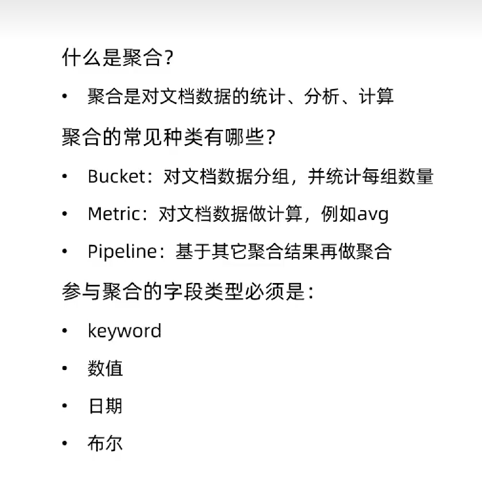
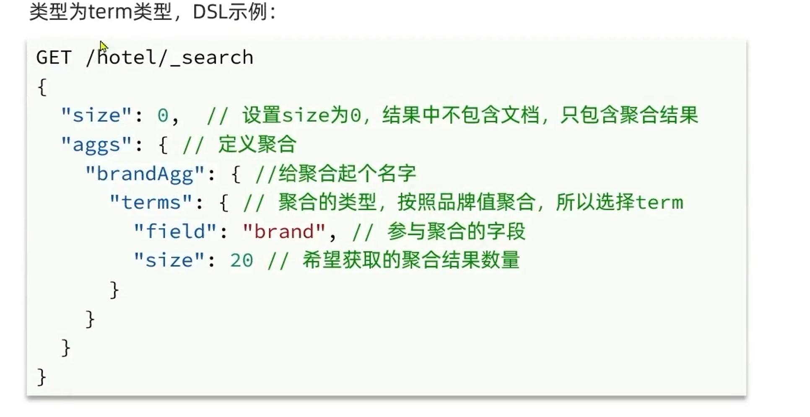
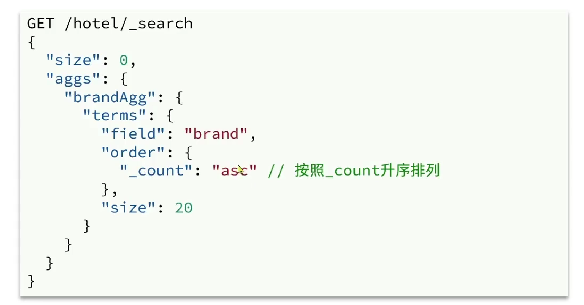
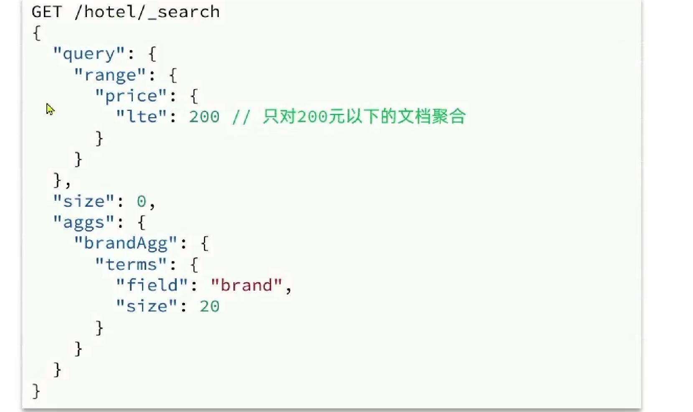
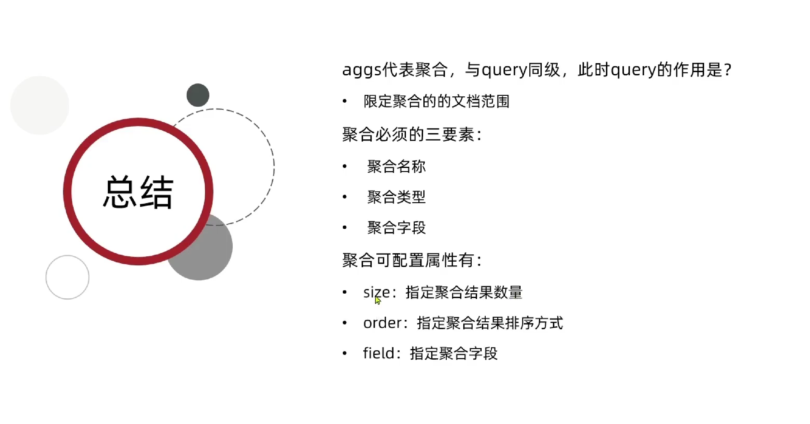
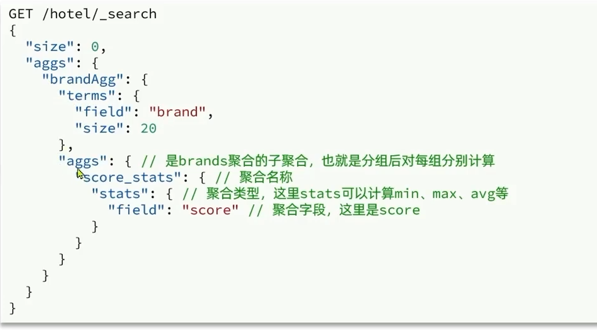
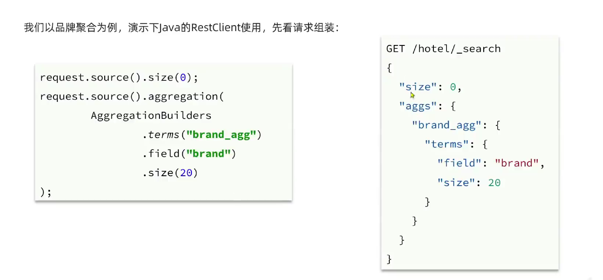
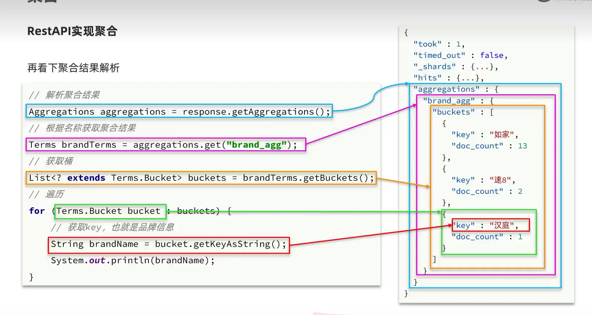
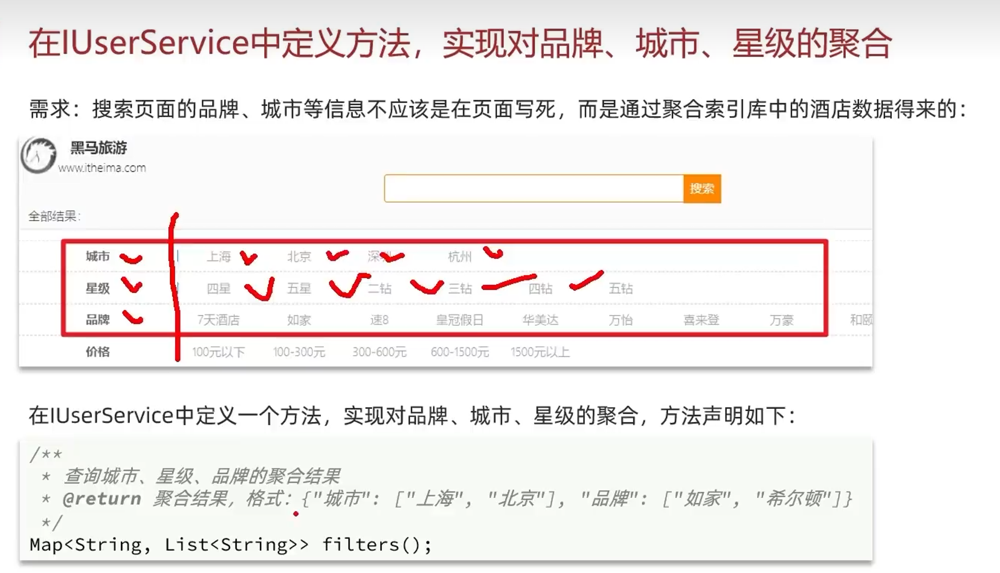

## 数据聚合

### 聚合的种类

聚合（aggregations） 可以实现对文档数据的统计，分析，运算，聚合常见的有三类

- 桶 (Bucket) 聚合 ： 用来对文档做分组

  - TremAffregation ： 按照文档的值分组
  - Data Histogram 按照日期阶梯分组，例如一周为一组，或者一月为一组

- 度量（Metric）聚合 ：用来计算一些值，比如最大值，最小值，平均值等。

  - avg 求平均值
  - Max 求最大值
  - min 求最小值
  - stars 同时求max min avg sum 等

- 管道（pipeline） 聚合：其他聚合的结果为基础做聚合

  

  

  

### DSL实现聚合

#### 入门例子

**统计所有数据中的酒店品牌有几种，此时可以根据酒店品牌的名字做聚合**



​	

```powershell
# 聚合查询
GET /hotel/_search
{
  "size": 0  ,
  "aggs": {
    "brandAgg": {
      "terms": {
        "field": "brand",
        "size": 20
      }
    }
  }
}
```


#### backet 聚合 ，聚合结果排序

默认情况下，bucket聚合会统计Bucker内的文档数量， 记为_count降序排序。 我们可以修改结果排序方式：



```powershell
# 聚合查询
GET /hotel/_search
{
  "size": 0  ,
  "aggs": {
    "brandAgg": {
      "terms": {
        "field": "brand",
        "size": 40,
        "order": {
          "_count": "asc"
        }
      }
    }
  }
}
```


#### backet 聚合 , 限定聚合范围

默认情况下 ，Bucket 聚合是对索引库的所有文档做聚合，我们可以限定要聚合的文档范围，只要添加query条件即可



```powershell
# 范围聚合, 只对酒店价格在100-500 之间的酒店的进行品牌的统计
GET /hotel/_search
{
  "query": {
    "range": {
      "price": {
        "gte": 100,
        "lte": 500
      }
    }
  },
  "aggs": {
    "brandAgg": {
      "terms": {
        "field": "brand",
        "size": 10
      }
    }
  }
}
```


#### 总结




---


#### DSL 实现 metrice 聚合

**我们要求获取每个品牌的评分的 min max avg 等值**



```powershell
GET /hotel/_search
{
  "size": 0, 
  "aggs": {
    "brandAgg": {
      "terms": {
        "field": "brand",
        "size": 20,
        "order": {
          "score_state.avg": "asc"
        }
      },
      "aggs": {
        "score_state": {
          "stats": {
            "field": "score"
          }
        }
      }
    }
  }
}
```


## RestAPI实现聚合


### 入门案例



```powershell
    @Test
    public void backet() throws IOException {
        SearchRequest request = new SearchRequest("hotel");
        request.source()
                .size(0)
                .aggregation(
                AggregationBuilders
                        .terms("brand_agg")
                        .field("brand")
                        .size(20)

        );

        SearchResponse search = client.search(request, RequestOptions.DEFAULT);
        System.out.println(search);
}
```




```powershell

    // 聚合
    @Test
    public void backet() throws IOException {
        SearchRequest request = new SearchRequest("hotel");
        request.source()
                .size(0)
                .aggregation(
                AggregationBuilders
                        .terms("brand_agg")
                        .field("brand")
                        .size(20)

        );

        SearchResponse search = client.search(request, RequestOptions.DEFAULT);
//        System.out.println(search);
        Aggregations aggregations = search.getAggregations();
        Terms brandAgg = aggregations.get("brand_agg");
        List<? extends Terms.Bucket> buckets = brandAgg.getBuckets();
        for (Terms.Bucket bucket : buckets) {
            System.out.print(bucket.getKeyAsString()+"\t");
            System.out.print(bucket.getDocCount()+"\t");
            System.out.println();

        }

    }
```


### 多条件聚合




```powershell

    // 多条件查询
    @Test
    public void querys() throws IOException {
        SearchRequest request = new  SearchRequest("hotel");
        request.source().aggregation(AggregationBuilders
                .terms("brandAgg")
                .field("brand")
                .size(20)
        );

        request.source().aggregation(AggregationBuilders
                .terms("cityAgg")
                .field("city")
                .size(100)
        );

        request.source().aggregation(AggregationBuilders
                .terms("starNameAgg")
                .field("starName")
                .size(100));

        SearchResponse search = client.search(request, RequestOptions.DEFAULT);
        Aggregations aggregations = search.getAggregations();
        Map<String, List<String>> query = query(aggregations);
        List<String> brand = query.get("品牌");
        for (String s : brand) {
            System.out.println(s);
        }

        List<String> starName = query.get("星级");
        System.out.println("---星级---");
        for (String s : starName) {
            System.out.println(s);
        }

        List<String> city = query.get("城市");
        System.out.println("---城市---");
        for (String s : city) {
            System.out.println(s);
        }


    }


    public Map<String,List<String>> query(Aggregations aggregations){

        List<String> cityList = new ArrayList<>();
        List<String> brangList = new ArrayList<>();
        List<String> starNameList = new ArrayList<>();
        Map<String,List<String>> map = new HashMap();


        Terms cityAgg = aggregations.get("cityAgg");
        List<? extends Terms.Bucket> buckets = cityAgg.getBuckets();

        for (Terms.Bucket bucket : buckets) {
            cityList.add(bucket.getKeyAsString());
        }


        Terms brandAgg = aggregations.get("brandAgg");
        List<? extends Terms.Bucket> brandAgg1 = brandAgg.getBuckets();

        for (Terms.Bucket bucket : brandAgg1) {
            brangList.add(bucket.getKeyAsString());
        }


        Terms starNameAgg = aggregations.get("starNameAgg");
        List<? extends Terms.Bucket> brandAgg2 = starNameAgg.getBuckets();

        for (Terms.Bucket bucket : brandAgg2) {
            starNameList.add(bucket.getKeyAsString());
        }

        map.put("品牌",brangList);
        map.put("城市",cityList);
        map.put("星级",starNameList);
        return map;
    }

```


### 带过滤条件的聚合


## 自动补全

### 拼音分词器

```powershell
# 拼音分词器
POST /_analyze
{
  "text": ["如家酒店还不错"],
  "analyzer": "pinyin"
}
```

