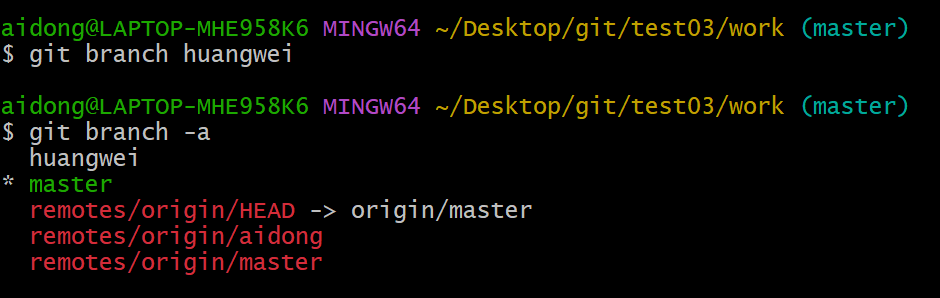
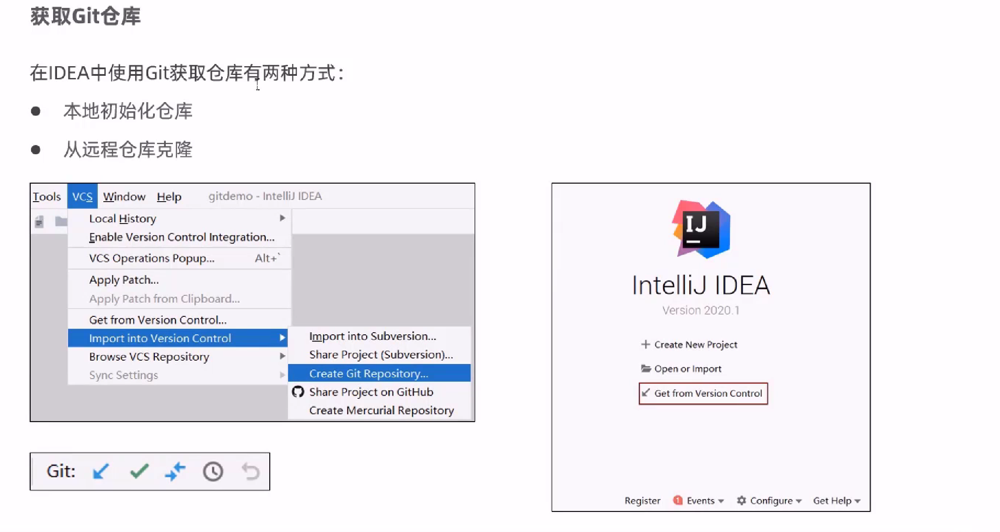
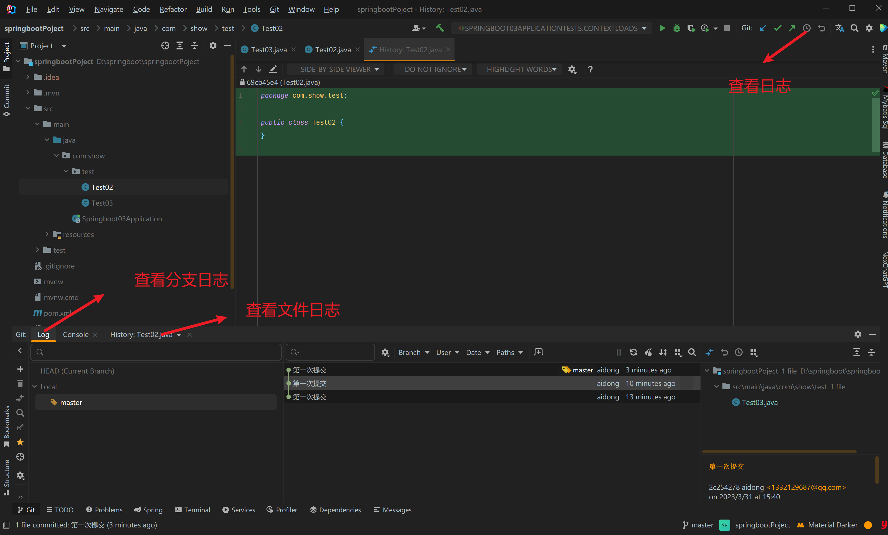

### git简介


- commit :提交，将本地文件和版本信息保存到本地仓库
- push：推送，将本地仓库文件和版本信息上传到远程仓库
- pull：拉去，将远程仓库文件和版本信息下载到本地仓库

### git下载地址


---

> **https://git-scm.com.download**


### git码云托管服务


### 	码云托管流程


---

1. 注册

   

2. 登录

   

3. 新建仓库

   


### git常用命令


```powershell
git config --gloabl user.name aidongdong
git config --global user.emali "1332129687@qq.com"
#查看配置
git config --global --list 
```


### 获取仓库


#### **获取本地仓库**


**初始化成功**


#### 获取远仓库


**获取成功**


### git区域概念


**暂存区域，文件**


**git中文件的状态**


### 本地仓库操作常用命令


**切换版本x**


---


### git 远程仓库操作


**git remote 查看**


---


**git clone 克隆**


---


**git pull 拉取**


[short-name] 

```powershell
git pull origin master --allow-unrelated-histories
#当仓库是本地出初始化而且有文件的时候 用git pull 拉去代码需要使用这个代码才能拉去成功 
```


----


**git push 推送**

[remote-name] 仓库名称 

[branch-name] 分支名称

git push origin mastet


---


**git  remote  add [url] 添加远程仓库**

git remote add  origin mester  http://gitee.com/...


---


### 分支操作

**简介**


---


**查看分支**


```powershell
git branch -r #查看远程
git branch -a #查看远程+本地
git branch  #查看本地分支
```


---


**创建分支**




```powershell
git branch huangwei  #创建分支
git branch -a 
```


---


**切换分支**


```powershell
git checkout huangwei #切换分支
git branch  #查看本地分支
```


----

**将本地分支推送到远程分支**


[shortName]远程仓库的别名

[name] 本地分支名称

```powershell
git push origin huangwei #推送本地分支huangwei 到远程origin仓库
```


---


**分支合并**


```powershell
git merge [name]
```

---


### git标签操作


---


**列出标签**


```powershell
git tag
```

---


**创建标签**


```powershell
git tag v1.0.0
git tag v1.0.1
```

---


**推送标签**


```powershell
git push origin v1.0.0
每一个标签其实就是标记一个版本，就像是一个分支保存当前版本
```


---


**检出标签**


```powershell
git checkout -b b1.0.1 1.0.1
标签检出其实就是新建一个分支然后复制标签记录的版本
```


---


## 在idea中使用get


### 在idea配置git


---


**获取仓库**



---


**从本地获取仓库**


---


**从远程仓库获取**、


---


### 在idea中本地仓库操作


---


**将文件加入暂存区**


---


**将文件添加到版本库**


---


**查看日志**



---


### 在idea操作远程仓库


---


**查看远程仓库**


---


**添加远程仓库**


---


**推送代码到远程仓库**


