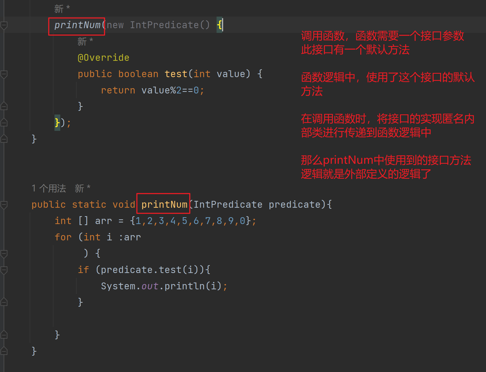
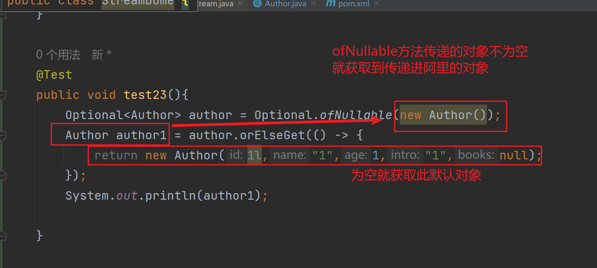
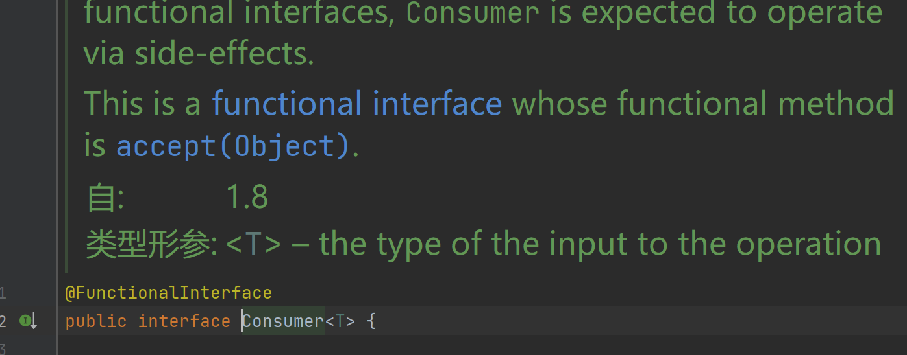

# 函数式编程

## 1.概述

### 1.1为什么学？

### 1.2 函数式编程思想

#### 1.2.1 概念

面向对象思想需要关注用什么对象完成什么事情，而函数式编程思想就类似于数学中的函数，它主要关注的是对数据进行了什么操作

#### 1.2.2 优点

- 代码简介，快速开发
- 接近自然语言，易于理解
- 易于  **并发编程**

 

## 2.lambda表达式

### 2.1 概念

Lambda 是 JDK8 中的一个语法糖，可以看成是一种语法糖，他可以对某些匿是名内部类的写法进行简化，它是函数编程思想的一个重要体现。让我们不需要关注是什么对象，而是更关注我们对数据进行了什么操作

### 2.2  核心原则

可推导可省略

### 2.3  基本格式

```java
(参数列表) -> { 代码 }
```

#### 例子1

我们在创建线程并启动时可以使用匿名内部类

```java
   new Thread(new Runnable() {
            @Override
            public void run() {
                
            }
        }).start();
```

可以使用Lambda的格式进行修改，修改后

```java
   new Thread(()->{
            System.out.println("线程中的方法启动了2");
        }).start();
```


#### 例子2

现有方法定义如下，其中IntBinaryOperator是一个接口，先使用匿名内部类写发调用该方法

```java
   	 public static void main(String[] args) { 
         //匿名内部类写法
	int i1 = calculateNum(new IntBinaryOperator() {
            @Override
            public int applyAsInt(int left, int right) {
                return left + right;
            }
        });
        System.out.println(i1);
		
		//lambda 表达式写法
        int i = calculateNum((a, b) -> {
            return a + b;
        });
        System.out.println(i);
    }
}

    public static int calculateNum(IntBinaryOperator operator){
        int a =  10 ;
        int b = 20;
        return operator.applyAsInt(a,b);
    }

```

#### 例子3

现有方法定义如下，其中InPredicte是一个接口，使用匿名内部类和lamdba表达式写

```java
public static void main (String [] args){
    	//匿名内部类写法
         printNum(new IntPredicate() {
            @Override
            public boolean test(int value) {
                return value%2==0;
            }
        });
    
    	//lamdba写法
    printNum((value)-> {return value%2==0;});
    
    //lamdba 简化写法
          printNum(value-> value%2==0);
    
}    


public static void printNum(IntPredicate predicate){
        int [] arr = {1,2,3,4,5,6,7,8,9,0};
        for (int i :arr
             ) {
            if (predicate.test(i)){
                System.out.println(i);
            }

        }
    }
```





#### 例子4

```java
//匿名内部类写法
Integer integer = typeCover(new Function<String, Integer>() {
            @Override
            public Integer apply(String s) {
                return Integer.valueOf(s);
            }
        });

//lmadba表达式写法
Integer integer1 = typeCover((String s) -> {
            return Integer.valueOf(s);
        });
        System.out.println(integer1);
    }

public static <R> R typeCover(Function<String,R> function){
        String str  = "12345";
        R result = function.apply(str);
        return result;
    }
```


#### 例子5

```java
  foreachArr(new IntConsumer() {
            @Override
            public void accept(int value) {
                System.out.println(value);
            }
        });

        foreachArr((value)->{
            System.out.println(i);
        });
    }

    public static void foreachArr(IntConsumer intConsumer){
        int [] arr = {1,213,141,23,523,423432,456235,1,312};
        for (int i = 0; i <arr.length ; i++) {
            intConsumer.accept(arr[i]);
        }
    }

```


### 2.4  省略规则

- 参数类型可以省略
- 方法体只有一句代码时大括号和return和唯一一句代码的分号可以省略
- 方法只有一个参数时，小括号可以省略


## 3.Stream 流

### 3.1 概述

java8的Stream使用的函数式编程模式。如同它的名字一样，它可以被用来对集合或数组进行链装流式操作，

### 3.2 案例数据准备

```java
@Data
@AllArgsConstructor
@NoArgsConstructor
@EqualsAndHashCode //
public class Author {
    private Long id;

    private String name;

    private Integer age;

    private String intro;

    private List<Book> books;
}
```

```java
@Data
@AllArgsConstructor
@NoArgsConstructor
@EqualsAndHashCode
public class Book {
    private Long id;

    private String name;

    private String category;

    private Integer score;

    private String intro;
}

```

```java
    private static List<Author> getAuthor(){
        Author author = new Author(1l, "鞥第1", 33, "123123123123212",null);
        Author author1 = new Author(2l, "鞥第2", 33, "123123123123212",null);
        Author author2 = new Author(3l, "鞥3", 33, "123123123123212",null);
        Author author3 = new Author(4l, "鞥4", 33, "123123123123212",null);

        //书籍列表
        List<Book> books1  = new ArrayList<>();
        List<Book> books2  = new ArrayList<>();
        List<Book> books3  = new ArrayList<>();


        books1.add(new Book(1l,"asdasdasd","123123",88,"12312312"));
        books1.add(new Book(1l,"asdasdas1123d","123vsdf23",889,"12asd312312"));


        books2.add(new Book(2l,"asdasdasd","123123",88,"12312312"));
        books2.add(new Book(2l,"asdasdas1123d","123vsdf23",889,"12asd312312"));

        books3.add(new Book(3l,"asdasdasd","123123",88,"12312312"));
        books3.add(new Book(3l,"asdasdas1123d","123vsdf23",889,"12asd312312"));

        author.setBooks(books1);
        author1.setBooks(books2);
        author2.setBooks(books3);
        author3.setBooks(books3);

        List<Author> authors = new ArrayList<>(Arrays.asList(author,author1,author3,author2));
        return authors;
    }
```


### 3.3 快速入门


#### 3.3.1 需求

我们可以调用getAuthor方法获取的list集合，使用stream流进行打印

现需要打印年龄小于18的作家，注意要去重


#### 3.3.2 实现

```java
    public static void main(String[] args) {

        List<Author> author = getAuthor();
        author.stream()  //把集合转换为Stream流
                .distinct()   //去重函数
                .filter(item-> item.getAge()<18) //进行过滤 年龄《18 才获取
                .forEach(itme-> System.out.println(itme)); //打印数据
    }
```


### 3.4 Stream常用操作

#### 3.4.1 创建流

单列集合： 集合对象.stream()

```java
   List<Author> author = getAuthor();
   Stream<Author> stream = author.stream();
```

数组： Ayyays.sream(数组) 或者使用 Stream.of 创建

```java
      Integer [] arr = {1,1,2,3,4,5,6};
        Stream<Integer> stream = Arrays.stream(arr);
        Stream<Integer> stream1 = Stream.of(arr);
        stream.forEach(item->{
            System.out.println(item);
        });
        stream1.forEach(item->{
            System.out.println(item);
        });
```

双列集合：转换成单列集合后再创建

```java
//创建map集合 
Map<String,Integer> map  = new HashMap<>();
        map.put("蜡笔小新",19);
        map.put("黑子",17);
        map.put("蜡笔2新",19);
		//使用map集合的entrySet方法将map集合转换为一个set单列集合
        Set<Map.Entry <String, Integer>> entries = map.entrySet();
        entries.stream().forEach(item->{
            //获取key
            System.out.println(item.getKey());
            //获取value
            System.out.println(item.getValue());
            System.out.println(item.getClass());
        });
```

####  3.4.2 中间操作

##### filter

可以对流中的元素进行条件过滤，符合过滤条件的才能继续留在流中

例1

打印所有名字长度大于1的作家姓名

```java
  author.stream().filter(item->{
            return item.getName().length()>1;
        }).forEach(item->{
            System.out.println(item);
        });
```


#####  map

可以把对流中的元素进行计算或者转换

例如

打印所有作家的姓名

```java
  
//将Stream流中的对象进行转换
       List<Author> list = getAuthor();
    
            list
                    .stream() // 转换流
                    .map(item->item.getName()) //将list中集合的每一个元素替换称为 list.getName
                    .forEach(item->{ // 遍历，打印输出
                System.out.println(item);
            });
```

对作者集合中的数据做运算

```java
      author.stream().map(author1 ->author1.getAge() )
                .map(age->age+10).forEach(item-> System.out.println(item));
```


##### distinct

可以去除流中的重复元素

例如：

打印所有作家的姓名，并且要其中不能有重复的元素

```java
    public static void test03(){
        List<Author> author = getAuthor();
        author.stream()  // 转换流
                .map(item->item.getName()) //对象映射
                .distinct() //去重
                .forEach(item->{ //  遍历
            System.out.println(item);
        });
    }
```


**注意：是distinct 方法是依赖于Object中的equals方法来判断对象是否相同的，所有需要重写eqauls方法**

##### sorted 

对流中的元素按照年龄进行降序排序，且不要求不能有重复元素


```java
@Data
@AllArgsConstructor
@NoArgsConstructor
@EqualsAndHashCode //
public class Author implements Comparable<Author> {
    private Long id;

    private String name;

    private Integer age;

    private String intro;

    private List<Book> books;

    @Override
    public int compareTo(Author o) {
        return this.getAge()-o.getAge();
    }
}
```

```java
// 使用函数编程直接比较，直接传递使用规则进行排序  sorted((o1,o2)->o2-o1)
// o2 - o1 是降序
// o1 - p2 是升序
// sorted 方法使用的 Comparable接口的 compareTo 方法，我们写的类没有实现compareTo接口就需要自己传递规则
// 如果实现了可与直接 调用sorted（） 方法
@Test
    public  void test04(){
        List<Author> author = getAuthor(); 
        author.stream() //  转换流
            .map(item->item.getAge()) //  映射年龄
            .dtinct() // 去重
            .sorted(() //  使用类规则排序！！！！
            .orEach(item->{ //遍历
            System.out.println(item);
        });
    }
```


```java
// 使用函数编程直接比较，直接传递使用规则进行排序  sorted((o1,o2)->o2-o1)
// o2 - o1 是降序
// o1 - p2 是升序
// sorted 方法使用的 Comparable接口的 compareTo 方法，我们写的类没有实现compareTo接口就需要自己传递规则
// 如果实现了可与直接 调用sorted（） 方法
@Test
    public  void test04(){
        List<Author> author = getAuthor(); 
        author.stream() //  转换流
            .map(item->item.getAge()) //  映射年龄
            .dtinct() // 去重
            .sorted((o1,o2)->o2-o1) //  自定义规则排序！！！！！
            .orEach(item->{ //遍历
            System.out.println(item);
        });
    }
```

 **注意：如果调用空参的：sorted（） 方法 ，需要流中的元素是实现了Comparable 接口**


##### limit 

可以设置流的最大长度，超出部分将被抛弃掉

对流中的元素按照年龄进行降序排，并且要求不能有重复的元素，然后打印其中年龄最大的两个作家的姓名

```java
 @Test
    //        对流中的元素按照年龄进行降序排，并且要求不能有重复的元素，然后打印其中年龄最大的两个作家的姓名
    public void test05(){

        List<Author> author = getAuthor();
        author.stream()
                .distinct() // 去重
                .sorted((o1, o2) -> o2.getAge()-o1.getAge()) // 排序，自定义排序规则
                .limit(2) // 设置的流的长度
                .forEach(item->{  // 遍历
            System.out.println(item.getName());
        });
    }
```

##### skip

跳过流中的前n个元素，返回剩下的元素

例如：

​	打印除了年龄最大的作家外的其他作家，要求不能有重复元素，并且按照年龄进行排序

```java
    @Test
//    	打印除了年龄最大的作家外的其他作家，要求不能有重复元素，并且按照年龄进行排序
    public void test06(){
        List<Author> author = getAuthor();
        author.stream() //转换流
                .distinct() // 去重
                .sorted((o1, o2) -> o2.getAge()-o1.getAge()) //  自定义规则按照年龄排序
                .skip(1) // 跳过第一条
                .forEach(item->{ //遍历
            System.out.println(item.getName());
        });
    }
```

##### flatMap 

map只能把一个对象转换为另一个对象来作为流中的元素，而flatMap可以把一个对象转换成多个对象作为流中的元素

例1 ：

​	打印所有书籍的名字，要求对重复的元素进行去重

**使用两重foreach 进行实现    **

```java

    @Test

    public void test07(){
        List<Author> author = getAuthor();
        author.stream() // 转换流
                .distinct() // 去重
                .map(item->item.getBooks()) //  映射
                .forEach(item->{ // 每一个集合
            item.forEach(e->{ // 遍历集合中的元素
                System.out.println(e.getName()); // 打印
            });
        });
    }
```

**flatMap实现**

```java
    @Test
//    打印所有书籍的名字，要求对重复的元素进行去重
    public void test07(){
        List<Author> author = getAuthor();
        author.stream() // 转换流
                .flatMap(item->{ //此时的item 是 作家 作家下面有书籍
                    return  item.getBooks().stream(); // 流替换-将作家下面的books 对象转化成为流，替换作家在流中的位置
                })
                .distinct() // 去重
                .forEach(item-> System.out.println(item));
    }
}
```


例2 

​	打印现有数据的所有分类。要求对分类去重，不能出现这样的格式，：哲学，爱情

```java
    @Test
    //        打印现有数据的所有分类。要求对分类去重，不能出现这样的格式，：哲学，爱情
    public void test08(){
        List<Author> author = getAuthor();
        author.stream() // 转换流
                .flatMap(item->item.getBooks().stream()) // 替换流 ，将 作者流替换成为书籍流
                .distinct() //去重
                // 再次替换，将book中的分类以 ,为分割转换为数组再转换称为流，然后替换书籍流，得到分类流
                .flatMap(book-> Arrays.stream(book.getCategory().split(",")))
                .distinct() // 去重
                .forEach(item->{ //遍历
                    System.out.println(item);
                });

    }
```


#### 3.4.3 终结操作

##### foreach

对流中的元素进行遍历操作，我们通过传入的参数去指定遍历到的元素进行什么具体操作

例子

​	输出所有作家的名字

```
    @Test
    //	输出所有作家的名字
    public void test09(){
        List<Author> author = getAuthor();
        author.stream().forEach(e-> System.out.println(e.getName()));

    }
```


##### count 

可以用来获取元素中的个数

例子

​	打印这些作家所输出的书籍的数目，注意删除重复元素

```java

    @Test
//    打印这些作家所输出的书籍的数目，注意删除重复元素
    public void test10(){
        List<Author> author = getAuthor();

        long count = author
                .stream() //转换流
                .distinct() // 去重
                .flatMap(e -> e.getBooks().stream()) // 流替换
                .distinct() // 去重
                .count(); // 获取流总数
        System.out.println(count);

    }
```


##### max&min

用来获取流中的最值

例子

​	分别获取这些作家所出书籍的最高分和最低分

```java
 @Test
    public void test11(){
        List<Author> author = getAuthor();
        // 获取最大值
        Optional<Integer> max = author
                .stream()
                .distinct()
                .flatMap(item -> item.getBooks().stream())
                .map(item -> item.getScore())
                .distinct()
                .max((o1, o2) -> o1 - o2);
        System.out.println(max);
        // 获取最小值
        Optional<Integer> min = author
                .stream()
                .distinct()
                .flatMap(item -> item.getBooks().stream())
                .map(item -> item.getScore())
                .distinct()
                .min((o1, o2) -> o2-o1);
        System.out.println(min);

    }
```


##### collect 

把当前流转换成一个集合

例子1

​	获取一个存放所有作者名字的list集合

```java
    @Test
    public void test12(){
        List<Author> author = getAuthor();
        List<String> collect = author
                .stream() //转换流
                .map(item -> item.getName()) // 映射名字
                .collect(Collectors.toList()); // 流转换称为 list集合
        collect.forEach(item->{
            System.out.println(item);
        });
    }
```


例子2

​	获取一个所有书名的set集合

```java
    @Test
//    获取一个所有书名的set集合
    public void test13(){
        List<Author> author = getAuthor();
        Set<String> collect = author
                .stream() // 转换流
                .flatMap(item -> item.getBooks().stream()) //  书籍流替换
                .map(item -> item.getName()) // 书籍名 隐射 书籍对象
                .collect(Collectors.toSet()); // 转化为set 集合
        collect.forEach(item-> System.out.println(item));


    }
```


例子3

 	获取一个map集合，map的key为作者名，value为list<book>

```java
// 使用匿名内部类写法 
@Test
    public void test14(){
        List<Author> author = getAuthor();
        Map<String, List<Book>> map = author.stream().collect(Collectors.toMap(
                new Function<Author, String>() {
                    @Override
                    public String apply(Author author) {
                        return author.getName();
                    }
                },
                new Function<Author, List<Book>>() {
                    @Override
                    public List<Book> apply(Author author) {
                        return author.getBooks();
                    }
                }
        ));
        System.out.println(map);
    }
```

```java
// lamdb 表达式
@Test
    public void test14(){
        List<Author> author = getAuthor();
        Map<String, List<Book>> map = author
                .stream() // 转换流
                .collect(Collectors.toMap(author1 -> author1.getName(),ahthor2->ahthor2.getBooks())); // 流转map
        System.out.println(map);
    }
```


##### 查找与匹配

###### anyMatch

可以用来判断是否存在有任意符合匹配条件的元素，结果为boolean类型

例子：

判断是否有29岁以上的作家

```java
    @Test
//    判断是否有29岁以上的作家
    public void test15(){
        List<Author> author = getAuthor();
        boolean result = author
                .stream() // 转换流
                .anyMatch(item -> item.getAge() > 29); // 判断
        System.out.println(result);

    }
```


###### allMatch

可以用来判断是否都符合匹配条件，结果为booeal类型，如果都符合结果为true，否则 false

例子

判断所有作家是否都是成年人

```java
    @Test
//    判断所有作家是否都是成年人
    public void test16(){
        List<Author> author = getAuthor();
        boolean result = author.stream()// 转换流
            .allMatch(item -> item.getAge() > 18);// 判断
        System.out.println(result);
    }
```


###### noneMatch

可以判断流中的元素是否都不符合匹配条件，如果都不符合条件结果为true，否则结果为flase

例子

判断作家是否都没有超过100岁

```java
    @Test
//    判断作家是否都没有超过100岁
    public void test17(){
        List<Author> author = getAuthor();
        boolean result = author.stream().noneMatch(item -> item.getAge() > 100);
        System.out.println(result);
    }
```


###### findAny

获取流中的任意元素，该方法没有办法保证获取的一定是流中的第一个元素

例子

获取任意一个大于18的作家，如果存在就输出他的名字

```java
    @Test
//   获取任意一个大于18的作家，如果存在就输出他的名字
    public void test18(){
        List<Author> author = getAuthor();
        Optional<Author> any = author
                .stream() // 转换流
                .filter(e -> e.getAge() > 18) // 条件过滤
                .findAny(); // 随机获取
        // 判断是否为空
        any.ifPresent(e->{
            System.out.println(e);
        });
    }
```

###### findFirst

获取流中的第一个元素

例子：

获取年里最小的作家，并输出他的姓名

```java
    @Test
//   获取任意一个大于18的作家，如果存在就输出他的名字
    public void test19(){
        List<Author> author = getAuthor();
        Optional<Author> first =
                author.stream() // 转换流
                        .sorted((o1, o2) -> o1.getAge() - o2.getAge()) // 按照年龄排序
                        .findFirst(); // 获取第一个元素
        first.ifPresent(e-> System.out.println(e)); // 打印
    }
```


###### reduce 归并

对流中的数据按照你制定的计算方式计算出一个结果(聚合)

reduce的作用是把stream中的元素给组合起来，我们可以传入一个初始值，它会按照我们的计算方式一次拿流中的元素和初始化值的基础上进行运算，计算结果在和后面的元素计算

的内部计算方式如下：


**使用reduce求所有作者的年龄的和**

```java

//    **使用reduce求所有作者的年龄的和**
    @Test
    public void test20(){

        List<Author> author = getAuthor();
        Integer reduce = author.stream()
                .distinct() // 去重
                .map(item -> item.getAge()) // 映射年里
                .reduce(0, (result, element) -> result + element);
        System.out.println(reduce);
    }
```

**使用reduce求所有作者中年龄最大的**

```java
//**使用reduce求所有作者中年龄最大的**
    @Test
    public void test21(){
        List<Author> author = getAuthor();
        Integer reduce = author
                .stream() // 转换流
                .map(item -> item.getAge()) // map 映射
                // 获取流中年龄最大的作者
                .reduce(Integer.MIN_VALUE, (result, element) -> {
                    System.out.println(result+"--"+element);
                    return result < element ? element : result;
                });
        System.out.println(reduce);
    }
```


**使用reduce求所有作者中年龄最小的**

```java
    @Test
    public void test22(){
        List<Author> author = getAuthor();
        Integer reduce = author
                .stream() // 转换流
                .map(item -> item.getAge()) // map 映射
                // 获取流中年龄最小的作者
                .reduce(Integer.MAX_VALUE, (result, element) -> {
                    return result > element ? element : result;
                });
        System.out.println(reduce);
    }
```

##### 3.5 注意事项

- 惰性求值（如果没有总结操作，那么中间操作是不会得到执行的）
- 流是一次性的（一旦一个流对象经过一个终结操作后，这个流就不能被使用了）
- 不会影响原数据（我们再流可以做多数据多处理，但是正常情况下是不会影响到原本集合中的元素的，这往往也是我们期望的）


## 4 Optional

### 4.1  概述

我们再编写代码的时候最多出现的异常就是空指针异常，所有再很多情况下需要做各种非空判断

例如

```java
Student student  = getStudent();
if(student!=null){
	Systemctl.out.prinln(student.getName())

```

尤其是对象中属性还是一个对象的情况下，这个判断会更多

而过多的判断语句会让我们的代码显的繁杂

所有再jdk8中引入了Optional，演出使用Optional的习惯后，你可以写出更优雅的代码来避免空指针异常

并且再很多函数式编程相关的API也都用到了Optional，如果不会使用Optional也会对函数式编程的学习造成影响


### 4.2 使用

##### 4.2.1 创建对象

Optional 就好像是包装类，可以把我们具体的数据封装到Optional对象内部，然后我们去使用Optional中封装好的方法操作封装进去的数据可以非常优雅的避免空指针异常

 我们一般使用Optional的静态方法 ofNullable 来把数据封装称为一个Optional对象，无论传入的参数是否为null都不会出现问题

```java
        Author author =  getAuthor();
        Optional<Author> author1 = Optional.ofNullable(author);
```

你可能还觉得我们还要加一行代码来封装数据比较麻烦，但是如果改造下getAuthor方法，让其返回值就是封装好的Optional的话，我们在使用时就会方便很多

而在实际发开过程中我们很多数据都是从数据库获取的，Myabtis从3.5版本也支持Optional了。我们可以直接把dao的方法的返回值类型定义成为Optional类型，Myabtis会自动把数据封装称为Optional对象返回，封装过程也不用自己操作

如果你确定一个对象不是空的则可以使用Optional的静态方法of来发数据封装成功Optional对象 **不建议使用**

```java
  Author author = new Author();
        Optional<Author> author1 = Optional.of(author);
```

**但是一定注意，这个方法一但传入空值，就会出现问题，会出现空指针异常**


如果以方法的返回值类型是Optional类型，而如果我们经判断发现某次计算得到的返回值为null，这个时候我们就需要把null封装称为一个Optional对象返回，这时则可以使用Optional的静态方法empty来进行封装

```java
Optional.empty();
```

##### 4.2.2 安全消费值

   是我们获取到了一个Optional对象后肯定需要对其中的数据进行使用，这时候我们可以使其 **ifPresent** 方法对来消费其中的值，这个方法会判断其内部封装的数据是否为空，不为空时才执行具体的代码，这样使用起来更加安全了

```
  Optional<Author> author = Optional.ofNullable(new Author());
        author.ifPresent(author1 -> System.out.println(author1));
```


##### 4.2.3 获取值

如果我们向获取自己进行处理的可与使用get（）方法获取，但不推荐，因为Optional内部为空时，会出现异常

```java
        // 封装Optional 对象
        Optional<Author> author = Optional.ofNullable(new Author());
        // 从Optional 对象中获取原数据
        Author author1 = author.get();
```

```java
    // 封装Optional 对象
        Optional<Author> author = Optional.ofNullable(null);
        // 从Optional 对象中获取原数据
        Author author1 = author.get();

// 报错
java.util.NoSuchElementException: No value present
    at java.util.Optional.get(Optional.java:135)
```


##### 4.2.4 安全获取值

如果我们期望安全的获取值，不推荐使用get 方法 ， 而是使用Optional 提供的以下方法

- **orElseGet**

  获取数据并设置数据为空的默认值，如果数据不为空就能获取到该数据。如果为空则根据你传入的参数来创建对象作为默认值返回

  

```java
  Optional<Author> author = Optional.ofNullable(new Author());
        Author author1 = author.orElseGet(() -> new Author(1l,"1",1,"1",null));
        System.out.println(author1);
```


- **orElseThrow**

获取数据，如果数据不为空就能获取数据，如果为空则根据你传入的参数来创建抛出异常

```java
     Optional<Author> author = Optional.ofNullable(null);
        Author author1 = author.orElseThrow(() -> new RuntimeException("空指针异常了"));
        System.out.println(author1);
```

##### 4.2.5 过滤

可以使用Filter 方法打对数据进行过滤，如果原本是有数据的，但不符合判断的，也会变成一个数据的Optional

​	

```java
        Optional<Author> authorObject = getAuthorObject(); // 获取Optianal对象
        Optional<Author> author1 = authorObject // 过滤
                .filter(author -> author.getAge() > 100 // 如果对象的age!> 100 就返回一个空对象
        );
  


        Optional<Author> authorObject = getAuthorObject();
         authorObject
                .filter(author -> author.getAge() > 100
        ).ifPresent(author -> System.out.println(author)); // 不为空输出
```

##### 4.2.6 判断

我们可以使用isPresent方法进行是否存在数据判断，如果为空返回值为false，如果不为空，则返回true，但是这种方式并不能体现Options的好处，**更推荐使用ifParesent方法**

```java
       Optional<Author> authorObject = getAuthorObject(); //  获取Optional对象
        boolean present = authorObject.isPresent(); // 判断是否为空
        System.out.println(present); 

```

##### 4.2.7 数据转换

Optional还提供了map可以让我们对数据进行转换，并且转换得到的数据也还是被Optional包装好的，保证了我们使用安全

 **单个对象数据转换**

```java
     Optional<Author> authorObject = getAuthorObject(); // 获取Optional对象
        Optional<Integer> age = authorObject.map(item -> item.getAge()); // 对象映射
        System.out.println(age);
```

**集合数据转换**

```java
      Optional<Author> authorObject = getAuthorObject();
        Optional<List<Book>> books = authorObject.map(item -> item.getBooks());
        books.ifPresent(item-> System.out.println(item));
```


## 5 函数式接口

### 5.1  概述

**只有一个抽象方法** 的接口我们称之为函数式接口

jdk的的函数式接口上都加上了@Functionallnterface注解进行标识，但是无论是否加上该注解只要有一个抽象方法，都是函数的接口

### 5.2 常见的函数式接口


