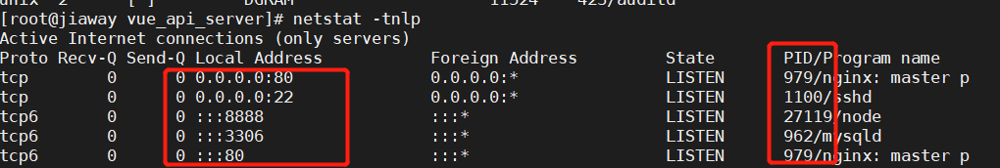

### linux的目录结构

- linux的目录结构是一个树形结构
- windows系统可以拥有多个盘符，c，d，e
- linux没有盘符的概念，只有一个根目录/ 所有文件都在它下面

### linux命令基础

命令：即linux终端，是一种命令提示符页面，以纯“字符”的形式操作系统

命令行：即 linux程序，一个命令就是linux的程序

无论是什么命令，用于什么用途，在linux中。命令有其通用格式

command：命令本省

-options：【可选，非必填】命令的一些选项，可以通过命令选项控制命令的行为细节

parameter：【可选，非必填】命令的参数，多数用于命令的指向目标等

### **ls命令**

```powershell
#ls命令的作用就是列出目录下的内容，语法细节如下
ls [-a -l -h] [Linux 路径]
-a -l -h 是可选的选项
linux路径是此命令的可选参数
#当不使用选项和参数，直接使用ls命令本体，表示：以平铺形式，列出当前目录下的内容

#直接输入ls命令，表示列出当前工作目录下的内容，当前工作目录是？
linux系统的命名运行终端，在启动的时候，默认会加载
当前登录用户的home目录为当前的工作目录， 所以ls命令列出的是home目录的内容
home目录：每个linux操作用户在linux系统的个人账户目录，路径在：/home/用户名
[root@VM-12-12-opencloudos web]# cd /home
[root@VM-12-12-opencloudos home]#  /user
-bash: /user: No such file or directory
[root@VM-12-12-opencloudos home]# ls
lighthouse  www #用户目录
[root@VM-12-12-opencloudos home]#  


ls命令的参数
#当ls不使用参数，表示列出：当前工作目录的内容，即用户的home目录
#当使用参数，ls命令的参数表示：指定一个linu路径，列出指定路劲内的内容

ls命令选项
-a选项 
#表示all的意思，即是列出全部文件（包含被隐藏的文件/文件夹） 
#只有通过-a选项才能看见这些隐藏文件夹/文件夹
ls  -a  /home

-l 选项，
#表示：以列表（竖版排序）的形式展示内容，并展示更多信息
ls -a -l /home 

# 语法中的选项是可以组合使用的，比如学习的-a 和-l可以组合使用
写法：
ls -l -a
ls -la
ls -al
#上述的三种写法，都是一样的，表示同时应用-l和-a的功能

#混合使用
ls -al /home
ls -la /home


-h选项
#表示易于阅读的形式，列出文件大小，如k m g 
#-h 选项必须搭配 -l 一起使用
ls -alh  /home 

```

### 	目录切换

### cd切换目录

```powershell
#当linux终端（命令行）打开的时候，会以默认以用户的home目录作为当前的工作目录
#我们可以通过cd命令，更改当前所在工作目录
#cd 命令来自英文 change Directory
语法：cd [linux路劲]
cd 命令无需选项，只有参数，表示要切换到那个目录下
cd 命令直接执行，写参数，表示回到用户的home目录下

#回到根目录
cd /
#回到用户目录
cd
#切换目录
cd /home
```

### pw查看当前目录

```powershell
#通过ls来验证当前的工作目录，其实是不恰当的
#我们可以通过pwd命令，来查看当前所在的工作目录
#pwd命令来自： print Work Directory 
语法：pwd
pwd 命令，无选项，无参数，直接输入pwd即可
```

### 相对路劲，决定路劲

```powershell
#如果想要进入home/www下使用相对路径和绝对路径的两种写法
绝对路径
cd /home/www
想对路径
cd /www

#决定路径：以根目录为起点，描述路劲的一种写法，路径以/开头
#相对路径：以当前目录为起点，描述路径的一种写法，路径描述无需以/开头

特殊路径符号
. :表示当前目录
#如： cd ./www 表示切换到当前目录下的www目录内，和cd www 效果一致
..:表示上一级目录
#如：cd../ 即可切换到上一级目录 cd../..切换到上二级目录

~ 表示home目录
#如： cd ~ 即可切换到home目录或者 cd ~ www 切换到home内的www目录 


#进入目录
cd 路径
#退出一级目录
cd ../
#推出一级目录 并进入 下级一个目录
cd ../www 
#退出两级目录
cd ../.. 
#推出两级级目录 并进入 下级一个目录
cd ../.. /www
```

### 目录的常用操作

```powershell
#通过mkdir命令创建新的目录
#mkdir来自英文 Make Directory
语法：mkdir [-p] linux路径
#参数必填，表示Linux路基，即要创建文件夹得路径，相对路基，绝对路基均可
#-P 选项是可选的，表示自动创建不存在的父级目录，适用于创建连续多层级的目录

创建一级目录
mkdir test 
创建多级目录
mkdir -p text/test01/test02
在用户目录下创建
mkdir ~/test

注意！
创建文件夹需要修改权限，请确保操作均在home目录内，不要再home外操作
涉及到权限问题，home外无法成功


#文件目录操作命令 mkdir
作用：创建一个空目录
语法：mkdir [-p] dirName
说明:
	-p: 确保目录存在，不存在就创建一个，通过此选项可以实现多级目录同时创建

举例
	mkdir itcast 在当前目录下，建立一个名为itcast的子目录
	mkdir -p itcast/test 在工作目录下的itcast目录中建立一个名未test的子目录，若itcast目录不存在，则建立一个
	
#文件目录操作命令
作用：删除空目录
语法 rmdir [-p] dirName
说明：
	-p：当子目录被删除后时，父目录为空目录的话，则一并删除
举例
	rmdir itcast 删除名为itcast的空目录
	rmdir -p itcast/test 删除itcast目录中名为test的子目录，或test目录删除后itcast目录变为空目录。则也被删除
	mrdir itcast* 删除名称以itcast开始的空目录
	
	
#文件目录操作命令：rm
作用：删除文件或者目录
语法： rm[-rf] name
说用：
	-r:将目录及目录中所有文件（目录）递归删除
	-f:无需确认，直接删除
举例：
	rm -r itcast/ 删除名为itcast的目录和目录中所有文件，删除前需要确认
	rm -rf/ 无需确认，直接删除名为itcast的目录和目录中所有文件
	rm -f hello.txt 无需确认，直接删除hello.txt
	
	
#拷贝移动命令 cp
作用：用于复制文件或目录
语法：cp[-r] soure dest
说明：
	-r ：如果复制的是目录需要使用此选项，此时将复制该目录下的所有子目录和文件
举例：
	cp hello.txt itcast/ 将hello复制到itcast目录中
	cp hello.txt ./hi.txt 将hello.txt复制到当前目录下，并改名成hi.txt
	cp -r itcast/ ./itheimal/ 将itcast目录下的所有文件复制到itheimal目录下
	cp -r itcast/* ./itheima/ 将itcast目录下的所有文件复制到itheimal目录下 
	
#拷贝移动命令mv
作用：为文件或目录改名，或将文件或目录移动到其他位置
语法：mv source dest
举例：
	mv hello.txt hi.txt 将hello.txt 改名为hi.txt  原理和windows的剪切一样
	mv hi.txt itheima. 将文件hi.txt 移动到itheima目中中
	mv hi.txt itheima/hello.txt 将文件hi.txt 移动到itheima目录中，并改名为hello.txt
	mv itcast/ itheima/ 如itheima目录不存在，将itcast目录改名为itheima
	mv itcast/ itheima/ 如果itheima目录不存在，将itcast目录移动到itheima目录中
	

#打包压缩命令 tar
作用：对文件进行打包，解包，压缩，解压
语法： tar [-zcvxf] fileNmae [files]
包文件后缀为.tar 表示只是完成了打包，没有压缩
包文件后缀为tar.gz 表示打包的同时还进行了压缩

说名：
	-z :z表示的是gzip，同过gzip命令处理文件，gzip可以对文件压缩或解压
	-c：c代表的是create，即创建新的包文件
	-x：x代表的是extract，实现从包文件中还原文件
	-v：v代表的verbose，显示命令的执行过程
	-f：f代表的是file，用于指定包文件的名称

举例：
	#打包
	tar -cvf hello.tar ./* 将当前目录下所有文件打包，打包后的文件命名为hello.tar
	tar -zcvf hello.tar.gz ./* 将当前目录下所有文件打包并压缩，打包后的文件名hello.tar.gz
	#解包
	tar -xvf hello.tar 将hello.tar文件进行解包，并将解包的文件放在当前目录
	tar -zxvf hello.tar.gz 将hello.tar.gz 进行解压，并将解压后的文件放在当前目录
	tar -zxvf hello.tar.gz /user/local 将hello.tar.gz文件进行解压，并将解压的文件放在/user/local目录
	#
	tar -cvf test.tar test ：将test文件打包 
	tar -czvf test.tar.gz test :将test文件打包压缩
	tar -xvf test.tar ：将test.tar 文件进行解包
	tar -zxvf test.tar.gz ：将test.tar 将文件进行解压解包 	
	
	

#文本编辑命令 vi/vim
作用：vi命令是linux系统提供的一个文本编辑工具。可以对文本内容进行编辑，类型与windows中的记事本
语法：vi fileName
说明：
	1:vim是从vi发展来的一个功能更加强大的文本编辑工具，在编辑文件时可以对文本内容进行着色，方便我们对文件进行编辑处理，所有实际工作win更加常用

#文本编辑命令vim
作用：对文件内容进行编辑，vim其实就是一个文本编辑器
语法：vim fileName
说明：
	1：在使用vim命令编辑文件时，如果指定的文件存在则直接打开文此文件。如果指定文件不村子，则新建立文件
	2：vim在进行文本编辑器时共分为三种模式，分别是命令模式（command mode），插入模式（insert mode） 和底行模式（last line mode ）这三中模式可以相互切换，我们在使用vim时一定要注意当前所处于那个模式
	命令模 式说明：
		1：命令模式下可以查看文件内容吗，移动光标（
		2：通过vim命令进入打开文件后，默认进入命令模式
		3：另外两种模式需要先进入命令模式才能进入
	插入模式说明：
		1：插入模式下可以对文本内容进行编辑
		2：在命令模式下安下【i，a，o】任意一个，可以进入插入模式，进行插入模式后，下方会出现insert字样
		3：在插入模式下按下esc键，回到命令模式
	底行模式说明：
		1：底行模式下可以通过命令对文件内容进行查找，显示行号，退出等操作
		2：在命令模式下按下【:,/】任意一个可以进入底行模式
		3：通过/方式进入底行模式后，可以对文件内容进行查找
		4：通过: 方式进入底行模式后，可以输入wq（保存并退出），q！（不保存退出），set nu （显示行号）
		
		
#查找命令 find
作用：在指定目录下查找文件
语法：find dirName -option fileName
举例：	
	find ./ -name "*.java" 在当前及其子目录下查找.java结尾的文件
	find /itcast -name "*.java" 在/itacst目录及其子目录下查找.java结尾的文件
	
#查找命令 gerp
作用：从指定文件中查找指定的文本内容
语法： grep word fileName 
举例
	grep Hello HelloWord.java 查找HelloWord.java文件中出席Hello字符串的位置
	grep hello "*.java" 查找当前目录中所有.java结尾的文件周昂包含hellow字符串的位置

```

### 创建文件

```powershell
#可以通过touch命令创建文件
语法  touch linux 路基
#touch命令无选项，参数必填，表示要创建文件路径，相对，绝对，特殊路劲符号都可以使用
创建一个文件
touch t1.txt 

#查看文件内容
cat  linux路 劲
#cat 没有选项，只有必填参数，参数表示被查看的文件

#more命令查看文件内容
#more命令同样可以查看内容，同cat不同的是：
cat是将内容全部显示
more支持翻页。如果内容过多，可以一页一页显示
语法：more linux 路劲
推出查看 按下q键推出查看

#文件操作命令 tail
作用： 查看文件末尾的内容
语法： tail [-f] fileName
说明： 	
	#-f：动态读取文件末尾内容并显示，通常用于日志文件的内容输出
	举例：
	tail/etc/profile 显示/etc目录下的profile文件末尾10行内容
	tail -20/etc/profile 显示etc/目录下的profile文件末尾20行的内容
	tail -f /itacst/my.log 动态读取/itcast目录下的my.log文件末尾内容并显示
```

### 文件操作

**复制文件**

```powershell
cp命令复制文件夹
#cp命令可以用于复制文件/文件夹，cp命令来自于copy
语法 cp [-r] 参数1 参数2
# -r 选项 ，用于复制文件夹使使用，表示递归
# 参数1 表示被复制
# 参数2  存放未知
操作:
复制到同级
cp t1.txt  www
复制到上级
cp t1.txt ../www
复制到用户目录下
cp t1.txt ~/
```

**移动文件**

```powershell
#mv命令可以用于移动文件、文件夹，mv命令来自move
语法： mv 参数1 参数2
参数1： 表示被移动文件
参数2： 表示要移动去的未知
操作：
移动文件
同级移动
mv t1.txt  www
上级
mv t1.txt ../
用户
mv t1.txt ~/

重命名文件
如果一个文件要移动到一个不存在的文件中，就会将自己改名为要以移动的文件
mv web web1
```

**删除文件**

**rm删除文件，文件夹**


```powershell
#rm命令可用于删除文件文件夹
#rm名来自英语remove
语法：rm [-r -f]参数1 参数2 ....
#同cp命令一样 -r选项用用于删除文件夹
#-f表示force，强制删除 (不会弹出确认新形象)
	#普通用户删除内容不会弹出提示，只有root管理员用户删除内容会有提示
	#所以一般普通用户用户到-f选项

#参数1，参数2  参数n  表示要删除的2文件或文件夹路劲，按照空格隔开
```


### 软件安装

**软件安装方式**

- 二进制发布包安装
  - 软件已经针对具体的平台编译打包发布，只要解压，修改配置即可
- rpm
  - 软件已经按照redhat的包管理规范进行了打包，使用rpm命令进行安装，不能自行解决依赖问题
- yum 安装
  - 一种在线软件安装方式，本质上还是rpm安装，自动下载并安装，安装过程中自动解决依赖库问题
- 源码编译安装
  - 软件以源码工程的形式发布，需要自己编译打包


### 安装jdk

操作 步骤

1. 将jdk的压缩包上传到liunx服务器

2. 解压安装包，命令为 tar -zxvf   jdkName  -C /usr/local

3. 配置变量环境，使用vim 命令修改/etc/profile文件，在文件末尾加入如下配置

   ```
   JAVA_HOME = /usr/local/jdk1.8.0_171
   PATH=&JAVA_HOME/bin:&PATH
   ```

4. 重新加载profile文件，使用命令 source /etc/profile

5. 检查是否安装成功


### 安装tomcat

操作步骤

1. 将tomcat安装包上传到liunx服务器
2. 解压安装包 命令：tar -zxvf  tomcatName -C/usr/local
3. 进入tomcat的bin目录，命令： sh.startup.sh  or  ./startup.sj
4. 验证tomcat是否启动成功
   1. 查看进程 ps -ef | grep tomcat
   2. 查看启动日志 ： more /usr/local/tomcat/logs/catalina.out


### 防火墙操作

```powershell
#查看防火墙状态
systemctl status firewalld   firewalld -cmd state
#暂时关闭防火墙
systemctl stop firewalld
#永久关闭防火墙
systemctl disable firewalld
#开启防火墙
systemctl start firewalld
#关闭指定端口
firewall-cmd --zone=public --remove-port=8080/tcp --permanent
#开启指定端口
firewall-cmd --zone=public --add-port=9200/tcp --permanent
#立即生效
    firewall-cmd --reload
#查看开放的端口
firewall-cmd --zone=public --list-ports
```

 

### 查看端口

```powershell
#下载netstat命令
 yum install net-tools -y

# 查看正在运行的端口号和进程号 简洁版
netstat -tnlp

# netstat -tunlp | grep 8000
tcp        0      0 0.0.0.0:8000            0.0.0.0:*               LISTEN      26993/nodejs   

netstat -ntlp   //查看当前所有tcp端口
netstat -ntulp | grep 80   //查看所有80端口使用情况
netstat -ntulp | grep 3306   //查看所有3306端口使用情况

# 杀掉进程 kill -9 pid 如 杀掉 27119
kill -9 27119
```




