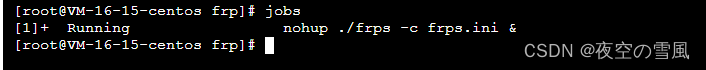

## 前言：

### 为什么需要内网穿透功能？

从公网中访问自己的私有设备向来是一件难事儿。
自己的主力台式机、NAS等等设备，它们可能处于路由器后，或者运营商因为IP地址短缺不给你分配公网IP地址。如果我们想直接访问到这些设备（远程桌面，远程文件，SSH等等），一般来说要通过一些转发或者P2P组网软件的帮助。
我有一台计算机位于一个很复杂的局域网中，我想要实现远程桌面和文件访问，目前来看其所处的网络环境很难通过简单的端口映射将其暴露在公网之中，我试过这么几种方法：

1.远程桌面使用TeamViewer。可用，但需要访问端也拥有TeamViewer软件，不是很方便，希望能使用Windows自带的远程桌面。且TeamViewer不易实现远程文件访问。
2.使用蒲公英VPN软件进行组网，可用，但免费版本网络速度极慢，体验不佳，几乎无法正常使用。
3.使用花生壳软件进行DDNS解析，可用，但同第二点所述，免费版本有带宽限制，无法实际使用。
4.搭建frp服务器进行内网穿透，可用且推荐，可以达到不错的速度，且理论上可以开放任何想要的端口，可以实现的功能远不止远程桌面或者文件共享。

## [frp](https://so.csdn.net/so/search?q=frp&spm=1001.2101.3001.7020)是什么？

```powershell
1.frp是一个高性能的反向代理应用，可以帮助您轻松地进行内网穿透，对外网提供服务， 支持tcp, udp, http,
https等协议类型，并且web服务支持根据域名进行路由转发。
2.frp内网穿透主要用于没有公网IP的用户，实现远程桌面、远程控制路由器、
搭建的WEB、FTP、SMB服务器被外网访问、远程查看摄像头、调试一些远程的API（比如微信公众号，企业号的开发）等。
3.为什么要选择frp？市面上提供内网穿透服务的公司对免费的用户是有限制的，
本站免费提供无限流量、无限域名绑定、不限制网速、不限制连接数的内网穿透服务
```

## 准备工作

**搭建一个完整的frp服务链，我们需要：**

- VPS一台（也可以是具有公网IP的实体机）
- 访问目标设备（就是你最终要访问的设备）
- 简单的Linux基础（会用cp等几个简单命令即可）

## [VPS](https://so.csdn.net/so/search?q=VPS&spm=1001.2101.3001.7020)相关

因为frp的原理是利用服务端（所准备的VPS）进行转发，因而VPS的速度直接决定了之后连接的质量，请根据自己的需要选择相应主机配置。
我这里测试使用的是腾讯云4核4G的轻量应用服务器，采用的宝塔Linux面板 7.6.0 腾讯云专享版。


## 下边开始正式的配置：

## 1.服务端配置

[SSH连接](https://so.csdn.net/so/search?q=SSH连接&spm=1001.2101.3001.7020)到VPS或者通过宝塔面板终端运行如下命令查看处理器架构，根据架构下载不同版本的frp。

```
arch
```

查看结果，如果是“X86_64“即可选择”amd64”，
运行如下命令，根据架构不同，选择相应版本并进行下载

```powershell
wget https://github.com/fatedier/frp/releases/download/v0.42.0/frp_0.42.0_linux_amd64.tar.gz
```

然后解压

```powershell
tar -zxvf frp_0.42.0_linux_amd64.tar.gz
```

文件夹改个名，方便使用

```
cp -r frp_0.42.0_linux_amd64 frp
```

把解压出来的文件夹复制到你想要的目录下，这里我放在了/root/frp路径下。

```powershell
cd frp
```

查看一下文件

```
ls -a
```

我们只需要关注如下几个文件

```powershell
frps
frps.ini
frpc
frpc.ini
```

前两个文件（s结尾代表server）分别是服务端程序和服务端配置文件，后两个文件（c结尾代表client）分别是客户端程序和客户端配置文件。
因为我们正在配置服务端，可以删除客户端的两个文件

```powershell
rm frpc
rm frpc.ini
rm frpc_full.ini
```

然后修改frps.ini文件

```
vim frps.ini
```

```
[common]
bind_port = 7000
dashboard_port = 7500
token = 41f1a553fd725468436eeac92425285f9accbd21e31325575ee27ab1ea928931
dashboard_user = root
dashboard_pwd = admin
```

如果没有必要，端口均可使用默认值，token、user和password项请自行设置。

```powershell
“bind_port”表示用于客户端和服务端连接的端口，这个端口号我们之后在配置客户端的时候要用到。
“dashboard_port”是服务端仪表板的端口，若使用7500端口，在配置完成服务启动后可以通过浏览器访问 x.x.x.x:7500
（其中x.x.x.x为VPS的IP）查看frp服务运行信息。 “token”是用于客户端和服务端连接的口令，请自行设置并记录，稍后会用到。
“dashboard_user”和“dashboard_pwd”表示打开仪表板页面登录的用户名和密码，自行设置即可。
“vhost_http_port”和“vhost_https_port”用于反向代理HTTP主机时使用。

```

之后我们就可以运行frps的服务端了

```
./frps -c frps.ini
```


**注意云服务需要配置放行 端口  7000 7500**

#### 服务端后台运行

至此，我们的服务端仅运行在前台，如果Ctrl+C停止或者关闭SSH窗口后，frps均会停止运行，因而我们使用 nohup命令将其运行在后台。

```
nohup后台程序管理或关闭相关命令可自行查询资料，上面这个连接中也有所提及。
```

```powershell
nohup ./frps -c frps.ini &
```

输出如下内容即表示正常运行：


```
此时可先使用Ctrl+C关闭nohup，frps依然会在后台运行，使用jobs命令查看后台运行的程序
```

```
jobs
```



此时访问服务器ip地址:7500依然可以打开仪表板界面，至此，服务端即设置完成。

#### 关闭frp进程


找到frp进程

```powershell
ps -aux|grep frp| grep -v grep
```


进程号是18066

**kill该进程**

```
# 命令格式：kill -9 <pid>
kill -9 18066
```


#### 配置systemctl来控制frps

1、创建frps.service

```
sudo vim /lib/systemd/system/frps.service
```

2、在frps.service里添加以下内容

```
[Unit]
Description=frps service
After=network.target syslog.target
Wants=network.target

[Service]
Type=simple
#启动服务的命令（此处写你的frps的实际安装目录）
ExecStart=/root/frp/frps -c /root/frp/frps.ini

[Install]
WantedBy=multi-user.target
```

***注意"ExecStart="之后的路径要填写你的frps安装路径(本文以安装到/root/frp/为例)***
对应的文件地址：

3、使用systemctl命令来控制frps

```
启动frps
```

```powershell
sudo systemctl start frps
```

```
服务器开机自动启动frps
```

```
sudo systemctl enable frps
```

```
重启frps
```

```
sudo systemctl restart frps
```

```
停止frps
```

```
sudo systemctl stop frps
```

```
查看日志
```

```
sudo systemctl status frps
```


## 2.客户端设置


frp的客户端就是我们想要真正进行访问的那台设备，大多数情况下应该会是一台Windows主机，因而本文使用Windows主机做例子。Linux配置方法类似。

同样地，根据客户端设备的情况选择相应的frp程序进行下载，Windows下下载和解压等步骤不再描述。
假定你下载了“frp_0.42.0_windows_amd64.zip”，将其解压在了C盘根目录下，并且将文件夹重命名为“frp”，可以删除其中的frps和frps.ini、frps_full.ini文件。
下载地址：
https://github.com/fatedier/frp/releases/download/v0.42.0/frp_0.42.0_windows_amd64.zip

用文本编辑器打开frpc.ini，与服务端类似，内容如下：

```powershell
[common]
server_addr = 你的服务器ip
server_port = 7000
token = 41f1a553fd725468436eeac92425285f9accbd21e31325575ee27ab1ea928931 # toke 密钥 要和 服务端的token一致


[rdp]
type = tcp # 服务代理类型
local_ip = 127.0.0.1    # 本地地址       
local_port = 3389 # 本地代理端口
remote_port = 7001   # 服务器代理端口

# 配置完成  等于
服务IP:7001 = 127.0.0.1:3389
```


```powershell
其中common字段下的三项即为服务端的设置。
“server_addr”为服务端IP地址，填入即可。
“server_port”为服务器端口，填入你设置的端口号即可，如果未改变就是7000
“token”是你在服务器上设置的连接口令，原样填入即可。
```

## 自定义规则

frp实际使用时，会按照端口号进行对应的转发，原理如下图所示：


```pow
上面frpc.ini的rdp、smb字段都是自己定义的规则，自定义端口对应时格式如下。
“[xxx]”表示一个规则名称，自己定义，便于查询即可。
“type”表示转发的协议类型，有TCP和UDP等选项可以选择，如有需要请自行查询frp手册。
“local_port”是本地应用的端口号，按照实际应用工作在本机的端口号填写即可。
“remote_port”是该条规则在服务端开放的端口号，自己填写并记录即可。 RDP，即Remote Desktop
远程桌面，Windows的RDP默认端口是3389，协议为TCP，建议使用frp远程连接前，在局域网中测试好，能够成功连接后再使用frp穿透连接。
SMB，即Windows文件共享所使用的协议，默认端口号445，协议TCP，本条规则可实现远程文件访问。
```

配置完成frpc.ini后，就可以运行frpc了。

***frpc程序不能直接双击运行！***
使用命令提示符或Powershell进入该目录下

```
cd C:\frp
```

并执行

```
./frpc -c frpc.ini
```

运行frpc程序，窗口中输出如下内容表示运行正常。


不要关闭命令行窗口，此时可以在局域网外使用相应程序访问 x.x.x.x:xxxx （IP为VPS的IP，端口为自定义的remote_port）即可访问到相应服务。

## 客户端后台运行及开机自启

rpc运行时始终有一个命令行窗口运行在前台，影响美观，我们可以使用一个批处理文件来将其运行在后台，而且可以双击执行，每次打开frpc不用再自己输命令了。
在任何一个目录下新建一个文本文件并将其重命名为“frpc.bat”，编辑，粘贴如下内容并保存。

```powershell
@echo off
if "%1" == "h" goto begin
mshta vbscript:createobject("wscript.shell").run("""%~nx0"" h",0)(window.close)&&exit
:begin
REM
cd C:\frp
frpc -c frpc.ini
exit

```

将cd后的路径更改为你的frpc实际存放的目录。

之后直接运行这个 .bat 文件即可启动frpc并隐藏窗口（可在任务管理器中退出）。


```powershell
至于开机启动，把这个.bat文件直接扔进Windows的开机启动文件夹就好了。

至此，客户端配置完成，之后就是你自己根据需要在frpc.ini后追加规则即可。
强烈建议你在使用frp直接测试内网穿透前，先在局域网内测试好相关功能的正常使用，并配置好可能会影响的Windows防火墙等内容，在内网调试通过后再使用frp进行内网穿透测试。

```

