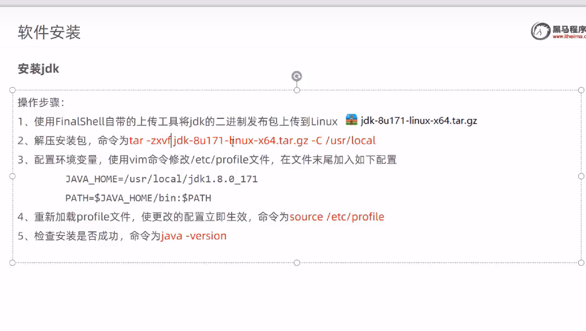
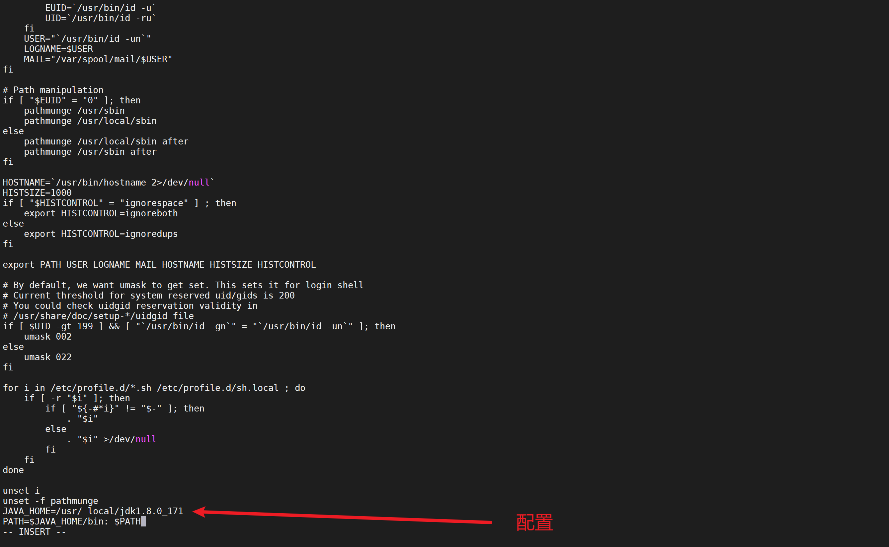

## 安装jdk



```powershell
#将上传的 jdk文件进行解压  并指定解压路径放在 /usr/local
tar -zxvf jdk-8u171-linux-x64.tar.gz -C /usr/local 
```


### 配置环境变量 

通过 vim /etc/profile 打开配置文件

```powershell
JAVA_HOME=/usr/local/jdk1.8.0_121
PATH=$JAVA_HOME/bin:$PATH


JAVA_HOME=/usr/local/btjdk/jdk8


```



### 重新加载配置

```powershell
source /etc/profile
```

### 查看是否配置成功

```powershell
java -version 
```

