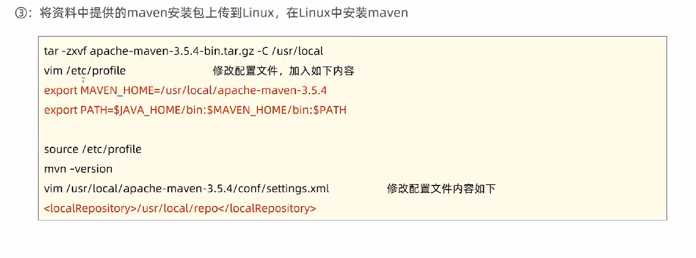

```
tar -zxvf apache-maven-3.5.4-bin.tar.gz -C /usr/local
vim /etc/profile

export MAVEN_HOME=/usr/local/apache-maven-3.5.4
export PATH=$JAVA_HOME/bin:$MAVEN_HOME/bin:$PATH;

source /etc/profile
mvn -version
vim /usr/local/apache-maven-3.5.4/conf/settings.xml

```

