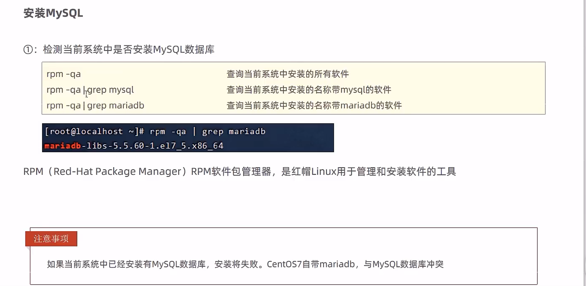
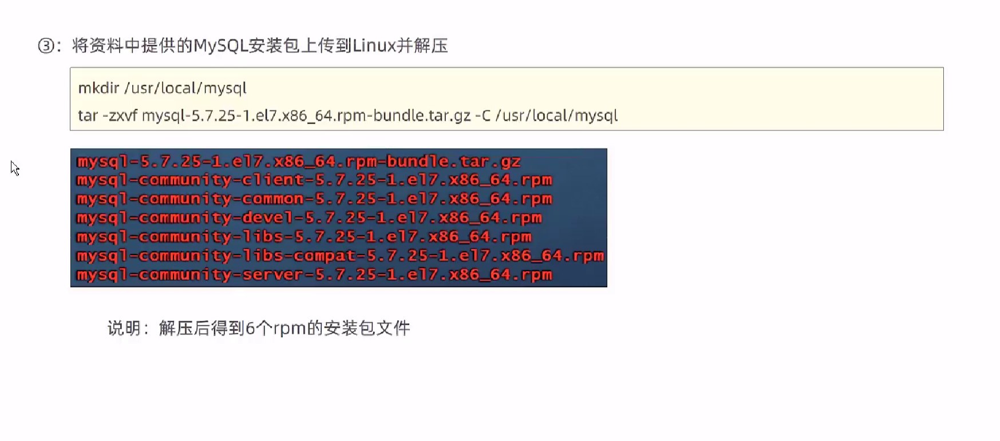
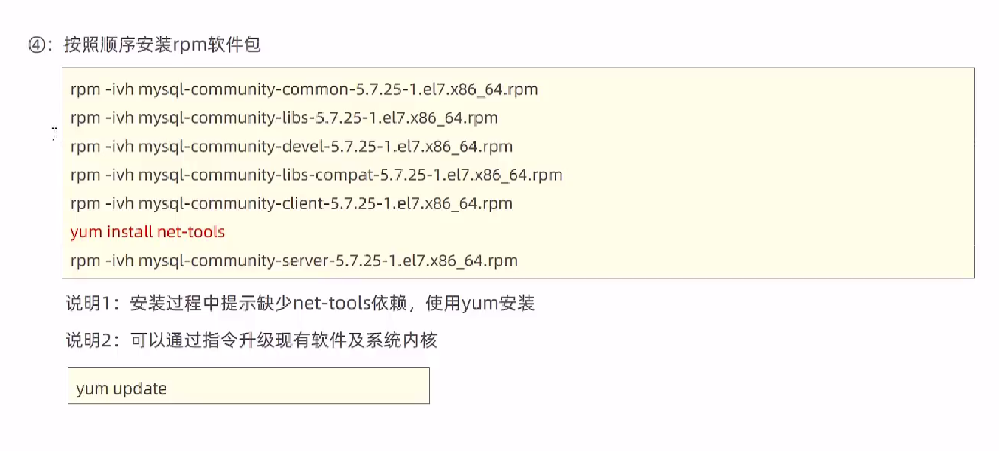
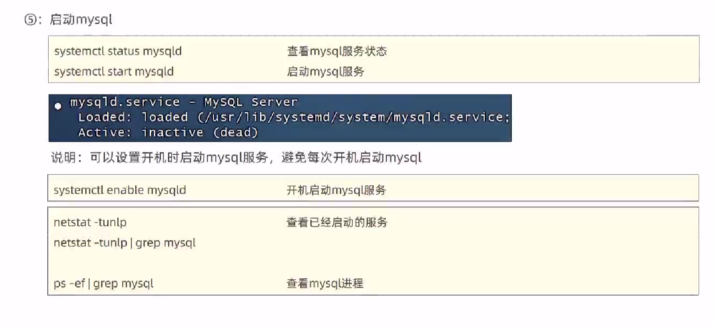
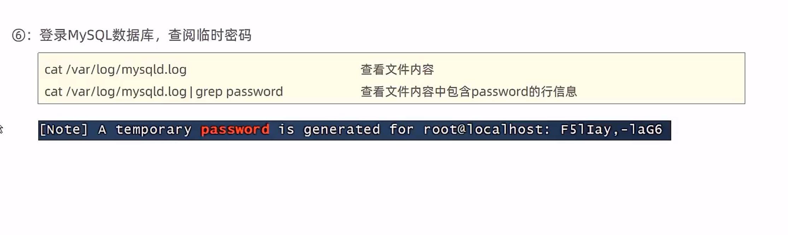
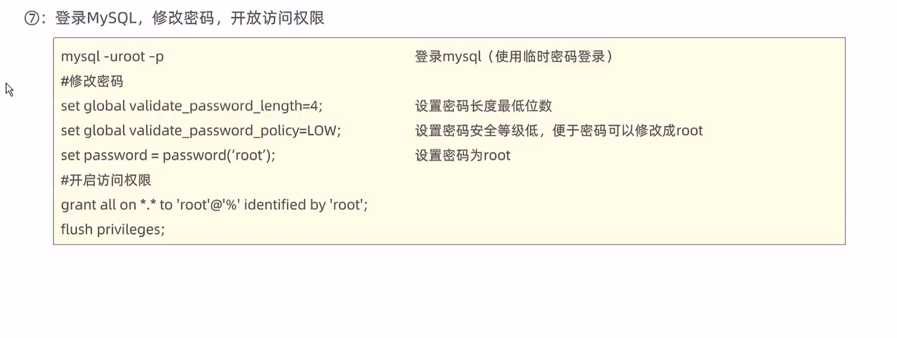

## 安装mysql




```
rpm -e --nodeps 
```




```
cd /usr/local
mkdir mysql

tar -zxvf  mysql-5.7.25-1.el7.x86_64.rpm-bundle.tar.gz  -C /usr/local/mysql
```




```
 rpm -ivh mysql-community-common-5.7.25-1.el7.x86_64.rpm
rpm -ivh mysql-community-libs-5.7.25-1.el7.x86_64.rpm
rpm -ivh mysql-community-devel-5.7.25-1.el7.x86_64.rpm
rpm -ivh mysql-community-libs-compat-5.7.25-1.el7.x86_64.rpm
rpm -ivh mysql-community-client-5.7.25-1.el7.x86_64.rpm
```







```
 cat /var/log/mysqld.log | grep password

```



```
set global validate_password_length =4; 
set global validate_password_policy=LOW;
set password =password('root');
grant all on *.*to'root'@'%'identified by 'root'
flush privileges;
```

