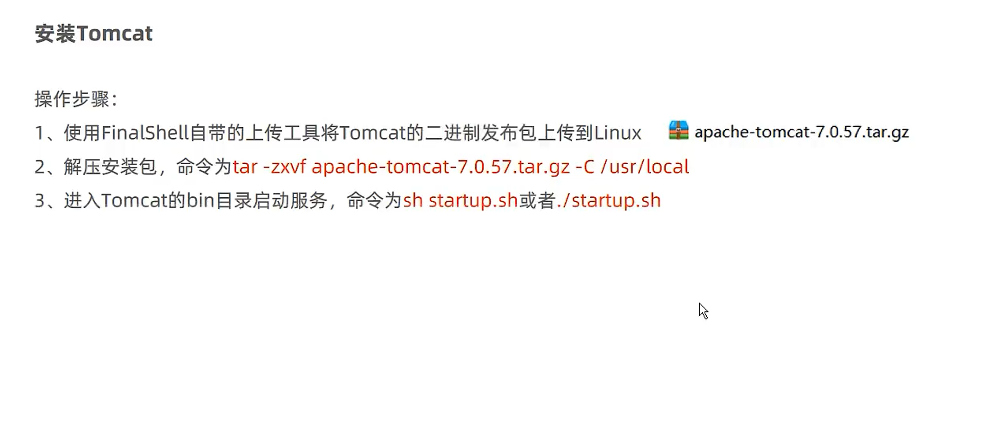
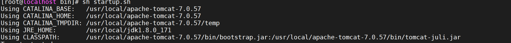
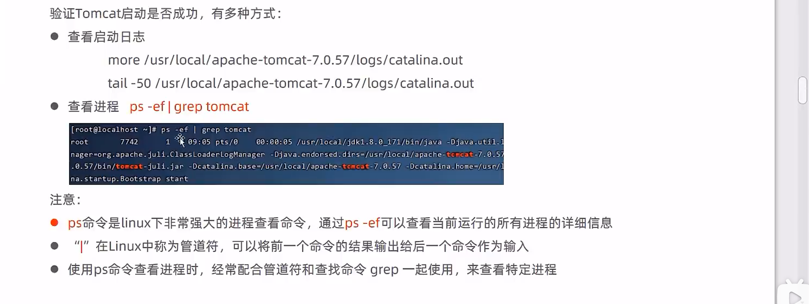
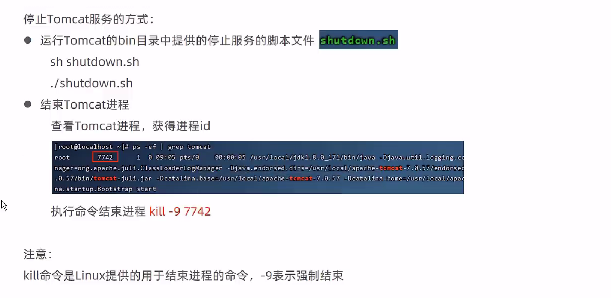

## 安装tomcat



### 解压

上传完成后解压到 /usr/local

```powershell
tar -vxzf apache-tomcat-7.0.57.tar.gz  -C /usr/local
```

### 启动tomcat

进入到tomcat包中执行 startup.sh

```
cd /usr/local
cd /apache-tomcat-7.0.57/bin
sh startup.sh
```

**启动成功**




### 验证tomcat是否启动成功



### 停止tomcat

