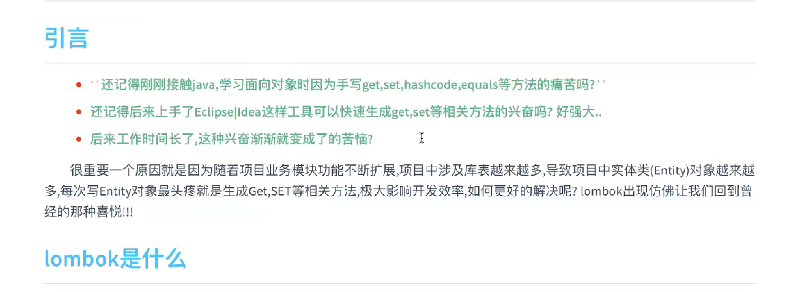
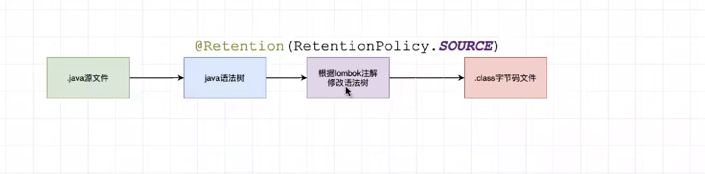

## ombok 配置

### maven项目引入依赖


```xml
<!--这个是springboot项目 版本已经被springboot管理--> 
<dependency>
            <groupId>org.projectlombok</groupId>
            <artifactId>lombok</artifactId>
        </dependency>
```

### 确保idea下载了lombok插件


## 什么是lombok

----



---


```
Lombox是一个好用的工具，就像 Google Guava 一样。可用来帮助开发人员消除 Java 的冗长代码，尤其是对于简单的 Java 对象（POJO）。它通过注释实现这一目的。

通过在开发环境中实现 Lombok，开发人员可以节省构建诸如hashCode()和equals()这样的方法以及以往用来分类各种 accessor 和 mutator 的大量时间
```


**通俗解释**

lombok快熟开发工具，提供了一组java相关注解，通过注解来更快的生成java对象中我们想要的相关方法

（get，set，toString ）等一系列方法、


##  lombok原理



```
lombok是在编译的时候生效的
lombox是java编译到语法树的时候进行修改语法树，到达功能
lombok包只在开发环境使用，生产环境是不需要lombok包的

     <dependency>
            <groupId>org.projectlombok</groupId>
            <artifactId>lombok</artifactId>
            <scope>provided</scope>
        </dependency>

 <scope>provided</scope> 所以将scope设置为 provided
```


## 注解

### @Data注解

```java
@Data 
public class TestUser {
    private String id;
    private String name;
    private String password;
}
//类注解
// @data注解会帮我们重写get set toString equals hashCode 方法	
```

### @Get   @Set

```java
@Get
@Set
public class TestUser {
    private String id;
    private String name;
    private String password;
}
//类注解
//只生成get or set 方法
```

### @toString

```java
@toString
public class TestUser {
    private String id;
    private String name;
    private String password;
}
//类注解
//值生成 toString 方法
```

### @AllArgsConstructor

### @NoArgsConstuctor

```java
@AllArgsConstructorg  //生成全部有参钩爪
@NoArgsConstuctor  //生成无参构造
public class TestUser {
    private String id;
    private String name;
    private String password;
}

```

### @Accessors

```java
@Accessors(chain = true) //开启set方法的链式调用
@NoArgsConstuctor
public class TestUser {
    private String id;
    private String name;
    private String password;
}


public class Dome(){
    public static void main (String [] grs){
        TestUser  user = new TestUser();
        user.setId("1").setName("张三"); //开启链式调用 
    }
}
```


## 日志注解

### @Slf4j

```java
//类注解
//快速的给类中定义一个日志变量

@Slf4j  //等同于--》  private Logger = LoggerFactory.getLogger(this.getClass());
public class Dome(){
	//原生写法日志变量
    private Logger = LoggerFactory.getLogger(this.getClass());
}
```

