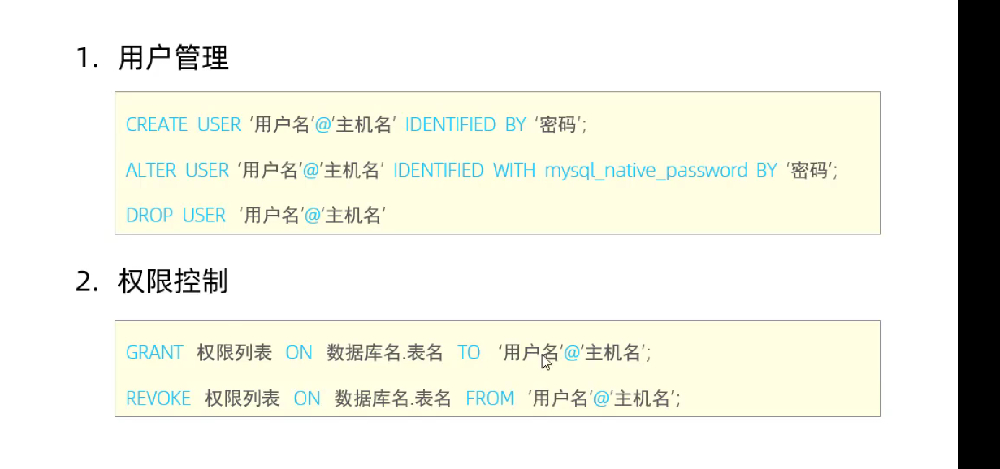

### sql的通用语法

1. sql语句可以单行或多行书写，以分号结尾
2. sql语句可以使用空格/缩进在增强语句的可读性
3. mysql数据库的sql语句不区分大小写
4. 注释
   1. 单行注释：--注释内容 or # 注释内容
   2. 多行注释 /* 注释内容 */


### sql分类


## DDL

对数据库的结构操作

### DDL 数据库操作

```mysql
# 查询所有数据库
show databases;

#查询当前数据库
select database();

#创建
create database [if not exists] name [default charset=[utf-8] [collate 排序规则]]

#删除 
drop database [if exists] name;

#使用
use databasename


```

```mysql
show databases ;
create  database  if not exists  mydome ;
drop  database  if exists  mydome;
use mysql;
select database();
```


### DDL 查询表结构

```mysql
#查询当前数据库的所有表
show  tables

#查询表结构
desc 表名

#查询指定表的建表语句
show create table 表名
```

### DDL 表操作-创建

```mysql
create table user(
	字段1  字段类型 [commit 字段1注释],
    字段2  字段类型 [commit 字段2注释],
    字段3  字段类型 [commit 字段3注释]
)[commit 表注释];
```


### DDL 表操作-修改

```mysql
#增加字段
alter table 表名 add 数据类型	[commit 注释]  [约束]

alter table  user add shows varchar(255) ;

#修改数据类型
alter table 表明 modify 字段名 数据类型;

alter  table  user modify  shows int not null ;

#修改字段名和数据类型
alter table 表明  change 旧字段名 新字段名 数据类型  [commit 注释] [约束]; 
alter  table  user change  shows display varchar(255) not null ;

#删除字段
alter table 表明 drop 字段名;
alter  table  user drop  display;

#修改表明
alter table 表名 rename to 新表名
alter  table  user rename to users

```

### DDL 表操作-删除

```mysql
#删除表
drop table [if exists] 表名  #判断删除，不会出现报错

drop table if exists users;

#删除指定表，并重新创建表
truncate table 表名; 

#删除表，然后根据建表语句重新创建
truncate table users;
```


## DML

对数据库的表进行增删改的操作

### DML-增加数据

```mysql
#给表中的指定指定字段增加数据
insert into 表名(字段名1，字段名2,...) value(值1,值2,...);

insert into users (id, name, password)
values (null,'root','123456');

#给全部字段增加数据
insert into 表名 value (值1,值2,...);

insert into users
values (null,'root2','123456');

#批量添加数据
insert into 表名(字段名1，字段名2,...) value(值1,值2,...),(值1,值2,...),(值1,值2,...);
insert into 表名 value (值1,值2,...),(值1,值2,...),(值1,值2,...);

insert into users (id, name, password)
values (null,'root','123456'),(null,'huangwei','123456');

```


### DML-修改数据

```mysql
#修改数据
update 表名 set 字段名1=值1，字段名2=值2，字段名3=值3,..[where 条件]

update users
set name = 'huangwei'
where id='1';

```

### DML-删除数据

```mysql
#删除数据
delete from 表名 [where 条件]

delete
from users
where id =1;
```


## DQL

数据库查询语言，用来查询数据库中的记录

### DQL-基础查询

```mysql
#语法
select 
	字段列表
from 
	表名列表
where
	条件列表
group by 
	分组字段列表
having 
	分组后条件列表
order by 
	排序字段列表
limit 
	分页参数
```

- 基本查询
- 条件查询(where)
- 聚合函数(max min count avg sum)
- 分组查询 (group by)
- 排序查询（order by）
- 分页查询（limit）

```mysql
#查询返回多个字段
select 字段1, 字段2, 字段3,...from 表名

select id,name,password from users

#查询全部字段
select * from 表名

select * from users


#设置命名
select 字段1 [as 别名1] , 字段2 [as 别名2], 字段3 [as 别名3 ],...from 表名
select 字段1 [别名1],字段2 [别名2],... from 表名 #简写省略 as 关键字


#取出重复记录
select distinct 字段列表 from 表名

select distinct password '密码'

```


### DQL-条件查询语句

```mysql
#语法
select 字段列表 from 表名 where 字段列表;
```


```mysql
# 查询年龄等于88的员工
select * from emp where age=88;
#查询你年龄小于20的员工信息
select * from emp where age<20;
#查询年龄小于等于20的年龄
select * from emp where age<=20;
#查询没有身份证号的员工信息
select * from emp where idcard is null;
#查询有身份证号的员工
select * from emp where idcard not is null;
#查询年龄不等于88的员工
select * from where age!=88;
select * from where age<>88;
#查询年龄在15（包含）到20（包含）之间的员工
select * from emp where age>=15 and age<=20;
#betwen关键子是包含写法
select * from emp between 15 and 20;
#查询性别为女年龄小于25岁的员工信息
select * from emp where sex='女'and age<25
#查询年龄等于18 or 20 or 40 的员工信息
select * from emp where age=18 or age=20 or 
age=40
select * from emp where age in (18,20,40)
#查询姓名为两个子的员工
select * from emp where name like '__'
#查询身份证号最后一位是x的员工共信息
select * from emp where name like '%_'
select * from emp where name like '_______________x'
```

### DQL-聚合函数

**介绍**

 讲一列数据作为一个整体，做纵向计算

**常见的聚合函数**


**语法**

```mysql
select  聚合函数(字段列表) from 表名;

#统计企业员工数量
select count(*) from emp;
select count(id) from emp; 

#null值是不参与聚合函数计算的

#统计企业员工的平均年龄
select avg(age) from emp;

#统计企业员工的最大年龄
select max(age) from emp;

#统计企业员工的最小年龄
select min(age) from emp;

#统计西安地区的年龄之和
select sum(age) from where workaddress='西安'
```


### DQL-分组查询

```mysql
select  字段列表 from 表名 [where 条件] group by 分组字段 [having 分组后过滤条件]
```

**where和having的区别**

- 执行时机不同：where是分组之前进行过滤，不满足where条件，不参与分组，而having是对结果进行过滤
- 判断条件不同：where不能会聚合函数进行判断，而having可以

```mysql
#更具性别分组，统计男性员工和女性员工的数量

select sex,count(*)
from student
group by sex
;

#根据性别分组：统计男性员工和女性员工的平均年龄

select avg(age)
from student
group by sex
;

#查询年龄小于45的员工，并根据工作地址分组，获取员工数量大于等于3的工作地址
select workaddress 
from emp 
where age<45
group by workaddress
having count(workaddress)>=3
```

### DQL-排序查询

```mysql
#语法
select 字段列表 from 表名 order by 字段1 排序方式1，字段2 排序方式2;
```

**排序方式**

- ASC ：升序（默认值）
- DESC ： 降序

**注意！如果是多字段排序，当第一个字段值相同，才会根据第二个字段排序**

```mysql
#根据公司的员工进行排序
select * from emp order by age ASC
#根据入职时间对员工进行降序排序
select * from emp order by entrydate DESC;
#根据年龄对手的员工进行升序排序，年龄相同，在按照入职时间进行排序
select * from emp order by age ASC, entrydate DESC
```

### DQL-分页查询

```mysql
#语法
select 字段列表 from 表名 limit 起始索引，查询记录数
```

**注意**

- 起始索引从0开始，其实索引=（查询页吗-1）* 每页显示数
- 分页查询是数据库的方言，不同的数据库有不同的实现，mysql中的limit
- 如果拆线呢的是第一页数据，起始索引可以省略，直接写limit 10.

```mysql
#查询第一页员工数据，每页展示10条记录
select * from emp limit 0,10

#查询第二页数据，每页展示十条
select * from emp limit 10,10
```


### SQL练习

```mysql
#查询年龄为20，21，22，23的员工
	select * from emp where age in(20,21,22,23)
#查询性别为男，并且年龄在20-40岁含 以内的姓名为三个子的员工
	select * from where sex='男'and between 20 and 40 and name like '___'
#统计员工表中年龄小于60的 男员工和女员工数量
	select sex,count(*) from emp where age<60 group by sex 
#查询年龄小于等于35岁的员工姓名和年龄，并对查询接结果进行升序排序，年龄相同按入职时间排序
	select name,age from emp where age<=35 order by ASC ,entrydate DESC
#查询性别为男，且年龄在20-40岁含以内的前5个员工信息，对查询结果按年龄升序排序，年龄相同按入职时间排序
	select * from where sex='男' and between 20 and 40  age ASC , entrydate DESC limit 5;
```

### DQL执行顺序

```mysql
#编写顺序
select 
	字段列表
from 
	表名列表
where
	条件列表
group by 
	分组字段列表
having 
	分组后条件列表
order by 
	排序字段列表
limit 
	分页参数
	
#执行顺序
```


## DCL

用来管理数据库用户，控制数据库的访问权限

### DCL-用户管理

```mysql
#查询用户
use mysql ;
select * from user;


#创建用户
	create user '用户名'@'主机名' identified by '密码'
	#创建用户 任意主机可以访问
	create user 'aidong'@'%' identified by  'aidong';
	#创建用户，本地主机访问
	create  user 'aidong'@'localhost' identified by 'aidong'
	 创建完成的用户是没有任何权限的


#修改用户密码
	alter user '用户名'@'主机名' identified with mysql_native_password by '新密码' 
	alter  user 'aidong'@'localhost' identified  with  mysql_native_password by '123456'


#删除用户
	drop user '用户名'@'主机名'
	drop  user 'aidong'@'%';
	
	
		create user '用户名'@'主机名' identified by '密码'
```

### DCL-权限控制

mysql中定义了很多种权限，但常用就以下几种、


```mysql
#查询权限
show grants  for 'aidong'@'localhost'

#授予权限
grant [权限列表] no 数据库名.表民 to '用户名'@'主机地址'
	#授予 aidong@localhost用户mysql.user表的全部权限
    grant all no mysql.hser to 'aidong' @ 'localhost';
    
#撤销选线
revoke 权限列表 on 数据库名.表名 form '用户名'@'主机名'

	#撤销 aidong@localhost用户mysql.user 的全部权限
	revoke  all on mysql.user from 'aidong'@'localhost';
```

​	
