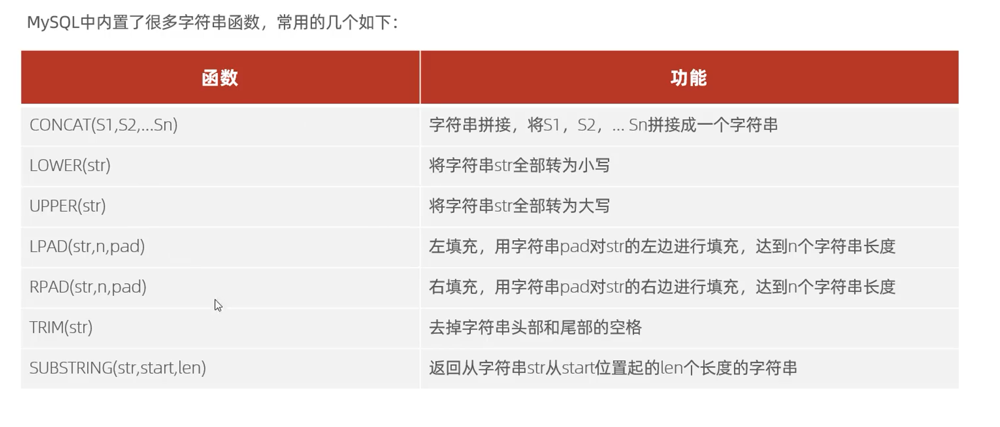
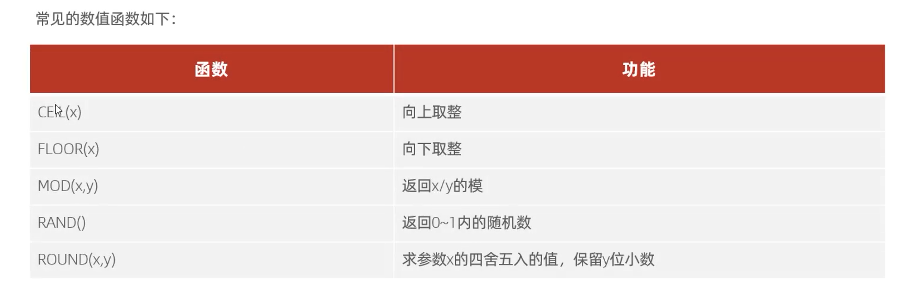
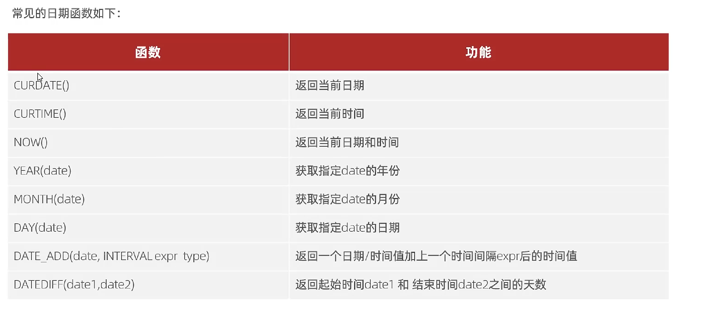
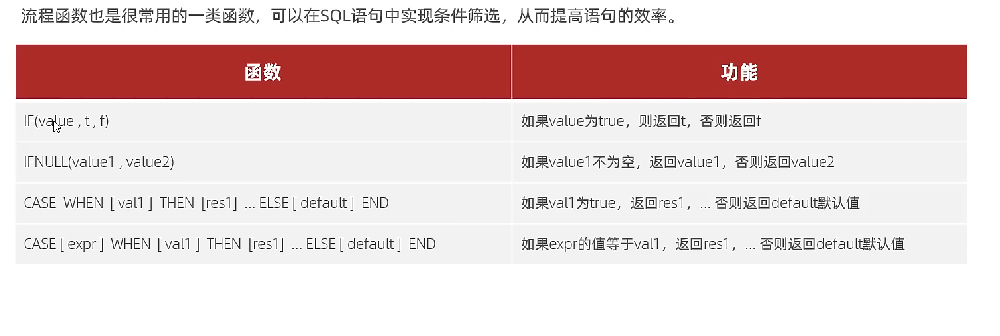

### 字符串函数



```mysql
#字符串凭借函数 将s1 和 s2 sn 拼接成一个字符串 ， mybaits中模糊查询使用
const (s1 , s2... sn)  
	select concat('1','2','3')
	#结果
	123
#将字符串转为小写
lower(str)
	 select  lower('SECASS')
	 #结果
	 secass
#将字符串转为大写
upper(str)
	select upper('scase')
	#结果
	SCASE
#左填充，用字符串pad对str的左边填充，达到n个字符串长度
lapd（str,n.pad）
	select lpad('1',4,'3')
	#结果
	3331
#右填充 用字符串pad对str的由边填充，达到n个字符串长度
repd(str,n,pad)
	select rpad('1',4,'3')
	#结果
	1333
#去除字符串的头部和尾部的空格
tirm(str)
	select trim (' sss ')
	sss
#截取字符串从start开始截取len长度的字符串
subString("123asda",1,3)
	select  subString('123asda',1,3);
	#结果
	123

#sql练习
#1；由于业务需求变更，企业的员工工号，统一为五位数，目前不足五位数的全部在前面补0，
update emp set workno = lapd(workno,5,'0'); 
```


### 数值函数



```mysql
#向上取整
ceil(1.3)
	#结果
	2
#向下取整
floor(1.3)
	#结果
	1
#返回x/y的摸
mod(x,y) 
	select  mod(11,2);
	#结果
	1
	select  mod(10,2);
	#结果
	0
#返回0-1之间的随机数
rand()
	select rand();
	#结果
	0.43939230445715816
#x四舍五入，去y位小数
round()
	select  round(1.5)
	#结果
	2
	select  round(1.4)
	#结果
	1

#sql练习，数据库生成随6位验证码
	select lpad(round(rand() * 1000000,0),6,'0');
```


### 日期函数



```mysql
#返回当前的日期
curdate（）;
	select curdate();
	#结果
	2023-05-18

#返回当前时间
curtiem()
	select curtime();
	#结果
	09:45:21

#返回当亲的时间日期
now()
	select now();
	#结果
	2023-05-18 09:46:09
	
#获取指定data的年份
year();
	select year(now());
	#结果
	2023
	
#获取指定data的月份
	month（）
	select month(now())
	#结果
	5
#获取指定data的日期
day();
	select day(now());
	#结果
	18

#时间相加
date_add();
	#50年后
	select date_add(now(),INTERVAL 50 YEAR )
	#50天后
	select date_add(now(),INTERVAL 50 DAY )
	#50月后
	select date_add(now(),INTERVAL 50 MONTH)

#时间相减
datediff()
	#现在和50年后相差多少天
	select datediff(now(),date_add(now(),INTERVAL 50 YEAR ))
	#结果
	-18263
	
#sql联系
#查询所有员工的入职天数
select datediff(now(),entrydate) from emp 
```

### 流程控制函数



```mysql
#if流程函数
if(vlaue,t,f)
	select if(1=2,'ok','error')
	#结果
	error
	
	select if(1=1,'ok','error')
	#结果
	ok
	
#ifnull函数判断为空
ifnull()
	select ifnull(null,'default');
	#结果
	default
	
	select ifnull('ok','default');
	#结果
	ok
	
#case when else end
#当员工的工作地址是北京/上海的时候显示一线城市，其他的显示二线城市
select name,( case workaddress when '北京' then '一线城市' when '上海' then '一线城市' else '二线城市' end ) '工作地址'
from emp

#统计班级各个学员成绩，展示
#>=85展示优秀
#>=60，展示几个
#否则不及格

#建表
create table score(
    id int comment 'ID',
    name varchar(20) comment '姓名',
    math int comment '数学',
    english int comment '英语',
    chinese int comment '语文'
) comment '学员成绩表';
insert into score(id, name, math, english, chinese) VALUES (1, 'Tom', 67, 88, 95 ), (2, 'Rose' , 23, 66, 90),(3, 'Jack', 56, 98, 76);

#查询
select name,(case   when math>=85 then '优秀' when math>=60 then '及格' else '不及格'end) '数学',
       (case   when  english>=85 then '优秀'  when  english>=60 then '及格' else '不及格' end ) '英语',
       (case  when  chinese>=85 then  '优秀' when  chinese>=60 then '及格' else '不及格' end )'语文'
from score;
	
```

