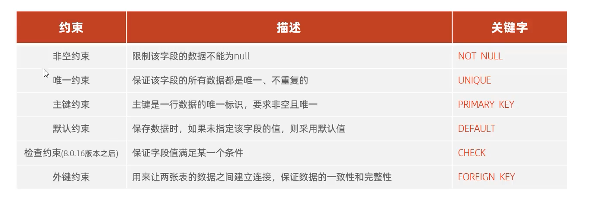
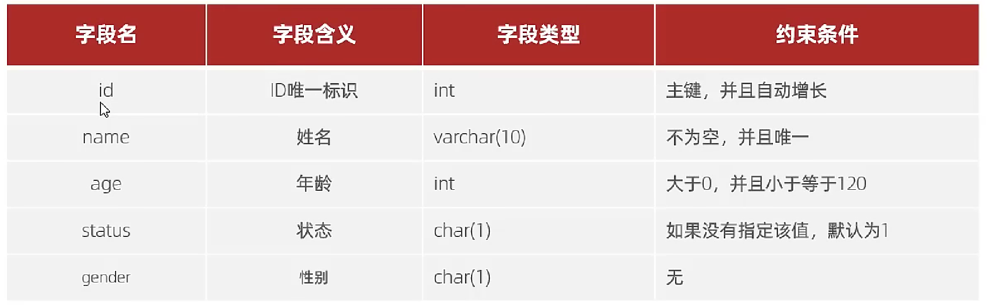
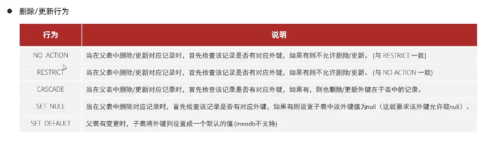

## 概述

1. 约束是作用于表中字段上的规则，用于限制存储在表中的数据
2. 目的：保证数据库中数据的正确，有效和完整性
3. 分离
4. 


### 基础约束



```mysql
create table user (
id int primary key auto_increment commit'主键' , #主键，自增长
name varchar(266) not null unique commit'姓名', #非空 唯一
age int not null  check (age >0 and age < 120) commit'年龄', #非空 年龄小于120 大于 0
status char(1) default '1' commit '状态', #默认约束
gender char(1) commit '性别'
)chaset='utf-8'
```

### 外键约束

**概念**

外键用来让两张表之间建立联系，从而保证数据的一直性和完整性

```mysql
#添加外键语法

create table 表名(
字段名 数据类型, 
    ....
    
[constraint] [外键名称] foreign key (外键字段名) references 主表 （主表列名）
)

#2
alter table 表名 add constraint 外键名称 foreign key (外键字段名) references 主表 （主表列名）


#删除外键

alter table 表名 drop foreign key 外键名称;
```


### 	外键约束更新行为



```mysql

#设置主外键关系， 主表修改主键外键数据也会修改，主表删除数据，外表也会删除相关联主表中数据的数据
alter  table 表名 add constraint 外键名称 foreign key  （外键字段） references 主表名 （主表字段）on update cascade on delete cascade 
```

