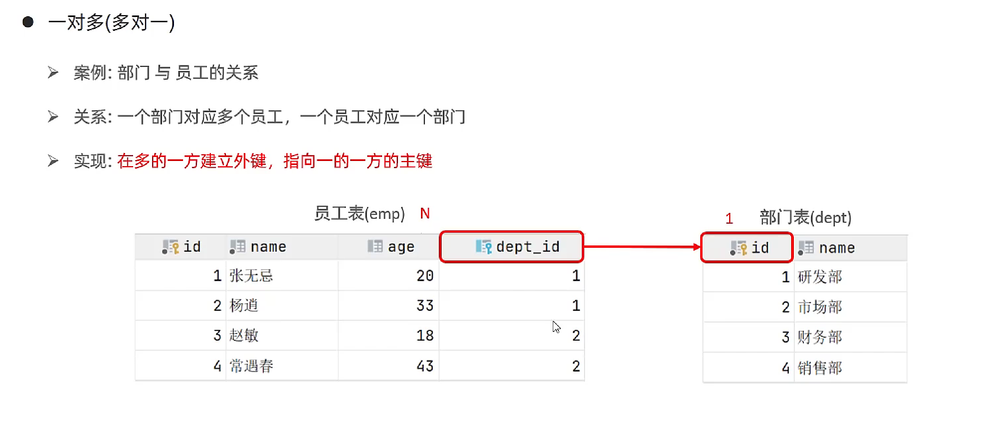
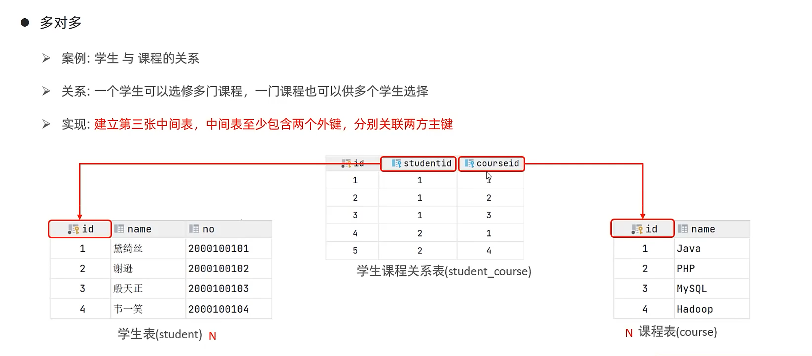
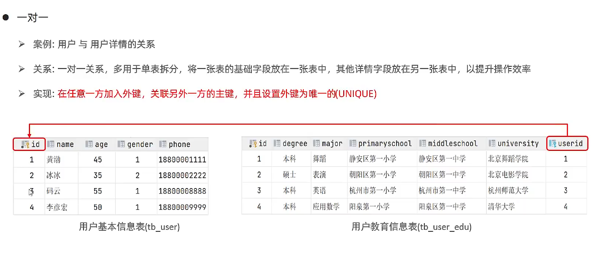
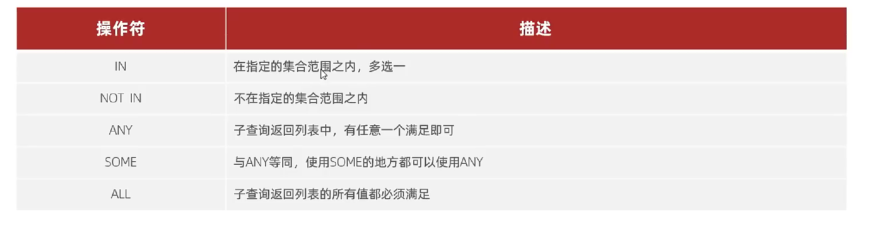

### 多表关系

项目开发中，在进行数据表结构设计时，会根据业务需求以及业务模块之间的关系，分析并设计表结构，由于业务之间相互关联，所有各个表结构之间也存在着各种关系，基本分为三种

- 一对多 （多对一）
- 多对多
- 一对一


**一对多**

- 案例：部门 与 员工的关系
- 关系：一个部门对应多个员工，一个员工对应一个部门
- 实现：在多的一方建立外键，指向一的一方的主键




**多对多**

- 案例：学生与 课程的关系 
- 关系： 一个学生可以选修多门课程，一门课程也可以供多个学生选择
- 实现：建立第三张中间表，中间表至少包含两个外键，分别关联两方主键




**一对一**

- 案例：用户 与 用户详情的关系
- 关系：一对一的关系，多用于单表拆分，将一张表的基础字段放在一张表中，其他详细字段放在另一张表中，以提升效率
- 实现：在任意一方加入外键，关联另外一放的主键，并且设置唯一的unique




**建表数据**

```mysql
create table dept(
    id   int auto_increment comment 'ID' primary key,
    name varchar(50) not null comment '部门名称'
)comment '部门表';

create table emp(
    id  int auto_increment comment 'ID' primary key,
    name varchar(50) not null comment '姓名',
    age  int comment '年龄',
    job varchar(20) comment '职位',
    salary int comment '薪资',
    entrydate date comment '入职时间',
    managerid int comment '直属领导ID',
    dept_id int comment '部门ID'
)comment '员工表';

-- 添加外键
alter table emp add constraint fk_emp_dept_id foreign key (dept_id) references dept(id);


INSERT INTO dept (id, name) VALUES (1, '研发部'), (2, '市场部'),(3, '财务部'), (4, '销售部'), (5, '总经办'), (6, '人事部');
INSERT INTO emp (id, name, age, job,salary, entrydate, managerid, dept_id) VALUES
            (1, '金庸', 66, '总裁',20000, '2000-01-01', null,5),

            (2, '张无忌', 20, '项目经理',12500, '2005-12-05', 1,1),
            (3, '杨逍', 33, '开发', 8400,'2000-11-03', 2,1),
            (4, '韦一笑', 48, '开发',11000, '2002-02-05', 2,1),
            (5, '常遇春', 43, '开发',10500, '2004-09-07', 3,1),
            (6, '小昭', 19, '程序员鼓励师',6600, '2004-10-12', 2,1),

            (7, '灭绝', 60, '财务总监',8500, '2002-09-12', 1,3),
            (8, '周芷若', 19, '会计',48000, '2006-06-02', 7,3),
            (9, '丁敏君', 23, '出纳',5250, '2009-05-13', 7,3),

            (10, '赵敏', 20, '市场部总监',12500, '2004-10-12', 1,2),
            (11, '鹿杖客', 56, '职员',3750, '2006-10-03', 10,2),
            (12, '鹤笔翁', 19, '职员',3750, '2007-05-09', 10,2),
            (13, '方东白', 19, '职员',5500, '2009-02-12', 10,2),

            (14, '张三丰', 88, '销售总监',14000, '2004-10-12', 1,4),
            (15, '俞莲舟', 38, '销售',4600, '2004-10-12', 14,4),
            (16, '宋远桥', 40, '销售',4600, '2004-10-12', 14,4),
            (17, '陈友谅', 42, null,2000, '2011-10-12', 1,null);


```


### 多表查询

- **概述** 指从多张表中查询数据
- **笛卡尔积**  笛卡尔积乘积是值在数学中，两个集合 a集合 和 b集合 的所有组合情况（**在多表查询时，需要消除无效的笛卡尔积**）

```mysql
#多表 直接查，出现笛卡尔积情况
select *
from emp e , dept ;

#消除笛卡尔积
select *
from dept d, emp e where  d.id = e.dept_id;
```

**多表查询的分类**

- 连接查询	
  - 内连接：相当于查询 A，B交集部分数据
  - 外连接
    - 左外连接：查询左表所有数据，以及两张表交集部分数据
    - 右外连接：查询右表所有数据，以及两张表交集部分数据
  - 自连接：当前表与自身的连接查询，自连接必须使用表别名
- 子查询


### 多表查询-内连接

- 内连是查询两张表交集的部分


**内连接查询语法**

```mysql
#隐式内连接
select 字段列表 from 表 表1，表2 where 条件 ....


#显示内连接 
select 字段列表 from 表1 [inner] join 表2 on 连接条件2


#例子

#查询每一个员工的姓名。以及关联部门的名称（隐式连接实现）
select e.name,d.name
from emp e, dept d  where  e.dept_id = d.id;

#查询每一个员工的姓名。以及关联部门的名称（显式连接实现）
select e.name,d.name
from dept d inner  join  emp e  on e.dept_id=d.id;

```


### 多表查询-外连接

- 外连接查询是 查询主表的全部数据和子表与主表相关的数据

```mysql
#左外连接
select 字段列表 from 表1 left [outer] join 表2 条件 ...


#右外连接
select 字段列表 from 表1 right [outer] join 表2 条件 ...


#例子，
#查询emp表的所有数据，和相应部门的信息(左外连接)
select *
from emp left join dept on emp.dept_id=dept.id;

#查询emp表的所有数据，和相应部门的信息(右外连接)
select *
from dept d right join emp e on d.id = e.dept_id;
```


### 多表查询-自连接

- 自连接查询，可以是内连查询，也可以是外连接查询

```mysql
#语法
select 字段列表 from 表a 别名a join 表a 别名b on 条件...

#案例
#查询员工，以及所属领导的名子
select e1.name,e1.job,e2.name,e2.job
from emp e1 join emp e2  on e1.id = e2.managerid;

#查询员工，以及所属领导的名子 ，如果员工没有领导，也需要查询出来

select e1.name,e1.job,e2.name,e2.job
from emp e1 left join emp e2 on e1.id=e2.managerid;
```


### 多表查询-联合查询

对应union查询，就是多次查询的结果合并起来，形成一个新的结果集

```mysql
#语法
select 字段列表 from 表 a ...
union [all]
select 字段列表 from 表 b ...

#是将薪资低于5000的员工 ，和年龄大于50的员工全部查询出来

select  * from emp where  salary<5000 union all
                                      select * from emp where age>50
                           
#是将薪资低于5000的员工 ，和年龄大于50的员工全部查询出来 去重
select  * from emp where  salary<5000 union
                                      select * from emp where age>50
                                      
                                   
                                      
#对于联合查询的多张表的列数必须保持一致，字段类型也需要报错一致
#union all 会将全部数据合并在一起， union会对合并之后的数据去重
                                      
                                      
```


### 多表查询-子查询

- 概念：sql语句中嵌套select语句，成为嵌套查询，又成子查询

```mysql
select * from t1 where column1 = (select column1 from t2)

#子查询外部的语句可以是insert / update / delete /select 的任何一个
```

- **根据子查询的结果不同，分为**
  - 标量子查询（子查询的结果为单个值）
  - 列子查询（子查询的结果为一列）
  - 行子查询（子查询结果一行）
  - 表子查询（查询结果为多行多列）

#### 标量子查询

子查询返回的结果是单个值（数字，字符串，日期等）。最简单的形式，这种子查询为 **标量子查询**

常用的操作符号 ： = <> >= < <=

```mysql
#案例
#查询销售部所有员工
select *
from emp where dept_id = (select dept.id from dept where dept.name='销售部');

#查询在东方白入职的员工信息

select *
from emp where entrydate> (select entrydate
from emp where name='方东白');

```

 

#### 列子查询

子查询返回的结果是一列，（可以是多行），这种成为列子查询

常用的操作符号：in not in any some all



```mysql
#案例
#查询销售不 和 市场部 的所有员工信息
select *
from emp where dept_id in (select id
from dept where name in ('销售部','市场部'));
 
#查询比财务部所有人工资都高的员工共信息

select *
from emp where salary >all (select salary
from emp where dept_id=(select id
from dept where name='财务部'));

#查询比研发不任意一人工资的的员工信息
select *
from emp where  salary >any (select salary
from emp where dept_id = (select id
from dept where name='研发部')
);
```

#### 行子查询

子查询返回的结果是一行（可以是多列），这种子查询成为 **行子查询**

常用操作符 : = <> in not in

```mysql
#案例
#查询与张无忌，的薪资以及直属领导相同的阳光信息

select *
from emp where (managerid,salary)=(select managerid,salary from emp where name='张无忌');
```


#### 表子查询

子查询的返回结果是多行多列，这种子查询被称为 **表子查询**

常用的操作符号: in

```mysql
#案例
#查询 鹿杖客 宋远桥 的职位 和薪资相同的员工
select *
from emp where (job,salary) in (select job,salary from emp where name in ('鹿杖客','宋远桥'));

#查询入职日期是 2006-01-01 之后的员工信，及其部门信息

select *
from dept d join (select * from emp where entrydate >'2006-01-01') s where s.dept_id = d.id;
 
```


#### 多表查询联系

```mysql
#查询员工的姓名，年龄，职位，部门信息
select e.name,e.age,e.job,d.name
from emp e, dept d where e.dept_id = d.id;

#查询年龄小于30岁的员工姓名，年龄，职位，部门信息
select e.name,e.age,e.job,d.name
from emp e, dept d where e.dept_id = d.id and age<30;

#查询有用员工的部门id 部门名称
select *
from dept where id in (select dept_id
from emp );

#查询年龄大于40岁。以其归宿部门名称， 如果员工没有分配部门也要显示出来
select *
from emp e left join dept d on e.dept_id = d.id
where  e.age> 40;


#查询所有员工的工资等级
select e.name,s.grade
from emp e , salgrade s where  e.salary>= s.losal and e.salary<s.hisal;


#查询 研发部 所有员工的信息 以及工资等级
select e.name , s.grade,e2.id,e.salary
from emp  e, (select *
from emp where dept_id = (select id
from dept where name= '研发部')  ) e2 ,salgrade s

    where  e2.id = e.id and e.salary >= s.losal and e.salary<= s.hisal;
    
    
#查询研发部所有员工的工资
select avg(salary)
from emp where  dept_id = (select dept.id
from dept where  name='研发部');

#查询工资比灭绝高的员工信息
select *
from emp where salary>(
    select salary
from emp where  name = '灭绝'
    );
    
#查询比平均工资高的员工
select *
from emp where  salary> (
    select avg(salary)from emp
    );


#查询低于本部门平均工资的员工信息
select *
from emp e1 where salary < (
                        select avg(salary)
                         from emp where dept_id =e1.dept_id
                                  );
                                  
#查询所有部门信息，统计部门的人数
select *
from dept d, (select dept_id,count(*)
from emp group by dept_id) e
where d.id = e.dept_id
;

#查询所有学生的选课情况，展示学生名称，学号，课程名称
```

