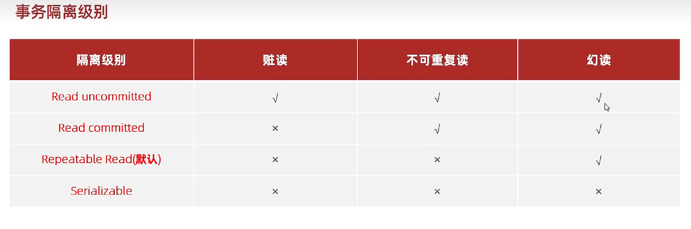
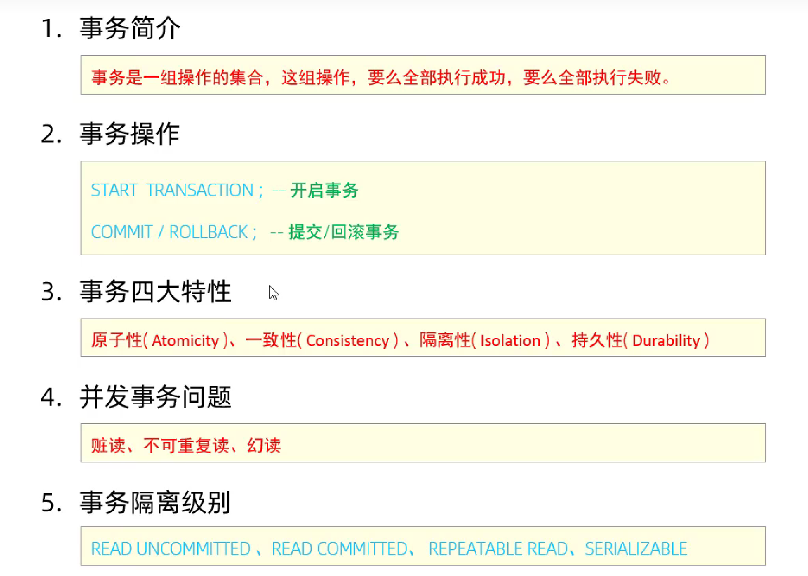

## 事务

### 事务的简介

事务 是一组操作的集合，它是一个不可分割的工作单位，事务会把所有的操作作为一个整体一起向系统发起提交或撤销操作请求，即这些操作 **要么同时成功** **要么同时失败**


### 事务的操作

**查看/设置事务的提交方式**

```mysql
#查看事务的提交方式
select @@autocommit

#设置事务的提交方式
# 0 手动提交
set @@autocommit= 0;
# 1 自动提交
set @@autocommit= 1;


#提交事务
commit ;

#回滚事务
rollback;
```


### 事务的四大特性

1. 原子性：（Atomicity） 事务时不可分割的最小操作单元，要么全部成功，要么全部失败
2. 一致性（Consistency）：事务完成时，必须使用所有的额数保持一致状态
3. 隔离性：（Isolation）：数据库系统提供的隔离机制，保证事务在不受外部并发影响的独立环境下运行
4. 持久性（Durabliity）：事务一旦提交或回滚，它对数据库中的数据的改变就是永久的

### 并发事务问题

1. 脏读：一个事务读取到另外一个事务还没有提交的数据
2. 不可重复读：一个事务先后读取同一条记录，但两次读取的数据不同，称为不可重复读
3. 幻读：一个事务按照条件查询数据时，没有对饮的数据行，但是在插入数据时，又发现这行数据已经存在了，好像出现了幻影

### 事务的隔离级别



```mysql
#查看事务的隔离级别
select @@transaction_isolation;

#设置事务的隔离级别
set [session | global ] transaction isolation level {read uncommitted | read committed | repeatable read | serializable}
```


### 总结

