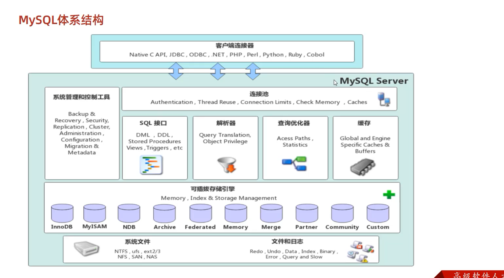
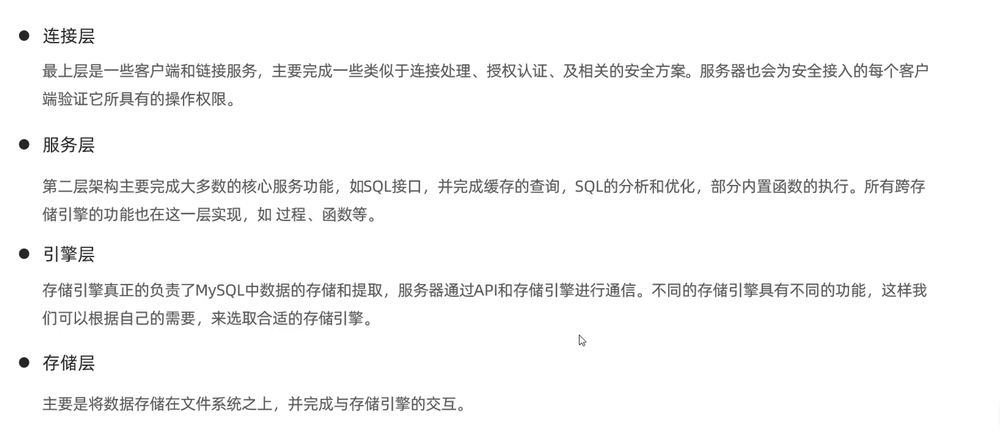
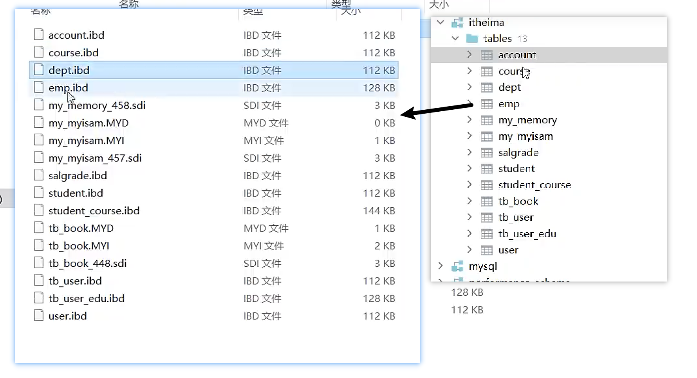
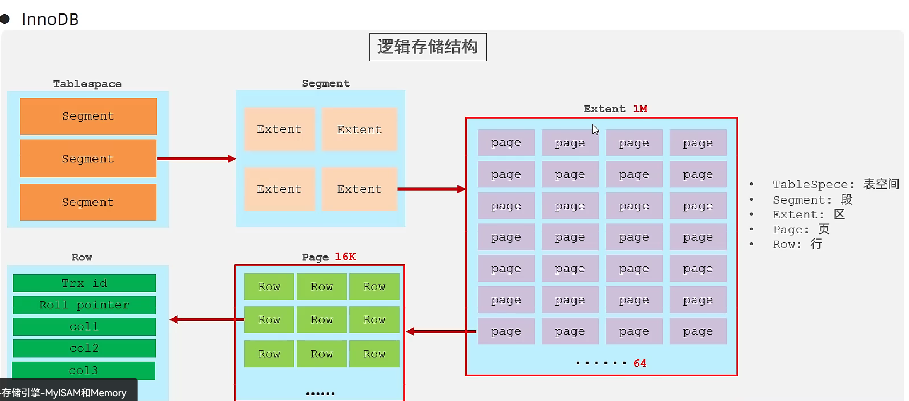
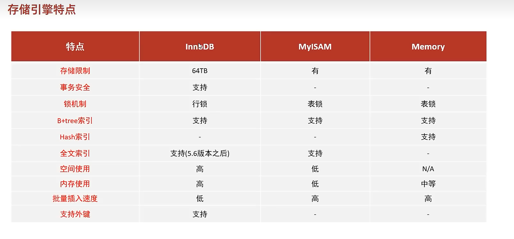

## 存储引擎

### mysql体系结构



- 连接层
- 服务层
- 引擎层
- 存储层




### 存储引擎简介

存储引擎就是存储数据，建立索引，更新/查询数据等技术实现方式。存储引擎是基于表的，而不是基于库的，所以存储引擎也可以称为表类型

**在创建表时 指定存储引擎**

```mysql
create table 表名(
	字段1 类型1 ....
) engine = innodb  #指定存储引擎
```

**查看当前数据库支持的存储引擎**

```mysql
show engines;
```


### 存储引擎的特点

####  **InnoDB**

**InnoDB**

**介绍** InnoDB 一种兼顾高可靠和高性能的存储引擎，在MySQL5.5一行，InnoDB是默认的mysql存储引擎

**特点**

DML操作遵循ACID模型，支持事务

行级锁，提交并发访问性能

支持 外键 FOREIGN KEY 约束 ，保证数据的完整性和正确性

**文件**

xxx.idb: xxx表名  ，

innoDB存储引擎的每一张表都会对应一个这样的表空间文件，存储该表的表结构，（frm，sdi），数据和索引

参数： innodb_file_per_table






#### MySAM

- **介绍** MyISAM是MySQL早期的默认存储引擎
- **特点** 
  - 不支持事务，不支持外键
  - 支持表锁，不支持行所
  - 访问速度快
- **文件** 
  - xxx.sdi:存储表结构信息
  - xxx.MYD:存储数据
  - xxx.MYI :存储索引


#### Memory

- **介绍** Memory引擎的表数据存储在内存中的，由于受到硬件的问题，断电的影响，只能将这些表作为临时表或缓存使用
- **特点** 
  - 内存存放
  - hash索引（默认） 
- 文件
  - xxx.sdi ： 存储表结构信息





### 选择存储引擎

在选择存储引擎时，应该根据应用系统的特点选择合适的存储引擎，对于复杂的引用系统，还可以根据实际情况选择多种存储引擎进行组合

- **InnoDB** ：是mysql默认的存储引擎，支持事务，外键，如果应用对事务的完整性有比较高的要求，在并发的条件下要求数据的一致性，数据操作除了插入和查询，还包含很多的更新，删除操作，那么InnoDB存储引擎是比较适合选择的
- **MyISAM** ： 如果应用是以读操作和插入操作为主，只是很少的更新和删除操作，并且对事务的完整性，并发要求性不是很高，选择MyISAM
- **MEMORY** 将所有数据保存在内存，访问速度快，通常用于临时表和缓存。 MEMORY的缺陷是对表的大小有限制吗，太大的表无法缓存到内存中，且无法保障数据的安全性