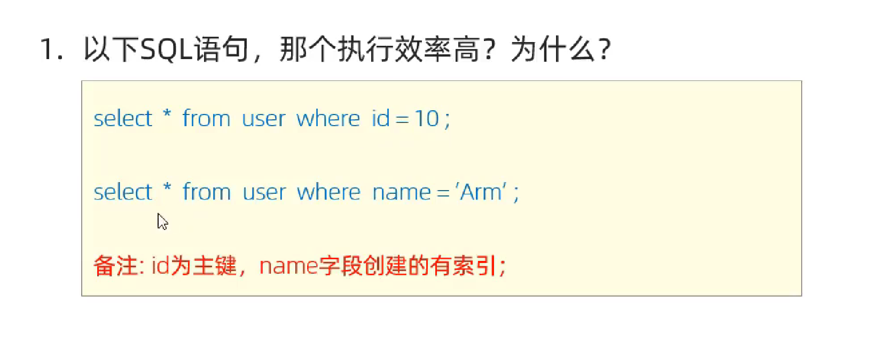

## 索引

### 索引的概述

- **介绍** 索引 index 是帮助MySQL **高效获取数据** 的 **数据结构 （有序）** 。在数据之外，数据库系统还维护着满足特定算法的数据结构，这些数据结构以某种方法引用（指向）数据，这样就可以在这些数据结构上实现高级查找算法，这种数据结构就是索引


**优缺点**


### 索引结构


**b树**


**b+树**


**mysql  b+树**


**hash索引**


#### 思考

为什么innoDB存储引擎选择使用B+树索引结构

- 相对于二叉树，层级更少，搜索效率高
- 相对于b数，无论是叶子节点还是非叶子节点，都会保存数据，这样导致一页中存储的键值值减少，指针跟着较少，只能增加数据的高度，导致性能降低

 

### 索引的分类


**聚集索引的选取规则**

- 如果存在主键，主键索引就是聚集索引
- 如果不存在索引，将使用第一个唯一*（unique）索引作为聚集索引
- 没有主键 没有唯一索引， 则innoDB会自动生成一个rowid作为隐藏的聚集索引


#### 

#### 思考



**mysql树的层级有多高**


### 索引的语法

- 创建索引

  - ```mysql
    create [unique | fulltext ] index 索引名 on 表名 (字段名,..)
    
    
    ```

    

- 查看索引

  - ```mysql
    show index from 表名;
    ```

    

- 删除索引

  - ```mysql
    drop index 索引名 on 表名 
    ```


**建表**

```mysql

create table tb_user(
	id int primary key auto_increment comment '主键',
	name varchar(50) not null comment '用户名',
	phone varchar(11) not null comment '手机号',
	email varchar(100) comment '邮箱',
	profession varchar(11) comment '专业',
	age tinyint unsigned comment '年龄',
	gender char(1) comment '性别 , 1: 男, 2: 女',
	status char(1) comment '状态',
	createtime datetime comment '创建时间'
) comment '系统用户表';


INSERT INTO tb_user (name, phone, email, profession, age, gender, status, createtime) VALUES ('吕布', '17799990000', 'lvbu666@163.com', '软件工程', 23, '1', '6', '2001-02-02 00:00:00');
INSERT INTO tb_user (name, phone, email, profession, age, gender, status, createtime) VALUES ('曹操', '17799990001', 'caocao666@qq.com', '通讯工程', 33, '1', '0', '2001-03-05 00:00:00');
INSERT INTO tb_user (name, phone, email, profession, age, gender, status, createtime) VALUES ('赵云', '17799990002', '17799990@139.com', '英语', 34, '1', '2', '2002-03-02 00:00:00');
INSERT INTO tb_user (name, phone, email, profession, age, gender, status, createtime) VALUES ('孙悟空', '17799990003', '17799990@sina.com', '工程造价', 54, '1', '0', '2001-07-02 00:00:00');
INSERT INTO tb_user (name, phone, email, profession, age, gender, status, createtime) VALUES ('花木兰', '17799990004', '19980729@sina.com', '软件工程', 23, '2', '1', '2001-04-22 00:00:00');
INSERT INTO tb_user (name, phone, email, profession, age, gender, status, createtime) VALUES ('大乔', '17799990005', 'daqiao666@sina.com', '舞蹈', 22, '2', '0', '2001-02-07 00:00:00');
INSERT INTO tb_user (name, phone, email, profession, age, gender, status, createtime) VALUES ('露娜', '17799990006', 'luna_love@sina.com', '应用数学', 24, '2', '0', '2001-02-08 00:00:00');
INSERT INTO tb_user (name, phone, email, profession, age, gender, status, createtime) VALUES ('程咬金', '17799990007', 'chengyaojin@163.com', '化工', 38, '1', '5', '2001-05-23 00:00:00');
INSERT INTO tb_user (name, phone, email, profession, age, gender, status, createtime) VALUES ('项羽', '17799990008', 'xiaoyu666@qq.com', '金属材料', 43, '1', '0', '2001-09-18 00:00:00');
INSERT INTO tb_user (name, phone, email, profession, age, gender, status, createtime) VALUES ('白起', '17799990009', 'baiqi666@sina.com', '机械工程及其自动化', 27, '1', '2', '2001-08-16 00:00:00');
INSERT INTO tb_user (name, phone, email, profession, age, gender, status, createtime) VALUES ('韩信', '17799990010', 'hanxin520@163.com', '无机非金属材料工程', 27, '1', '0', '2001-06-12 00:00:00');
INSERT INTO tb_user (name, phone, email, profession, age, gender, status, createtime) VALUES ('荆轲', '17799990011', 'jingke123@163.com', '会计', 29, '1', '0', '2001-05-11 00:00:00');
INSERT INTO tb_user (name, phone, email, profession, age, gender, status, createtime) VALUES ('兰陵王', '17799990012', 'lanlinwang666@126.com', '工程造价', 44, '1', '1', '2001-04-09 00:00:00');
INSERT INTO tb_user (name, phone, email, profession, age, gender, status, createtime) VALUES ('狂铁', '17799990013', 'kuangtie@sina.com', '应用数学', 43, '1', '2', '2001-04-10 00:00:00');
INSERT INTO tb_user (name, phone, email, profession, age, gender, status, createtime) VALUES ('貂蝉', '17799990014', '84958948374@qq.com', '软件工程', 40, '2', '3', '2001-02-12 00:00:00');
INSERT INTO tb_user (name, phone, email, profession, age, gender, status, createtime) VALUES ('妲己', '17799990015', '2783238293@qq.com', '软件工程', 31, '2', '0', '2001-01-30 00:00:00');
INSERT INTO tb_user (name, phone, email, profession, age, gender, status, createtime) VALUES ('芈月', '17799990016', 'xiaomin2001@sina.com', '工业经济', 35, '2', '0', '2000-05-03 00:00:00');
INSERT INTO tb_user (name, phone, email, profession, age, gender, status, createtime) VALUES ('嬴政', '17799990017', '8839434342@qq.com', '化工', 38, '1', '1', '2001-08-08 00:00:00');
INSERT INTO tb_user (name, phone, email, profession, age, gender, status, createtime) VALUES ('狄仁杰', '17799990018', 'jujiamlm8166@163.com', '国际贸易', 30, '1', '0', '2007-03-12 00:00:00');
INSERT INTO tb_user (name, phone, email, profession, age, gender, status, createtime) VALUES ('安琪拉', '17799990019', 'jdodm1h@126.com', '城市规划', 51, '2', '0', '2001-08-15 00:00:00');
INSERT INTO tb_user (name, phone, email, profession, age, gender, status, createtime) VALUES ('典韦', '17799990020', 'ycaunanjian@163.com', '城市规划', 52, '1', '2', '2000-04-12 00:00:00');
INSERT INTO tb_user (name, phone, email, profession, age, gender, status, createtime) VALUES ('廉颇', '17799990021', 'lianpo321@126.com', '土木工程', 19, '1', '3', '2002-07-18 00:00:00');
INSERT INTO tb_user (name, phone, email, profession, age, gender, status, createtime) VALUES ('后羿', '17799990022', 'altycj2000@139.com', '城市园林', 20, '1', '0', '2002-03-10 00:00:00');
INSERT INTO tb_user (name, phone, email, profession, age, gender, status, createtime) VALUES ('姜子牙', '17799990023', '37483844@qq.com', '工程造价', 29, '1', '4', '2003-05-26 00:00:00');

```

**案例**

```mysql
#name字段为姓名字段，该字段的值可能会重复，为该字段创建索引
create index  idx_user_name on tb_user(name);
#phone手机号码字段的值是非空的，且唯一的，创建唯一索引

#为profession age status 创建联合索引
create  index  idx_user_profession_age_status on tb_user(profession,age,status)
#为emial建立合适的索引来提升查询效率
create  index  idx_user_email on tb_user(email);
```


### sql性能分析


#### **查看sql执行频率**


```mysql
show  global status like 'Com_______';
#查看mysql的记录
```


#### **慢查询日志**


```mysql
#查看慢查询日志是否开启  on 开启  off关闭
show variables like 'slow_query_log';


select  sleep(10) #睡眠10秒
```


#### profile详情


```mysql
#查看 数据库是否 支持  profiling
select @@have_profiling;

#查看profiling是否开
select  @@profiling;

#开启profiling;
set @@profiling = 1;
```


#### explain执行计划


```mysql
explain select 字段列表 from 表名 where 条件;

explain select * from tb_user;
```


### 索引使用

- 最左前缀法则

  如果索引了多列（联合索引），要遵守最左前缀法则，最左法则指的是查询从最左列开始，且不跳过索引中的列

  如果过跳过某一列 **索引将部分失效（后面的索引字段失效）**

- 范围查询

  联合索引中，出现范围查询（<,>） **范围查询右侧的列索引失效**

  可以使用 >= 规避失效

**索引失效的情况**

- 索引列运算

  不要在索引列上进行运算符操作，**索引将失效**

- 字符串不加引号

  字符串类型字段使用时，不叫引号 **索引将失效**

- 模糊查询

  如果仅仅是尾部模糊查询，索引不会失效，如果是头部模糊匹配，索引失效

- or连接条件

  用or分开的条件，如果or前的条件列有索引，而后面的列没有索引，那么涉及的索引都不会被用的

- 数据分布影响

  如果mysql评估使用索引比全表更慢，则不使用索引

  我们可以直接指定使用那个索引

  


**覆盖索引**

尽量使用覆盖索引（查询使用了索引，并且需要返回的列，在该索引中已经全部能够找到）


**前缀索引**

当字符类型为字符串（varchar ,text 等）时，有时候需要索引很长的字符串，这会让所有变的很大，查询时，浪费大量的磁盘io，影响查询效率，此时可以只将字符串的一部分前缀，建立索引，这样可以大大节约索引空间，从而提高效率

```mysql
#语法
create index idx_xxx on 表名  (column(前缀几个字符))

#前缀长度
可以根据索引的选择性来决定，而选择性是指不重复索引的值（基数）和数据表的记录总数的比值，索引选择性越高则查询效率越快，唯一索引选择性是1，这是最好的索引选择性，性能也是最好的	

#计算选择性
select (distinct email)/count(*) from user;

#创建前缀索引 使用前5个字符串
create index idx_email_5 on user(email(5));

```


**单列索引和联合索引**

- 单例索引：即一个索引只包含一个字段
- 联合索引：即一个索引包含了多个列

在业务场景中，如果存在多个查询条件，考虑针对于查询字段建立索引时，建议建立联合索引，而非单列索引


### 索引设计原则

1. 针对数据量较大，且查询比较频繁的表建立索引
2. 针对于常作为查询条件 where 排序 order by 分组 group by 操作的字段建立索引
3. 尽量选择区分度高的列作为索引，尽量建立唯一索引，区分度越高，使用索引的效率越高
4. 如果字符串类型的字段，字段长度较长，可以针对字段的特点建立前缀索引
5. 尽量使用联合索引，减少单列索引，查询时，联合索引很多时候可以覆盖索引，节省存储空间，避免回表。提高查询效率
6. 要控制索引数量，索引并不是多多益善，索引越多，维护索引的代价也就越大，会影响增删改的效率
7. 如果索引列不能存在null值，请在创建表的时候使用not null 约束它，当优化器知道每列是否包含null值时，它可以更好的确定那个索引有效的用于查询


### 总结

- 索引概述

  ```
  索引是高效获取数据的数据结构
  ```

- 索引的概述

  ```
  b+树
  hash
  ```

- 索引的分类

  ```
  主键索引
  唯一索引
  常规索引
  全文索引
  聚集索引
  二级索引
  ```

- 索引的语法

  ```
  create [uniqun] index idx_XXX s on xxx(xxx)
  show index form xxx
  drop index xxx on xxx
  ```

- sql的性能分析

  ```
  执行频次
  慢查询日志
  profile
  expalin
  ```

- 索引的使用

  ```
  联合索引
  索引失效
  sql提示
  覆盖索引
  前缀索引
  单列/联合索引
  ```

- 索引的设计原则

  ```
  表
  字段
  索引
  ```

  
