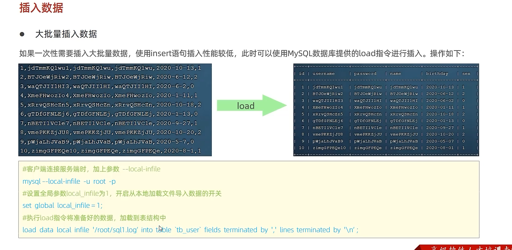

### 插入优化

- insert 优化

  1. 批量插入

     ```mysql
     insert into user values(1,2,3),(1,2,3)
     ```

  2. 手动提交事务

     ```mysql
     start transaction 
     insert into user values(1,2,3),(1,2,3);
     insert into user values(1,2,3),(1,2,3);
     insert into user values(1,2,3),(1,2,3);
     commit
     ```

  3. 主键顺序插入

     ```
     乱序: 1,35,76,23,632,6234,
     顺序：1，2，4，5，6，7，89，
     ```

  

  **大批量插入数据**

  如果一次需要插入大批量数据，使用insert语句性能比较低，此时可以使用mysql数据库提供的load指令进行插入

  

  

  

  
  
  
  
  ### 主键优化
  
  - 数据组织方式
  
     在InnoDB存储引擎中，表数据都是根据主键顺序存放的，这种存储方式的表为 **索引组织表**(index organized table **iot**)
  
  - 页分裂
  
    页可以为空，也可以填充一半，也可以填充100%，每股页包含了2-n行数据（如果一行数据过打，会溢出），根据主键排序
  
  - 页合并
  
    当删除一行记录并每页被物理删除，只是记录被标记（flaged）为删除并且它的空间变得允许被其他记录声明使用
  
    当页中删除的记录达到 MERGE_THRESHOLD(默认为页的50%) ，InnoDB会开始寻找靠近的页（前或者后） 看看是否可以将两个页合并以优化空间使用
  
  - 主键设计原则
  
    - 满足业务需求的情况下，尽量降低主键的长度
    - 插入数据时，尽量选择顺序插入，选择使用AUTO——INCREMENT自增主键
    - 尽量不要使用UUID做主键或者是其他的自然主键，如身份证号
    - 业务操作时，避免对主键的修改
  
  
  
  
  
   
  
  