# 1nginx

### 简介

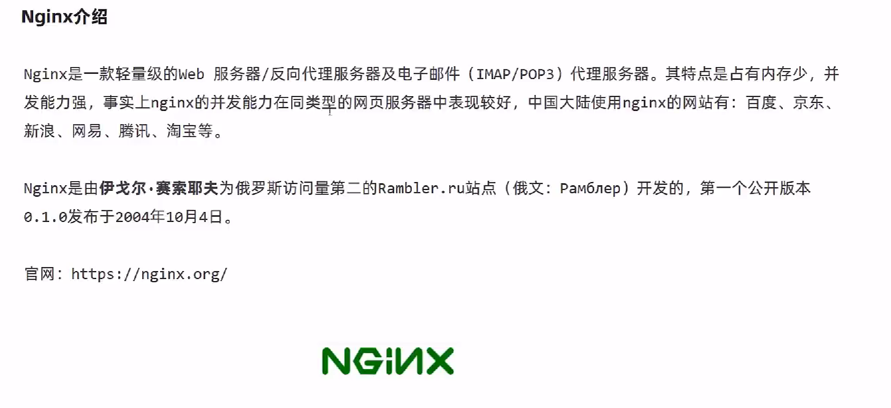

### 下载安装

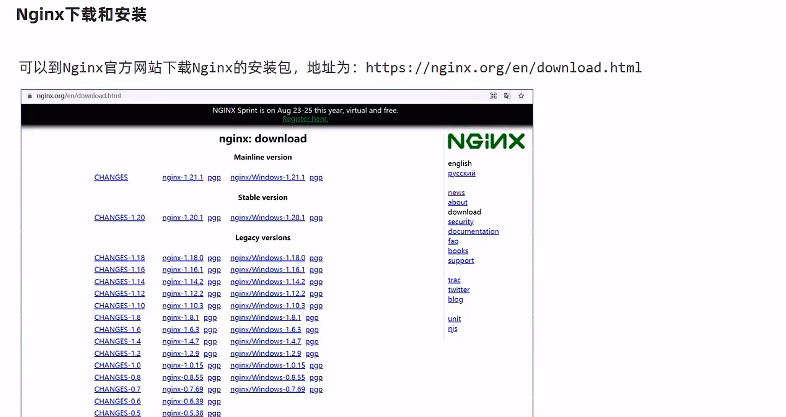

```
http://nginx.org/en/download.html
```

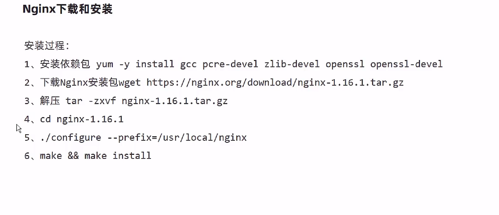

```powershell
#安装依赖包
yum -y install gcc pcre-devel zlib-devel openssl openssl-devel
#安装wget
yum install -y wget
#下载nginx 包
wget http://nginx.org/download/nginx-1.16.1.tar.gz
#解压
tar -zxvf nginx-1.16.1.tar.gz
#创建解压目录
cd /usr/local/
mkdir nginx
#回到下载目录
cd 
#进入解压完成的目录
cd nginx-1.16.1/
#指定安装目录
./configure --prefix=/usr/local/nginx
#进行编译
    make $$ make install 
```


### nginx目录

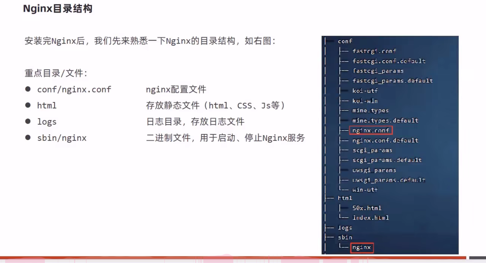


### 安装tree查看目录

```powershell
yum Install tree
#使用方式
tree  展示当前目录
```


## nginx常用命令

### 查看版本


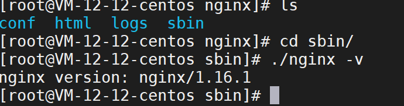

```
./nginx -v
```


### 检查配置文件正确性

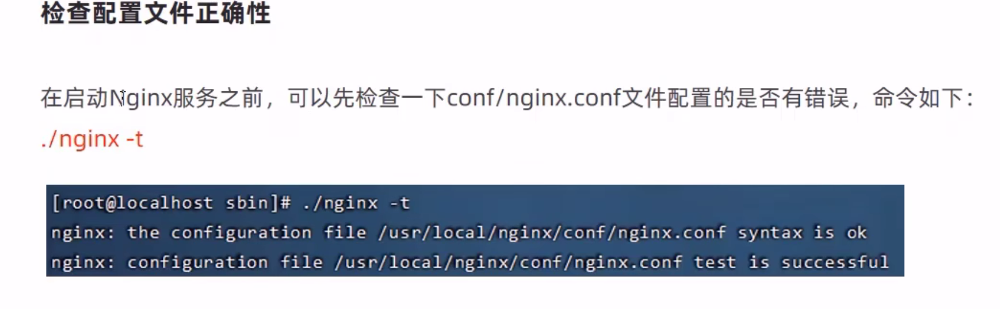

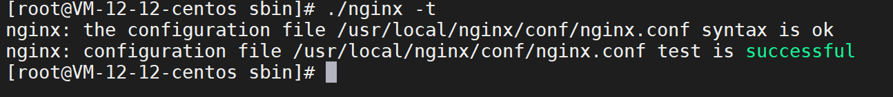

```
./nginx -t
```


### 启动和停止


```powershell
当nginx运行起来以后  在nginx目录下会多一些以_temp结尾的临时文件
在logs 目录下也会存在 access.log 和 error.log 两个日志文件 nginx.pid 记录了nginx进程
```


### 重新加载配置


### nginx配置文件结构


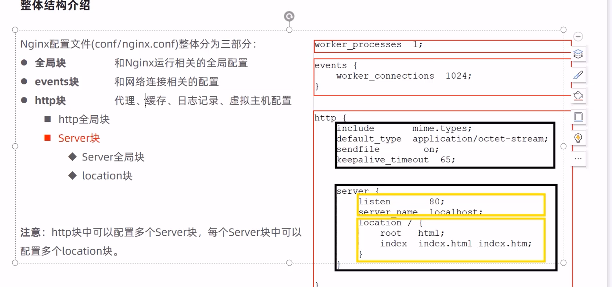


## nginx具体的应用


### 部署静态资源

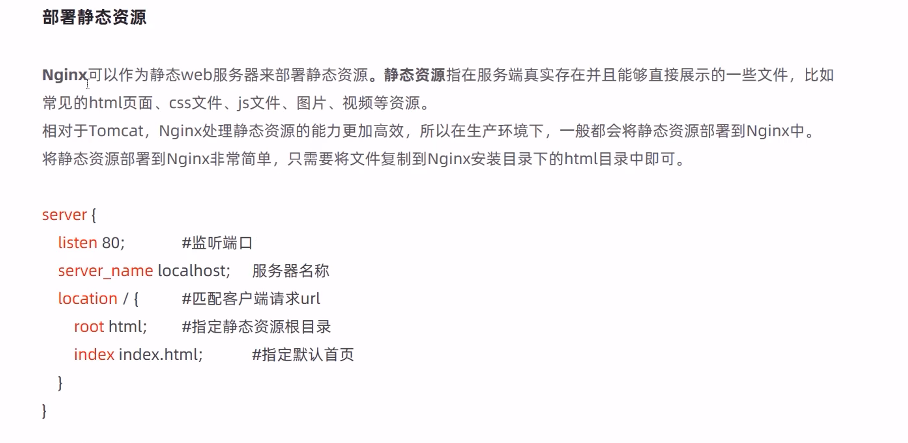


### 反向代理

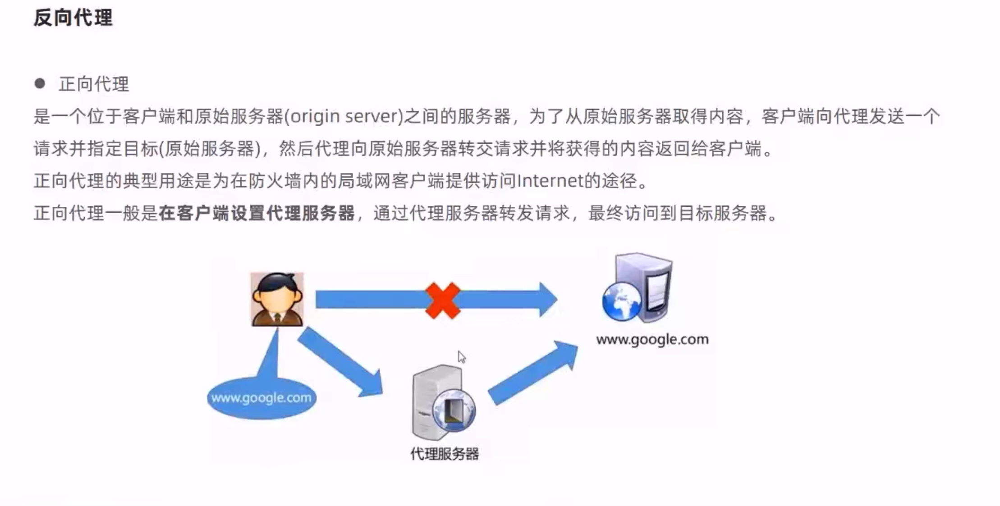

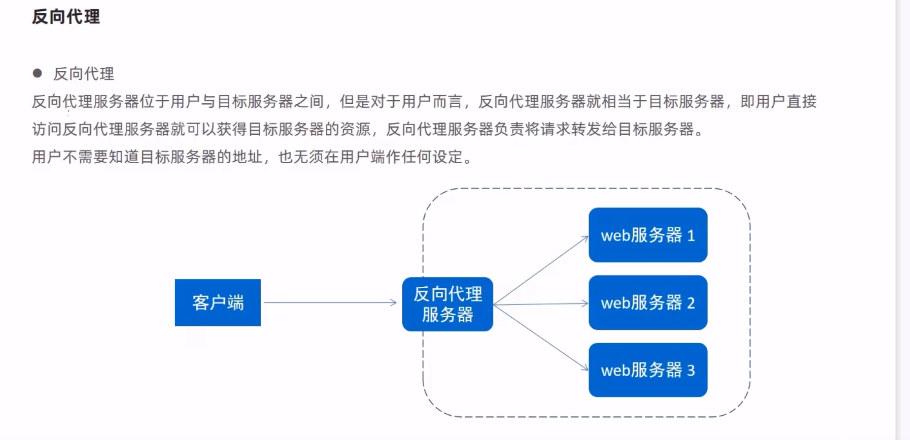

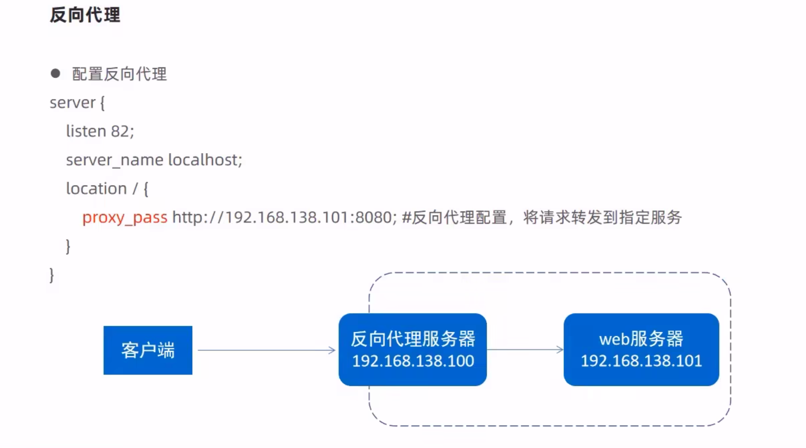

### 负载均衡

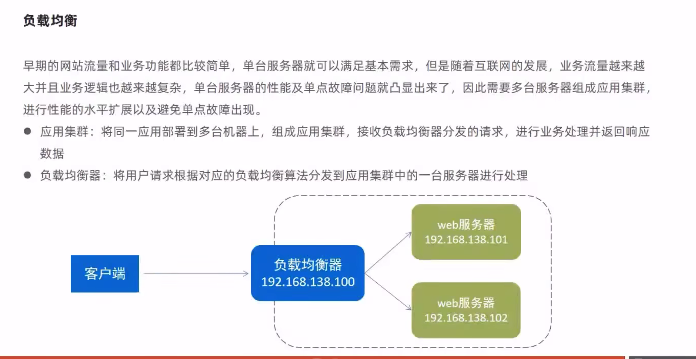

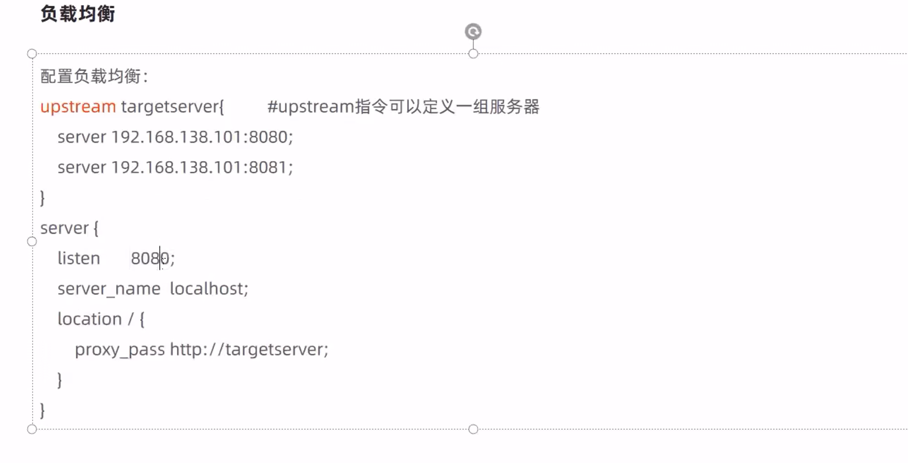

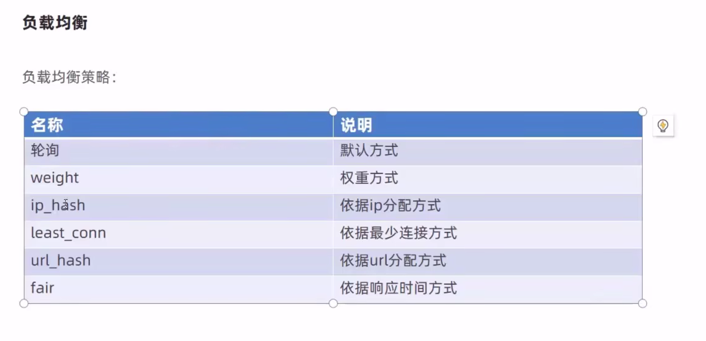
