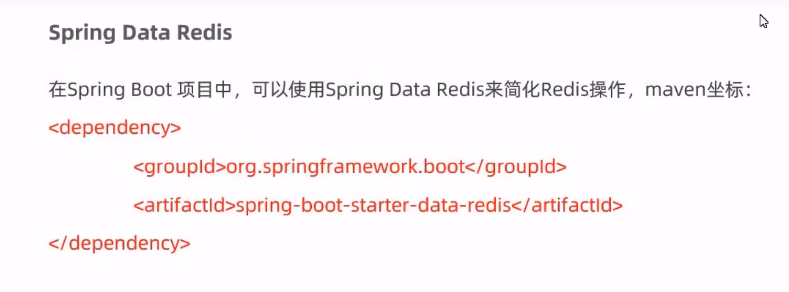

## redis的安装

###  linux安装


**在此网站下载**

上传到linux系统中

```
http://download.redis.io/releases/
```

**2：解压安装包**

tar -zxvf  redis-3.0.0.tar.gz -C  /usr/local


**3:安装redis的依赖 gcc**

yum  install gcc-c++


**4:进入/usr/local/redis-3.0.0 进行编译**

make


**5：进入redis的src目录，进行安装，**

make install


### redis服务的启动与停止

**linux中服务的启动 **

进入redis/src/   执行redis-server这个文件进行启动服务  

**运行2：**

 进入到redis3.0.0 目录修改 redis.conf 文件

**修改配置文件**

进入配置文件  vim redis-conf 

查 daemonize   默认参数是no 修改为yes


执行语法 

在redis根目录执行  src/redis-server ./redis.conf

redis默认使用端口是6375


**linux中连接redis**

进入redis/src/   执行redis-cli这个文件进行连接服务


### redis密码设置

redis默认是不需要密码的，他的配置文件是设置了不需要密码，我们自己要使用密码的需要自己去设置，修改配置文件

**1:进入配置文件**

目录 redis3.0.0 执行  

vim redis.conf 

进入配置文件进行修改


**需要将 requirepass foobared 进行修改**

 requirepass 12356


**修改完成可以正常连接  但是使用命令出现 没有登录**


使用 aut  12356 进行密码登录


**登录参数命令**

src/redis-cli -H 地址 -p 端口 -a 密码


### redis远程链接设置

redis默认是不能远程连接的

**修改配置文件**

修改redis.conf 配置

vim redis.conf  进入  /bind 查找 


bind限制了只有本机可以连接redis，我们需要进行修改

将bind 127.0.0.1进行修改


## redis数据类型


### 字符串操作命令


**语法操作**

```powershell
#设置
set  name  xiaoming
设置已经存在的key 覆盖
#取出
get name 
#取出不存在 提升nil
nil 表示 null 

#setex  id 10  10
设置10秒存在的key

#setnx id 10 	
设置不存在的key
设置存在的key 显示0
设置不存在key 显示1


```


  

### 哈希的操作命令


```powershell
hset user name 黄伟   #设置key为user 字段为name  值为 黄伟
hset user age 20  	#设置key为user 字段为age  值为 20
hget user age    #取出key为user 哈希表中中 字段为 age 的值
hdel user age  #删除key为user哈希表字段age
hkeys user   #获取key为user哈希表中的所有字段名
hvals user  #获取key为user哈希表中所有的value值
hgetall user #获取key为user哈希表中所有的 字段 值  
```


### 列表


### 无序集合set


### 有序集合 sorted set


### 通用命令


### 在java中操作redis

**简介**


**操作方式**


**依赖**

```xml
   		<dependency>
            <groupId>redis.clients</groupId>
            <artifactId>jedis</artifactId>
            <version>2.8.1</version>
        </dependency> 

```

**测试jedis**

```java
    //测试jedis
    @Test
    public void testRedis(){
        //1获取连接
        // 参数1 连接地址   参数2 连接端口  参数3 密码
        Jedis jedis = new Jedis("localhost" ,6379);
        //2执行操作
        jedis.set("name","黄伟");
        String name = jedis.get("name");
        System.out.println(name);
        //3关闭连接
        jedis.close();
    }
```

**测试成功**


**如果redis服务没有启动的话会报错**


表示连接超时


### springboot整合jedis  

**启动依赖**

```xml
 		<dependency>
            <groupId>org.springframework.boot</groupId>
            <artifactId>spring-boot-starter-data-redis</artifactId>
          </dependency>
```



**使用jedis**


**springboot整合redis的配置**

```yaml
spring:
  application:
    name: springbootredis_demo
  redis:
    host: localhost #连接地址
    port: 6379      #连接端口
    # password: 12356   redis设置了密码就需要配置
    database: 0 #使用的redis数据库 0号数据库
    jedis:
      pool:
        max-active: 8 #最大连接数
        max-wait: 1ms #连接池最大阻塞等待时
        max-idle: 4 #连接池中最大空闲连接
        min-idle: 0 #连接池中最小空闲连接
```


### springboot整合redis测试代码

```java
/**
     * RedusTemplate 是可以自动装配的，不需要我们自己写管理第三方bean
     * springboot的实现方式是，当在ioc容器中不存在 RedisTemplate就会执行自动装配的代码
     */
    @Autowired
    private RedisTemplate redisTemplate;
    @Test
    public void valueOperations(){
        //获取字符串执行对象
        ValueOperations valueOperations = redisTemplate.opsForValue();
        //设置字符串 key user
        valueOperations.set("user","huangwei");
        //获取key user
        Object user = valueOperations.get("user");
        System.out.println(user);
    }
```


**在使用RedisTemplate模板是springboot创建的时候。opsForValue的对象， 设置的set数据和get数据 springboot会进行序列化，和反序列化，可以通过自己注册RedisTemplate来进行设置反序列集  可以不用！！！！！！**

###  操作string类型

```java
   //获取字符串执行对象
        ValueOperations valueOperations = redisTemplate.opsForValue();
        //redis set 方法
        valueOperations.set("user","黄伟");
        //redis get 方法
        valueOperations.get("user");
        //redis getex 方法
        //1：key  2:value 3:timeout 4:单位
        valueOperations.set("user","黄伟",10l,TimeUnit.SECONDS);
        //redis setnx
        Boolean aBoolean = valueOperations.setIfAbsent("user", "huangwei");
        System.out.println(aBoolean);
```

### 操作hash

```java
@Test
    public void testList(){
        ListOperations listOperations = redisTemplate.opsForList();
        //lpush
        listOperations.leftPush("mylist","a");
        listOperations.leftPushAll("mylist","a","b","c");

        //lrange
        List mylist = listOperations.range("mylist", 0, -1);
        for (Object o : mylist) {
            System.out.println(o);
        }
        //rpop
        //头部删除
        listOperations.leftPop("mylist");
        //尾部删除 出队列
        listOperations.rightPop("mylist");
        //清空
        //llen
        Long size = listOperations.size("mylist");
        int lsize = size.intValue();
        for (int i = 0; i < lsize; i++) {
            Object element = listOperations.rightPop("mylist");
            System.out.println(element);
        }
        List mylist1 = listOperations.range("mylist", 0, -1);
        System.out.println("开始取参数");
        for (Object o : mylist1) {
            System.out.println(o);
        }
		//清空的操作是获取list列表的长度，然后进行循环遍历，每一次循环进行leftpop()删除
    }
```

### 操作set

```java
  @Test
    public void testSet(){
        SetOperations setOperations = redisTemplate.opsForSet();
        //sadd 添加
        setOperations.add("myset","a", "b","a");
        //smembers 获取
        Set myset = setOperations.members("myset");
        for (Object o : myset) {
            System.out.println(o);
        }
        //srem 删除
        setOperations.remove("myset","a");
        System.out.println("已经删除-------------");
        for (Object o :  setOperations.members("myset")) {
            System.out.println(o);
        }
```

### 操作sorted set

```java
@Test
    public void testSortedSet(){
        ZSetOperations zSetOperations = redisTemplate.opsForZSet();
        //zdd 存值
        zSetOperations.add("myzset","score",20);
        zSetOperations.add("myzset","score2",11);
        zSetOperations.add("myzset","score3",12);
        zSetOperations.add("myzset","score4",13);
        Set myzset = zSetOperations.range("myzset", 0, -1);
        for (Object o : myzset) {
            System.out.println(o);
        }                                                                                       
        //zncrement 增加分手
        System.out.println("-----------");
        zSetOperations.incrementScore("myzset","score3",20);
        for (Object o : myzset) {
            System.out.println(o);
        }
        //删除元素
        zSetOperations.remove("myzset","b");
    }
```


### 通用操作

```java
  @Test
    public void testCommon(){
        //获取redis所有key
        Set<String>keys = redisTemplate.keys("*");

        for (String key : keys) {
            System.out.println(key);
        }
        //判断key是否存在
        System.out.println(redisTemplate.hasKey("mylist"));
        //删除指定key
        System.out.println(redisTemplate.delete("mylist"));
        //判断key的对应类型
        DataType myzset = redisTemplate.type("myzset");
        System.out.println(myzset);
    }
```

