## spring cache缓存框架

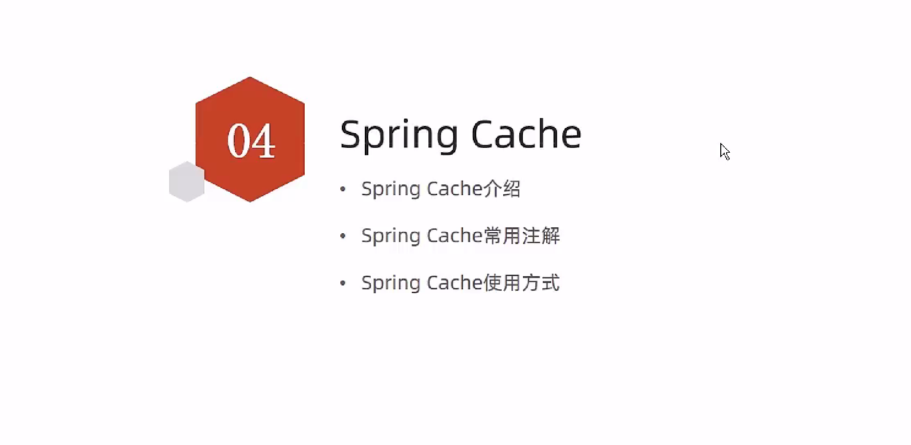

### 简介

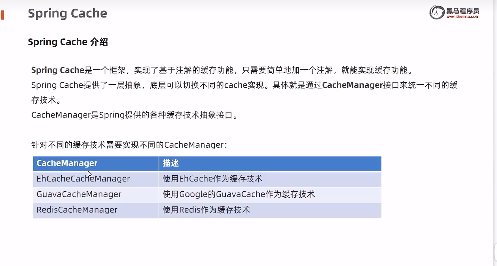

### spring cache 常用注解

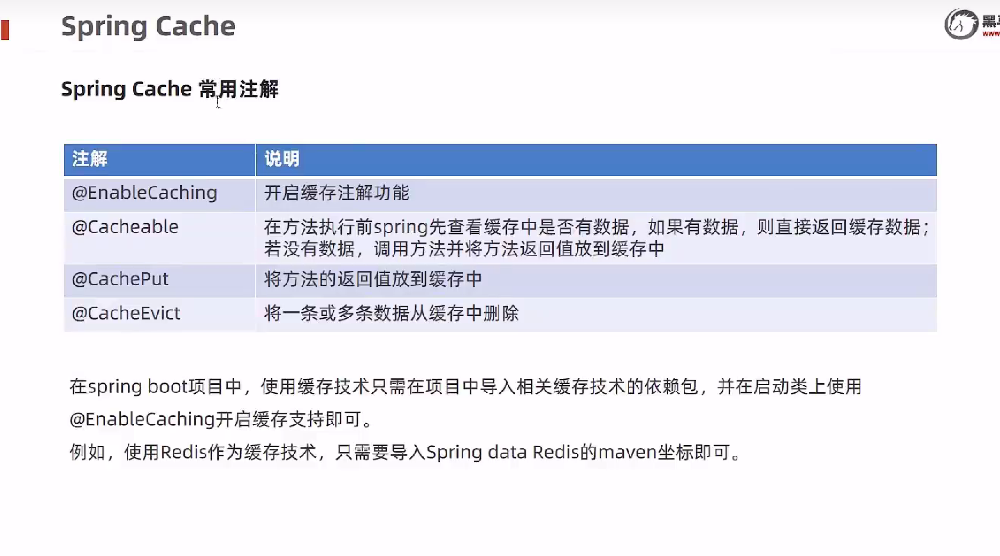


**EnableCaching开启缓存注解**

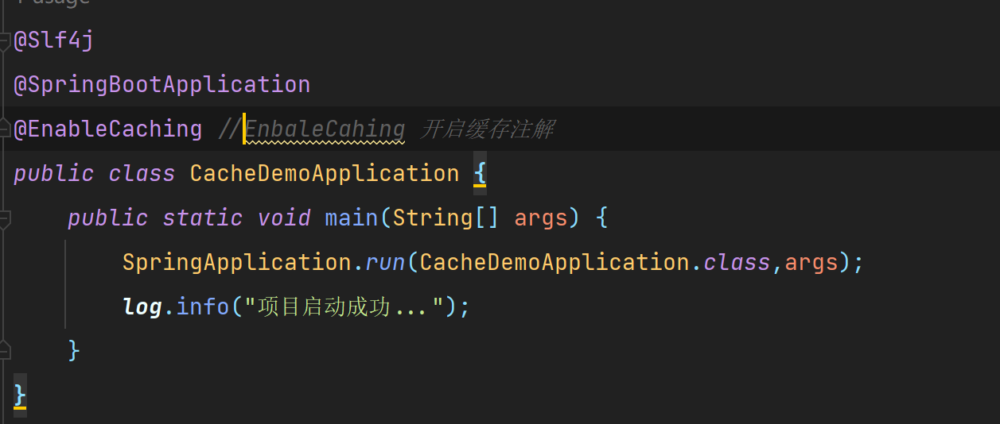


---

### 使用基础的spring cache

最基础的spring cache在 spring web 的启动器中的依赖已经自带了 

我们直接使用spring 注入就可以了

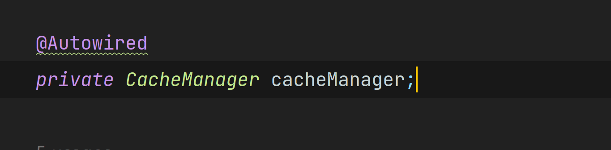

CacheMaager 是一个接口，这个接口有四个实现类

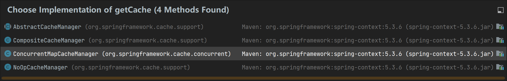

默认使用的实现类就是  **ConcurrentMapCacheManager**

**当添加了redis依赖后，实现方式会自动跳转到redis**


### @cacheput 注解   添加缓存

@cacheput注解的作用是将一个方法的返回值放入到缓存中

我们一般使用@cacheput缓存需要指定两个属性，value 和 key

value 指定的是一个类一样的东西，在value下面可以有很多key

key 是一个类中的唯一标识

​	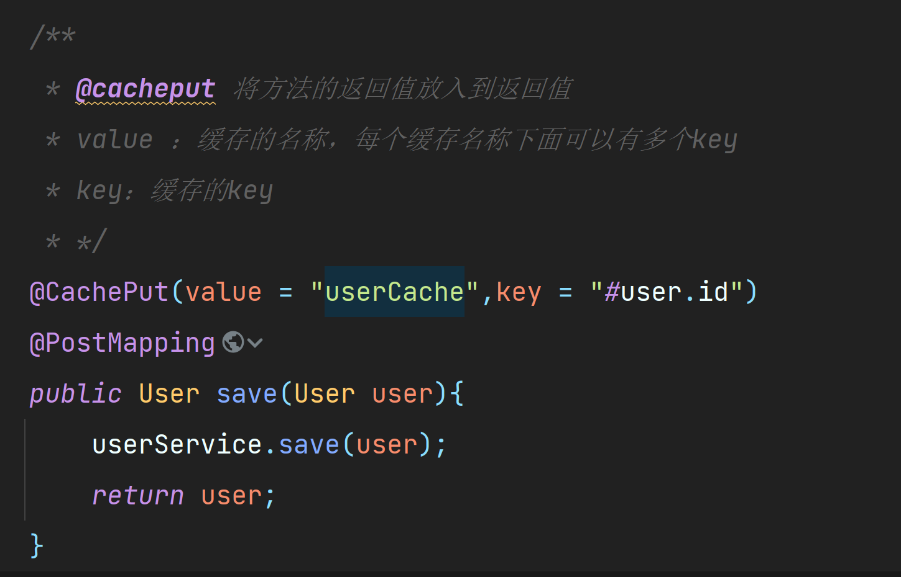

**查看map缓存**

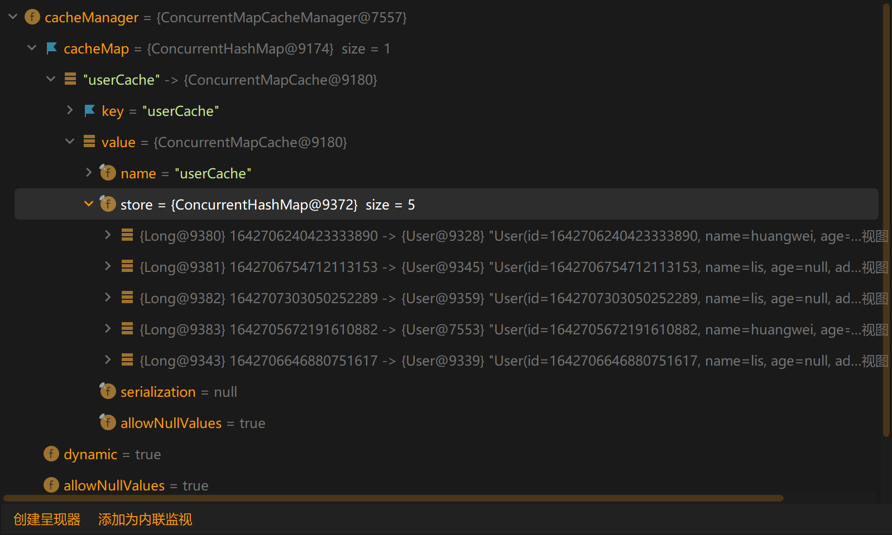

---


### @chcheEvict 注解 删除缓存

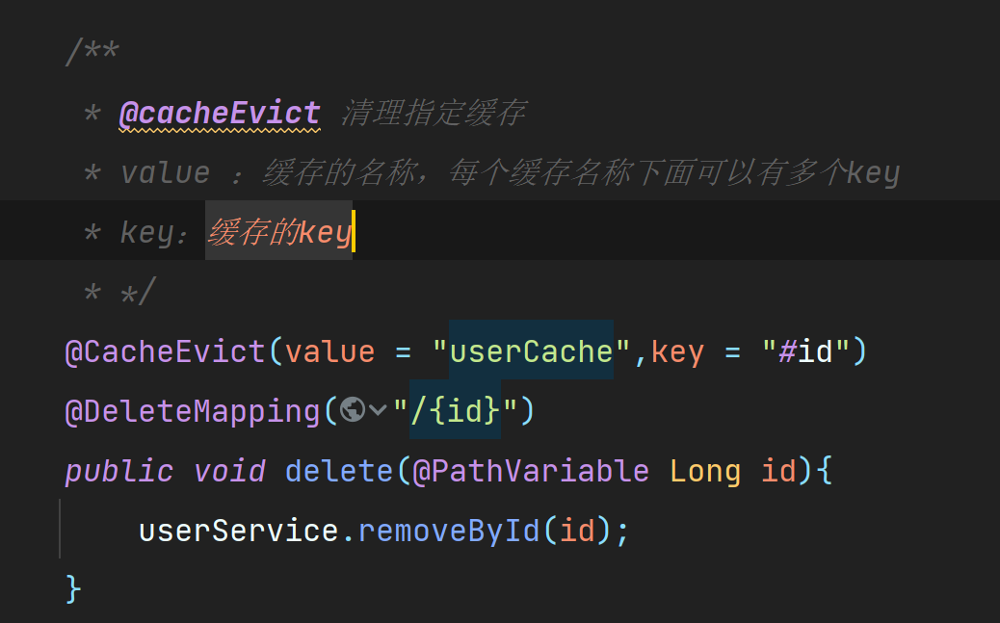


---


### @cacheable 注解 查询

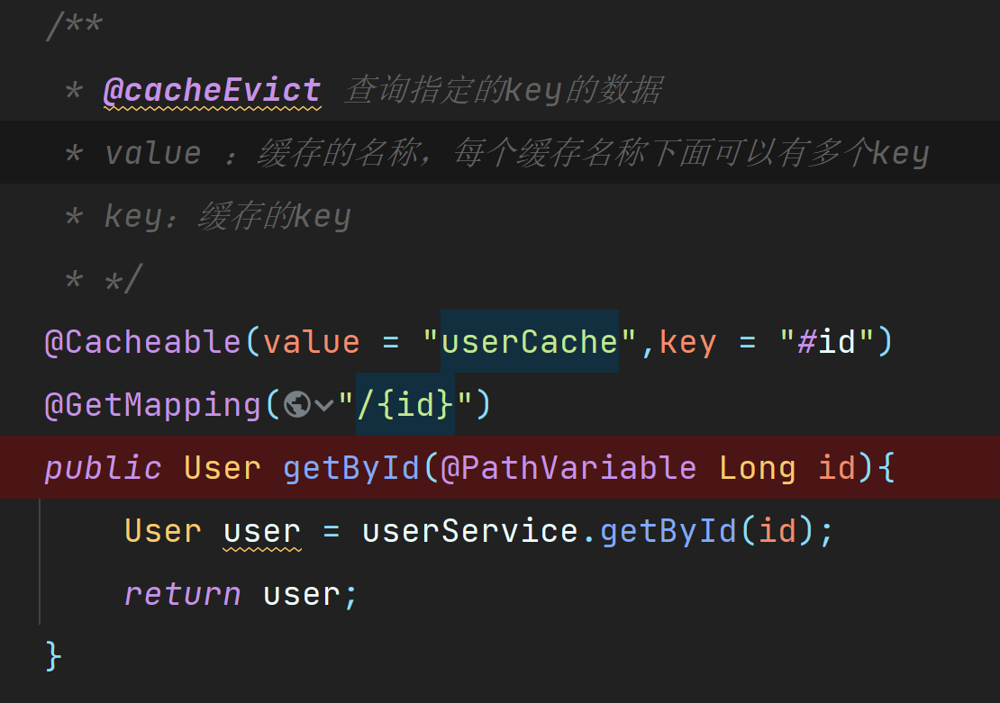

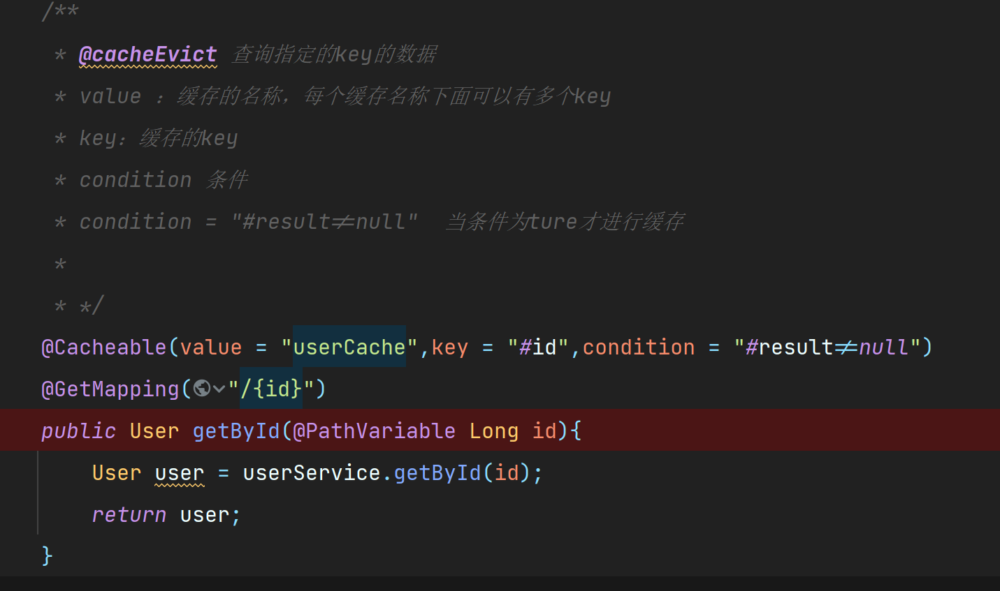

---


### 使用redis缓存数据

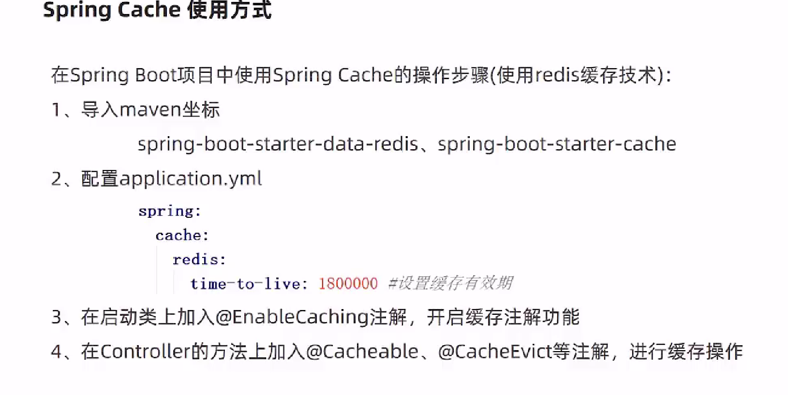

```xml
   <dependency>
            <groupId>org.springframework.boot</groupId>
            <artifactId>spring-boot-starter-cache</artifactId>
        </dependency>

        <dependency>
            <groupId>org.springframework.boot</groupId>
            <artifactId>spring-boot-starter-data-redis</artifactId>
        </dependency>
```

```yaml
server:
  port: 8089
spring:
  #配置初始化启动
  mvc:
    servlet:
      load-on-startup: 1
  #配置redis
  redis:
    host: 127.0.0.1
    port: 6379
    timeout: 30000 #连接等待时间
    #配置默认数据库
    database: 0
  #配置过期时间
  cache:
    redis:
      time-to-live: 180000 
  application:
    #应用的名称，可选
    name: cache_demo
  datasource:
    druid:
      driver-class-name: com.mysql.cj.jdbc.Driver
      url: jdbc:mysql://localhost:3306/cache_dome?serverTimezone=Asia/Shanghai&useUnicode=true&characterEncoding=utf-8&zeroDateTimeBehavior=convertToNull&useSSL=false&allowPublicKeyRetrieval=true
      username: root 
      password: 123456

mybatis-plus:
  configuration:
    #在映射实体或者属性时，将数据库中表名和字段名中的下划线去掉，按照驼峰命名法映射
    map-underscore-to-camel-case: true
    log-impl: org.apache.ibatis.logging.stdout.StdOutImpl
  global-config:
    db-config:
      id-type: ASSIGN_ID
```

