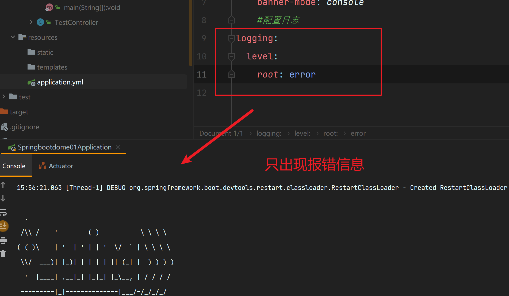

## 基础配置

**配置启动端口**

```yaml
#配置启动端口
server:
  port: 808
```

**配置banner**

```yaml
# 修改banner
spring:
  main:
    banner-mode: console
```

**配置日志级别**

```yaml
logging:
  level:
    root: debug
```


```yaml
logging:
  level:
    root: error
```



```yaml
logging:
  level:
    root: info 
    #默认
```


---


### 配置文件的类型


---


### 配置文件的加载优先级


```powershell
当在同一文件下同时存在 properties  yml yaml 三个配置文件
properties 起主导
```


---

```powershell
当在同一文件下同时存在   yml yaml 两个个配置文件
yml 起主导
```


---


### yml数据格式


**数据格式**

```yaml
#表示变量
myName: 黄伟
#表示对象 格式1
my:
  name: 黄伟
  age: 12
#表示对象 格式2
my2: {name: 黄 , age: 12}
#表示数组 格式1
list:
  - 11
  - 12
  - 13
  - 14
#表示数组 格式2
list1: [1,2,34,5,6]
#表示对象数组 格式3
students1: [{name: 黄 ,age: 12} , {name: 黄 ,age: 12}]
#表示对象数组 格式4
students:
  -
    name: 黄伟
    age: 12
  -
    name: 黄伟
    age: 12

```

**语法规则**


**总结**


---


### 读取yml文件

**读取变量**

```yaml
myName: 黄伟
#读取简单类型
```


**读取对象**

```yaml
my:
  name: 黄伟
  age: 12
  #读取多级属性
```


**读取数组**

```yaml
list:
  - 11
  - 12
  - 13
  - 14
```


---


### yml文件中变量引用


---


### 读取yml文件中的全部属性


---


### 读取ymal的引用数据类型

1. 在yml文件中创建一个数据对象

   ```yaml
   datasource:
     url: aakhasjkdhaskdhqueioqwueiqowe
     password: 123456
     username: root
     driver: com.mysql.jdbc.Driver
   ```

2. 创建一个实体类来接受读取配置文件

   ```java
   public class MyDataSource {
       private String url;
       private String username;
       private String password;
       private String driver;
     }
   ```

   


## 整合第三方技术

### 整合Junit


---


### 整合mybaits

**1：导入依赖**

```xml
    <dependency>
            <groupId>com.baomidou</groupId>
            <artifactId>mybatis-plus-boot-starter</artifactId>
            <version>3.5.3.1</version>
        </dependency>
        <dependency>
            <groupId>mysql</groupId>
            <artifactId>mysql-connector-java</artifactId>
            <version>8.0.23</version>
        </dependency>
```

**2：配置数据库连接**

```yaml
#配置数据库
spring:
  datasource:
    driver-class-name: com.mysql.jdbc.Driver
    url: jdbc:mysql://localhost:3306/myschool
    username: root
    password: 123456
```

**3：配置代理接口**


#### 配置时区 

```yaml
spring:
  datasource:
    driver-class-name: com.mysql.jdbc.cj.Driver 
    url: jdbc:mysql://localhost:3306/myschool?serverTimeZone=UTF #设置时区 
    username: root
    password: 123456
```


---


### 整合mybaits-plus


**1：导入依赖**

```xml
    <dependency>
            <groupId>com.baomidou</groupId>
            <artifactId>mybatis-plus-boot-starter</artifactId>
            <version>3.5.3.1</version>
        </dependency>
```

**2：配置数据库连接**

```yaml 
#配置数据库
spring:
  datasource:
    driver-class-name: com.mysql.jdbc.Driver
    url: jdbc:mysql://localhost:3306/myschool
    username: root
    password: 123456

```

**3：继承类**


**配置前缀**

```yaml
mybatis-plus:
  global-config:
    db-config:
      table-prefix: tb_  #配置表明前缀 tb_ ..  例如 tb_user
```


#### 设置mp的调试日志

```yaml
mybatis-plus:
  configuration:
    log-impl: org.apache.ibatis.logging.stdout.StdOutImpl
```


### 整合druid

**1：导入依赖**

```xml
   <dependency>
            <groupId>com.alibaba</groupId>
            <artifactId>druid-spring-boot-starter</artifactId>
            <version>1.2.8</version>
        </dependency>
```

**2：配置yaml--1**

```yaml
spring:
  datasource:
    driver-class-name: com.mysql.jdbc.Driver
    url: jdbc:mysql://localhost:3306/myschool
    username: root
    password: 123456
    type: com.alibaba.druid.pool.DruidDataSource #配置数据库连接源为druid
```

**2：配置yaml--2**  推荐使用！！！！！

```yaml
spring:
  datasource:
    druid:
      driver-class-name: com.mysql.jdbc.Driver
      url: jdbc:mysql://localhost:3306/myschool
      username: root
      password: 123456
```


通用配置不算整合druid


专门整合druid


