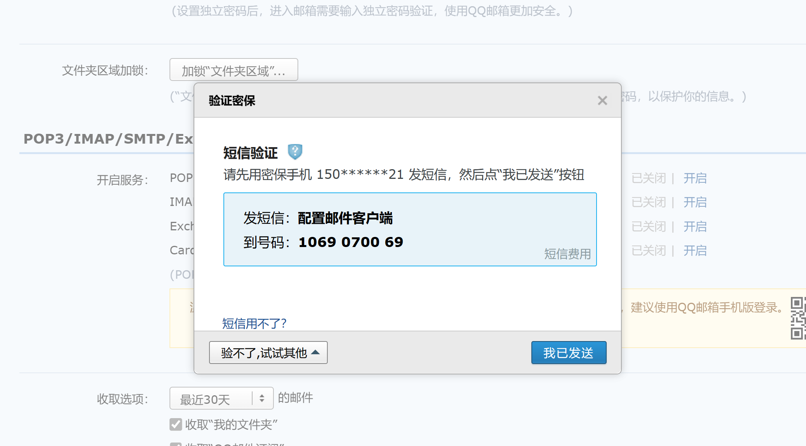

## 邮箱登录功能api使用-- qq邮箱完成功能

### 拿到自己qq的SMTP密钥





---


### 进入java代码！！

**导入依赖**

```xml
  <dependency>
            <groupId>javax.activation</groupId>
            <artifactId>activation</artifactId>
            <version>1.1.1</version>
        </dependency>
        <dependency>
            <groupId>org.apache.commons</groupId>
            <artifactId>commons-email</artifactId>
            <version>1.4</version>
        </dependency>
        <dependency>
            <groupId>javax.mail</groupId>
            <artifactId>mail</artifactId>
            <version>1.4.1</version>
        </dependency>
```

**导入工具类**

**发送邮箱工具类**

```java
package com.regin.utrils;

import org.apache.commons.mail.EmailException;
import org.apache.commons.mail.SimpleEmail;

/**
 * @author mrs
 * @create 2022-06-06 0:26
 */
public class EmailUtils {
    public static void sendAuthCodeEmail(String email, String authCode) {
        try {
            SimpleEmail mail = new SimpleEmail();
            mail.setHostName("smtp.qq.com");//发送邮件的服务器,这个是qq邮箱的，不用修改
            mail.setAuthentication("1332129687@qq.com", "locjvblikjijgdhf");//第一个参数是对应的邮箱用户名一般就是自己的邮箱第二个参数就是SMTP的密码,我们上面获取过了
            mail.setFrom("1332129687@qq.com","mrs");  //发送邮件的邮箱和发件人
            mail.setSSLOnConnect(true); //使用安全链接
            mail.addTo(email);//接收的邮箱
            mail.setSubject("验证码");//设置邮件的主题
            mail.setMsg("尊敬的用户:你好!\n 登陆验证码为:" + authCode+"\n"+"     (有效期为一分钟)");//设置邮件的内容
            mail.send();//发送
        } catch (EmailException e) {
            e.printStackTrace();
        }
    }
}
```

**生成随机数工具类**

```java
package com.regin.utrils;

import java.util.Random;

/**
 * 随机生成验证码工具类
 */
public class ValidateCodeUtils {
    /**
     * 随机生成验证码
     * @param length 长度为4位或者6位
     * @return
     */
    public static Integer generateValidateCode(int length){
        Integer code =null;
        if(length == 4){
            code = new Random().nextInt(9999);//生成随机数，最大为9999
            if(code < 1000){
                code = code + 1000;//保证随机数为4位数字
            }
        }else if(length == 6){
            code = new Random().nextInt(999999);//生成随机数，最大为999999
            if(code < 100000){
                code = code + 100000;//保证随机数为6位数字
            }
        }else{
            throw new RuntimeException("只能生成4位或6位数字验证码");
        }
        return code;
    }

    /**
     * 随机生成指定长度字符串验证码
     * @param length 长度
     * @return
     */
    public static String generateValidateCode4String(int length){
        Random rdm = new Random();
        String hash1 = Integer.toHexString(rdm.nextInt());
        String capstr = hash1.substring(0, length);
        return capstr;
    }
}

```

**调用**

```java
  EmailUtils.sendAuthCodeEmail(phone,code);
phone 是邮箱  code 是验证码
    
```

