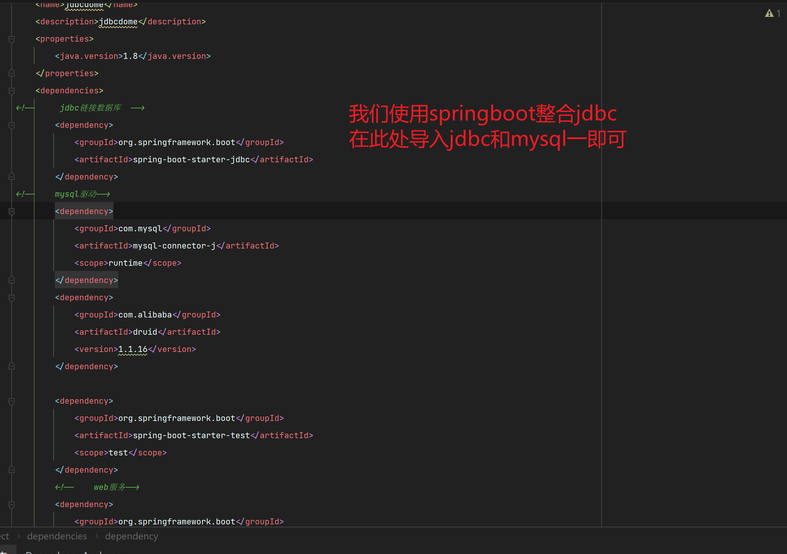

```xml
<?xml version="1.0" encoding="UTF-8"?>
<project xmlns="http://maven.apache.org/POM/4.0.0" xmlns:xsi="http://www.w3.org/2001/XMLSchema-instance"
         xsi:schemaLocation="http://maven.apache.org/POM/4.0.0 https://maven.apache.org/xsd/maven-4.0.0.xsd">
    <modelVersion>4.0.0</modelVersion>
    <parent>
        <groupId>org.springframework.boot</groupId>
        <artifactId>spring-boot-starter-parent</artifactId>
        <version>2.7.10</version>
        <relativePath/> <!-- lookup parent from repository -->
    </parent>

    <groupId>com.example</groupId>
    <artifactId>jdbcdome</artifactId>
    <version>0.0.1-SNAPSHOT</version>


    <name>jdbcdome</name>
    <description>jdbcdome</description>
    <properties>
        <java.version>1.8</java.version>
    </properties>
    <dependencies>
<!--     jdbc链接数据库  -->
        <dependency>
            <groupId>org.springframework.boot</groupId>
            <artifactId>spring-boot-starter-jdbc</artifactId>
        </dependency>
<!--    mysql驱动-->
        <dependency>
            <groupId>com.mysql</groupId>
            <artifactId>mysql-connector-j</artifactId>
            <scope>runtime</scope>
        </dependency>

        <dependency>
            <groupId>org.springframework.boot</groupId>
            <artifactId>spring-boot-starter-test</artifactId>
            <scope>test</scope>
        </dependency>
        <!--    web服务-->
        <dependency>
            <groupId>org.springframework.boot</groupId>
            <artifactId>spring-boot-starter-web</artifactId>
        </dependency>
    </dependencies>
    
    <build>
        <plugins>
<!--            maven插件-->
            <plugin>
                <groupId>org.springframework.boot</groupId>
                <artifactId>spring-boot-maven-plugin</artifactId>
            </plugin>
        </plugins>
    </build>

</project>

```



```yaml
spring:
  datasource: #数据源
    url: jdbc:mysql://localhost:3306/mybatis
    username: root
    password: 123456
    driver-class-name: com.mysql.cj.jdbc.Driver

```

```java
    @Autowired
    private JdbcTemplate jdbcTemplate;
    @Test
    void contextLoads() throws SQLException {
        List<Map<String, Object>> maps = jdbcTemplate.queryForList("select * from user");
        System.out.println(maps);

    }
```

