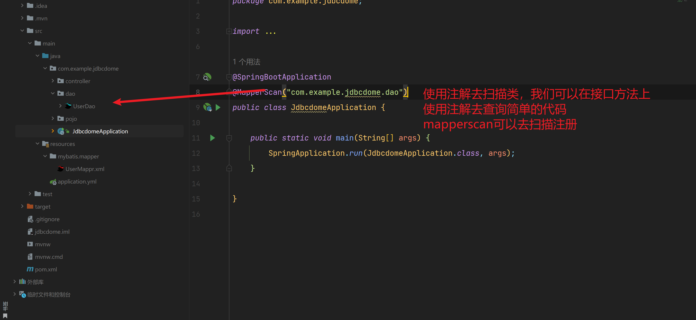
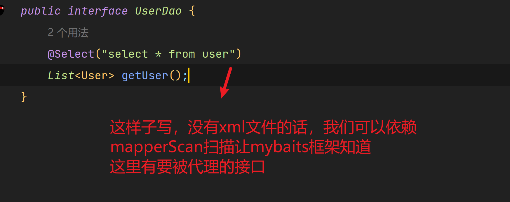
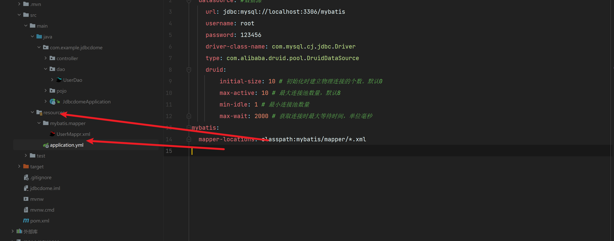

```xml
      <dependency>
            <groupId>org.mybatis.spring.boot</groupId>
            <artifactId>mybatis-spring-boot-starter</artifactId>
            <version>3.0.0</version>
        </dependency>
```

```powershell
导入mybatis启动依赖
```


## 注解写法-扫描






## xml写法--配置文件

```yaml
mybatis:
  mapper-locations: classpath:mybatis/mapper/*.xml
```

```powershell
我们可以在配置文件中指定我们mapper的映射xml文件然后xml文件便绑定具体的接口
实现代理接口
```

