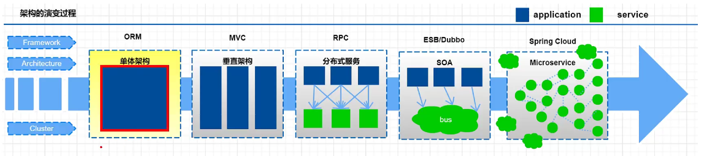

## 微服务介绍

### 系统架构

```
随着互联网的发展，网站引用的规模也在不断的扩大，进而导致系统架构也在不断的进行变化，
从互联网早期到现在，系统架构经历了几个过程 
单体引用架构--》垂直应用架构 --》 分布式架构 --》 SOA架构 --》微服务架构。
正在悄然兴起的服务网格
```





### 单体应用架构

```powershell
# 互联网早期，一般的网站应用流量比较少，只需一个应用，将所有功能代码部署在一起就可以，这样可以减少开发，部署和维护的成本

# 比如说一个电商系统，里面会包含很多：用户管理，商品管理，订单管理，物流管理等很多模块，我们会把它们做成一个web项目，然后部署到一台tomcat服务上

优点
# 项目架构简单，小项目的话，开发成本低
# 项目部署在一个节点上，维护方便

缺点
# 全部功能集成在一个工程中，对于大型项目来讲不易开发和维护
# 项目模块之间紧密耦合，单点容错率低
# 无法针对不同模块进行针对性优化和水平扩展
```

### 垂直应用架构

```powershell
# 所谓垂直引用架构，就将原来的一个应用，拆成互不相干的几个引用，以提升效率，比如我们可以将电商项目的单体引用拆封成：

# * 电商系统（用户管理，商品管理，订单管理）
# * 后台管理（用户管理，订单管理，客户管理）
# * CMS系统（广告管理，营销管理）

# 这样拆分完毕后，一但用户访问量变大，只需要增加电商系统的节点，而不需增加后台和coms的节点

优点

# 系统拆分实现了流量分担，解决了并发问题，而且可以针对不同模块进行优化和水平扩宽
# 一个系统的问题不会影响到其他系统提高了  容错率

缺点
# 系统之间相互对立，无法进行相互调用
# 系统之间相互独立，会有重复的开发任务
```

### 分布式架构 RPC

```powershell
# 当垂直应用越来越多，重复的业务代码就会越来越多，这时候，我们就思考可不可以将重复的代码抽取出来，做成统一的业务层作为独立的服务，然后由前端控制调用不同层的服务呢？
# 这就产生了新的分布式架构，它将工程拆封为了表现层和服务层两个部分，服务层中包含业务层逻辑，表现层只需要处理页面交互，业务逻辑都是调用服务层的服务发现

优点
# 抽取公共的功能为服务层，提高代码的复用性
缺点
# 系统之间耦合度变高，调用关系错综复杂，难以维护
```


### SOA架构

```powershell
# 在分布式架构下，当服务越来多，容量的评估，小服务资源的浪费等问题渐渐显现，此时需增加一个调度中对集群进行实时管理，此时，用于资源调度和治理中心 （SOA Service Oriented Architecture） 是关键

优点
# 使用治理服务 （ESB/dubbo）解决了服务之间的调用关系的自动调节
缺点
# 服务间会有依赖关系，一旦某个环节出错会影响较大（服务雪崩）
# 服务关系复杂，运维，测试部署困难
```


### 微服务架构

```powershell
# 微服务架构在某种程度上是面向服务架构SOA继续发展的下一步，它更加加强服务的 “彻底拆封”

微服务架构与SOA架构的不同
# 微服务架构比SOA架构的细粒度会更加精细。让专业的人去做专业的事情（专注），目的提高效率，每个服务与服务之间互相不影响，每个微服务必须独立部署，微服务架构更加轻巧，轻量级。
# SAO架构可能数据库存储会发生共享，微服务强调每个服务都是单独的数据库，保证每个服务之间互不影响
# 项目体系特征： 微服务比SOA架构更加适合互联网公司敏捷开发，快速迭代版本，因为粒度非常精细

优点：
# 服务原子拆封。独立打包，部署和升级，保证每个服务清晰任务划分，利于扩展
# 服务之间采用Resultful等轻量级http协议相互调用

缺点
# 分布式系统开发的技术成本高（容错，分布式事务等）
# 复杂度更高，各个微服务进行分布式独立部署，当进行模块调用的时候，分布式会变得更加麻烦
```


### 微服务架构常见问题

```powershell
一旦采用了微服务架构，就势必会遇到这样几个问题
# 这么多小服务，如何管理它们？（服务治理，注册中心【服务注册，发现，剔除】） nacos
# 这么多小服务，它们之间如何通信？（restful rpc dubbo feign） httpclient（“url”,参数）
# 这么多小服务，客户端如何访问它们？ 网关 gateWay
# 这么多小服务, 一旦出现问题如何自处理？（容错） sentinel
# 这么多小服务 ，一但出现问题，如何排错？（链路追踪） skywalking

# 对于上面的问题，是任何一个微服务设计者都不能绕过去的，因为大部分的微服务产品都正对每一个维妮塔提供了相应的组件解决它们
```


### springcloudAlibaba 介绍

