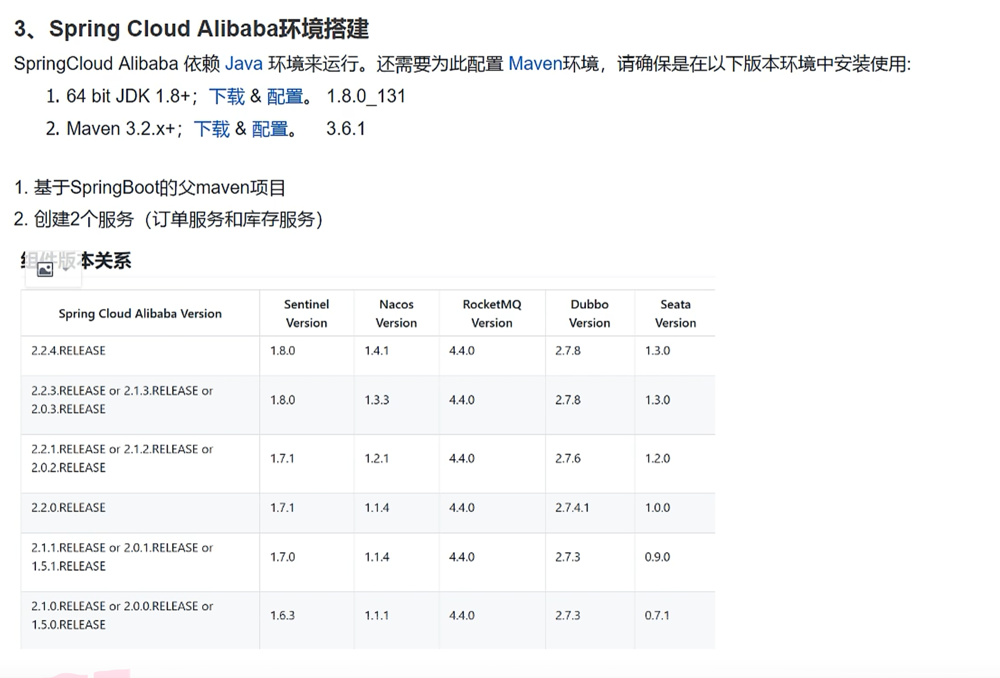
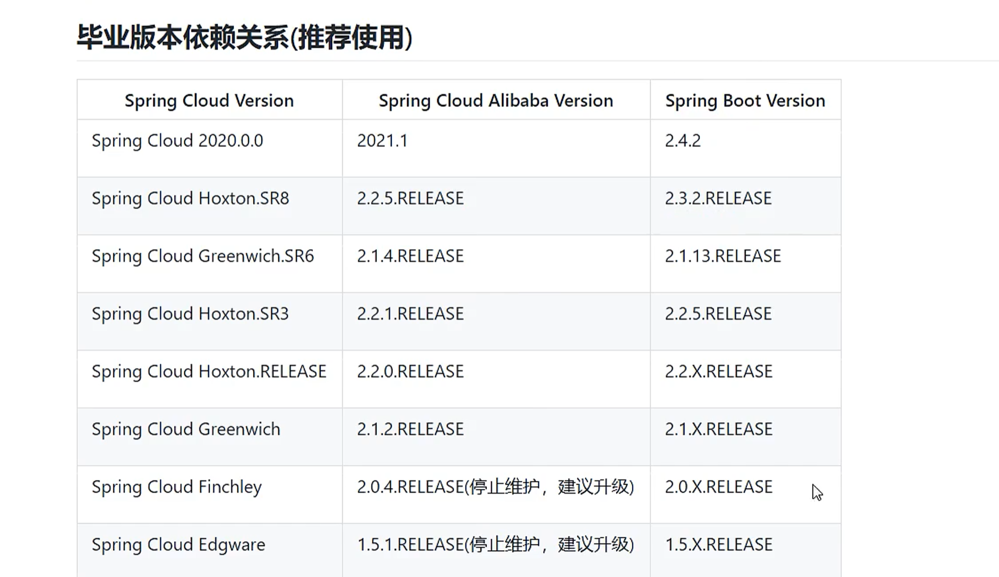

## 分布式项目搭建




-  **1搭建父亲工程项目**


```powershell
父工程项目，没有src资源文件，只需要pom文件做聚合管理，版本依赖管理的操作
父工程的打包方式是pom
```


```xml
<?xml version="1.0" encoding="UTF-8"?>
<project xmlns="http://maven.apache.org/POM/4.0.0" xmlns:xsi="http://www.w3.org/2001/XMLSchema-instance"
         xsi:schemaLocation="http://maven.apache.org/POM/4.0.0 https://maven.apache.org/xsd/maven-4.0.0.xsd">
    <modelVersion>4.0.0</modelVersion>
    
    <parent>
        <groupId>org.springframework.boot</groupId>
        <artifactId>spring-boot-starter-parent</artifactId>
        <version>2.3.12.RELEASE</version>
        <relativePath/> <!-- lookup parent from repository -->
    </parent>
    
    <groupId>com.show</groupId>
    <artifactId>springcloudAlibaba</artifactId>
    <version>0.0.1-SNAPSHOT</version>
    
    <name>springcloudAlibaba</name>
    <description>springcloudAlibaba</description>
    
    <modules>
        <module>Order</module>
        <module>Stock</module>
    </modules>
    
    <packaging>pom</packaging>
    
    <properties>
        <java.version>1.8</java.version>
    </properties>

<!--    springboot 基本场景启动-->
    <dependencies>
        <dependency>
            <groupId>org.springframework.boot</groupId>
            <artifactId>spring-boot-starter</artifactId>
        </dependency>
<!--    springboot 测试环境启动器-->
        <dependency>
            <groupId>org.springframework.boot</groupId>
            <artifactId>spring-boot-starter-test</artifactId>
            <scope>test</scope>
        </dependency>
    </dependencies>

    <build>
        <plugins>
            <plugin>
                <groupId>org.springframework.boot</groupId>
                <artifactId>spring-boot-maven-plugin</artifactId>
            </plugin>
        </plugins>
    </build>

</project>

```


- **搭建子工程**

```xml
<project xmlns="http://maven.apache.org/POM/4.0.0" xmlns:xsi="http://www.w3.org/2001/XMLSchema-instance"
         xsi:schemaLocation="http://maven.apache.org/POM/4.0.0 http://maven.apache.org/maven-v4_0_0.xsd">
    <modelVersion>4.0.0</modelVersion>
    
    <parent>
        <groupId>com.show</groupId>
        <artifactId>springcloudAlibaba</artifactId>
        <version>0.0.1-SNAPSHOT</version>
    </parent>
    
    <artifactId>Order</artifactId>
    <packaging>war</packaging>
    
    <name>Order Maven Webapp</name>
    <url>http://maven.apache.org</url>
    
    <dependencies>
        <dependency>
            <groupId>org.springframework.boot</groupId>
            <artifactId>spring-boot-starter-web</artifactId>
        </dependency>
    </dependencies>
    
    <build>
        <finalName>Order</finalName>
    </build>
    
</project>
```


**子工程为微服务**

```powershell
微服务之间互相调用需要使用 restFul调用需要注入到ioc容器中


@SpringBootApplication
public class OrderApplication {
    public static void main(String[] args) {
        SpringApplication.run(OrderApplication.class,args);
    }
	#配置restFul调用配置
    @Bean
    public RestTemplate getRestTemplate(RestTemplateBuilder restTemplateBuilder){
        return  restTemplateBuilder.build();
    }
}

#调用实例


@RestController
@RequestMapping("/order")
public class OrderController {

    @Autowired
   private RestTemplate restTemplate;


    @RequestMapping("/add")
    public String add(){
        System.out.println("下单成功");
        String forObject = restTemplate.getForObject("http://localhost:8011/stock/reduct", String.class);
        System.out.println(forObject);
        return  "helloWord";
    }
}
```


## springcloudAlibaba服务搭建

**版本**




[springCloudAlibabab版本查看](https://github.com/alibaba/spring-cloud-alibaba/wiki/%E7%89%88%E6%9C%AC%E8%AF%B4%E6%98%8E)

**父工程项目版本管理**

```xml
<?xml version="1.0" encoding="UTF-8"?>
<project xmlns="http://maven.apache.org/POM/4.0.0" xmlns:xsi="http://www.w3.org/2001/XMLSchema-instance"
         xsi:schemaLocation="http://maven.apache.org/POM/4.0.0 https://maven.apache.org/xsd/maven-4.0.0.xsd">
    <modelVersion>4.0.0</modelVersion>

<!--    项目版本-->
    <groupId>com.show</groupId>
    <artifactId>springcloudAlibaba</artifactId>
    <version>0.0.1-SNAPSHOT</version>

    <name>springcloudAlibaba</name>
    <description>springcloudAlibaba</description>
<!--    子模块管理-->
    <modules>
        <module>Order</module>
        <module>Stock</module>
    </modules>
<!--打包方式-->
    <packaging>pom</packaging>

<!--    统一版本管理-->
    <properties>
        <java.version>1.8</java.version>
        <spring.cloud.alibaba.version>2.2.5.RELEASE</spring.cloud.alibaba.version>
        <spring.boot.version>2.3.11.RELEASE</spring.boot.version>
        <srping.cloud.version>Hoxton.SR8</srping.cloud.version>
    </properties>

<!--    springboot 基本场景启动-->
    <dependencies>
        <dependency>
            <groupId>org.springframework.boot</groupId>
            <artifactId>spring-boot-starter</artifactId>
        </dependency>
<!--    springboot 测试环境启动器-->
        <dependency>
            <groupId>org.springframework.boot</groupId>
            <artifactId>spring-boot-starter-test</artifactId>
            <scope>test</scope>
        </dependency>
    </dependencies>

    <dependencyManagement>
        <dependencies>
<!--            springCloudAlibaba的版本管理 使用dependencyManagement完成继承-->
            <dependency>
                <groupId>com.alibaba.cloud</groupId>
                <artifactId>spring-cloud-alibaba-dependencies</artifactId>
                <version>${spring.cloud.alibaba.version}</version>
                <type>pom</type>
                <scope>import</scope>
            </dependency>
<!--            springboot的版本管理-->
            <dependency>
                <groupId>org.springframework.boot</groupId>
                <artifactId>spring-boot-starter-web</artifactId>
                <version>${spring.boot.version}</version>
                <type>pom</type>
                <scope>import</scope>
            </dependency>
<!--            springcloud的版本管理-->
            <dependency>
                <groupId>org.springframework.cloud</groupId>
                <artifactId>spring-cloud-dependencies</artifactId>
                <version>${srping.cloud.version}</version>
                <type>pom</type>
                <scope>import</scope>
            </dependency>
        </dependencies>
    </dependencyManagement>

<!--    插件-->
    <build>
        <plugins>
            <plugin>
                <groupId>org.springframework.boot</groupId>
                <artifactId>spring-boot-maven-plugin</artifactId>
            </plugin>
        </plugins>
    </build>

</project>

```

