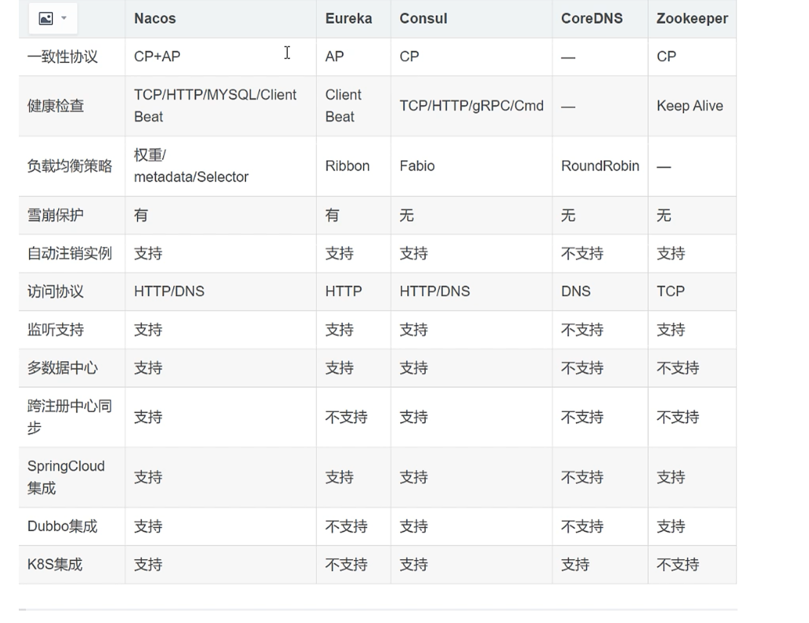

### 1：什么是nacos

官方：一个更容易于构建云原生应用的动态服务发现，服务配置，和服务管理平台

集 **注册中心**+ **配置中新** + **服务管理** 平台


[springcloudalibaba中文](https://spring-cloud-alibaba-group.github.io/github-pages/2021/zh-cn/index.html#_spring_cloud_alibaba_nacos_discovery)

**nacos的关键特征性包括**

- 服务发现和服务健康检查
- 动态配置服务
- 动态dns服务
- 服务及其元数据管理

### 2：Nacos注册中心

#### **Nacos核心功能**

-  **服务注册**

  ```powershell
  # Nacos Client 会同发送Rest请求的方式向Nacos Server 注册自己服务，提供自身元数据，如 ip 地址 端口等信息，Nacos Server 接受到请求后，就会吧这些元数据信息存储在一个双层的内存map中
  ```

- **服务心跳**

  ```powershell
  # 在服务注册后，Nacos Client 会维护一个定时心跳来持续通知Nacos Server ，说明服务一直处于可用状态，防止被剔除，默认5s发送一次心跳
  ```

- **服务同步**

  ```powershell
  # 服务消费者(Nacos Client) 在调用服务提供者的服务时，会发送一个Rest请求给Nacos Server 获取上面注册的服务清单，并且缓存在Nacos Client本地，同时会在Nacos CLient本地开启一个定时任务拉去服务端的注册信息更新到本地缓存
  ```

- **服务健康检查**

  ```powershell
  # Nacos Server 会开启一个定时任务来检查注册服务实例的健康情况，对于超过15s没有收到客户端心跳的实例会将它的healhy属性设置为false（客户端服务不会发现）如果某个实例超过30秒没有收到心跳，直接剔除该实例，如果恢复发送心跳则重新注册
  ```

  

####  Nacos与其他服务注册的区别




### 3:  Naocs Server 服务部署

记得查看nacos和springcloudalibaba的版本


[springcloudalibaba中文](https://spring-cloud-alibaba-group.github.io/github-pages/2021/zh-cn/index.html#_spring_cloud_alibaba_nacos_discovery)

[去nacos官网下载windowsnacos版本](https://github.com/alibaba/nacos/releases)


### 4: Nacos Client搭建

**注意**

在使用nacos的客户端之前，必须保证已经将***\*RestTemplate\**** 注入到spring容器中

1：导入依赖

```xml
<dependency>
            <groupId>com.alibaba.cloud</groupId>
            <artifactId>spring-cloud-starter-alibaba-nacos-discovery</artifactId>
 </dependency>
```


2： 在applicaiton配置中写入配置

```yaml
server:
  port: 8010

spring:
  application:
    #应用名称，（nacos会将该名称当作服务名称）
    name: order-server
  cloud:
    nacos:
      discovery:
        #nacos服务端 地址
        server-addr: localhost:8848
```


3: 在启动类中配置客户端注解

```java
@SpringBootApplication
@EnableDiscoveryClient
public class OrderApplication {
    public static void main(String[] args) {
        SpringApplication.run(OrderApplication.class,args);
    	}
    }
```

