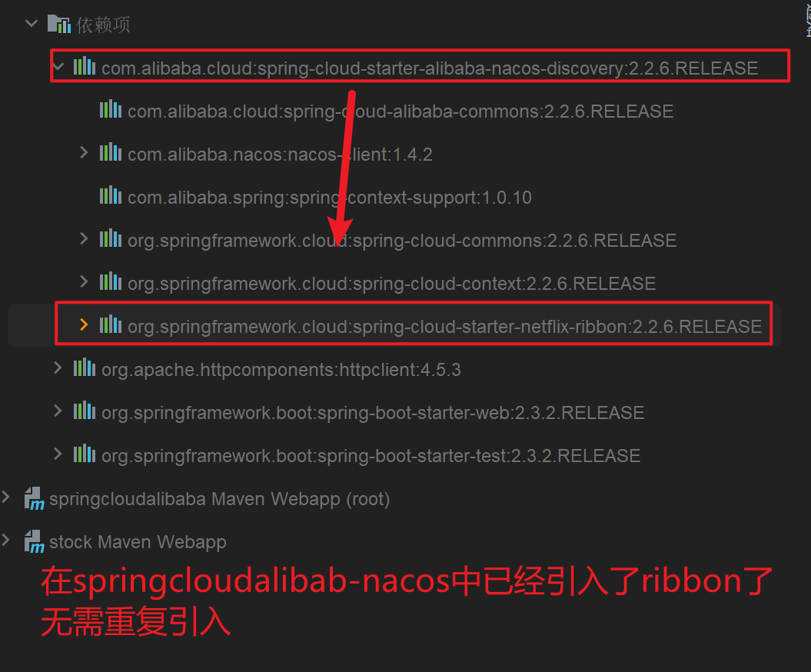
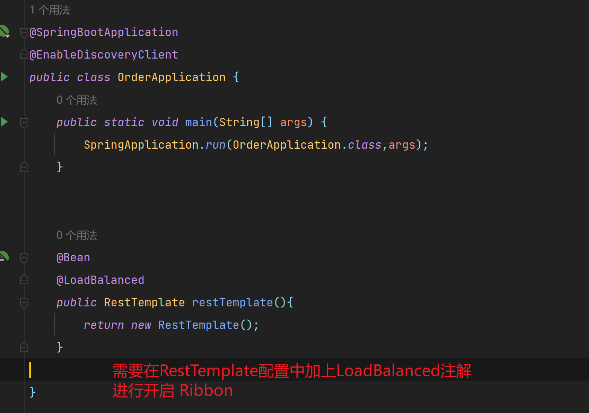
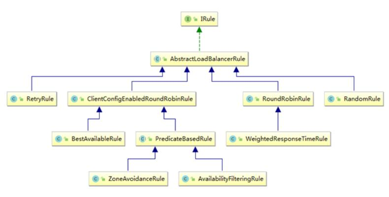
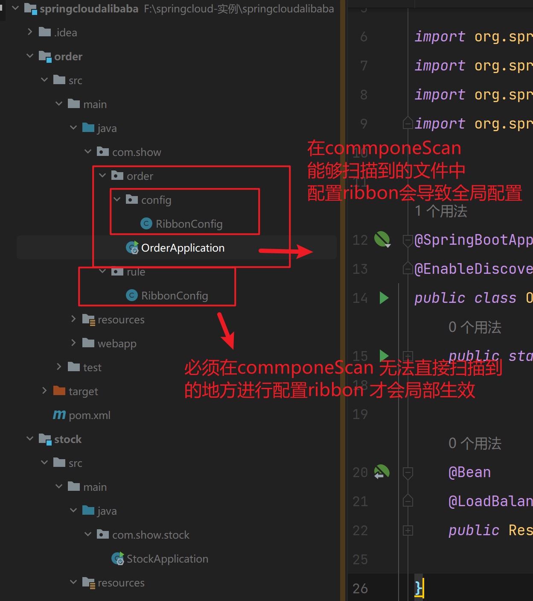
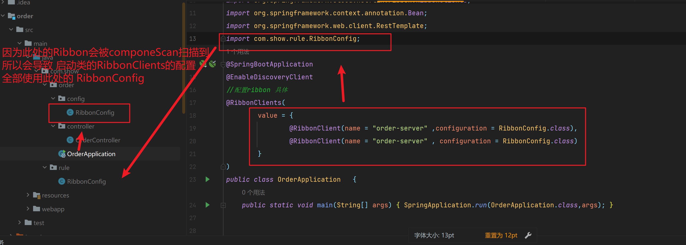

## Ribbon 

### 什么是Ribbon

目前主流的负载方案为以下两种

- 集中式负载均衡，在消费者和服务提供方中间使用独立的代理进行负载，有硬件（比如F5） 也有软件的（不如 nginx）
- 客户端根据自己的请求做负载均衡，Ribbon 就属于客户端自己做负载均很

```powershell
# Spring Cloud Ribbon 是基于 Netflix Ribbon 实现的一套客户端的的负载均衡工具，Ribbon客户端，组件提供一系列完善的配置，如超时，重试等，通过Load Baiancer 获取到服务提供的所有机器实例，Ribbon会自动基于某种规则（轮询，随机）去调用这些服务，Ribbon 也可以实现我们自己的负载均衡算法
```

**客户端的负载均衡**

```powershell
#例如 spring cloud 中的 ribbon 客户端会有一个服务器地址，在发送请求前会通过负载均衡算法选择一个服务器，然后进行访问，这是客户端负载均衡，即在客户端进行负载均衡算法分配
```

**服务端的负载均衡**

```powershell
# 例如 Nginx ，通过Nginx进行负载均衡，先发送请求，然后通过负载均衡算算法，在多个服务器之间进行访问，即在服务端进行负载均衡算法分配
```


**常见的负载均衡算法**

- 随机,通过随机选择服务进行执行,一般这种方式比较少
- 轮询,负载均衡默认实现方式,请求来之后排队处理
- 加权轮询,通过服务器性能分析,给高配置,低负载的服务区分配更高的权重,均衡各个
- 地址Hash,通过客户端请求的地址HASH值去模映射进行服务调度,ip, hash
- 最小链接,即使请求均衡了,压力也不一定均衡,最小链接数法就是根据服务器情况,比如请求积压数等参数,将请求分配到当前压力最小的服务器上,最小活跃数


### 依赖项 

****




### 开启ribbon




### 负载均衡策略



**IRule**

- 这是所有负载均衡策略的父接口,里面的核心方法就是cloose方法,用来选择一个服务实例

**AbstractLoadBalancerRule**

AbstractLoadBalancerRule是一个抽象类,里面主要定义了一个ILoadBalancer,也就是我们上文说的负载均衡器,这里定义它的目的就是辅助负载均策略选取合适的服务端实例

- **RandomRule  随机策略** 

  ```powershell
  # 看名字就知道,这种负载均衡策略就是 随机选择一个服务实例 ,看源码我们知道,在RandomRule的午餐构造方法中初始化了一个Random对象,然后它重写了choose方法又调用了 choose(ILoadBalancer Ib, Object key) 这个重载的choose方法,在这个重载的choose方法中,每次利用random对象生成一个不大于服务实例总数的随机数,并将该数字作为下标所随机获取一个服务实例
  ```

- **RoundRobinRule 轮询策略**

  ```powershell
  # RoundRobinRule 这种负载均衡策略叫做 线性轮询负载均衡策略. 这个类的choose(ILoadBalancer lb , Obhect key) 函数逻辑: 开启一个计数器 count ,在 while循环中遍历服务清单,获取清单之前先通过 incrementAndGetModulo 获取一个下标 这个下表是一个不断自然增长的数先加1 然后和服务清单总数去模之后获取到的(所有这个下标从来不会越界) 拿着下标再去服务器清单列表中获取服务,每次循环计数+1 ,如果连续10次没有取到服务,则会报一个 警告 No avalible alive serves after 10 tries from load balncder xxdx .
  ```

- **RestryRule 轮询重试策略**

  ```powershell
  # 看名字就知道这种负载均衡策略带有重试功能,首先RetryRule中又定义了一个subRule,它的实现类是RoundRobinRule,然后RetryRule的choose(IloadBalancer lb , Object key) 方法中,每次还是采用 incrementAndGetModulo 中choose规则来选择一个服务实例,如果选择实例正常就返回,如果选择服务实例为null或者已经失效,则在失效时间deadline之前不断的进行重试(重试时间获取服务的策略还是RoundRobinRule中定义的策略),如果超过了deadline还没有取到则会返回一个null
  ```

- **WeightedResponseTimeRule 权重策略**

  ```powershell
  # WeightedResponseTimeRule 是 RoundRobinRule 的一个子类,在 WeightedResponseTimeRule 中对 RoundRobinRUle的功能进行了扩展,WeightedResponseTimeRule 会根据每一个实例的运行情况来给计算出一个实例的权重,然后在挑选实例的时候则根据权重选择,这样能够实现更优的实例调用 WeightedResponseTimeRule  中有一个名叫 DynamicServerWeightTask的定时任务,默认情况下每隔30秒会计算一次各个服务的服务实例权重,权重计算规则也很加单 如果一个服务的平均响应时间越短则权重越大,那么该服务的选中执行入伍的概率也就越大
  ```

- **ClientConfigEnabledRounRobinRule 轮询策略 **

  ```powershell
  # ClientConfigEnabledRounRobinRule  选择策略的实现简单,内部定义了 RoundeRobinRule chooses 方法还是采用了 RoundeRobinRule 的 choose 方法 所有它选择的策略和 RoundeRobinRule一致
  ```

- **BesAvailableRule  过滤失效服务并 找到最小并发服务使用 **

  ```powershell
  #  BesAvailableRule 基础了 ClientConfigEnaledRoundRobinRule 它在 ClientConfigEnaledRoundRobinRule 的基础上主要增加了根据loadBalancerStats 中保存服务实例的状态信息 来过滤掉失效的服务实例功能，然后顺便找出并发请求最小的服务实例来使用。然而 loadBalancerStats有可能为null 如果 loadBalancerStats有可能为null 为null 则 BaseAvailableRule 将采用它的父类即 ClientConfigEnabledRoundRobinRUle的服务选取策略（线性轮询）
  ```

- **ZoneAvoidanceRule 默认规则**

  ```powershell
  # ZoneAvoidanceRule  是 PredicateBaseRule的一个实现类。只不过这里多了一个过滤条件 ZoneAvoidanceRule 的过滤条件是以 ZoneAvoidancePredicate为主的过滤条件和以 AvailabilityPredicate为过滤条件组成一个叫做 CompositePredicate的组合过滤条件，过滤成功之后，继续采用线性轮询（RoundRobinRule）的方式从过滤结果中选择一个出来
  ```

- **AvailablitryFilteringRule 先过滤掉故障实例，再选择并发较小的实例**

  ```powershell
  # 过滤掉一直链接失败的被标记为 circuit tripped的后端server，并过滤掉那些高并发的后端server或者使用一个AvalibailtyPredicate来过滤server的逻辑，其实就是检查status里记录的各个server运行状态
  ```

  


### 修改默认的负载均衡策略

**配置类**

1: 书写配置类

```java
@Configuration
public class RibbonConfig {
    /**
     * 全局配置
     * 指定负载均衡策略
     * @return
     */
    @Bean
    public IRule iRule (){
        return  new NacosRule();
    }
}
```

**小坑**




2：在启动类中指定ribbon的负载均衡策略




```java
@SpringBootApplication
@EnableDiscoveryClient
//配置ribbon 具体
@RibbonClients(
        value = {
                @RibbonClient(name = "order-server" ,configuration = RibbonConfig.class),
                @RibbonClient(name = "order-server" , configuration = RibbonConfig.class)
        }
)
public class OrderApplication   {
    public static void main(String[] args) {
        SpringApplication.run(OrderApplication.class,args);
    }
```

**配置文件**

```yaml
#设置调用服务的负载均衡策略
order-server:
  ribbon:
    NFLoadBalancerRuleClassName: com.show.rule.RibbonConfig.class
```


### 自定义负载均衡策略

1 ：编写配置类  实现 AbstractLoadBalancerRule 接口 自定义负载均衡策略

```java
public class CustomRule extends AbstractLoadBalancerRule {
    @Override
    public void initWithNiwsConfig(IClientConfig iClientConfig) {

    }

    @Override
    public Server choose(Object o) {
        ILoadBalancer loadBalancer = this.getLoadBalancer();
        //获得请求服务的实例
        List<Server> reachableServers = loadBalancer.getReachableServers();
        //获取随机数
        int random = ThreadLocalRandom.current().nextInt(reachableServers.size());
        //获取具体的服务实例对象
        Server server = reachableServers.get(random);
        //返回服务实例
        return server;
    }
}

```


2：  将自己编写的 ribbon配置类 的 bean注入的spring容器

```java
@Configuration
public class RibbonConfig {

    //将负载均衡策略配置类注入到spring容器
    @Bean
    public IRule rule (){
        //使用自己编写的 负载均衡策略
        return  new CustomRule();
    }
}

```


3：在启动类中配置 ribbon配置类

```java
//配置ribbon 具体服务的负载均衡策略
@RibbonClients(
        value = {

                @RibbonClient(name = "order-server" , configuration = RibbonConfig.class),
                @RibbonClient(name = "stock-service" , configuration = RibbonConfig.class)
        }
)
public class OrderApplication   {
    public static void main(String[] args) {
        SpringApplication.run(OrderApplication.class,args);
    }
}
```


### 使用LoadBalancer替换 Ribbon

**1： 什么是 SpringCloudLoadBalancer**

Spring Cloud LoadBalancer 是 Spring Cloud 官方自己提供的客户端负载均衡器，用来替代 Ribbon

Spring 官方提供了两种负载均衡的客户端

**RestTemplate**

RestTemplate是Spring提供用于访问Rest服务的客户端，RestTemplate提供了多种便捷远程Http服务的方法， 能够大大提高客户端的编写效率，默认情况下，RestTemplate默认依赖jdk的Http链接工具

**WebClient**

WebClient是从Spring WebFlux 5.0 版本开始提供的一个非阻塞的基于响应式编程的进行http请求的客户端工具，它的响应式编程的语句Reactor的，WebClient中提供了标准的Http请求方式对应的get，post,put,delete 等方法，可以用来发起相应的请求


**2 ： RestTemplate 整合 LoadBalancer**

1： 依赖

```xml
<!--    移除 nacos依赖中 自带的 ribbon 否则会起冲突-->
    <dependencies>
        <dependency>
            <groupId>com.alibaba.cloud</groupId>
            <artifactId>spring-cloud-starter-alibaba-nacos-discovery</artifactId>
		<!-- 移除 ribbon-->
            <exclusions>
                <exclusion>
                    <groupId>org.springframework.cloud</groupId>
                    <artifactId>spring-cloud-starter-netflix-ribbon</artifactId>
                </exclusion>
            </exclusions>
            
            <!--        添加 LoadBalancer 依赖-->
        <dependency>
            <groupId>org.springframework.cloud</groupId>
            <artifactId>spring-cloud-starter-loadbalancer</artifactId>
        </dependency>
           
        </dependency>
```


2： 禁用ribbon 规则 ，让springcloud使用loadbalancer

在将ribbon排除后是没有这个选项的，是无法禁用ribbon规则，要导入了loadBalancer才可以禁用

```yaml
  spring:
  	cloud:
  	  loadbalancer:
  	    ribbon:
  	      enabled: false
```


3 ： **注意事项**

- 使用 LoadBalancer 是需要存在springcloud的依赖的，我们现在学习的项目，依赖以及在父级配置好了

