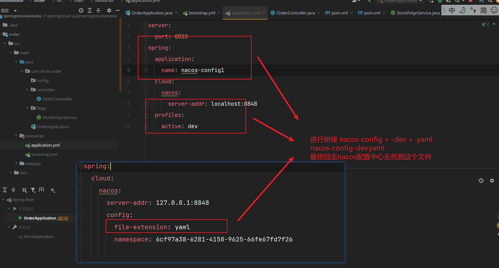

## nacos作为配置中心

官方文档 [nacos](https://nacos.io/zh-cn/)

Nacos 提供于存储配置和其他数据， key - value 存储，分布式系统中外部化配置提供服务端和客户端支持，使用 Spring Cloud Alibaba Config ， 您可以在 Nacos Server 集中管理你的 Spring Cloud 应用的外部配置


 **Spring Cloud Config 对比**

**三大优势**

- springcloud config 大部分场景结合git使用，动态变更还需要依赖springcloud bus 消息总线来通过所有的客户端变化
- springcloud config 不提供可视化界面
- nacos config 使用长轮询更新配置，一旦配置有变动后，通知Provider的过程非常迅速，从速度上秒杀springcloud原来的config


### 使用nacosconfig 

**1： 在nacos 服务端创建 配置**


**2 : 在项目中条件 nacos config 依赖**

```xml
 <dependency>
            <groupId>com.alibaba.cloud</groupId>
            <artifactId>spring-cloud-starter-alibaba-nacos-config</artifactId>
        </dependency>
```


**3： 创建一个bootstrap.yml or  bootstrap.properites 文件用来读取配置中心的文件**

参考官方文档

**实例**

[[Nacos config · alibaba/spring-cloud-alibaba Wiki · GitHub](https://github.com/alibaba/spring-cloud-alibaba/wiki/Nacos-config)](https://github.com/alibaba/spring-cloud-alibaba/wiki/Nacos-config)


### 扩展配置

**创建一个bootstap文件**

```properties
#基础配置
#只配置位置和id 

# 指定配置的名称也就是id
spring.application.name=nacos-config.properties 
# 配置nacos的地址
spring.cloud.nacos.config.server-addr=127.0.0.1:8848
# 配置拉去配的文件的格式  默认值是properties

#你可以通过配置  来关闭动态刷新  --客户端无法感知配置的变化
spring.cloud.nacos.config.refresh.enabled=false

 

```

#### 可支持profile粒度的配置

1: 创建配置文件


2: 在bootstrap文件中进行引用


3: 在applicaiton配置文件中进行profile的细粒度控制



**注意点**

- 当你在nocos配置 默认配置文件非properites格式的文件的配置，就必须配置 config.file-extensios: xxx 
- 在nacos上文件命名的规制 spring.application.name - profile.file-extension.properites 
- 只有默认的配置文件才能结合profile进行设置 。 **默认的配置文件是：** 就是nacos上配置文件名称和服务名称是一样
- profile必须跟随默认的配置文件格式来
- 配置文件存在优先级（优先级大的会覆盖优先级小的） **proflie>默认配置**


#### 支持自定义 namespace 的配置

1:创建一个命名空间


2: 配置文件指定读取命名空间的配置

```yaml
spring:
  cloud:
    nacos:
      server-addr: 127.0.0.1:8848
      config:
        file-extension: yaml
		# 配置 读取指定的命名空间
        namespace: 6cf97a38-6281-4150-9625-66fe67fd7f26
```

#### 支持自定义 Group 的配置

1： 在nacos定义配置的时候自己直接选择分组


2: 在项目中指定读取的是哪一个分组的配置文件

```yaml
spring:
  cloud:
    nacos:
      server-addr: 127.0.0.1:8848
      config:
        file-extension: yaml
        namespace: 6cf97a38-6281-4150-9625-66fe67fd7f26
        # 读取指定分组的配置
        group: dome01
```


#### 支持自定义扩展的 Data Id 配置

**shared-configs:读取配置**

此方式指定读取的配置文件的优先级是    shared-configs:《  profile 《  默认配置

在shared-configs: 下配置多个数组配置 也是有加载优先级的 下标越大越优先

1：创建一个随意命名的 配置


```yaml
spring:
  cloud:
    nacos:
      server-addr: 127.0.0.1:8848
      config:
        file-extension: yaml
        namespace: 6cf97a38-6281-4150-9625-66fe67fd7f26
        group: dome01
        # 进行配置 读取指定的配置
        shared-configs:
          # 配置nacos中的配置名称
          - data-id: common.yaml
            # 配置是否感知配置的更新
            refresh: true
            # 配置分组 默认的是 DEFAULT_GROUP
            group: DEFAULT_GROUP

```


**extension-configs: 读取指定配置**

此方式指定读取的配置文件的优先级是   shared-configs: 《 extension-configs《  profile 《  默认配置

在extension-configs下配置多个数组配置 也是有加载优先级的 下标越大越优先

```yaml
extension-configs:
  - data-id: common.yaml
```


### @RefreshScope 注解

当nacos更新了配置，项目会自动拉去配置，但是如果我们在controller使用@value注解进行了注入 nacos配置中心配置是无法动态属性的，因为注入是一次性的，并没有响应式，需要RefreshScope注解

```java

@RestController
@RequestMapping("/order")
@RefreshScope //开启动态注入，当nacos配置修改，进行动态注入
public class OrderController {


    @Value("${user.age}")
    String userAge;

    @GetMapping("/getUserAge")
    public String getUserAge (){
        return  userAge;
    }
}

```

