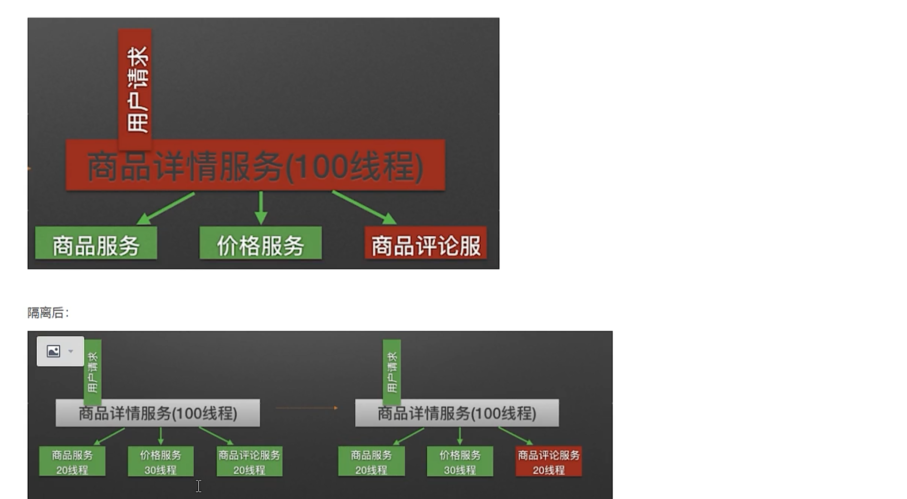

## Sentinl

### 分布式系统遇到的问题


#### **服务雪崩**

服务雪崩效应，因为服务提供者不可用导致了服务调用者的不可用，并将不可用逐渐放大，就叫服务雪崩效应

导致服务不可用的原因


在服务提供者不可用的时候，会出现大量重试的情况，用户重试，代码逻辑重试，这些重试最终导致：进一步加大流量请求，所以归根结底导致服务雪崩的最根本原因是：大量请求线程同步等待造成的资源耗尽，当服务调用者使用同步调用时，会产生大量的等待线程占用系统资源，一旦线程资源被耗尽，服务调用者提供的服务也将处于不可用状态，于是雪崩效应就产生了


**解决方案**

稳定性 恢复性


#### **常见的容错机制**

##### **超时机制**

不不做如何处理的情况下，服务提供者不可用会导致消费者求情线程强制等待，而照成系统资源耗尽，加入超时机制，一旦超时，就释放资源，由于是否资源较快，一定程度上可以抑制资源耗尽的问题

#####  **服务限流**


我们会服务进行压测，得到一个QPS值，即是每秒处理请求的值，会设置每秒进入的请求数，如果超过服务处理数 直接拒绝

##### **隔离**

原理： 用户的请求将不再直接访问服务，而是通过线程池中空闲的线程来访问服务，如果线程池满了，则会进行降级处理，用户的请求不会被阻塞，至少可以看到一个执行结果（列入返回友好提示）

**隔离前**


**隔离后**



##### **信号隔离**

信号隔离也可以用于限制并发访问，防止阻塞扩展，与线程隔离最大的不同在于执行依赖代码的线程依然是请求线程，（该线程需要通过信号申请，如果客户端是可信的且可以快速返回，则可以使用型号隔离替换线程隔离，降低开销。信号量的大小可以动态调整，线程池大小不可用）

##### **服务熔断**

**远程服务不稳定或网络抖动时暂时关停**

现实世界的断路器 -- 断路器实时监控电路情况，如果发现电路电流异常，就会踢跳闸，从而防止电路被烧毁

软件世界的断路器可以这样理解： 实时监控应用，如果发现在一定时间内失败次数/失败率 达到一定阈值，就 **跳闸** ， 断路器打开， -- 此时，请求直接返回，而不去调用原本调用的逻辑，跳闸一段时间后（例如10秒） ，断路器会进入半开状态，这是一个瞬间态，此时允许一次请求调用该调的逻辑，如果成功，则断路器关闭，应用正常调用； 如果调用任何不成功，断路器继续回到开打状态，过段时间进入半开状态尝试-- 通过 **跳闸**，应用保护自己，而且避免资源浪费； 而通过半开的设计，可以实现应用的 **自我修复**。

所以，同样的道理，**当依赖的服务有大量超时，在让新的请求去访问根本没有意义，只会无畏的消耗现有资源** 如果我们设置了超时时间为1s，如果短时间有大量请求在1s内都得不到响应，就意味着这个服务出现了异常，此时就没有必要让其他的请求去访问这个依赖了，这个时候就应该用断路器避免资源的浪费

  


### 什么是Sentinel

[**官方文档](https://sentinelguard.io/zh-cn/docs/introduction.html)**  


#### 

随着微服务的流行，服务和服务之间的稳定性变得越来越重要。Sentinel 是面向分布式、多语言异构化服务架构的流量治理组件，主要以流量为切入点，从流量路由、流量控制、流量整形、熔断降级、系统自适应过载保护、热点流量防护等多个维度来帮助开发者保障微服务的稳定性

源码地址：https://github.com/alibaba/Sentinel 

官方文档：https://github.com/alibaba/Sentinel/wiki


**Sentinel 具有以下特征**

- **丰富的应用场景**“ Sentinel 承接了阿里巴巴近10年的双十一打促流量的核心场景。例如秒杀（即突发浏览在系统容量可以承受范围内），消息削峰填谷，实现熔断下游不可用等。
- **完备的实时监控**” ： Sentinel 同时提供了实时监控功能，你可以在控制台中看到接入应用的单台机器秒级数据，甚至500台一下规模的集群的汇总运行情况
- **广泛的开源生态**： Sentinel 提供开箱即用的与其他开源框架/库的整合模块，列如 Spring Cloud , Dubbo , gRPC 的整合 。你只需要引入相应的依赖并运行简单的配置即可快速的接入Sentinel
- **完善的SPI扩展点** ： Sentinel 提供简单易用，完善的SPI扩展点，你可以通过实现扩展点，快速的定制逻辑。列如定制规则管理，适配数据源等

**阿里云提供了企业级的Sentinel服务 应用高可用服务 AHAS 	** 


#### [Sentinel 与 Hystrix 的对比](https://github.com/alibaba/Sentinel/wiki/Sentinel-与-Hystrix-的对比)

| Sentinel       | Hystrix                                        |                               |
| -------------- | ---------------------------------------------- | ----------------------------- |
| 隔离策略       | 信号量隔离                                     | 线程池隔离/信号量隔离         |
| 熔断降级策略   | 基于响应时间或失败比率                         | 基于失败比率                  |
| 实时指标实现   | 滑动窗口                                       | 滑动窗口（基于 RxJava）       |
| 规则配置       | 支持多种数据源                                 | 支持多种数据源                |
| 扩展性         | 多个扩展点                                     | 插件的形式                    |
| 基于注解的支持 | 支持                                           | 支持                          |
| 限流           | 基于 QPS，支持基于调用关系的限流               | 有限的支持                    |
| 流量整形       | 支持慢启动、匀速器模式                         | 不支持                        |
| 系统负载保护   | 支持                                           | 不支持                        |
| 控制台         | 开箱即用，可配置规则、查看秒级监控、机器发现等 | 不完善                        |
| 常见框架的适配 | Servlet、Spring Cloud、Dubbo、gRPC 等          | Servlet、Spring Cloud Netflix |


### Sentinel 快速开始 -  未整合 alibaba

#### 代码实现限流

1：

```xml
<dependency>
    <groupId>com.alibaba.csp</groupId>
    <artifactId>sentinel-core</artifactId>
    <version>1.8.6</version>
</dependency>
    <dependency>
            <groupId>com.alibaba.csp</groupId>
            <artifactId>sentinel-annotation-aspectj</artifactId>
            <version>1.8.1</version>
   </dependency>
```

2：通过代码的方式进行对接口进行流控

```java
@RestController
@Slf4j
public class HelloController {

    private static  final  String  RESOURCE_MAME= "hello";
    private static final String USER_RESOURCE_MAME = "user";
    private static final String DEGRSDE_RESOURCE_MAME = "degrade";

    //进行流控
    @RequestMapping("/hello")
    public String  hello (){
        Entry entry = null;

        try {
            // sentinel 针对资源进行现在
            entry= SphU.entry(RESOURCE_MAME);
            //被保护的业务逻辑
            String str = "hello word ";
            log.info("--------"+str+"--------");
        } catch (BlockException e) {
            log.info("block");
            return "被流控了";
        }finally {
            if (entry!=null){
                entry.close();
            }
        }

        return  null;
    }

    // bean 的初始化方法
    @PostConstruct
    private static void initFlowRules  (){
        //限流控规则

        List<FlowRule> rules = new ArrayList<>();

        //流控
        FlowRule flowRule =  new FlowRule();
        //设置受保护的资源
        flowRule.setResource(RESOURCE_MAME);
        //设置 流控规则的模式 QPS
        flowRule.setGrade(RuleConstant.FLOW_GRADE_QPS);
        //设置资源保护阈值
        // set limit QPS to 20 
        // 设置 1 秒之内只能访问一次  如果超过次数，那么访问请求就会进入 cath语句块中
        flowRule.setCount(1);
        rules.add(flowRule);

        //加载配置好的规则
        FlowRuleManager.loadRules(rules);
    }
}

```


#### 注解实现限流-指定限流方法

1：导入依赖

```xml
<dependency>
    <groupId>com.alibaba.csp</groupId>
    <artifactId>sentinel-core</artifactId>
    <version>1.8.6</version>
</dependency>
```

2：需要将SentinelResourceAspect bean 注入到ioc 容器

```java
@SpringBootApplication
public class MainApplication {
    public static void main(String[] args) {
        SpringApplication.run(MainApplication.class,args);
    }

    @Bean
    public SentinelResourceAspect sentinelResourceAspect (){
        return new SentinelResourceAspect();
    }
}

```

```java
 /**
     * SentinelResource 注解属性
     * value 设置受保护的资源
     * blockHandler 设置流控降级后的处理方法,默认该方法必须生成在同一个类中
     * blockHandler如果不想在同一个类中 可以设置blockHandlerClass属性 如果不在同一个类中的处理方法
     * 就必须将处理方法设置称为static方法
     * fallback 当接口出现了异常，就可以交给fallback 指定的方法进行处理
     */
    @RequestMapping("/user")
    @SentinelResource(value = USER_RESOURCE_MAME,blockHandler = "blockHandlerForGetUser"  )
    public String  user (String id){
        return "user";
    }

    /**
     * 注意
     * 1： 一定要是public
     * 2： 返回值一定要和原方法保持一致，包含原方法的参数
     * 3:   可以在参数的最后添加BlockException 可以区分是什么规则的限流方法
     *
     * @return
     */
    public String blockHandlerForGetUser (String id,BlockException blockException ){
        log.info("限流了");
        blockException.printStackTrace();
        return "被流控了";
    }

	public String fallbackHandlerForGetUser(String id , Throwable throwable){
    log.info("出现异常了");
    throwable.printStackTrace();
    return "出现异常了";
	}
	
	//流控规则
	 @PostConstruct
    private static void initFlowRules  (){
        //流控规则
        List<FlowRule> rules = new ArrayList<>();
        //流控
        FlowRule flowRule2 =  new FlowRule();
        //设置受保护的资源
        flowRule.setResource(USER_RESOURCE_MAME); //  USER_RESOURCE_MAME = 'user'
        //设置 流控规则的模式 QPS
        flowRule.setGrade(RuleConstant.FLOW_GRADE_QPS);
        //设置资源保护阈值
        // set limit QPS to 20
        // 设置 1 秒之内只能访问一次
        flowRule2.setCount(1);
        rules.add(flowRule2);
        //加载配置好的规则
        FlowRuleManager.loadRules(rules);
    }


```


#### 注解实现限流-  指定异常处理

```java
/**
 * SentinelResource 注解属性
 * value 设置受保护的资源
 * blockHandler 设置流控降级后的处理方法,默认该方法必须生成在同一个类中
 * blockHandler如果不想在同一个类中 可以设置blockHandlerClass属性 如果不在同一个类中的处理方法
 * 就必须将处理方法设置称为static方法
 * fallback 当接口出现了异常，就可以交给fallback 指定的方法进行处理
 * fallback如果不想在同一个类中 可以设置fallbackHandlerClass属性 如果不在同一个类中的处理方法
 * 就必须将处理方法设置称为static方法
 *
 */
@RequestMapping("/user")
@SentinelResource(value = USER_RESOURCE_MAME,blockHandler = "blockHandlerForGetUser",
                           fallback = "fallbackHandlerForGetUser")
public String  user (String id){
    if (true){
        throw   new RuntimeException("自定义异常");
    }
    return "user";
}

/**
 * 注意
 * 1： 一定要是public
 * 2： 返回值一定要和原方法保持一致，包含原方法的参数
 * 3:   可以在参数的最后添加BlockException 可以区分是什么规则的限流方法
 *
 * @return
 */
public String blockHandlerForGetUser (String id,BlockException blockException ){
    log.info("限流了");
    blockException.printStackTrace();
    return "被流控了";
}

public String fallbackHandlerForGetUser(String id , Throwable throwable){
    log.info("出现异常了");
    throwable.printStackTrace();
    return "出现异常了";
}
```


**fallbock和  blockHandler 的优先级** 

blockHandler 优先级是  》 fallback 的 


**配置部分异常不被处理 ** exceptionsToIgnore

```java
    @RequestMapping("/user")
    @SentinelResource(value = USER_RESOURCE_MAME,blockHandler = "blockHandlerForGetUser",
                               fallback = "fallbackHandlerForGetUser",
                                exceptionsToIgnore =  {IOException.class}                           
    ){
        。。。。
    }
// 指定 IOException 不被处理
```


#### 注解实现降级

1：定义规则

```java
    @PostConstruct //初始化
    public void  initDegradeRule(){
        //降级规则集合
        List<DegradeRule> degradeRules = new ArrayList<>();
        //创建单个降级规则
        DegradeRule degradeRule = new DegradeRule();
        //设置降级资源
        degradeRule.setResource(DEGRSDE_RESOURCE_MAME);
        //设置降级规则参数
        //设置规则的 异常数
        degradeRule.setGrade(RuleConstant.DEGRADE_GRADE_EXCEPTION_COUNT);
        //异常数2  超过两个就会熔断
        degradeRule.setCount(2);
        //触发熔断的最小请求数
        degradeRule.setMinRequestAmount(2);
        //统计时常
        degradeRule.setStatIntervalMs(60*1000);

        //规则总计 1分钟内，执行了2次，触发了2次异常就会熔断

        //熔断持续时长 单位 s
        //一点触发了熔断，再次调用对应的接口就会直接调用，降级方法
        // 10 秒过后会出现 半开状态， 如果第一次再次出现异常，就会继续熔断
        degradeRule.setTimeWindow(10);
        degradeRules.add(degradeRule);
		//加载规则
        DegradeRuleManager.loadRules(degradeRules);
    }

```

2：接口指定降级方法

```java
   @RequestMapping("/degrade")
    @SentinelResource(value = DEGRSDE_RESOURCE_MAME,blockHandler = "blockHandlerDegrade",entryType = EntryType.IN)
    public String degrade() throws RuntimeException {
        throw new RuntimeException("异常");
    }
```

3：降级方法

```java
    public String blockHandlerDegrade (BlockException blockException){
        blockException.printStackTrace();
        log.info("熔断调用");
        return "熔断降级";
    }
```


### 部署sentinel控制台

1：去官网下载控制台

[[Releases · alibaba/Sentinel (github.com)](https://github.com/alibaba/Sentinel/releases)](https://github.com/alibaba/Sentinel/releases)

2：本地启动

```java
java -jar sentinel-dashboard-1.8.1.jar
```

用户可以通过如下参数进行配置：

```
 -Dsentinel.dashboard.auth.username=sentinel 用于指定控制台的登录用户名为 sentinel；
 -Dsentinel.dashboard.auth.password=123456 用于指定控制台的登录密码为 123456；如果省略这两个参数，默认用户和密码均为 sentinel；
 -Dserver.servlet.session.timeout=7200 用于指定 Spring Boot 服务端 session 的过期时间，如 7200 表示 7200 秒；60m 表示 60 分钟， 默认为 30 分钟； java ­Dserver.port=8858 ­Dsentinel.dashboard.auth.username=xushu ­Dsentinel.dashboard.auth.password=123456 ­jar sentineldashboard­1.8.0.ja
```

为了方便快捷启动可以在桌面创建.bat文件

```
 java ‐Dserver.port=8858 ‐Dsentinel.dashboard.auth.username=xushu ‐Dsentinel.dashboard.auth.password=123456 ‐jar D:\server\sentinel‐dashboard‐1.8.0.jar
pauser
```

3:整合控制

**导入依赖**

```xml
   <!--如果要使用@SentinelResource注解-->
	<dependency>
            <groupId>com.alibaba.csp</groupId>
            <artifactId>sentinel-annotation-aspectj</artifactId>
            <version>1.8.1</version>
        </dependency>
		<!--整合sentienl 控制台-->
        <dependency>
            <groupId>com.alibaba.csp</groupId>
            <artifactId>sentinel-transport-simple-http</artifactId>
            <version>1.8.1</version>
        </dependency>
```


4：启动项目 -- 需要加入启动参数

```
-Dcsp.sentinel.dashboard.server=127.0.0.1:8858
```

可以将项目打成jar包 然后

```
java -Dcsp.sentinel.dashboard.server=127.0.0.1:8858  -jar xxx.jar
```

可以在idea中设置


