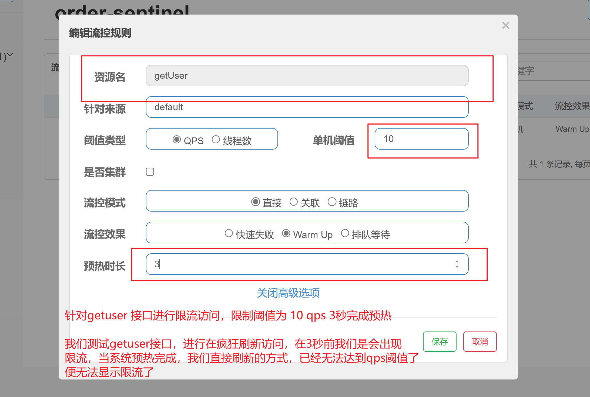
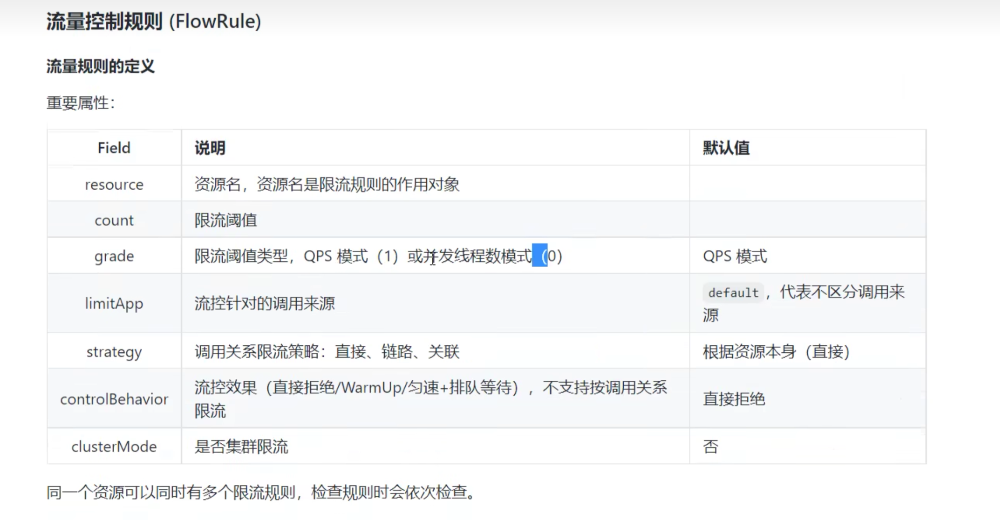

## springcloudalibaba整合sentinel

### 整合

1：引入依赖

```xml
    <dependency>
            <groupId>com.alibaba.cloud</groupId>
            <artifactId>spring-cloud-starter-alibaba-sentinel</artifactId>
        </dependency>
```

2：在application配置文件中进行配置

```yaml
server:
  port: 8010
spring:
  application:
    name: order-sentinel
  cloud:
    #往sentinel服务端注册
    sentinel:
      transport:
        dashboard: 127.0.0.1:8858
    #往nacos服务端注册
    nacos:
      server-addr: 127.0.0.1:8848
```


## 控制台操作


## 限流

#### QPS限流

**流控规则**

 流量控制（flow control），其原理是监控应用流量的 QPS 或并发修线程等指数，当达到指定的阈值时对流量进行控制，以避免瞬时的流量高峰冲垮，从而保障应用的高可用、==== FlowRule RT  （响应时间） 1/02s= 5


同一个资源可以创建多条限流规则。FlowSlot 会对该资源的所有限流规则依次遍历，直到有规则触发限流或者所有规则遍 历完毕。一条限流规则主要由下面几个因素组成，我们可以组合这些元素来实现不同的限流效果。


|      Field      | 说明                                                         | 默认值                        |
| :-------------: | :----------------------------------------------------------- | :---------------------------- |
|    resource     | 资源名，资源名是限流规则的作用对象                           |                               |
|      count      | 限流阈值                                                     |                               |
|      grade      | 限流阈值类型，QPS 或线程数模式                               | QPS 模式                      |
|    limitApp     | 流控针对的调用来源                                           | `default`，代表不区分调用来源 |
|    strategy     | 调用关系限流策略：直接、链路、关联                           | 根据资源本身（直接）          |
| controlBehavior | 流控效果（直接拒绝 / 排队等待 / 慢启动模式），不支持按调用关系限流 | 直接拒绝                      |


**使用了@sentinelRespirce注解后 会生成一个新的资源，资源名为 sentinelRespirce注解的value属性 ，对这个新的资源设置限流，旧的资源设置是无效的**


#### 并发限流

并发数控制用于保护业务线程池不被慢调用耗尽。例如，当应用所依赖的下游应用由于某种原因导致服务不稳定、响应 延迟增加，对于调用者来说，意味着吞吐量下降和更多的线程数占用，极端情况下甚至导致线程池耗尽。为应对太多线 程占用的情况，业内有使用隔离的方案，比如通过不同业务逻辑使用不同线程池来隔离业务自身之间的资源争抢（线程 池隔离）。这种隔离方案虽然隔离性比较好，但是代价就是线程数目太多，线程上下文切换的 overhead 比较大，特别是 对低延时的调用有比较大的影响。**Sentinel 并发控制不负责创建和管理线程池，而是简单统计当前请求上下文的线程数目 （正在执行的调用数目），如果超出阈值，新的请求会被立即拒绝，效果类似于信号量隔离。并发数控制通常在调用端 进行配置。**


**线程数的流控 和 qps 的流控 有什么区别**


### sentinel全局处理异常

1：返回结果类

```java
@Data
@AllArgsConstructor
public class Result <T>{
    private Integer code;
    private String message;
    private T  data;

    public Result(Integer code, String message) {
        this.code = code;
        this.message = message;
    }

    public static Result error(Integer code , String message){
       return new Result(code,message);
    }

}

```

2：结果处理类

```java
@Slf4j
@Component
public class MyBlockExceptionHandler implements BlockExceptionHandler {
    @Override
    public void handle(HttpServletRequest httpServletRequest, HttpServletResponse httpServletResponse, BlockException e) throws Exception {
        log.info("BlockExceptionHandler BlockException================"+e.getRule());
            Result r = null;
            if (e instanceof FlowException) {
              r = Result.error(100,"接口限流了");

             } else if (e instanceof DegradeException) {
              r = Result.error(101,"服务降级了");

             } else if (e instanceof ParamFlowException) {
              r = Result.error(102,"热点参数限流了");

             } else if (e instanceof SystemBlockException) {
              r = Result.error(103,"触发系统保护规则了");

             } else if (e instanceof AuthorityException) {
              r = Result.error(104,"授权规则不通过");
             }

             //返回json数据
        httpServletResponse.setStatus(500);
        httpServletResponse.setCharacterEncoding("utf8");
        httpServletResponse.setContentType(MediaType.APPLICATION_JSON_VALUE);
        new ObjectMapper().writeValue(httpServletResponse.getWriter(), r);

             }
}
```

3： 接口

```java
    @GetMapping("/hello")
    public String hello ( ) throws InterruptedException {
        Thread.sleep(2000);
        return "hello";
    }
```

4：设置限流


5: 访问结果


### 流控模式

**基于调用关系的流量控制，调用关系包括调用方，被调用方； 一个方法可能会调用其它方法，形成一个调用链路的层次关系**

#### 直接

资源调用达到设置的阈值后直接被限流抛出异常


#### 关联

当两个资源之间具有资源争抢或依赖关系的时候，这个两个资源便有了关联关系，比如对数据库同一个字段的读操作和写操作存在争抢，度的速度过高会影响写的速度，写的速度过高会影响读的速度。

如果放入读写操作争抢资源，则抢本身带来的开销会降低整体的吞吐量。 可使用关联限流来避免具有关联关系的资源之间过度争抢。

举例说： read_db 和 write_db 这两个资源分别代表数据库的读写，如果我们给read_db 设置限流规则来达到写优先级目录，设置strategy为RuleConstant,STRATEGY_RELATE同时设置refRsource为weite_db。这样当写库过于频繁时，读数据的请求会被限流


#### 链路

下面中记录了资源之间的调用链路，这些资源通过调用关系，相互之间构成一棵调用树。这棵树的根节点是一个名字为 getUser 的虚拟节点，调用链的入口都是这个虚节点的子节点。 一棵典型的调用树如下图所示


上图中来自入孔 /order/test1 和 /order/test2 的请求都调用了getuser ,

sentinel 运训只根据某个入口的统计信息对资源限流


**测试会发现链路规则不生效**

**注意，高版本此功能直接使用不生效，如何解决？**

从1.6.3 版本开始，Sentinel Web filter默认收敛所有URL的入口context，因此链路限流不生效。 1.7.0 版本开始（对应SCA的2.1.1.RELEASE)，官方在CommonFilter 引入了 WEB_CONTEXT_UNIFY 参数，用于控制是否收敛context。将其配置为 false 即可根据不同的URL 进行链路限流。 SCA 2.1.1.RELEASE之后的版本,可以通过配置spring.cloud.sentinel.web-context-unify=false即可关闭收敛

```properties
spring.cloud.sentinel.web‐context‐unify: false
```

**测试，此场景拦截不到BlockException，对应@SentinelResource指定的资源必须在@SentinelResource注解中指定 blockHandler处理BlockException**

总结： 为了解决链路规则引入ComonFilter的方式，除了此处问题，还会导致更多的问题，不建议使用ComonFilter的方式。 流控链路模 式的问题等待官方后续修复，或者使用AHAS


### 流控效果


#### **快速失败**

（Rule COnstant, CONTROL_BEHAVIOR） 方式是默认流量控制方式 **当QPS超过任意规则的阈值后，新的请求会被立刻拒绝，拒绝的方式是抛出 FloException** 这种方式使用用于系统处理确切已知的情况下，比如通过压测确定了系统的准确水平时


#### Warm Up （激增流量）

Warm Up （RuleConstant.CONTROL_BEHVIOR_WARM_UP） 方式，即预热/ 冷启动方式，当系统长期处于低水位的情况下，当流量突然增加时，直接把系统拉升到高水位可能瞬间把系统压垮，通过 "冷启动" 让通过的流量缓慢增加，在一定时间内，增加到阈值的上线，给冷系统一个预热的时间，避免冷系统被压垮

**冷加载因子，cideFactor 默认是3.即请求QPS threshold/3 经预热时长 渐渐设置的QPS值**




```java
/*
创建test接口，进行100次getser接口访问，每一次访问间隔0.1秒，10秒打完全部
getuser 接口对于突发的接口限流为 1s10 qps 正常直接拒绝的话是，不会出现限流的情况的
我们进行预热接口，在前三秒会出现接口限流，等到3秒以后系统预热完成，就不会出现限流了
*/ 
@RequestMapping("test2")
    public String test2(){
        for (int i = 0; i < 100; i++) {
            System.out.println(userService.user());
            try {
                Thread.sleep(100);
            } catch (InterruptedException e) {
                throw new RuntimeException(e);
            }
        }
       return "看后台";
    }

```

**结果**

```
user
user
user
user
user
user 接口限流的
user 接口限流的
user 接口限流的
user 接口限流的
user
user
user
user
user 接口限流的
user
user
user 接口限流的
user 接口限流的
user 接口限流的
user
user
user
user
user 接口限流的
user
user
user
user
user
user
// 3s 预热完成
user
user
user
user 接口限流的
user
user
user
user
user
user
user
user
user
user
user
user
user
user
user
user
user
user
user
user
user
user
user
user
user
user
user
user
user
user
user
user
user
user
user
user
user
user
user
user
user
user
user
user
user
user
user
user
user
user
user
user
user
user
user
user
user
user
user
user
user
user
user
user
user
user

```


#### 排队等待

**匀速排队 （脉冲流量）**

匀速排队（RuleConstant.CONIROL_BEHAVIOR_RATE_LIMTER）的方式严格控制请求通过时间，也即是让请求以均匀的速度通过，对应的是漏桶算法\


**注意，匀速拍段模式展示不支持QPS》1000 的场景**


## 熔断

除了流量控制以为，对调用链路中不稳定的资源进行熔断降级也是保障的高可用的重要措施之一，我们需要对不稳定的**弱依赖服务调用**进行熔断降级，暂时切断不稳定调用，避免局部不稳定因素导致整体的雪崩，熔断降级作为保护自身的手段，通常在客户端，（调用端进行设置）


**熔断降级规则说明**

熔断降级规则 （DegraeRule）包含以下几个属性

|                    |                                                              |            |
| :----------------: | :----------------------------------------------------------- | :--------- |
|       Field        | 说明                                                         | 默认值     |
|      resource      | 资源名，即规则的作用对象                                     |            |
|       grade        | 熔断策略，支持慢调用比例/异常比例/异常数策略                 | 慢调用比例 |
|       count        | 慢调用比例模式下为慢调用临界 RT（超出该值计为慢调用）；异常比例/异常数模式下为对应的阈值 |            |
|     timeWindow     | 熔断时长，单位为 s                                           |            |
|  minRequestAmount  | 熔断触发的最小请求数，请求数小于该值时即使异常比率超出阈值也不会熔断（1.7.0 引入） | 5          |
|   statIntervalMs   | 统计时长（单位为 ms），如 60*1000 代表分钟级（1.8.0 引入）   | 1000 ms    |
| slowRatioThreshold | 慢调用比例阈值，仅慢调用比例模式有效（1.8.0 引入）           |            |

 

### 慢调用比例规则

慢调用比例规则（SLOW_REQUST_RATIO） ： **选择以慢调用比列作为阈值，需要允许的慢调用RT（即最大的响应时间）， 请求的响应时间大于该值则统计为慢调用，单位统计时长（staInterva 1MS） 内请求数目大于设置的最小请求数目，并且慢调用的比例大于阈值** 则接下来的熔断时长内请求会被自动熔断，经过熔断时长后熔断器会进入探测恢复状态（HALF——OPNE 状态），若接下来第一个请求响应时间小于面调用RT则结束熔断，如大于慢调用RT则再次熔断


#### 

### 异常比例规则


### 异常数规则


## Sentinel整合openFeign进行降级


 **1: 导入依赖**

```xml
    <dependencies>
        <dependency>
            <groupId>com.alibaba.cloud</groupId>
            <artifactId>spring-cloud-starter-alibaba-nacos-discovery</artifactId>
        </dependency>
<!--        openfeign 依赖-->
        <dependency>
            <groupId>org.springframework.cloud</groupId>
            <artifactId>spring-cloud-starter-openfeign</artifactId>
        </dependency>
<!--        sentinel 依赖-->
        <dependency>
            <groupId>com.alibaba.cloud</groupId>
            <artifactId>spring-cloud-starter-alibaba-sentinel</artifactId>
        </dependency>

```

**2：服务接口**

```java
@RestController
@RequestMapping("/stock")
public class StockController {
    @GetMapping("/helloword")
    public String hellWord(){
        int i = 1/0;
        return "stock -- hellword";
    }
}

```

**3：openFiegn服务编写**

openFeign服务提供的stock的服务接口

```java
@Component
@FeignClient(value = "stock-service",path = "/stock")
public interface StockServiceFeign {
    @GetMapping("/helloword")
     String hellWord();
}
```

stockFeign服务接口的实现类

```java
@Component
public class StockServiceFeignImpl implements StockServiceFeign{
    @Override
    public String hellWord() {
        return "降级了";
    }
}

```

**4 ：在application中开启openFeign对Sentinel的整合**

```yaml
server:
	#启动端口
  port: 8010
spring:
  application:
  #服务名称
    name: order-sentinel
  cloud:
    #往sentinel服务端注册
    sentinel:
      transport:
        dashboard: 127.0.0.1:8858
      web-context-unify: false
    #往nacos服务端注册
    nacos:
      server-addr: 127.0.0.1:8848
feign:
  sentinel:
    #openfeign整合sentinel
    enabled: true
```

**5：在接口上指定服务降级的实现类**

```java
@Component
@FeignClient(value = "stock-service",path = "/stock",fallback = StockServiceFeignImpl.class) 
// fallback = StockServiceFeignImpl.class 实现降级
public interface StockServiceFeign {
    @GetMapping("/helloword")
     String hellWord();
}
```


## 热点参数限流

 何为热点？ 热点即经常访问的数据。很多时候我们希望统计某个热点数据中访问频次最高的数据，并对其进行访问限制，比如


**热点参数限流会统计传入参数中的热带参数，并根据配置的限流阈值与模式，对包括含热点参数的资源调用进行限流** 。 热点参数可用做做是一种特殊的流量控制，仅对包含热点参数的资源调用生效

```java
 /**
    热点参数依赖与注解实现
     */
    @RequestMapping("/get/{id}")
    @SentinelResource(value = "getById",blockHandler ="getByIdBlockHandler" )
    public String getById(@PathVariable("id") String id){
        System.out.println("正常访问");
        return "正常访问";
    }

    public String getByIdBlockHandler(String id , BlockException blockException){
        return "热点异常处理";
    }
```


**单机阈值**  

1. 假设，参数大部分值都是热点参数，那单机阈值就主要针对热点参数进行流控，后续额外针对普通参数值进行流控
2. 假设大部分值是普通流量，那单机阈值就主要针对普通参数进行流控，后续额外针对热点参数进行流控

**配置热点参数规则**

**注意 ** 资源名必须是@SentinelResource（value='资源名'）中配置的资源吗，热点规则则依赖于注解


当我们新增完成，去找到这条规则，进行编辑


## 系统保护规则


Sentinel 系统自适应限流从整体维度对应用入口流量进行控制，结合应用Load，CPU使用率。总体平均RT，入口QPS和并发线程数等几个维度的监控指标，通过自适应的流控策略，让系统入口流量和系统的负载达到一个平衡，让系统尽可能跑在最大吞吐量同时保证系统整体的稳定性

- **Load 自适应**  （仅对Linux / Unix-like 集群生效）; 系统的Load1 作为启发指标，进行自适应系统保护，当Load1 超过设置的启发值，且系统当前的并发线程数超过系统容量时才会触发系统保护（ BBR 阶段），系统容量由系统的 maxQPS minRT 估算得知。设定参考值一般是 CPU cores * 2.5
- **CPU usage (1.5 + 版本)** 当系统CPU 使用率超过阈值即触发系统保护（取值返回 0-1） 比较灵敏
- **平均RT** 当机器上所有入孔流量的平均RT达到阈值即触发系统保护，但是是毫秒
- **并发线程数** 当单台机器上所有入口流量的并发线程数达到阈值即触发系统保护
- **入口QPS** 当单台机器上所有入口流量的QPS 达到阈值即触发系统保护


## Sentinel持久化模式

三种模式

| 推送模式 | 说明                                                         | 优化                     | 缺点                                                         |
| -------- | ------------------------------------------------------------ | ------------------------ | ------------------------------------------------------------ |
| 原始模式 | API将规则推送到客户端并直接更新到内存中，扩展写数据源（WeitableDataSource） | 简单，无任何依赖         | 不保证一致性，规则保存在内存中，重启即消失，严重不建议用于生产环境 |
| pull模式 | 拓展写数据源，客户端主动向某个规则管理中新定期轮询拉去规则，这个规则中心可以是 RDBMS 文件等 | 简单无依赖；规制持久化   | 不保证一致性，实时性不保证，拉去过于频繁也可能出现性能问题   |
| push模式 | 扩展读数据源 （ReadableDataSource）统一推送，客户端通过注册监听器的方式，时刻监听变化，比如使用nacos 等配置中心，这种方式有更好的实时性和一致性保证，生产环境下一般使用push模式 | 规制持久化；一致性；快速 | 引入第三方依赖                                               |


### 原始模式

如果不做任何修改，Dashboard的推送规则方式是通过API将规则推送到客户端并直接更新到内存中


这种做法的好处是简单，无依赖；坏处是应用重启规则就会消失，仅用于测试，不能用于生产环境


### 拉去模式

pull模式的数据源，（如本地文件，ROBMS等）一般是可写入的。使用时需要在客户端注册数据源;将对应的数据源注册到对应的RuleManger，将写数据源注册到transport的 WritableDataSource


### 推模式

生产环境一般使用的是push模式，对于push模式的数据源。如远程配置中心 (Zookeeper ， Noacos ， Apollo 等等) ，推送的操作不应由 Sentinel客户端进行操作，而应该经控制台统一进行管理，直接进行推送，数据源仅负责获取配置中心并更新到本地，因此推送规则正确的做法应该是 **配置中心控制台 / Snetinel 控制台 --》 配置中心 --> Sentinel 数据源 --》 Sentinel ** 而不是经过Sentinel 数据源推送至配置中心，这样的流程就非常清晰了





1：引入依赖

```xml
  <dependency>
            <groupId>com.alibaba.csp</groupId>
            <artifactId>sentinel-datasource-nacos</artifactId>
        </dependency>
```


2：创建配置文件，编写流控规则


3: 编写application 配置文件

#### yaml 配置文件

```yaml
server:
	#启动端口
  port: 8806

spring:
  application:
    name: sentinel-user-nacos-push  #微服务名称
  #配置nacos注册中心地址
  cloud:
    nacos:
      discovery:
        server-addr: 127.0.0.1:8848

    sentinel:
      transport:
        # 添加sentinel的控制台地址
        dashboard: 127.0.0.1:8080
        # 指定应用与Sentinel控制台交互的端口，应用本地会起一个该端口占用的HttpServer
        #port: 8719
	#sentinel配置拉去远程nacos中已经定义好的 限流规则
      datasource:
#        ds1:   #名称自定义，唯一
#          nacos:
#            server-addr: 127.0.0.1:8848    # nacos 地址 需要从nacos中拉去配置
#            dataId: ${spring.application.name}-flow-rules #配置的id名称
#            groupId: DEFAULT_GROUP #配置文件存在的分组
#            data-type: json   #配置文件的格式
#            rule-type: flow   # 是什么规则 flow = 流控
        flow-rules:
          nacos:
            server-addr: 127.0.0.1:8848
            dataId: ${spring.application.name}-flow-rules
            groupId: DEFAULT_GROUP   # 注意groupId对应Sentinel Dashboard中的定义
            data-type: json
            rule-type: flow #流控规则
        degrade-rules:
          nacos:
            server-addr: 127.0.0.1:8848
            dataId: ${spring.application.name}-degrade-rules
            groupId: DEFAULT_GROUP
            data-type: json
            rule-type: degrade # 熔断规则
        param-flow-rules:
          nacos:
            server-addr: 127.0.0.1:8848
            dataId: ${spring.application.name}-param-flow-rules
            groupId: DEFAULT_GROUP
            data-type: json
            rule-type: param-flow # 热点参数限流规则
        authority-rules:
          nacos:
            server-addr: 127.0.0.1:8848
            dataId: ${spring.application.name}-authority-rules
            groupId: DEFAULT_GROUP
            data-type: json
            rule-type: authority
        system-rules:
          nacos:
            server-addr: 127.0.0.1:8848
            dataId: ${spring.application.name}-system-rules
            groupId: DEFAULT_GROUP
            data-type: json
            rule-type: system #系统保护规则

  main:
    allow-bean-definition-overriding: true

#暴露actuator端点   http://localhost:8800/actuator/sentinel
management:
  endpoints:
    web:
      exposure:
        include: '*'


#feign:
#  sentinel:
#    enabled: true   #开启sentinel对feign的支持 默认false


```


#### 流控规则json

```json
[
  {
    // 资源名
    "resource": "/test",
    // 针对来源，若为 default 则不区分调用来源
    "limitApp": "default",
    // 限流阈值类型(1:QPS;0:并发线程数）
    "grade": 1,
    // 阈值
    "count": 1,
    // 是否是集群模式
    "clusterMode": false,
    // 流控效果(0:快速失败;1:Warm Up(预热模式);2:排队等待)
    "controlBehavior": 0,
    // 流控模式(0:直接；1:关联;2:链路)
    "strategy": 0,
    // 预热时间（秒，预热模式需要此参数）
    "warmUpPeriodSec": 10,
    // 超时时间（排队等待模式需要此参数）
    "maxQueueingTimeMs": 500,
    // 关联资源、入口资源(关联、链路模式)
    "refResource": "rrr"
  }
]

```

#### 降级规则json

```json
[
  {
  	// 资源名
    "resource": "/test1",
    "limitApp": "default",
    // 熔断策略（0:慢调用比例，1:异常比率，2:异常计数）
    "grade": 0,
    // 最大RT、比例阈值、异常数
    "count": 200,
    // 慢调用比例阈值，仅慢调用比例模式有效（1.8.0 引入）
    "slowRatioThreshold": 0.2,
    // 最小请求数
    "minRequestAmount": 5,
    // 当单位统计时长(类中默认1000)
    "statIntervalMs": 1000,
    // 熔断时长
    "timeWindow": 10
  }
]

```

#### 热点规则json

```json
[
  {
  	// 资源名
    "resource": "/test1",
    // 限流模式（QPS 模式，不可更改）
    "grade": 1,
    // 参数索引
    "paramIdx": 0,
    // 单机阈值
    "count": 13,
    // 统计窗口时长
    "durationInSec": 6,
    // 是否集群 默认false
    "clusterMode": 默认false,
    // 
    "burstCount": 0,
    // 集群模式配置
    "clusterConfig": {
      // 
      "fallbackToLocalWhenFail": true,
   	  // 
      "flowId": 2,
      // 
      "sampleCount": 10,
      // 
      "thresholdType": 0,
      // 
      "windowIntervalMs": 1000
    },
    // 流控效果（支持快速失败和匀速排队模式）
    "controlBehavior": 0,
    // 针对来源，若为 default 则不区分调用来源
    "limitApp": "default",
    // 
    "maxQueueingTimeMs": 0,
    // 高级选项
    "paramFlowItemList": [
      {
      	// 参数类型
        "classType": "int",
      	// 限流阈值
        "count": 222,
      	// 参数值
        "object": "2"
      }
    ]
  }
]

```

#### 系统规则

```json
[
  {
  	// RT
    "avgRt": 1,
    // CPU 使用率
    "highestCpuUsage": -1,
    // LOAD
    "highestSystemLoad": -1,
    // 线程数
    "maxThread": -1,
    // 入口 QPS
    "qps": -1
  }
]

```

