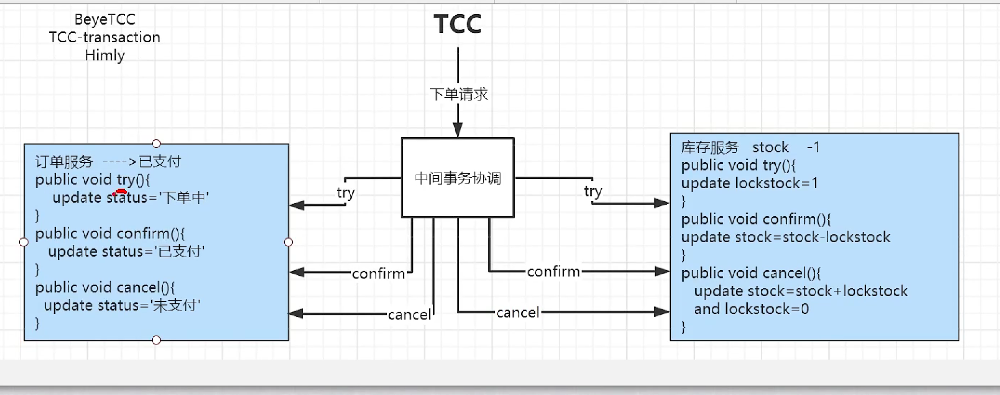
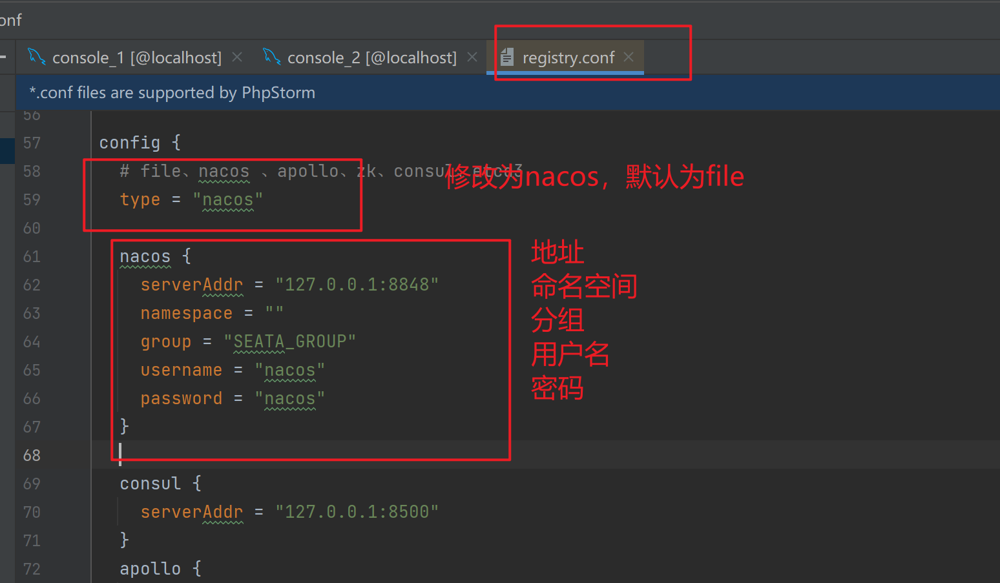

## 事务简介

### 事务的ACID

**1.1** **原子性（Atomicity）**

原子性是指事务是一个不可分割的工作单位，事务中的操作要么全部成功，要么全部失败。比如在同一个事务中的SQL语句，要么全部执行成功，要么全部执行失败

**一致性（Consistency）**

官网上事务一致性的概念是：事务必须使数据库从一个一致性状态变换到另外一个一致性状态。

换一种方式理解就是：事务按照预期生效，数据的状态是预期的状态。

举例说明：张三向李四转100元，转账前和转账后的数据是正确的状态，这就叫一致性，如果出现张三转出100元，李四账号没有增加100元这就出现了数据错误，就没有达到一致性。

**隔离性（Isolation）**

事务的隔离性是多个用户并发访问数据库时，数据库为每一个用户开启的事务，不能被其他事务的操作数据所干扰，多个并发事务之间要相互隔离。

**持久性（Durability）**

持久性是指一个事务一旦被提交，它对数据库中数据的改变就是永久性的，接下来即使数据库发生故障也不应该对其有任何影响。

例如我们在使用JDBC操作数据库时，在提交事务方法后，提示用户事务操作完成，当我们程序执行完成直到看到提示后，就可以认定事务以及正确提交，即使这时候数据库出现了问题，也必须要将我们的事务完全执行完成，否则就会造成我们看到提示事务处理完毕，但是数据库因为故障而没有执行事务的重大错误。


### 本地事务

**@Transational** 

大多数场景下，我们的应用都只需要操作单一的数据库，这种情况下的事务称为本地事务（Loacl Transaction） 本地事务的ACID特性是数据库直接支持的，本地事务应用架构如下所示


在JDBC编程中，我们通过java.sql.Connection 对象来开启，关闭或提交事务，

```java
Connection coonn == ... //获取数据库链接
conn.setAutoCommit(false) ; //开启事务
try{
    //...执行增加改sql
    commit(); //提交事务
}catch{
    conn.rollback(); //事务回滚
}final{
    conn.close(); //关闭链接
}
```


**分布式事务**

但我们的系统架构到达了微服务，操作不同的表，不同的数据库，不同的进程，本地的事务机制无法进行回滚的

例如： 一个用户下单了一个商品，我们需要，在订单服务生成订单数据，且要在支付服务生成 支付数据，无论那一个服务出现了异常，必须进行回滚，不然会出现支付数据和订单数据无法匹配，照成数据一致性问题


### 常见的分布式事务解决

1. seate 阿里分布式事务框架
2. 消息队列
3. sage
4. XA


他们有一个共同点，都是  **两阶段（2pc）** 两阶段是指完成整个分布式事务，划分成两个步骤完成。

实际上，这四种常见的分布式事务解决方案，分别对应着 **分布式事务的四种模式 ：  AT , TCC , Sage , XA** .

四种分布式事务模式，都有各自的理论基础，分别在不同的时间被提出; 每种模式都有它的适用场景，同样每个模式也都诞生有各自的代表产品； 而这些代表产品。可能是我们常见的（全局事务，基于可靠消息，最大努力通知，TCC）。


### 分布式事务理论基础

解决分布式事务，也有相关的规范和协议，分布式事务相关的协议有 2pc 3pc

由于 **三阶段提交协议 3pc **  非常男实现，目前市面上主流的分布式事务解决方案都是2pc协议，这就是文章开始提及的常见分布式解决方案里面，那些列举的都有一个共同点 **2阶段**  的内在原因

有些文章分析2PC ，几乎都会用TCC两阶段的例子，第一阶段的try，第二阶段完成confrim 或，cancel，其实2pc并不是专门为了实现TCC设计的，2PC具有普使性--协议一样的存在，目前绝大多数的分布式解决方案都是以2阶段提交协议2pc为基础的

TCC （Rry-Confirm-Cael）实际上是服务化两阶段协议


### 2pc两阶段提交协议

**2pc （两阶段提交，Two-Phase Commit）**

顾名思义，分为两个阶段， Prepare 和commit

**Prepare 预处理： 提交事务请求**

基本流程图


1. 询问 ， 协调者向所有参与者发送事务请求，询问是否可执行事务操作，然后等待各个参与者的响应
2. 执行，各个参与者收到协调者事务请求后，执行事务操作（例如更新一个关系性数据库的记录），并将 Undo 和 Redo 信息记录到日志中
3. 响应，如果参与者成功执行了事务并写入到Undo 和Redo信息，则向协调者返回yse信息，否则返No 响应 ，参与者也可能宕机，从而不会返回响应

**Commit 执行事务提交 **

执行事务提交分为两种情况，正常提交和回退

**正常提交事务**


1.  commit 请求 协调者向所有参与者 发送commit请求
2. 事务提交 参与者收到 Comiit 请求后，执行事务提交，提交完成后释放事务执行期占用的所有资源
3. 反馈结果，参与者事务提交后向协调者发送Ack响应
4. 完成事务。接送到所有参与者的ACK响应后，完成事务提交


**中断事务**

在执行 Prepare 步骤过程中，如果某些参与者执行事务失败，宕机于协调者之间的网络中断。那么协调者就无法接收到所有参与者的yes响应。或者某个参与者返回了No 响应。此时。协调者就会进入回退流程，对事务进行回退。流程图如下，红色部分（将 Commit 请求替换为红花的 Rollback 请求）


**2pc 的问题**

1. 同步阻塞。参与者在等待协调者的指令时，其实是在等待其他的参与者响应，在次过程中，参与者无法进行其他的操作，也就是阻塞了其运行，倘若参与者于协调者之间网络异常，导致参与者一致收不到协调者的信息，那么会导致参与者一致阻塞下去
2. 单点2pc中，一切请求都来自于协调者，所以协调者的地址至关重要。如果协调者宕机，那么就会使的参与者一并阻塞并一值占用事务资源，如果协调者也是分布式的，使用选主方式提供服务，那么在一个协调者挂掉后，可以选取另一个协调者继续后续服务，可以解决单点问题，但是，新协调者不知道上一个事务的全部状态信息，（列入已等待 Prepare 响应的时长等），所以无法顺利的处理上一个事务
3. 数据不一致 Commit  事务过程中Commit请求/Rollback 请求可能因为协调者宕机与参与者网络问题丢失，那么就导致了部分参与者没有收到Commit / Rollback 请求，参与者执行Commit / Rollback会向协调者发送Ack，然而协调者不论是否收到所有的参与者的Ack，该事务不会再有其他补偿了，协调者能做的就是等待超时后向参与者返回一个  **我不确定成功**
4. 环境可靠依赖 协调者Prepare 请求发出后，等待响应，然而如果有参与者与协调者之间的网络中端，都会导致协调者无法收到所有参与者的响应，那么2pc中，协调者会等待一定时间，然后超时后，会触发事务中断，在这个过程中，协调者和所有其他参与者都是出于阻塞的，这种机制对网路问题常见的现实环境来说太苛刻了
5. 


---


### AT 模式

auto transcation

at模式是一种无侵入式的分布式事务解决方案

阿里seate框架，实现了该模式

在AT模式下，用户只需要关注之间的业务sql，用户的业务 sql 作为第一阶段，Seate框架会自动生成事务的第二阶段提交和回滚的操作


**AT模式如何做到对业务的无侵入**

**一阶段**

在一阶段，Seate 会拦截“业务SQL”，首先解析SQL语义，找到“业务SQL”要跟新的业务数据，在业务数据被更新前，将其保存成 “before image” ，然后执行“ 业务SQL” 更行业务数据，在业务数据更新后，再将其保存称 “after image” ，最后生成行锁，以上操作全部再一个数据库事务内完成，这样保证了一阶段的操作的原子性

 


**二阶段提交**

二阶段提交的话，因为 '业务sql' 在一阶段已经提交至数据库，所有Seate框架只需将一阶段保存的快照数据和行锁删掉，完成数据清理接口


**二阶段回滚**

二阶段如果是回滚的话，Seate就需要回滚一阶段所执行的业务 “sql” ，还原业务数据、 回滚方式便是用 “before image” 还原业务数据；但在还原前要首先校验脏写，比对“数据库当前业务数据” 和 “alter image” ，如果两份数据完全一致说明没有脏写，可以还原业务数据，如果不一致就说明出现脏写，出现脏写就需要转人工处理了


AT模式的第一阶段，第二阶段提交和回滚由Seate自动生成，用户只需要编写 "业务SQL" ，便能轻松接入分布式事务，AT模式是一种对业务无


---


### TCC模式

1:侵入式比较强，并且得自己实现相关的事务控制逻辑

2：在整个过程基本没有锁，性能更强


TCC模式需要用户自己的业务场景是实现  try ， confirm 和 Cancel 三个操作，事务发起方在第一阶段执行try 方式，第二阶段执行 Confirm 方法，二阶段回滚需要执行 Cancel 方法





### 消息队列


---


## seate 开始

#### 什么是Seate

seate 是一款开源的分布式事务解决方案，致力于提供高性能和简单的分布式事务服务，Seata 将为用户提供了 AT ，TCC ，SAGA 和XA 事务模式，为用提供一站式的分布式解决方案，AT模式是阿里首推的模式，阿里云上有商用的GTS （Global Transaction Service 全局事务服务）

官网：https://seata.io/zh-cn/index.html 

源码: https://github.com/seata/seata 

官方Demo: https://github.com/seata/seata-samples 

seata版本：v1.4.0


### Seate 的三大角色

在Seate 的价格 ，一共有三个角色

**TC （Transaction Coordinator） 事务协助者**

维护全局和分布事务的状态，驱动全局事务提交或回滚

**TM （Transaction Manager） 事务管理器**

定义全局事务的范围，开始全局事务，提交或回滚全局事务

**RM （Resource Manager ） 资源管理器**

管理分支事务处理的资源，与TC交谈以注册分支事务和报告分支事务的状态，并驱动分支事务提交或回滚

**TC 为单独部部署的 Server 服务端 ，TM 和 RM 为嵌入到应用的Client 端**


在Seate中，一个分布式事务的生命周期如下


1. TM 请求 TC 开启一个全局事务，TC会生成一个XID作为该全局事务的编号。 XID，会在微服务的调用链路中传播，保证将多个微服务的子事务关联在一起
2. RM 请求将本地事务注册为全局事务的分支事务，通过全局事务xid进行关联
3. TM请求TC告诉XID对应的全局事务是进行提交还是回滚
4. TC驱动RM们将XID对应的自己本地事务进行提交还是回滚

## 部署seata 

### 部署服务端


**1: 下载seata 服务端**

[seata官方使用文档](https://seata.io/zh-cn/docs/ops/deploy-guide-beginner.html)

[seata服务端下载地址](https://github.com/seata/seata/releases)


**2： 修改seata 服务端的配置文件**


**注意 seata服务端 的数据库需要 >= 5.7 版本**


**3:将服务端的数据库连接 设置完成后，需要将连接的数据源，进行 建表**

下载脚本资源

[脚本资源](https://github.com/seata/seata/tree/1.3.0/script)


**4: 给seata配置注册中心**

将Seata Server 注册到nacos ，修改conf目录下的 registry.conf


**5:修改配置中心 在   registry.conf文件中**




**6:修改Seata的总配置**

去到脚本资源下载

[脚本资源](https://github.com/seata/seata/tree/1.3.0/script)


**7 将 seata 总配置文件注册到 nacos**

[脚本资源](https://github.com/seata/seata/tree/1.3.0/script)


**注意 在windows 中是 无法直接执行 .sh 文件的 需要下载一个git  在git窗口执行**

```
sh ./nacos-config.sh
```


**启动 sh 脚本参数**

```java
1 sh ${SEATAPATH}/script/config‐center/nacos/nacos‐config.sh ‐h localhost ‐p 8848 ‐g SEATA_GROUP ‐t 5a3c7d6c‐f497‐
4d68‐a71a‐2e5e3340b3ca

```

参数说明：

 -h: host，默认值 localhost

 -p: port，默认值 8848 

-g: 配置分组，默认值为 'SEATA_GROUP'

-t: 租户信息，对应 Nacos 的命名空间ID字段, 默认值为空 '


**8： 启动seata service**

```
码启动: 执行server模块下io.seata.server.Server.java的main方法
令启动: bin/seata-server.sh -h 127.0.0.1 -p 8091 -m db -n 1 -e test
```


### 客户端搭建

**1： 导入依赖**

```xml
 <dependency>
            <groupId>com.alibaba.cloud</groupId>
            <artifactId>spring-cloud-starter-alibaba-seata</artifactId>
        </dependency>
```

**2：修改application.yml 文件**

```yaml
server:
  port: 9002
spring:
  datasource:
    driver-class-name: com.mysql.cj.jdbc.Driver
    url: jdbc:mysql://localhost:3306/seata_stock?serverTimezone=UTC
    username: root
    password: 123456
  cloud:
    alibaba:
      seata:
        tx-service-group: guangzhou 	# 设置seata分组和 contxt中的分组一致
    nacos:
    
      server-addr: 127.0.0.1:8848 # 将客户端服务stack服务注册到nacos
  application:
    name: stock-service #服务名称

seata:
  registry:     #配置seata 注册中心 。
    type: nacos #设置配置中心类型
    nacos:  
      server-addr: 127.0.0.1:8848 #注册中心地址
      application: seata-server # seata服务端的名称
      username: nacos #用户名
      password: nacos # 密码 
      group: SEATA_GROUP #分组，和  registry + config 中的分组名要一致
  config: #设置配置中心
    type: nacos # 配置中为nocas
    nacos: 
      server-addr: 127.0.0.1:8848  #配置中心地址
      username: nacos  #用户名
      password: nacos #密码
      group: SEATA_GROUP #分组
  #seata的配置中心 ，可以读取 seata client 的一些配置

```


**代码示例**

```java
@RestController
@RequestMapping("/order")

public class OrderController {
    @Autowired
    private OrderService orderService;

    @Autowired
    private OrderMapper orderMapper;

    //接口。调用服务层
    @RequestMapping("/insert")
    public String insert (Order order){
        Integer insert = orderService.insert(order);
        return insert.toString();
    }
```

```java

//服务层实现

    @GlobalTransactional // 开启分布式事务
    @Override
    public Integer insert(Order order) {
        //向stock 服务插入数据
        String insert = stockServiceFeign.insert(new Stock(null,"30"));
        //执行报错
        int i =1/0;
        //不执行
        orderMapper.insert(order);
        return Integer.valueOf(insert);
    }
```

**结果**

```
如果是本地事务的话，stock服务的数据是已经插入完成，无法进行回滚
开启了分布式事务，回滚成功，查询数据库，stock和order数据库都为空，事务回滚成功
```

