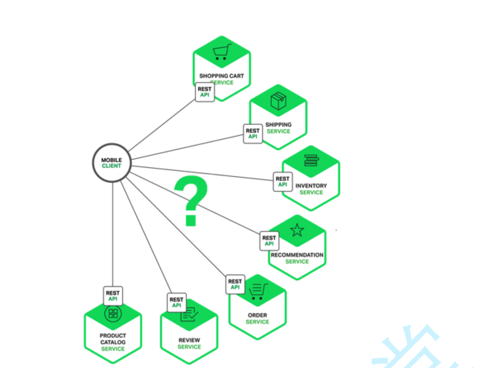
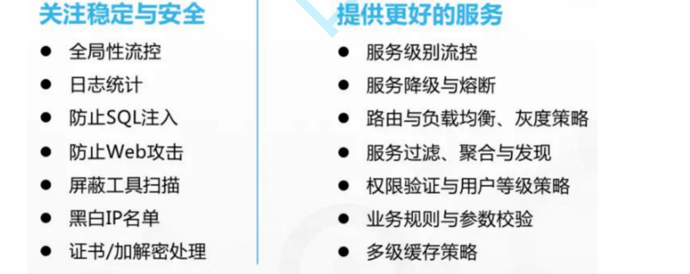
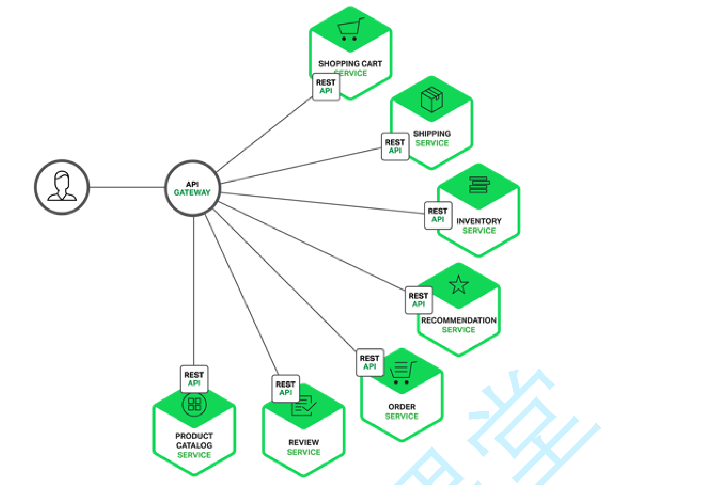

## GetWay网关

### 为什么需要网关

**这样的架构，会存在着诸多的问题：** 

- 每个业务都会需要鉴权、限流、权限校验、跨域等逻辑，如果每个业务都各自为战，自己造轮子实现一遍，会 很蛋疼，完全可以抽出来，放到一个统一的地方去做。
-  如果业务量比较简单的话，这种方式前期不会有什么问题，但随着业务越来越复杂，比如淘宝、亚马逊打开一 个页面可能会涉及到数百个微服务协同工作，**如果每一个微服务都分配一个域名的话，一方面客户端代码会很难维 护，涉及到数百个域名，另一方面是连接数的瓶颈，**想象一下你打开一个APP，通过抓包发现涉及到了数百个远程 调用，这在移动端下会显得非常低效。
-  后期如果需要对微服务进行重构的话，也会变的非常麻烦，需要客户端配合你一起进行改造，比如商品服务， 随着业务变的越来越复杂，**后期需要进行拆分成多个微服务，这个时候对外提供的服务也需要拆分成多个**，同时需 要客户端配合你进行改造，非常蛋疼。

**上面的这些问题可以借助API网关来解决。**

**所谓的API网关**，就是指系统的统一入口，它封装了应用程序的内部结构，为客户端提供统一服务，一些与业务本身功能无关的公共逻辑 可以在这里实现，诸如认证、鉴权、监控、路由转发等等。

添加上API网关之后，系统的架构图变成了如下所示：

### 什么Spring Cloud GetWay

网关作为流量的入口，常用的功能包括路由转发，权限校验，限流等。

Spring Cloud Gateway 是Spring Cloud官方推出的第二代网关框架，定位于取代 Netflix Zuul1.0。相比 Zuul 来说，Spring Cloud Gateway 提供更优秀的性能，更强大的有功能。

Spring Cloud Gateway 是由 WebFlux + Netty + Reactor 实现的响应式的 API 网关**。它不能在传统的 servlet 容器中工作，也不能构 建成 war 包。**

Spring Cloud Gateway 旨在为微服务架构提供一种简单且有效的 API 路由的管理方式，并基于 Filter 的方式提供网关的基本功能，例如 说安全认证、监控、限流等等。

**其他的网关组件：**

在SpringCloud微服务体系中，有个**很重要的组件就是网关**，在1.x版本中都是采用的Zuul网关；但在2.x版本中，zuul的 升级一直跳票，**SpringCloud最后自己研发了一个网关替代Zuul**，那就是**SpringCloud Gateway** 网上很多地方都说Zuul是阻塞的，Gateway是非阻塞的，这么说是不严谨的，准确的讲Zuul1.x是阻塞的，而在2.x的版本中，Zuul也是基 于Netty，也是非阻塞的，如果一定要说性能，其实这个真没多大差距。

而官方出过一个测试项目，创建了一个benchmark的测试项目：spring-cloud-gateway-bench，其中对比了：