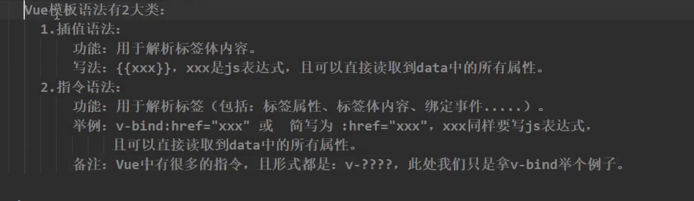
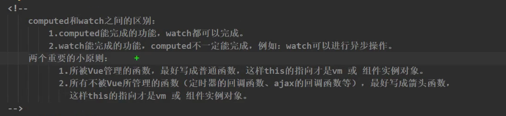

## 初始vue

### 分析hello案例

```html
<!DOCTYPE html>
<html lang="en">

<head>
    <meta charset="UTF-8">
    <meta http-equiv="X-UA-Compatible" content="IE=edge">
    <meta name="viewport" content="width=device-width, initial-scale=1.0">
    <title>Document</title>
</head>

<body>
    <h1 id="root">{{name}}</h1>
</body>

</html>
<script src="../vue.js"></script>
<script>
    new Vue({
        el: "#root",
        data: {
            name: "黄伟"
        }
    })
</script>
```


### 分析vue和模板对应关系

#### 1：（1）容器  -- 模板（n）


```powershell
中vue中一个实例只能接管一个模板 
如vue实例的选择器选中了两个模板 那么vue会解析第一个而不会解析第二个模板
这样子写并不会报错
```


#### 2：（n）容器  -- 模板（1）


**报错信息**


**总结**

```powershell
在vue中，所有模板和容器时一一对应的，无法实现 1对多 or 多对1 的关系
```


### 插值语法读取表达式


```powershell
vue中的插值语法，不知是能读取data属性中的数据，还可以写入表达式。
表达式的定义，就是有返回值
比如：
int a  =10 ;
{{a}} 在这里表达式里面是读取a的值 a的返回值是 10
```

 **总结**


----

## 模板语法

-  插值语法
- 指令语法

### v-bin


```powershell
指令语法和插值语法的各种用途

```

**总结**




---


## 数据绑定

```html

<body>

    <div id="root">
        <!-- 单项数据绑定 -->
        <input type="text" :value="name">
        <br>
        <!-- 双向数据绑定 -->
        <input type="text" v-model:value="name">
        <!-- 如下代码是错误的，v-model只能应用在表单元素上 -->
        <h1 v-model:x="name"></h1>
    </div>
</body>
<script src="../vue.js"></script>
<script>
    new Vue({
        el: "#root",
        data() {
            return {
                name: '张三'
            }
        },
    })
</script>
```

**错误信息**


**总结**


```powershell
v-model只能应用于表单类元素，因为，如果不是表达类元素，你都无法进行值得改变！！！
表单类的元素都有value
v-model的普通写法       <input type="text" v-model:value="name">
v-model的简写			<input type="text" v-model="name">

```


---

## el和data的两种写法


----

## mvvm模型

虽然没有完全遵循 [MVVM 模型](https://zh.wikipedia.org/wiki/MVVM)，但是 Vue 的设计也受到了它的启发。因此在文档中经常会使用 `vm` (ViewModel 的缩写) 这个变量名表示 Vue 实例。


---

## 事件处理

### 

### mothods中this指向


### 函数传参

#### 不传递参数时

##### 

#### 传递一个参数丢失event 


### 在data中写函数


**总结**


### **事件修饰符号**


#### 阻止默认事件行为  .prevent


#### 阻止事件冒泡.stop


#### once 单词事件触发


---


## 键盘事件


## 计算属性

### 姓名案例 -- 插值语法

```html
<!DOCTYPE html>
<html lang="en">

<head>
    <meta charset="UTF-8">
    <meta http-equiv="X-UA-Compatible" content="IE=edge">
    <meta name="viewport" content="width=device-width, initial-scale=1.0">
    <title>Document</title>
</head>

<body>
    <div id="root">
        姓 <input type="text" v-model="firstName"><br>
         名 <input type="text" v-model="lastName">

        <div>{{firstName}}-{{lastName}}</div>
        
    </div>
</body>
<script src="../vue.js"></script>
<script>
    new Vue({
        el: "#root",
        data() {
            return {
                firstName: "",
                lastName: ""

            }
        },
    })
</script>

</html>
```


### 姓名案例--函数语法

```html
<!DOCTYPE html>
<html lang="en">

<head>
    <meta charset="UTF-8">
    <meta http-equiv="X-UA-Compatible" content="IE=edge">
    <meta name="viewport" content="width=device-width, initial-scale=1.0">
    <title>Document</title>
</head>

<body>
    <div id="root">
        姓 <input type="text" v-model="firstName"><br> 名 <input type="text" v-model="lastName">
        <div>{{fullName()}}
            <div>
            </div>
</body>
<script src="../vue.js"></script>
<script>
    new Vue({
        el: "#root",
        data() {
            return {
                firstName: "1",
                lastName: ""

            }
        },
        methods: {
            fullName() {
                return this.firstName + this.lastName;
            }
        },
    })
</script>

</html>
```


### 姓名案例--计算属性

```html
<!DOCTYPE html>
<html lang="en">

<head>
    <meta charset="UTF-8">
    <meta http-equiv="X-UA-Compatible" content="IE=edge">
    <meta name="viewport" content="width=device-width, initial-scale=1.0">
    <title>Document</title>
</head>

<body>
    <div id="root">
        姓 <input type="text" v-model="firstName"><br> 名 <input type="text" v-model="lastName">
        <div>
            {{fullName }}<br> {{fullName }}<br> {{fullName }}<br> {{fullName }}<br>
            <div>
            </div>
</body>
<script src="../vue.js"></script>
<script>
    const vm = new Vue({
        el: "#root",
        data() {
            return {
                firstName: "",
                lastName: ""
            }
        },
        computed: {
            fullName() {
                return this.firstName + this.lastName;
            }
        }
    })
    console.log(vm);
</script>

</html>
```


```powershell
什么是属性？？？
#在vue中vue认为data：{}中的数据都属属性
```


### 计算属性的简写方式


---


## 监视数据

### 天气案例-计算属性+函数

```html
<!DOCTYPE html>
<html lang="en">

<head>
    <meta charset="UTF-8">
    <meta http-equiv="X-UA-Compatible" content="IE=edge">
    <meta name="viewport" content="width=device-width, initial-scale=1.0">
    <title>Document</title>
</head>

<body>
    <div id="root">
        姓 <input type="text" v-model="firstName"><br> 名 <input type="text" v-model="lastName">
        <div>{{fullName()}}
            <div>
            </div>
</body>
<script src="../vue.js"></script>
<script>
    new Vue({
        el: "#root",
        data() {
            return {
                firstName: "1",
                lastName: ""

            }
        },
        methods: {
            fullName() {
                return this.firstName + this.lastName;
            }
        },
    })
</script>

</html>
```


### 天气案例-监视属性

```html
<!DOCTYPE html>
<html lang="en">

<head>
    <meta charset="UTF-8">
    <meta http-equiv="X-UA-Compatible" content="IE=edge">
    <meta name="viewport" content="width=device-width, initial-scale=1.0">
    <title>Document</title>
</head>

<body>
    <div id="root">
        <h1>今天天气{{info}}</h1>
        <!-- <button @click="changeWeather">切换天气</button> -->
        <button @click="isHot=!isHot">切换天气</button>
    </div>
</body>
<script src="../vue.js"></script>
<script>
    const vm = new Vue({
            el: "#root",
            data() {
                return {
                    isHot: true
                }
            },
            computed: {
                info() {
                    return this.isHot ? "炎热" : "凉快"
                }
            },
            watch: {
                //监视 ishot属性
                isHot: {
                    immediate: true, //初始化时,让handler调用一下

                    //当ishot发生改变的时候触发
                    handler(newValue, oldValue) { //当ishot被修改后,会将修改前的值和修改后的值传递过来
                        console.log("ishot被改了");
                    }
                }
            }

        })
        
    //实现监视的第二种方法
    vm.$watch("isHot", {
        handler() {
            console.log("ishot被改了");
        }
    })
</script>

</html>
```

```powershell
#immediate:true 初始化容器调用一次
```


### 深度监视

```html
<!DOCTYPE html>
<html lang="en">

<head>
    <meta charset="UTF-8">
    <meta http-equiv="X-UA-Compatible" content="IE=edge">
    <meta name="viewport" content="width=device-width, initial-scale=1.0">
    <title>Document</title>
</head>

<body>
    <div id="root">
        {{student}} <br> {{student.a}} <br> {{student.b}} <br>
        <button @click="student.a++">点我a++</button><br>
        <button @click="student.b++">点我b++</button>
    </div>
</body>
<script src="../vue.js"></script>
<script>
    const vm = new Vue({
        el: "#root",
        data() {
            return {
                student: {
                    a: 1,
                    b: 2
                }
            }
        },
        watch: {
            //监视多级结构中,某个属性的变化
            'student.a': {
                handler() {
                    console.log("student.a监视成功");
                }
            },
            'student': {
                deep: true, //开启深度监视
                handler() {
                    console.log("student监视成功");
                }
            }
        }
    })
</script>
</html>
```


```powershell
vue默认是可以监测到对层级的数据改变的
但是提供给程序员使用的watch默认是不开启深度监视的
```


### 监视属性简写

```html
<!DOCTYPE html>
<html lang="en">

<head>
    <meta charset="UTF-8">
    <meta http-equiv="X-UA-Compatible" content="IE=edge">
    <meta name="viewport" content="width=device-width, initial-scale=1.0">
    <title>Document</title>
</head>

<body>
    <div id="root">
        <input type="text" v-model="student">
    </div>
</body>
<script src="../vue.js"></script>
<script>
    const vm = new Vue({
        el: "#root",
        data() {
            return {
                student: "黄伟"
            }
        },
        watch: {
            //简写
            student() {
                console.log("监视成功");
            }
        }
    })

    //简写
    vm.$watch('student', function() {
        console.log("监视成功");
    })
</script>

</html>
```


### 姓名案例-watch实现

```html
<!DOCTYPE html>
<html lang="en">

<head>
    <meta charset="UTF-8">
    <meta http-equiv="X-UA-Compatible" content="IE=edge">
    <meta name="viewport" content="width=device-width, initial-scale=1.0">
    <title>Document</title>
</head>

<body>
    <div id="root">
        姓 <input type="text" v-model="firstName"><br> 名 <input type="text" v-model="lastName">
        <div>
            {{fullName }}<br> {{fullName }}<br> {{fullName }}<br> {{fullName }}<br>
            <div>
            </div>
</body>
<script src="../vue.js"></script>
<script>
    const vm = new Vue({
        el: "#root",
        data() {
            return {
                firstName: "",
                lastName: "",
                fullName: ""
            }
        },
        watch: {
            firstName(newValue) {
                return this.fullName = newValue + this.lastName
            },
            lastName(newValue) {
                return this.fullName = newValue + this.lastName
            }
        }

    })
    console.log(vm);
</script>

</html>
```


### 监视属性--异步任务


**!!! 在watch开启的异步任务，请将函数写成箭头函数**




### 监视属性对比计算属性

```powershell
计算属性！
# 计算属性对比监视属性，优势在于，数据的修改是vue帮我们王城，
# 使用return直接将数据交给vue，vue完成数据修改，更新模板
# 因为是vue完成的数据修改，依靠的是return将数据交出去的，无法开启异步任务

监视属性！
# 监视属性对比计算属性，优势在可以开启异步任务
# 因为监视属性，修改数据是我们自己进行数据的修改，不是直接将数据交给vue进行修改的
# 但是监视属性比计算属性繁琐

当监视属性和计算属性都能完成的功能的时候，我们优先使用计算属性
```

