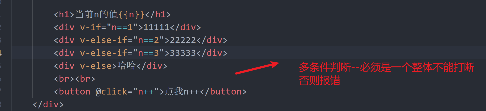
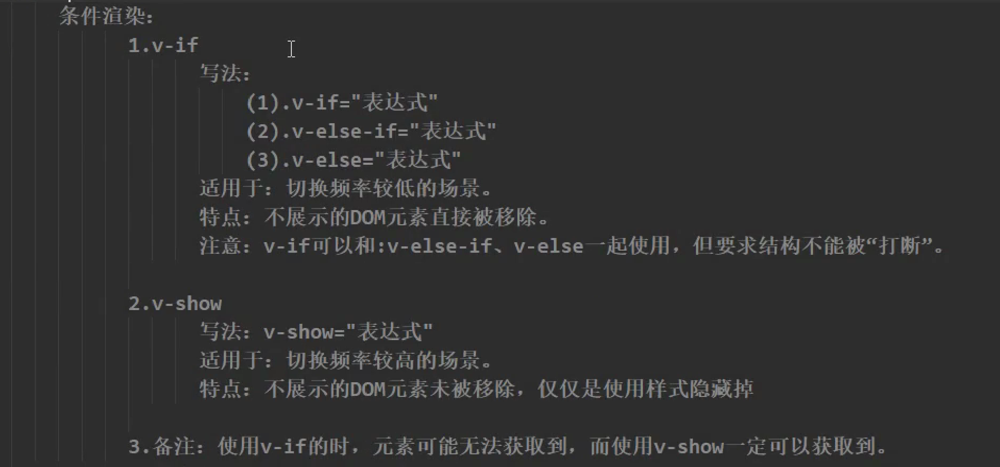
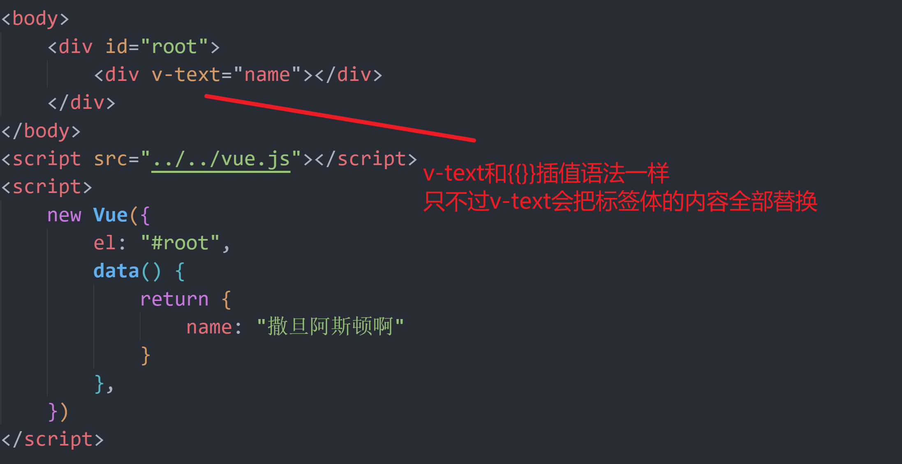

## 绑定class样式

### 字符串写法


### 数组写法


### 对象写法


**总结**


**代码**

```vue
<!DOCTYPE html>
<html lang="en">

<head>
    <meta charset="UTF-8">
    <meta http-equiv="X-UA-Compatible" content="IE=edge">
    <meta name="viewport" content="width=device-width, initial-scale=1.0">
    <title>Document</title>
</head>
<style>
    .basic {
        width: 300px;
        height: 300px;
        border: 1px solid black;
    }
    
    .happy {
        background-color: red;
    }
    
    .sad {
        background-color: aquamarine;
    }
    
    .normal {
        background-color: aqua;
    }
    
    .i01 {
        background-color: antiquewhite;
    }
    
    .i02 {
        font-size: 40px;
    }
    
    .i03 {
        border-radius: 50%;
    }
</style>

<body>

    <div id="root">
        <!-- 绑定class样式 ---字符串写法,适用于:类名不确定,需要动态指定 -->
        <div :class="mood" class="basic" @click="changeMood">{{name}}</div>
        <hr>
        <!-- 绑定class样式 ---数组写法,适用于:要绑定的样式不缺，名字也确定 -->
        <div :class="arr" class="basic"></div>
        <!-- <div :class="['i01', 'i02', 'i03']" class="basic"></div> -->
        <hr>
        <!-- 绑定class样式 ---对象写法适用:要绑定的样式确定,名字也确定,要动态的决定用不用 -->
        <div :class="classObj" class="basic"></div>
    </div>

</body>
<script src="../../vue.js"></script>
<script>
    new Vue({
        el: "#root",
        data() {
            return {
                name: "asdas ",
                mood: "",
                arr: ['i01', 'i02', 'i03'],
                classObj: {
                    'i01': true,
                    'i02': true,
                    'i03': false
                }
            }
        },
        methods: {
            changeMood() {
                var number = Math.floor(Math.random() * 3)
                var arr = ['happy', 'sad', 'normal']
                this.mood = arr[number]
            }
        },
    })
</script>

</html>
```

---


## 条件渲染

### v-show


### v-if





**总结**



```html
<!DOCTYPE html>
<html lang="en">

<head>
    <meta charset="UTF-8">
    <meta http-equiv="X-UA-Compatible" content="IE=edge">
    <meta name="viewport" content="width=device-width, initial-scale=1.0">
    <title>Document</title>
</head>

<body>
    <div id="root">
        <!-- v-show条件渲染 -->
        <!-- <h1 v-show="1==2">{{name}}</h1> -->
        <!-- <h1 v-show="a">{{name}}</h1> -->

        <!-- v-if 条件渲染-->
        <!-- <h1 v-if="1==2">{{name}}</h1>
        <h1 v-if="a">{{name}}</h1> -->
        <!-- 
        <h1>当前n的值{{n}}</h1>
        <div v-if="n==1">11111</div>
        <div v-else-if="n==2">22222</div>
        <div v-else-if="n==3">33333</div>
        <div v-else>哈哈</div>
        <br><br>
        <button @click="n++">点我n++</button> -->
        <template v-if="1== 1">
                <h1 >12312</h1>
                <h1 >12312</h1> 
                <h1 >12312</h1>
        </template>
    </div>
</body>
<script src="../../vue.js"></script>
<script>
    new Vue({
        el: "#root",
        data() {
            return {
                name: '撒旦阿斯顿按时撒',
                a: true,
                n: 0
            }
        },
    })
</script>

</html>
```


## 列表渲染

### 遍历对象


### 列表渲染key的原理


**index作为的key的小总结**


**id作为key的总结**

```powershell
当id作为key的时候，会让所有节点的key是唯一的，不会出现key的改变的情况，
所以，当我们在数组前面添加一个新的元素，不会让key发生改变，那么当vue使用diff算法进行对比的时候
可以将之前已经渲染好的虚拟dom进行直接复用，而新的数据在进行新的添加，这样就不会出现问题
```


### 列表过滤

#### wathc实现

```html
<!DOCTYPE html>
<html lang="en">

<head>
    <meta charset="UTF-8">
    <meta http-equiv="X-UA-Compatible" content="IE=edge">
    <meta name="viewport" content="width=device-width, initial-scale=1.0">
    <title>Document</title>
</head>

<body>
    <div id="root">
        <h1>人员列表</h1>
        模糊搜索<input type="text" v-model="keyWord">
        <!-- 遍历对象数组 -->
        <ul>
            <li v-for=" (p,index) in personFilter" :key="p.id">
                {{p.name }}--{{p.age}}--{{index}}
            </li>

        </ul>


    </div>
</body>
<script src="../../vue.js"></script>
<script>
    new Vue({
        el: "#root",
        data() {
            return {
                str: "askldjaslkdjaksljd lk",

                persons: [{
                    name: '马冬梅',
                    age: 20,
                    id: 20
                }, {
                    id: 001,
                    name: "周冬鱼",
                    age: 18
                }, {
                    id: 002,
                    name: "周杰伦",
                    age: 20
                }, {
                    id: 003,
                    name: "文昭论",
                    age: 23
                }],
                keyWord: "",
                personFilter: []

            }
        },
        watch: {
            keyWord: {
                immediate: true,
                handler(newValue, oldVaue) {
                    this.personFilter = this.persons.filter((p) => {
                        return p.name.indexOf(newValue) !== -1
                    })
                }

            }
        }

    })
</script>

</html>
```


#### computed实现

```html
<!DOCTYPE html>
<html lang="en">

<head>
    <meta charset="UTF-8">
    <meta http-equiv="X-UA-Compatible" content="IE=edge">
    <meta name="viewport" content="width=device-width, initial-scale=1.0">
    <title>Document</title>
</head>

<body>
    <div id="root">
        <h1>人员列表</h1>
        模糊搜索<input type="text" v-model="keyWord">
        <!-- 遍历对象数组 -->
        <ul>
            <li v-for=" (p,index) in personsFilter" :key="p.id">
                {{p.name }}--{{p.age}}--{{index}}
            </li>

        </ul>


    </div>
</body>
<script src="../../vue.js"></script>
<script>
    new Vue({
        el: "#root",
        data() {
            return {
                str: "askldjaslkdjaksljd lk",

                persons: [{
                    name: '马冬梅',
                    age: 20,
                    id: 20
                }, {
                    id: 001,
                    name: "周冬鱼",
                    age: 18
                }, {
                    id: 002,
                    name: "周杰伦",
                    age: 20
                }, {
                    id: 003,
                    name: "文昭论",
                    age: 23
                }],
                keyWord: ""
            }
        },
        computed: {
            personsFilter() {
                return this.persons.filter((p) => {
                    return p.name.indexOf(this.keyWord) !== -1
                })
            }
        }


    })
</script>

</html>
```


### 列表排序

```html
<!DOCTYPE html>
<html lang="en">

<head>
    <meta charset="UTF-8">
    <meta http-equiv="X-UA-Compatible" content="IE=edge">
    <meta name="viewport" content="width=device-width, initial-scale=1.0">
    <title>Document</title>
</head>

<body>
    <div id="root">
        <h1>人员列表</h1>
        模糊搜索<input type="text" v-model="keyWord">
        <button @click="sortType=1">升序</button><button @click="sortType=2 ">降序</button><button @click="sortType=0 ">原顺序</button>
        <!-- 遍历对象数组 -->
        <ul>
            <li v-for=" (p,index) in personsFilter " :key="p.id ">
                {{p.name }}--{{p.age}}--{{index}}
            </li>

        </ul>


    </div>
</body>
<script src="../../vue.js "></script>
<script>
    new Vue({
        el: "#root ",
        data() {
            return {
                str: "askldjaslkdjaksljd lk ",

                persons: [{
                    name: '马冬梅',
                    age: 20,
                    id: 20
                }, {
                    id: 001,
                    name: "周冬鱼 ",
                    age: 18
                }, {
                    id: 002,
                    name: "周杰伦 ",
                    age: 20
                }, {
                    id: 003,
                    name: "文昭论 ",
                    age: 23
                }],
                keyWord: " ",
                sortType: 0 // 0表示原顺序 1降序， 2升序
            }
        },
        computed: {
            personsFilter() {
                var arr = this.persons.filter((p) => {
                        return p.name.indexOf(this.keyWord) !== -1
                    })
                    //判断是否需要排序
                if (this.sortType) {
                    return arr.sort((a, b) => {
                         this.sortType === 1 ? a.age - b.age : b.age - a.age
                    })
                }
                //不需要排序，直接返回
                return arr;
            }
        }


    })
</script>

</html>
```


----


## vue监测数据的原理

### vue怎么监测对象数据改变

```
响应式数据式怎么做的呢！！！！
其实就在数据劫持_data中的set方法中调用了模板解析器
因为我们自己配置的data已经是被vue数据劫持了。
当我们自己在页面上要修改data中的数据时候，
底层使用的就是_data中的set方法，而set方法中调用了模板解析器的方法，
所以就做到了对象的数据响应式	
```


**数据劫持**


### vue.set() 方法 

```vue
// Vue.set(target,key,val) 
// Vue.set('vm上存在的属性','添加属性','值')
实例:
<script>
new ({
	el:"#root",
    data:{
        student:{
            age:12,
            name:"黄伟"
        },
        user:"root"
    }
    Vue.set(vm.student,'a',1); //成功
    Vue.set(vm,'b',2); //报错 
    //vue.set不能直接往vm身上添加东西，因为data数据是被劫持了
    //只有vm身上已经配置好的属性才存在set方法，才能给初始化data赋值
})
</script>
```

### vm.$set()

```vue
// vm.$set(target,key,val) 
// vm.$set('vm上存在的属性','添加属性','值')
实例:
<script>
new ({
	el:"#root",
    data:{
        student:{
            age:12,
            name:"黄伟"
        },
        user:"root"
    }
    vm.$set(vm.student,'a',1); //成功
    Vue.set(vm,'b',2); //报错 
    //vm.$set不能直接往vm身上添加东西，因为data数据是被劫持了
    //只有vm身上已经配置好的属性才存在set方法，才能给初始化data赋值
    //vm.$set对比Vue可以在vue管理的函数中使用this.$set()来进行调用
})
</script>
```


### vue监测数组数据改变原理


### 总结


## 表单收集数据


## vue  内置指令

### v-text 

 


### v-html


### v-cloak

```
当网速慢得 时候，可能会出先vue没有接管得模板出现在页面上
v-cloak 当vue接管模板会将v-cloak删除
我们可以使用css 将 v-cloak 隐藏
然后当vue接管模板是删除
这样就会出现页面闪现了
```


### v-once 


### v-pre

```
v-pre表示这个标签不被vue解析
```


## 自定义指令

### 函数式

**directives**


```powershell
指令函数什么时候被调用呢》？？？？
当元素和指令完成绑定的时候调用  ==》 一上来就调用
当指令所在的模板解析时，就会触发指令函数
并不是指令依赖的函数发生改变就触发函数
```

**函数的指令的生命周期**

```
当节点和指令绑定在一起时 调用 binding()
当节点所在模板进行解析时 调用 bindding();
```


```vue
<!DOCTYPE html>
<html lang="en">

<head>
    <meta charset="UTF-8">
    <meta http-equiv="X-UA-Compatible" content="IE=edge">
    <meta name="viewport" content="width=device-width, initial-scale=1.0">
    <title>Document</title>
</head>

<body>
    <div id="root">
        <h1>当前的n值是: <span v-text="n"></span></h1>
        <h1>放大10被的n值是: <span v-big="n"></span></h1>
        <button @click="n++">点我n++</button>
    </div>
</body>
    
<script src="../../vue.js"></script>
<script>
    new Vue({
        el: "#root",
        data() {
            return {
                n: 1
            }
        },
        directives: {
            //参数1 真实dom元素  参数2： 对象数据
            big(elemet, binding) {
                console.log(elemet);
                console.log(binding);
                elemet.innerText = binding.value * 10; //将真实dom的文本修改
            }
        }
    })
</script>

</html>
```


### 对象式


```vue
<!DOCTYPE html>
<html lang="en">

<head>
    <meta charset="UTF-8">
    <meta http-equiv="X-UA-Compatible" content="IE=edge">
    <meta name="viewport" content="width=device-width, initial-scale=1.0">
    <title>Document</title>
</head>

<body>
    <div id="root">
        <h1>当前的n值是: <span v-text="n"></span></h1>
        <h1>放大10被的n值是: <span v-big="n"></span></h1>
        <button @click="n++">点我n++</button>
        <hr>
        <input type="text" v-fbind="n" :value="n">
    </div>

</body>
<script src="../../vue.js"></script>
<script>
    new Vue({
        el: "#root",
        data() {
            return {
                n: 1
            }
        },
        directives: {
            //参数1 真实dom元素  参数2： 对象数据
            big(elemet, binding) {

                elemet.innerText = binding.value * 10;
            },
            fbind: {
                //当指令和元素成功绑定时调用
                bind(elemet, binding) {
                    console.log('bind');
                },
                //指令所在元素被插入页面时被调用
                inserted(elemet, binding) {
                    elemet.focus()
                    console.log('inserted');
                },
                //指令所在的模板被解析时，被调用
                update(elemet, binding) {
                    console.log('update');
                },
            }
        }

    })
</script>

</html>
```


## 生命周期


