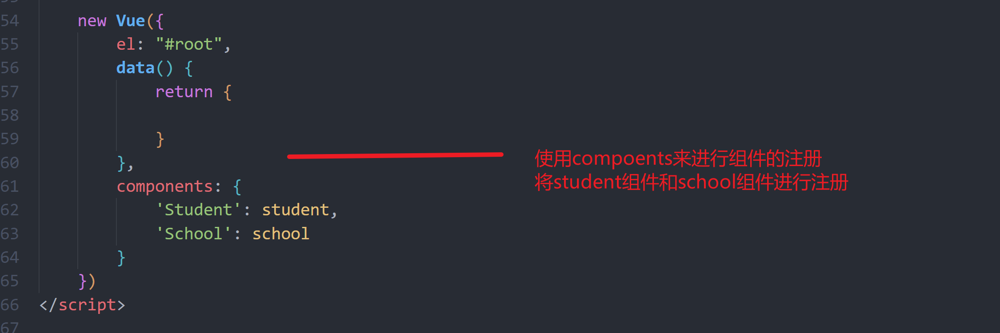
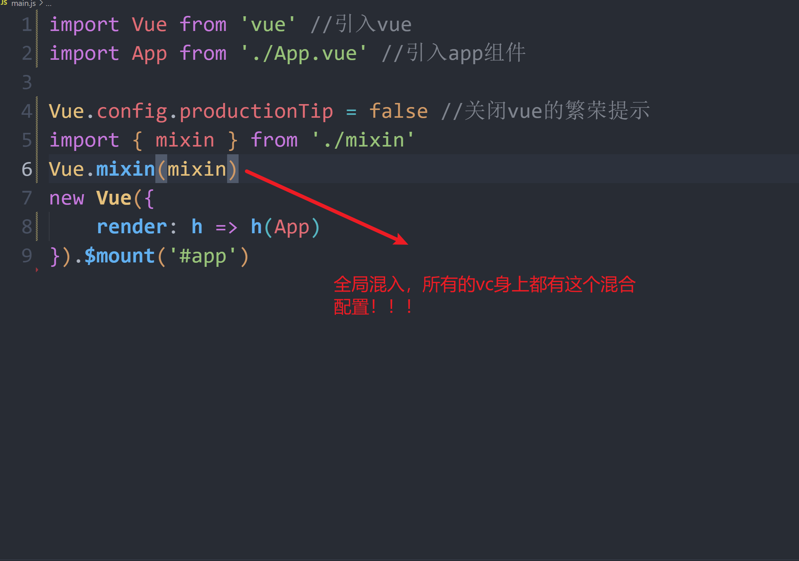

## 非单文件组件

### 1：创建组件


```powershell
const student = Vue.extend({
	template:
	    <div>
            <h1>{{name}}</h2>
            <h1>{{age}}</h2>
        </div>`
	`
	,data:function(){
		return {
		   name: "黄伟",
                age: 22
		}
	}
})
```

### 2：组测组件



```powershell
    new Vue({
        el: "#root",
        data() {
            return {

            }
        },
        #注册组件
        components: {
            'Student': student,
            'School': school
        }
    })
```

### 3：使用组件


```html
    <div id="root">
        <Student></Student>
        <hr>
        <School>
        </School>
    </div>
```


### 4：组件的全局注册

```powershell
Vue.compoent('Student',student);
```

### 5：注意事项


## 组件嵌套

```vue
<!DOCTYPE html>
<html lang="en">

<head>
    <meta charset="UTF-8">
    <meta http-equiv="X-UA-Compatible" content="IE=edge">
    <meta name="viewport" content="width=device-width, initial-scale=1.0">
    <title>Document</title>
</head>

<body>
    <div id="root">
        <school></school>
    </div>
</body>
<script src="../../vue.js"></script>
<script>
    const student = {
        name: 'student',
        template: `<div>
            
            <h1>学生姓名:{{name}}</h1>
                <h1>学生年龄:{{age}}</h1>
            </div>
                `,
        data() {
            return {
                name: "黄伟",
                age: 20
            }
        },
    }
    const school = {
        name: 'school',
        template: `
            <div>
        <h1>学校名称:{{name}}</h1>
        <h1>学校地址:{{address}}</h1>
        <student></student>
              </div>    
        `,
        data() {
            return {
                name: "北大青鸟",
                address: "湖南邵阳"
            }
        },
        components: {
            student
        }
    }


    new Vue({
        el: "#root",
        components: {
            school
        }
    })
</script>

</html>
```

## vueComponent 


```powershell
当我们使用vue创建组件的时候，都是需要调用vueComponent这个构造函数，但是我们自己是没有去调用的
组件构造方式！：
const student = Vue.extend({
	data:{
		return {}
	}
});
const school = { 
	data:{
		return {}
		}
}
这两种创建组件的方式我没有直接的进行 new vueComponent(){}这个函数

1：school 组件本质上就是一个vueComponent构造函数，且不是程序员定义的，是VUe.extend()生成
2：我们只需要写<student/> 标签vue会帮我们创建一个school组件的实例对象，即Vue帮我们执行了： new VueComponent(options)
3：每一次调用Vue.extend()每次返回的都是一个全新的VueComponent，等于每一次都new了一个新的对象
```


### vm 和 vc 的关系-区别


```powershell
vc组件是不能自己直接使用的，应为vc是需要vm实例去调用Vuecomponent钩爪函数
虽然vc直接也能调用自己VueComponent构造函数，但是这是基于已经有一个VueComponent是已经被vm创建出来
vc是不能有el配置项的
vc的data必须函数式配置，因为对象式会影响组件的复用
vm可以是函数式也可以是对象式

```

### 一个重要内置关系


## -----

## vscode记得安装vetur插件

## 单文件组件

```powershell
单文件组件是以 xxx.vue的文件形式出现的
但是浏览器是不认识.vue文件的
所欲需要进行编译加工
需要用vue脚手架
```


```vue
<template>
    <div>
        <!-- 组件结构模板  html-->
    </div>
</template>

<script>
// 组件的js代码
export default {
    name: 'Day021',

    data() {
        return {
            
        };
    },

    mounted() {
        
    },

    methods: {
        
    },
};
</script>

<style lang="less" scoped>
// 组件的样式 css

</style>
```

## vue脚手架文件解析

```js
import Vue from 'vue' //引入vue
import App from './App.vue' //引入app组件

Vue.config.productionTip = false //关闭vue的繁荣提示

new Vue({
    render: h => h(App),
}).$mount('#app')
```


**rander函数**


## vue修改默认配置

**修改main.js**

```powershell
vue的配置文件时被隐藏的需要在客户终端输入
vue inspect > output.js
进行查看配置文件 ---只能查看

```

## 手脚架总结


[链接1](http://cli.vuejs.org/zh)

[链接2](https://cli.vuejs.org/zh/config/)


##  ---

## ref属性-->节点标识


```powershell
如果你需要获取到组件标签的完整dom元素的时候，可以直接使用id然后使用原生操作获取元素节点
```


## props属性-->数据传递

### 简单数组传递


```powershell
使用props收到的数据最终还是放到了vc身上
```

​	

### 传递number数据


```powershell
使用一个:号就可以了。让这个属性变成一个表达式去执行，js底层就会进行转换
```

### 对象传递--类型限制


```powershell
可以对数据类型进行校验
```

### 对象传递--完整版


### 注意事项

```powershell
使用props接收传递的数据，尽力不要去修改数据
如果我们实在是要修改的话，可以使用一个中转变量来进行修改！！！
当data配置的数据和props传递过来的数据起冲突，props 》data中的数据，
因为是先声明props配置项的
参数传递的时候，不能使用vue已经占用的关键字
```

### 总结


## mixin混入

### 使用场景


### 使用mixin


### data数据混入


### 混入生命周期构造

```powershell
当混入配置中存在生命周期钩子
我们自己也配置了生命周期钩子
两个生命周期构造都调用
而且！！
mixin配置的生命的周期构造比我们自己配置的生命的周期钩子要早调用
```

### 全局配置



### 总结


## 插件

```powershell
vue中插件本质上就是一个对象{}但是他要包含install、
```


## scoped

****

```powershell
我们在写组件样式的时候，会出不同组件中的css类名样式冲突的
如果冲突了，样式会被进行覆盖了
先引入的组件的样式会被后引入的样式引入覆盖了
```

**scoped解决样式冲突**


**app组件尽量不要加scoped属性，因为加了就无法管理子组件**

## lang属性

```powershell
lang 可以指定使用什么语法的css
如less
```


