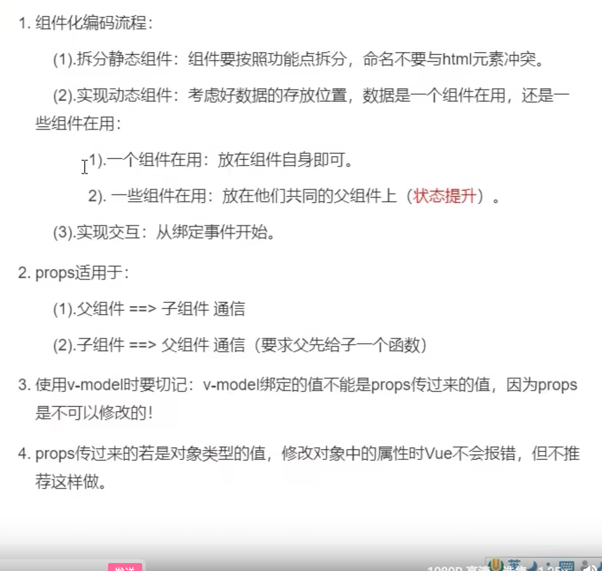
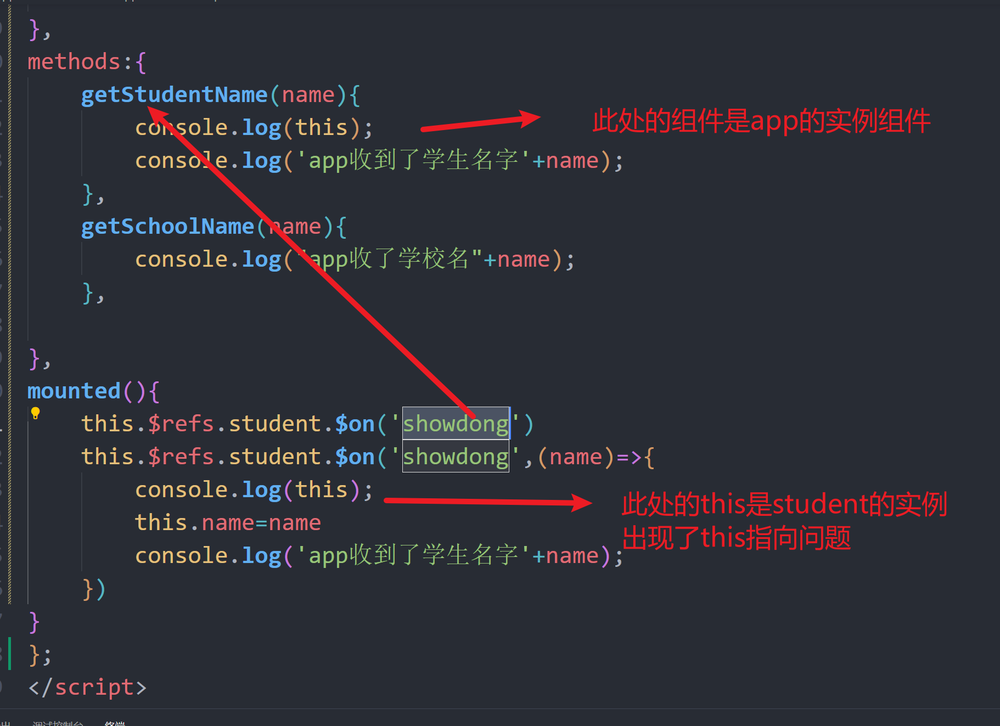
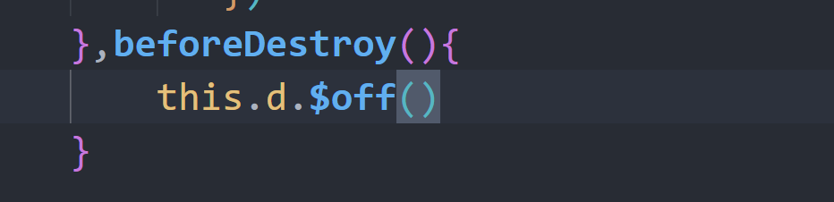

## 将项目拆分成组件


将项目拆分成组件


## 下载一个id生成器

```powershell
打开终端
npm i nanoid  下载
在组件进行引入
import {nanoid} from'naaoid'
调用生成id
id:nanoid();
```

## 组件通信

### 父组件传递子组件

```powershell
     <List :todos="todos"></List>
         props:["todos"]
使用标签传递 然后props进行接收就可以了
```

### 子组件传递夫组件

```powershell
子组件给父组件传递数据
1：父组件传递一个带参数的函数给子组件
2：子组件使用props接收到这个函数
3：子组件调用这个函数this.function(data);
4：当组件调用了函数， 父组件就受到数据
```


### 总结




## 浏览器的本地存储


## 组件的 自定义事件 $emit

```powershell
js自带的事件叫内置事件
如，click keyup等
内置事件是给html元素使用的

```

### 自定义-子-夫-通信


```powershell
自定义事件的子组件和父组件通信就是在夫组件写子组件标签的时候， 定义一个自定义事件，然后让这个事件绑定一个函数
然后在子组件内部，定义一个内置事件，然后触发一个函数，然后在这个函数体中使用this.$emit()方法，进行自定义事件，
当自定义事件被触发了，父组件的绑定函数也被触发
就完成了通信
```

### 写法2


## 解绑自定义事件


## 自定义事件注意点




```powershell
使用 this.$refs.student.$on('student',function(){}) //这样写会出现this不知指向当前组件，会指向调用组件实例
this.$refs.student.$on('student',()=>{})  //使用箭头函数就可以了

<Student @click="show"></Student>
#这样写vue会将@clikc当成自定义事件，需要加上 native 才能让vue识别这是原生事件
```


## 全局事件总线


```powershell
在main.js中将vm实例作为全局事件总线，
所有的子组件都可以拿到vm，就可以进行，注册和触发事件
Vue.prototype.$bus = this
```



```powershell
使用全局事件总线
需要使用
beforeDestroy（）函数
在组件要销毁前，将组件中注册的全局事件总线，进行清除，
不然全局事件总线，自定义事件会一值冗余
```


## 消息订阅与发布

**下载**

```powershell
npm i pubsub
```

**发布消息**

```powershell
1:组件引入pubsub
import pubsub from 'pubsub'
2:使用 -发布
PubSub.publish('data', 'data') #发布信息
3：使用订阅
PubSub.subscribe('data',(msg,data)=>{
  console.log(data)
}); 
#订阅信息


```


## nextTick


```powershell
nextTick可以让vue怎么完成dom模板解析后再次回调，这样当我们需要操作dom结构的时候，就不会出现，虚拟dom还没有渲染，就开始操作dom，然后导致代码不生效
如：操作input框
```


