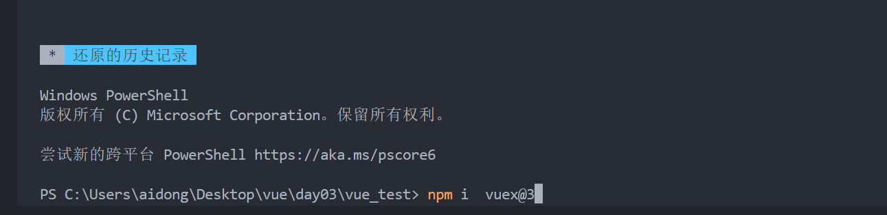
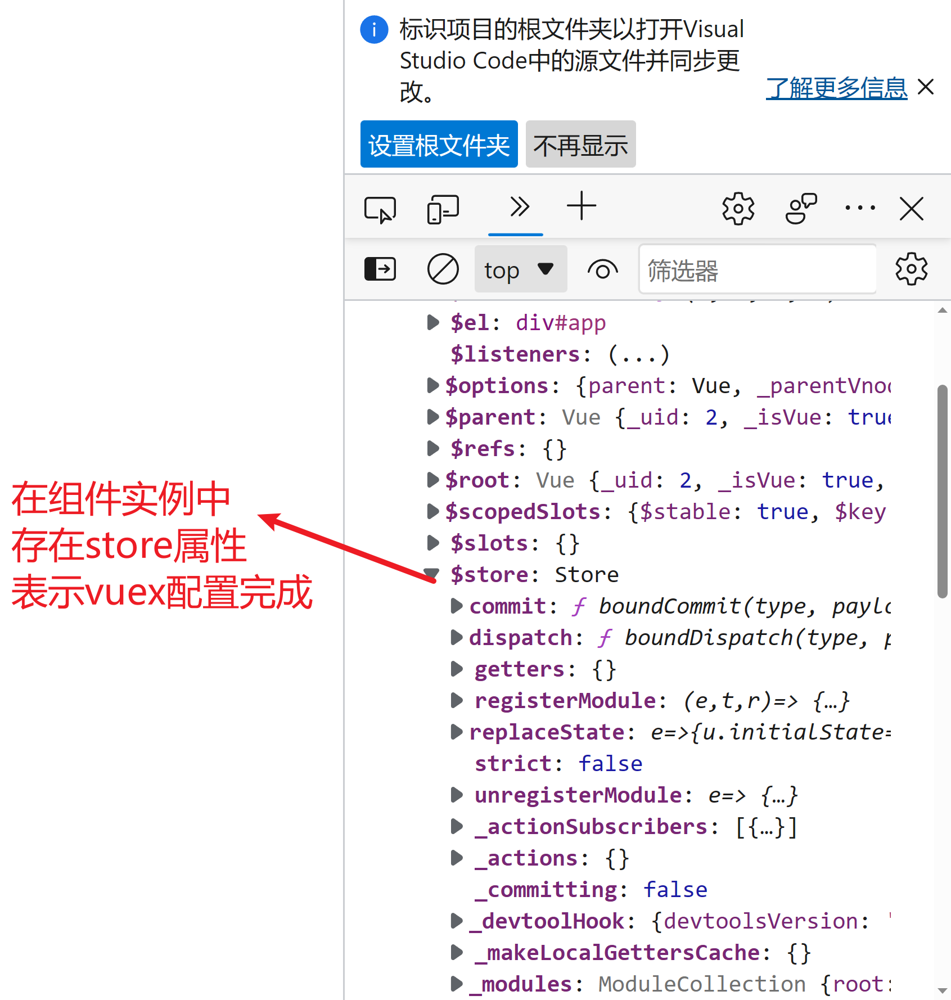
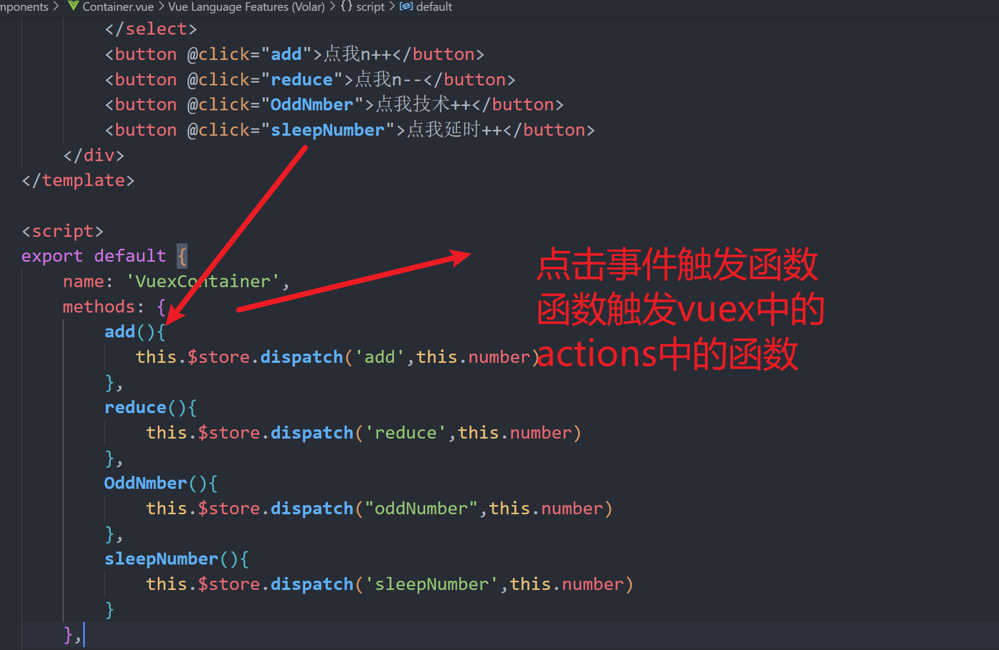
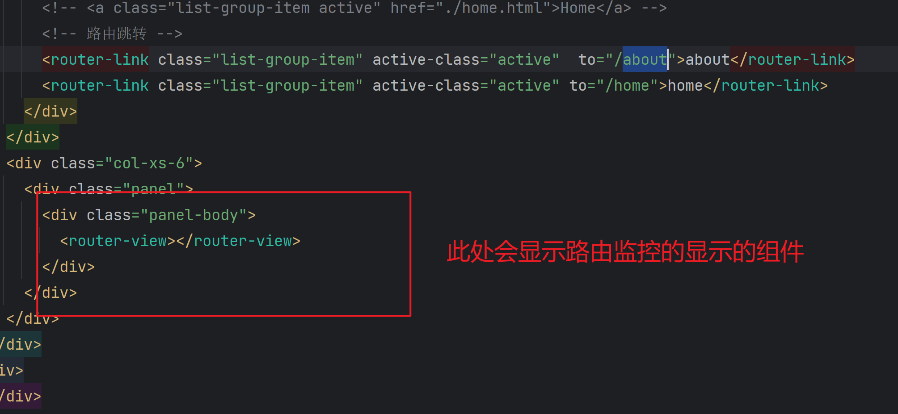

##    解决跨域问题

```powershell
1.配置类方式(实现WebMvcConfigurer)  
2.使用@CrossOrigin注解
3.使用nginx反向代理解决跨域 
4.Vue中配置代理服务器
```

## 配置代理1-》单个代理

**跨域报错1**


```powershell
当我们的前端页面向后端接口发起请求，必须保证3个一致，
1：地址一致如： 127.0.0.1
2：端口给一致:  127.0.0.1:8080
3: 协议一致： http://127.0.0.1:8080
三个当中有一致不一致就会出现跨域问题
跨域问题并不是服务器，没有提供数据，服务器是已经响应数据了的
是浏览器对数据进行了劫持，浏览器发现跨域问题就会劫持数据，不响应给前端页面
但是，服务器和服务器之间的通信就没有跨域问题
跨域问题本质就是浏览器的机制问题
```

**跨域解决方案**

**在vue.config文件中配置**


```powershell
使用代理服务器的时候，当前端页面已经存在的东西，代理服务器不会去请求元后端服务器，
而是直接使用前端的东西
```


## 配置代理2-》多个代理


### github案例

```
https://api.github.com/search/users?q=test
```


## 插槽

### 默认插槽

```powershell
当我们自己封装完成一个组件，样式等一些东西已经写好了，结构是由外部提供的时候，就使用插槽技术
```


### 	具名插槽


### 作用域插槽 


## vuex简介

```powershell
vuex是什么 
就是一个专业对集中数据管理的技术
可以让所有组件进行共享的数据技术
所有组件都有可以修改，查看的一个技术
```


### Vuex的使用步骤

### 1下载vuex

```powershell
下载vuex 在vue2中 下载vuex的命令
 	打开客户端端口 - npm i vuex@3  
 	因为vuex从202207 后默认就只能是vuex4了 vuex4对饮的vue3
 	在vue2中要下vuex3就需要指定版本
```



### 2：创建文件


### 3:编写index.js

```js
//引入vue用与加载vuex
import Vue from 'vue'
//引入vuex使用
import Vuex from 'vuex'
//使用vue加载vuex
Vue.use(Vuex)

const actions = {}
const mutations = {}
const state = {}
 //创建并暴露出vuex
export default new Vuex.Store({
    actions,
    mutations,
    state
})
```


### 4:mian.js进行引入

```js
import Vue from 'vue'
import App from './App.vue'

import store from './store'
Vue.use(store)

Vue.config.productionTip = false

new Vue({
    render: h => h(App),
    store
}).$mount('#app')
```





## vuex使用

```powershell
当我们加载完成vuex的插件后，我们所欲的身上都存在一个$store 属性
在将使用$store属性进行操作vuex中state的数据

```




### 	getters的配置


### mapState


### mapGetters


### mapMutations


### mapActions


## 路由

### 路由的简介

```powershell
一、路由的介绍
对于 Vue 这类渐进式前端开发框架，为了构建 SPA（单页面应用），需要引入前端路由系统，这也就是 Vue-Router 存在的意义。前端路由的核心，就在于 —— 改变视图的同时不会向后端发出请求。
路由的使用在vue是重点，也是核心所在。Vue.js 路由允许我们通过不同的 URL 访问不同的内容。
就是我在页面点击一个按钮需要跳转到对应的页面，这就是路由跳转

学习路由我们得知道route、routes、router：
route：首先它是个单数，为路由，即我们可以理解为单个路由或者某一个路由；

routes：它是个复数，我们理解为多个路由的集合，事实上官方定义routes是一个数组；routes表示多个单个路由的集合；

router：这个是路由器，router是一个VueRouter的对象，用来管理路由，所以它内部肯定会有routes属性，还有其他的属性和方法。当用户在页面上点击按钮的时候，这个时候router就会去routes中去查找route，就是说路由器会去路由集合中找对应的路由；

```

### 下载路由


### 配置路由规则


```java
//引入vue
import Vue from 'vue'
//引入vue-router
import VueRouter from 'vue-router'
import About from '../pages/About'
import Home from '../pages/Home'
//加载vue-router 插件
Vue.use(VueRouter);
    //创建并暴露一个路由器


//创建并暴露一个路由
export default new VueRouter({
    //编写配置
    routes: [{
        path: '/about',
        component: About
    }, {
        path: '/home',
        component: Home
    }]
})
```

### 监控规则原理




### 组件的分类

```powershell
在开发过程中，我们自己使用渲染的组件时正常组件
而有路由进行渲染的组件叫做路由组件
```


### 注意点


### 嵌套路由


### 路由传参


```powershell
路由传递的参数数据都在$route属性上也就是本身路由属性上
```


### 命名路由


```powershell
命名路由就是可以给路由取名字，当我们使用route -link 跳转对象式写法的时候 可以不用path属性写很长的url
  <router-link :to="{
                        path:'/home/news/detail', path属性
                        name: 'show',  			name属性
                        params:{
                            id:mes.id,
                            title:mes.title
                        }
}">{{mes.title}}</router-link>

                    
```


### 路由的params参数


### 路由的props配置


```powershell
路由配置的props属性的三种写法！！  --》 
--1  对象式
	直接写死一个对象，将数据传递，让显示组件的props配置接收
     // props:{id:"sadas",title:'1231231'}
     
--2 布尔式
	将上级路由传递过来的params属性的数据全部传递给显示组件的props配置属性 query属性的数据不可以使用
	   // props:true
--3 函数式
	通过返回的对象进行传递的，这个函数是vue帮我们回调的，会将显示组件的路由实例传递给回调函数
	我们过路由实例从他身上读取属性，然后将读取出来呢的数据以return对象的形式传递给显示组件的props配置
	其实函数式并没有简化代码，只是将繁琐的代码抽取到了路由配置文件中
	  props(route){
                    return {
                        id:route.query.id,
                        title:route.query.title
                    }
                }
             
	   
     
	
```


### router-link 标签的replace属性


```powershell
router-link 中的replace属性 是让浏览器不记录你的这一次跳转
```


### 编程式路由导航


### 缓存路由组件


### 两个新的生命周期函数


### 路由守卫


### 独享路由守卫


### 组件内路由守卫

