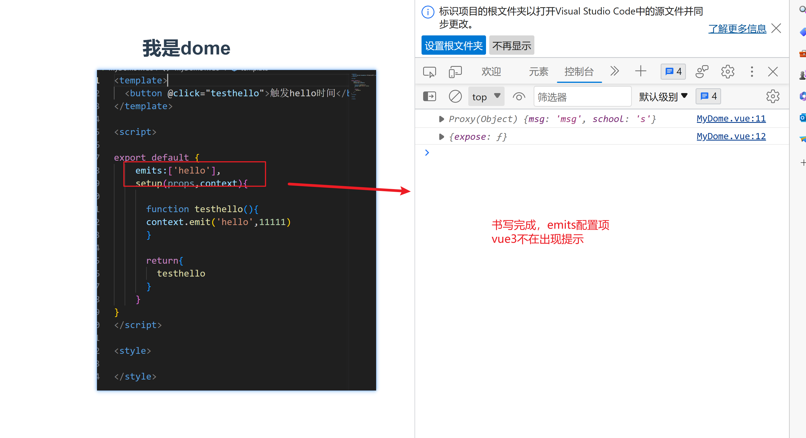

## vue3快速上手

----


### vue3简介

- 2002年9月18日，Vue.js发布3.0版本 代码 One Price 
- 耗时2年多，2600此提交，30+个RFC，600+此PR，99位贡献这

### vue3带来了什么

#### 1- 性能的提升

- 打包大小减少41%

- 初次渲染55%，更新渲染快133%

- 内存减少54%

  。。。。

#### 2-源码升级

- 使用Proxy带忒definePropety实现响应式
- 重写虚拟DOM的实现和Tree-Shaking


#### 3-拥抱TypeScript

-  Vue3可以更好的支持TypeScript


#### 4-新的特性

1. Composiltion（组合API）

   - setup配置
   - ref与reactive
   - watch与watchEddect
   - provide和inject

   ....

2. 新的内置组件

   - Fragment
   - Teleport
   - Suspense

3. 其他的改变

   - 新的生命周期钩子
   - data选项始终被声明为一个函数
   - 移除keyCode支持作为 v-on的修饰符号

### 


## 一-创建Vue3.0工程

### 1-使用vue-cli 创建

```vue
vue ceate 项目名称
vue create vue3.0
```


### 工程分析

**main.js**

```js
//引入的不在是vue的构造函数了，引入的是一个名为crateApp的工厂函数
import { createApp } from 'vue'
//引入app组件
import App from './App.vue'

// createApp(App).mount("#app") 
//下面对这行代码进行拆分

//创建应用实例对象-app（类似与之前vue2中的vm，但app比vm更轻）
const app = createApp(App)

//挂载
app.mount('#app')

//延时挂载
setInterval(() => {
    app.mount('#app')
}, 1000);


console.log(app);

```


**App组件**


## 常用的Composition API


### setup 

1. 理解：Vue3.0中的一个新的配置项，值为一函数
2. setup是所有Composition API （组合API） “表演舞台”
3. 组件中所用到的：数据，方法等等，均要配置在setup中
4. setup函数


### ref函数

- 作用: 定义一个<strong style="color:#DD5145">对象类型</strong>的响应式数据（基本类型不要用它，要用```ref```函数）
- 语法：```const 代理对象= reactive(源对象)```接收一个对象（或数组），返回一个<strong style="color:#DD5145">代理对象（Proxy的实例对象，简称proxy对象）</strong>
- reactive定义的响应式数据是“深层次的”。
- 内部基于 ES6 的 Proxy 实现，通过代理对象操作源对象内部数据进行操作。


### setup函数的两个形参

props -- context

**props 属性**


**context属性**


#### props配置的vue3


```vue
<!--
vue3中子组件的props配置 对比 vue2的props数据， 
优势： vue3中的props的数据是经过proxy的代理的，是响应式的，而且是可以直接使用
	  vu2中的书
-->
```


#### **vue 2 的props写法**


#### 自定义事件vue3


**忘记书写emits配置项**


**书写完成**





#### 插槽vue3


### 计算属性的写法vue3

**vue2**

```js
//vue2的计算属性的写法
computed:{
          fullName(){
            return  this.proson.firstName+this.proson.lastName
         }
    }
```


**vue3**

简写


完整写法


### watch--vue3

**vue2 的监视写法**

```js
    watch:{
        //简写形式--函数
        sum(newVlue,oldValue){
            console.log("sum的值发生了改变--"+newVlue+'--'+oldValue);
        }
        
        //完整写法--对象
        sum:{
         
            //处理函数
            handler(newVlue,oldValue){
                console.log("sum的值发生了改变--"+newVlue+'--'+oldValue);
            },
            //初始化直接调用监视一次
            immediate:true,
            //开启深度监视
            deep:true

        }
    }
```


**vue3监视属性**

```js
 // 情况1 -- 监视 ref 定义的响应式数据
     watch(sum,(newValue,oldValue)=>{
               console.log("sum的值发生了改变--"+newValue+'--'+oldValue);
     })

 // 情况2 -- 监视 ref 定义的多个响应式数据
    //      方式1：直接写多个watch
    watch(sum,(newValue,oldValue)=>{
              console.log("sum的值发生了改变--"+newValue+'--'+oldValue);
    })
    watch(msg,(newValue,oldValue)=>{
             console.log("msg的值发生了改变--"+newValue+'--'+oldValue)})

    // 情况2 -- 监视 ref 定义的多个响应式数据
    //      方式2：数组写法
    //形参： 参数1：监视属性的数组  参数2：处理函数 参数3：处理函数的配置对象
    watch([msg,sum],(newValue,oldVlue)=>{
         console.log(newValue[0],oldVlue[0]);
        console.log(newValue[1],oldVlue[1]);
     },{
         immediate:true
     })

    //情况3 监视一个 reactive所定义的一个响应式数据
    /**
             *   //注意1:使用reactive定义的数据，使用监视无法正确的获取oldValue
                    目前无法进行解决
                 //注意2: 默认开启深度监视，无法关闭，deep配置失效
             */
     watch(proson,(newValue, oldValue) => {
         console.log("proson变化了", newValue, oldValue);
       },
       {
         deep: false, //此处的deep配置无法
       }
     );

    //情况4 监视reactive所定义的一个响应式数据中的某一属性
    //监视某一个属性 参数1：必须写成一个函数，返回值是要监视的属性
      watch(()=>proson.age,(newValue,oldValue)=>{
         console.log('proson的age的值发生改变',newValue,oldValue);
      })

    //情况5  监视reactive定义一个响应式数据的某些个属性
     watch([()=>proson.age,()=>proson.name],(newValue,oldValue)=>{
       console.log(newValue,oldValue);
     })

    // 特殊情况
       watch(()=>proson.job,(newValue,oldValue)=>
       {
         console.log(newValue,oldValue);
       },{
         deep:true //此处由于监视的是有reactive所定义的某个对象中的属性，所有deep有效
       })
```


### watchEffect函数

```js
//此函数是不指定监视哪一个属性，在这个函数中用到哪一个属性，就会去监视这个属性

<button @click="name=name+'11'">点击修改姓名</button>


setup(){
    
   let name = ref('皇位')
   let age = ref(18)
    
    watchEffect(()=>{
        let x1 = name;
        let x2 = age;
        
    })
  
    return {
        name,
        age
    }
  
}
```


### 生命周期函数

**vue2**

```js
//在vue2中的生命周期函数，是配置选项，都和data同级的操作

beforeCreate()
在实例初始化之后,进行数据侦听和事件/侦听器的配置之前同步调用。
此时还没有进行数据代理，数据监测，所有vm身上并没有_data的属性。


created（）
在实例创建完成后被立即同步调用。在这一步中，实例已完成对选项的处理，意味着以下内容已被配置完毕：数据侦听、计算属性、方法、事件/侦听器的回调函数。vm身上也存在_data属性。


beforeMount()
在挂载开始之前被调用，这时页面中的插值语法都未被解析。该钩子在服务器端渲染期间不被调用。

mounted()
实例被挂载后调用，页面中的插值语法已经被解析了。该钩子在服务器端渲染期间不被调用。
注意 mounted 不会保证所有的子组件也都被挂载完成。如果你希望等到整个视图都渲染完毕再执行某些操作，可以在 mounted 内部使用 vm.$nextTick。


beforeUpdate（）
在数据发生改变后，DOM 被更新之前被调用。 该钩子在服务器端渲染期间不被调用，因为只有初次渲染会在服务器端进行。

Updated（）
在数据更改导致的虚拟 DOM 重新渲染和更新完毕之后被调用。
Updated 不会保证所有的子组件也都被重新渲染完毕。如果你希望等到整个视图都渲染完毕，可以在 updated 里使用 vm.$nextTick.


beforeDestroy()
实例销毁之前调用。在这一步，实例仍然完全可用。
该钩子在服务器端渲染期间不被调用。


destroyed()
实例销毁后调用。 该钩子被调用后，对应 Vue 实例的所有指令都被解绑，所有的事件监听器被移除，所有的子实例也都被销毁。、
该钩子在服务器端渲染期间不被调用。
```


**vue3**

```js
//vue3中是可以使用vue2的选项式的生命周期函数的，但是vue3的组合式生命周期函数比选项式的生命周期函数快调用

vue3的组合式生命周期和 选项是的生命周期的差异

//1 : 引入生命周期函数
import {onmount} from 'vue' //每使用一个生命周期函数都需要引入

//2: 使用函数
setuo(){
    //setup组合式，生命周期函数是回调函数，而不是执行函数
    onmout(()=>{
        //生命回到
    })
}

//3 ：生命周期函数的命名差异

vue3    						vue2
setup()							beforeCreate()
setup()							created（）
onbeforeMount()					 beforeMount
onMount()						Mount()
onbeforeUpdate					beforeUpdate()
onUpdated()						Updated()
onbeforeUnmounted				beforeDestroy()
onUnmounted						Destroy()
```


### hook函数


- 什么是hooks ---本质是一函数，把setup函数中使用的compositionAPI进行了封装
- 类似与vue2中的mixin
- 自定义hook的优势，复用代码，让setup中的逻辑更加清楚易懂
