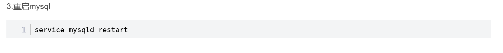

## 数据库库的主从复制

### 安装数据库1


```powershell
rpm  -qa #查询系统当前安装的全部如见
rpm -qa | grep mysql #查询当前系统安装软件名称带mysql的软件
rpm -qa | grep mariadb #查询当前系统安装软件名称带mariadb的软件
```

### 安装数据库2


```powershell
rpm -e --nodeps 
```

### 安装数据库3


### 安装数据库库4


```powershell
！！！！！在安装最后一个rpm的时候使用这个命令
rpm -ivh mysql-community-server-5.7.25-1.el7.x86_64.rpm --force --nodeps
```

### 安装数据库5


### 安装数据库6 登录


```powershell
cat /var/log/mysqld.log | grep password
```

### 安装数据库7


### 安装数据库8


### 


### 主从复制1 ：主库配置


```
log-bin=mysql-bin #[必须]启用二进制日志
server-id=100; #[必须]服务器唯一id
```


### 主从复制2：主库配置


```
stystemctl restart mysqld
```


### 主从复制3：主库配置


```mysql
GRANT REPLICATION SLAVE ON *.* to 'aidong'@'%' identified by 'aidong1010';
```


### 主从复制4：主库配置


### 主从复制5：从库配置


### 主从复制6：从库配置


### 主从复制7：从库配置


### 主从复制8：从库配置


### 注意事项

**如果是自己虚拟机复制的两个服务器，数据库的uuid会一致，需要进行修改，否则无法主从复制**





```powershell
show variables like 'server_uuid'; #查看数据库的uuid
select uuid(); #生成一个新的uuid  用于修改
```

