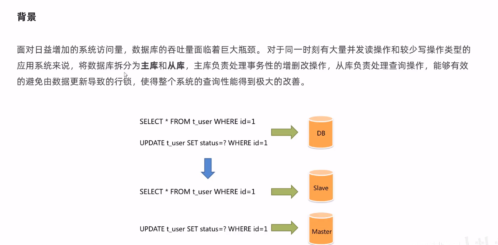
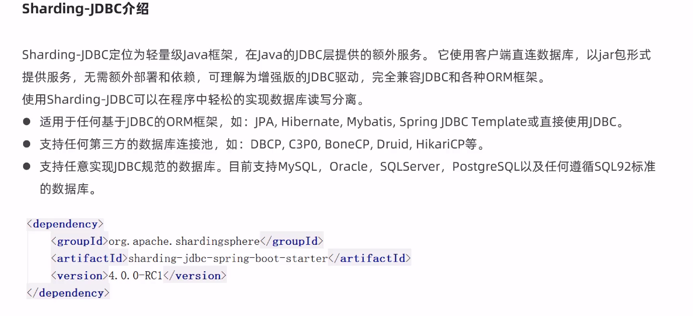
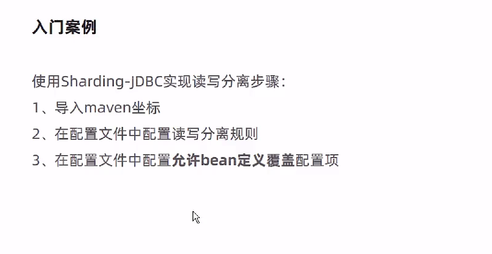

```yaml
spring:
  #读写分离配置
  shardingsphere:
    datasource:
      names:
        master,slave
      # 主数据源
      master:
        type: com.alibaba.druid.pool.DruidDataSource
        driver-class-name: com.mysql.cj.jdbc.Driver
        url: jdbc:mysql://192.168.192.135:3306/reggie?createDatabaseIfNotExist=true&useSSL=false&characterEncoding=utf-8
        username: root
        password: root
      # 从数据源
      slave:
        type: com.alibaba.druid.pool.DruidDataSource
        driver-class-name: com.mysql.cj.jdbc.Driver
        url: jdbc:mysql://192.168.192.138:3306/reggie?createDatabaseIfNotExist=true&useSSL=false&characterEncoding=utf-8
        username: root
        password: root
    masterslave:
      # 读写分离配置
      load-balance-algorithm-type: round_robin
      # 最终的数据源名称
      name: dataSource
      # 主库数据源名称
      master-data-source-name: master
      # 从库数据源名称列表，多个逗号分隔
      slave-data-source-names: slave
    props:
      sql:
        show: true #开启SQL显示，默认false
  main:
    allow-bean-definition-overriding: true
    #------------
    #将此配
```


```xml
<!--        读写分分离-->
        <dependency>
            <groupId>org.apache.shardingsphere</groupId>
            <artifactId>sharding-jdbc-spring-boot-starter</artifactId>
            <version>4.0.0-RC1</version>
        </dependency>
```

```powershell
#当主从数据库配置完成后，讲配置文件改好，框架会自己去操作jdbc层面的读写分离
#只需要讲依赖导入
#然后再yml文件配置好 就会读写分离了
```

